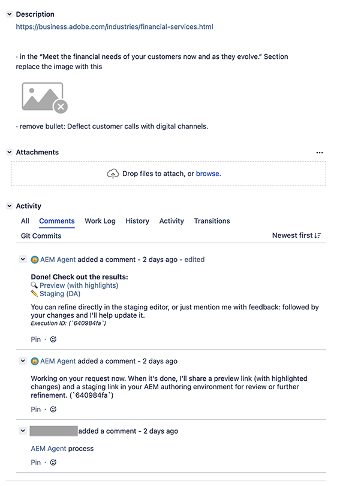

# Content Update Job {#content-update}

The content update job of the [Brand Experience Agent](/help/ai-in-aem/agents/brand-experience/overview.md) automates content production to accelerate everyday tasks for Adobe Experience Manager (AEM) as a Cloud Service and Edge Delivery Services. 

## Overview {#overview}

The content update job updates existing content, including content fragments, pages, forms and assets. The job can perform actions such as updating, removing, replacing, or adding content elements to keep experiences accurate and current. Inputs can be natural language description, and when used with Jira PDFs and screenshots can provide input too.

The content update job transforms the details that you provide, either through natural language or visuals, into content updates on your page. You supply the URL of a page that needs updating, together with details of what needs updating, and the agent skill completes your task. When used with Adobe Experience Manager (AEM) as a Cloud Service, the job creates a new [launch](/help/sites-cloud/authoring/launches/overview.md) so you can review the updates before applying. When used with Document authoring, the job creates a new [version](https://experienceleague.adobe.com/en/docs/experience-manager-learn/sites/document-authoring/how-to/document-versions#).

## Capabilities {#capabilities}

You can access the content update skill from:

* [The AI Assistant](#ai-assistant)
* [Jira](#jira)

## AI Assistant {#ai-assistant}

You can access the job in AEM via the AI Assistant. 

Open the AI Assistant from [`experience.adobe.com`,](https://experience.adobe.com) then start interacting by specifying your prompt in natural language using the `Ask AI Assistant anything` field:

### Configuring the Publish URL {#configuring-the-publish-url}

To use a publish (public facing) URL a one-time configuration must be made:

* Prerequisites:

  * To make the configuration, the user must have System Admin or Product Admin rights.

* Configuration:

  1. Invoke the Content Update skill by requesting a content update for the URL.
  1. The assistant will walk you through the configuration, by asking you a number of questions. 
  1. Once complete the publish URL is configured and can be used.

For example:

### Prompts {#prompts}

To initiate content updates you can give a wide range of natural language prompts. You need to specify the public facing (publish) URL, or the author environment URL, of the page you want to update. Some, but not all, of the verbs that are supported; replace, update, remove, change, revised, modify, adjust, delete. 

>[!NOTE]
>
>File uploads can be used when interacting using [Jira](#jira), but are not supported with AI Assistant.

### Sample Prompts {#sample-prompts}

Sample prompts include:

* on `<your-publish-URL>` update "Your perfect coffee is four questions away!" to "Your coffee, your way!"
* on `<your-author-env-URL>` replace the image from "holdingcup.png" to "stairhead.png"
* on `<your-publish-URL>` change "Take our Coffee Quiz" button to a more engaging version”
* on `<your-author-env-URL>` remove the section "Rewards unclaimed is a Gift missed!"

## Jira {#jira}

Using the content update job with Jira allows you to create a ticket with instructions that automate your edits.

### Create a Ticket {#create-a-ticket}

Create a Jira ticket (of any type). There are two essential details needed in the **Description** field of your ticket:

1. The public facing URL of the page you need to edit.

1. The changes needed. 

   The job supports the following range of formats to describe your changes:

   * Natural Language in the ticket description
     * for example "Change the headline from X to Y"
   * Annotated PDF attached
     * for example, create a PDF of your page and add annotations detailing what you want changed
   * Comments in attached PDF
     * for example, create a PDF of your page and add comments detailing what you want changed
   * Annotated screenshot attached
     * for example, take a screenshot of part of your page and add annotations detailing what you want changed
   * Microsoft Word file attached, containing natural language changes

### Invoke the Job from Your Ticket {#invoke-the-job-from-your-ticket}

To use the job, add a comment to your ticket. In the comment mention the job with the `@` symbol, together with the instructions.

For example:

* `@aemagent@adobe.com process this ticket`

### How the Job Interacts {#how-the-agent-interacts}

After you issue a command to the job, it responds with comments in the Jira. The comments detail the job's progress, and actions taken.

In the case of a `process` command to trigger updates, the responses might follow the sequence:

* The initial comment confirms that the job has started.

* Once the task is completed, the job responds with another comment containing details of the actions taken. 
  * The content updates made by the job are non-destructive - this means that they are made to a preview instance. 
  * The comment contains links to the updates, so that you can review and publish as required, or assign the Jira to whoever will be responsible.

* The following image shows an example Jira that triggers the `process`command for the content update job:

  

## Activation {#activation}

You can explore AEM Agents through the [Playground](https://www.aem.live/developer/aem-playground), or connect with your CSM or TAM to discuss access via the Agentic SKU.

## Limitations {#limitations}

Please be aware of the following limitations:

* File uploads can be used when interacting with [Jira](#jira), but are not supported when interacting with the [AI Assistant.](#ai-assistant)
