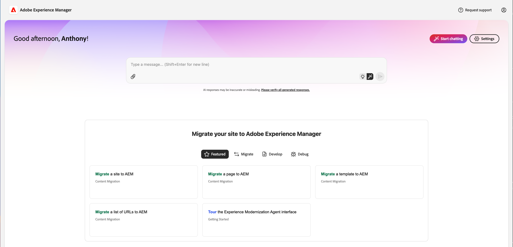
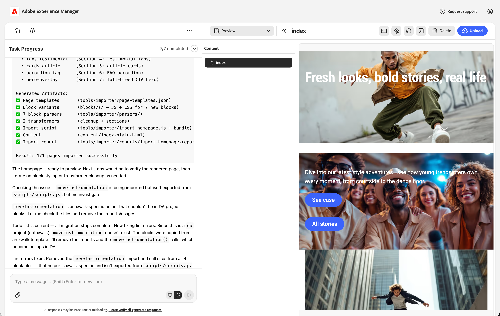
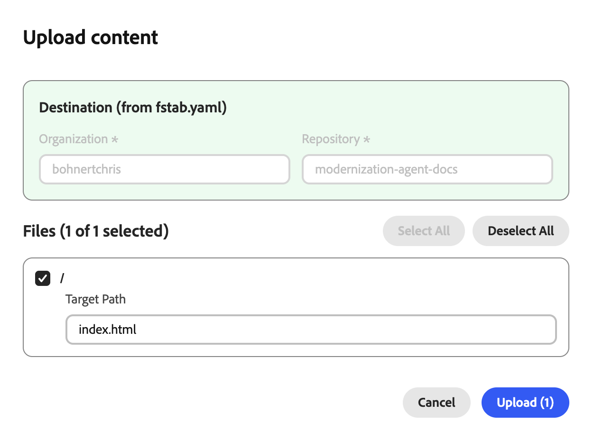
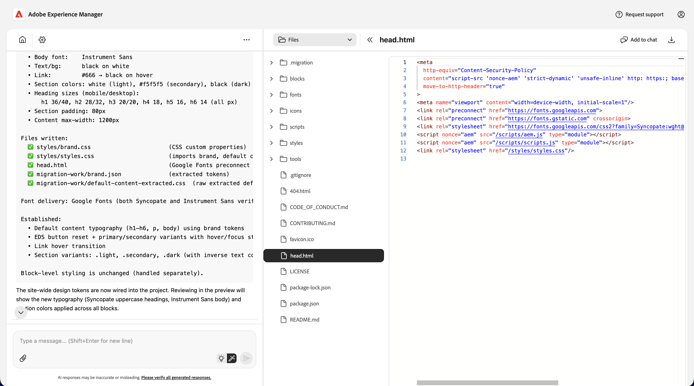
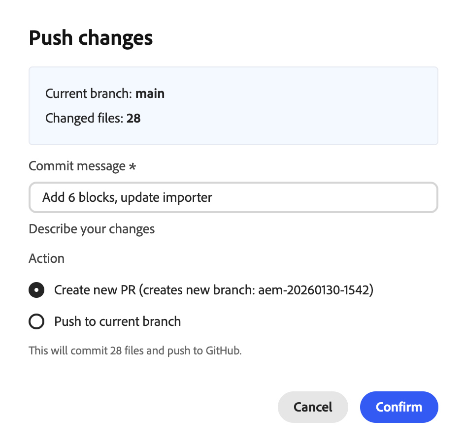
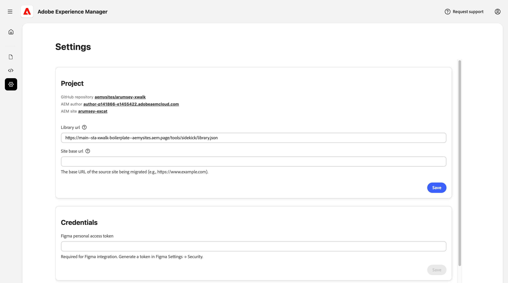

# Experience Modernization Console {#console-reference}

Reference guide for the Experience Modernization Console interface and capabilities

>[!NOTE]
>
>If you are interested in using the Experience Modernization Console, you can request access to ensure a smooth onboarding experience.

## Overview {#overview}

The Experience Modernization Console is a hosted, AI-assisted development environment for Edge Delivery Services, exposed as a web interface at [`aemcoder.adobe.io`](https://aemcoder.adobe.io). After connecting to their GitHub project, you can immediately start prompting changes in natural language without any further setup or local environment configuration.

>[!TIP]
>
>If you are interested in getting started right away with the console, check out the document [Getting Started with the Experience Modernization Agent.](/help/ai-in-aem/agents/brand-experience/modernization/getting-started.md)

## Capabilities {#capabilities}

Core capabilities of the console:

* Interactive chat panel with the agent and its skills
* Live AEM preview for immediate visual feedback on changes
* Content file browser and markdown viewer
* Content synchronization with [Document Authoring](https://da.live)
* Code browser and diff viewer for reviewing changes made
* GitHub integration with ability to create pull requests from changes

Developers retain full control over what ships. All changes made through the console require review and approval before deployment, ensuring governance, brand consistency, and security.

## Navigation {#navigation}

After signing into the console at [aemcoder.adobe.io](https://aemcoder.adobe.io), you arrive on the [home page](#home-page) of the console. Once you have started chatting you will be taking directly to the [chat page](#chat-page) on subsequent visits to Experience Modernization agent.

### Menu Bar {#menu-bar}

The top menu bar provides:

* An **Adobe Experience Manager** title on the left that links to the Home Page when clicked
* A **Request support** button where you can send details of any issues that were encountered
* An **Account** button on the right for switching to dark mode and signing out of the console

## Home Page {#home-page}

The **Home** page is your starting point for using the console. 

* At the top is a [prompt input](#prompt-input) for making requests of the console.
* Below the prompt panel are suggested prompts for getting started with your project.
* A **Start chatting** button that takes you to the [chat page](#chat-page).
* A **Settings** button to access the [project settings](#settings-page) page

### Prompt input {#prompt-input}

The prompt input provides controls for interacting with the AI.

* **Plan / Execute modes** (light bulb and magic wand icons): Toggle between planning and execution modes, respectively
  * **Plan mode**: The AI analyzes requests and outlines an approach without making changes, which is useful for understanding strategy before committing.
  * **Execute mode**: The AI carries out the plan and makes actual file changes.
* **Attach files** (paperclip icon): Upload and attach files to the prompt for additional context (e.g. reference designs, screenshots, specs)
* **Prompt queue** (clock icon): Additional prompts can be queued up to be automatically executed once the current prompt has completed.

## Chat Page {#chat-page}

The [**Chat** page](https://aemcoder.adobe.io/chat) is the main interface for interacting with Experience Modernization agent. This page is split into a resizable [chat panel](#chat-panel) and [workspace panel](#workspace-panel).

## Chat panel {#chat-panel}

The chat panel allows you to view and continue your conversation with the Experience Modernization agent. The chat panel includes the chat message history and a [prompt input](#prompt-input) for making additional requests of the console.

The chat panel header includes links for navigating to the [Home](#home-page) and [Settings](#settings-page) views and chat actions.

* **Chat actions**
  * **Clear chat**: This resets the conversation and clears the AI's context window. Use this option when starting a new task unrelated to the previous conversation.
  * **Download chat**: This downloads the conversation history as a markdown file.

## Workspace panel {#workspace-panel}

The workspace panel displays all the content and code for your site. The header at the top of the panel includes a picker to select the specific view you want to focus on. The actions available in the workspace header will change based on the currently selected view.

### Content views {#content-view}

The **Content views** contain multiple modes for displaying the selected page content. A collapsible file browser displays all the availble page content for your site.

* **Preview** (document with magnifying glass icon) to view the rendered HTML content 
* **Document view** (document icon) to view the underlying document authoring content structure, respectively
* **HTML view** (code icon) to view the raw plain html
* **Markdown view (AEM authoring)** (paragraph icon) to view the underlying markdown content structure
* **JCR XML view (AEM authoring)** (data icon) to view the resulting JCR XML content structure

The following actions are available in the contnet views:

* **Refresh** icon to update the preview panel rendering.
* **Responsive mode** to view the rendered HTML content in a desktop, tablet, or mobile view
* **Inspect mode** (select icon) to add elements of the page to your prompt for additional context
* **New window** (open in icon) to open the preview URL in a new tab (for a full desktop preview)
* **Delete** removes the selected page from the workspace. Previewed or published content will not be deleted.
* **Errors** button (AEM authoring) opens a modal window to view the errors on the selected page.
* **Upload content** button opens a modal window to upload files to AEM.

### Code views {#code-view}

The **Code views** provides tools for browsing your project files and managing code changes. The view includes a file browser for an overview of your code files or changes as diffs, and a preview area for viewing the selected file or changes.

* **Files** to browse the code files in the current workspace
* **Changes** to view the diffs of files changes created by your work on the project

#### File actions {#file-actions}

* **Add to chat** adds the selected file (or selected lines  from the file) to the chat panel for context.
* **Download** download the selected file to your local file system

#### Changes actions {#changes-actions}  

* **Add** (+ icon) to stage the changed file
* **Discard** (arrow icon) to discard the changed file
* **Delete** (trash icon) to delete the unstaged file
* **Refresh** (refresh icon) to refresh the list of changes
* **Switch Branch**: Switches branches within the same repository
* **Sync**: Pulls the latest changes from the remote origin
* **Push**: Opens a modal to push workspace changes to GitHub

When pushing changes, you must have first staged changes to include in the push. When pushing you can choose to create a new PR or push directly to the current branch

Additional GitHub project actions can be performed on the [settings page](#settings-page).

## Settings Page {#settings-page}

The [**Settings** page](https://aemcoder.adobe.io/settings) allows you to manage basic settings of the console and is broken up into the following sections.

If you make a change to any value in any section, click **Save** to save those changes to the individual section. Click the back icon to return to your previous view.

* **Project** allows you to view and edit project settings such as managing your GitHub connection and customizing the library URL.
  * **Connect / Reconnect**: Initiates GitHub authentication
  * **Switch Repository**: Replaces the workspace with a different repository. Any uncommitted work will be lost.
  * **Logout**: Disconnects from GitHub
  * **Library URL** - This URL points to a library.json file that defines available blocks, their variations, and example content.
  * **Site base URL** - The origin URL of the website being migrated
* **Agent permissions** - Allow agent to access configuration options
  * **Allow LLM to access admin.hlx.page on my behalf** - When enabled, the AI assistant can fetch site configurations and metadata from Adobe Experience Manager using your IMS credentials.
  * **Custom IMS Token** - You can provide a custom IMS token to use instead of your default session token.
* **Credentials** allows you to specify a personal access token for Figma so the [console can access design blocks for your project.](/help/ai-in-aem/agents/brand-experience/modernization/prompting-guide.md#figma-block-migration)
  * The token requires the following read-only scopes:
    * `file_content:read`
    * `file_metadata:read`
    * `library_assets:read`
    * `library_content:read`
    * `team_library_content:read`
    * `file_dev_resources:read`
    * `projects:read`
  * [See the Figma documentation](https://help.figma.com/hc/en-us/articles/8085703771159-Manage-personal-access-tokens) for more information about setting up personal access tokens.
* **Support** summarizes information shared with the Adobe support team when you make a support request.
  * **Request support** - Click to initiate a request for support from Adobe without leaving the console.
* **Danger zone** contains settings that can revert your workspace.
  * **Reset workspace** - Click to reset the workspace to its initial state. This can not be undone.
