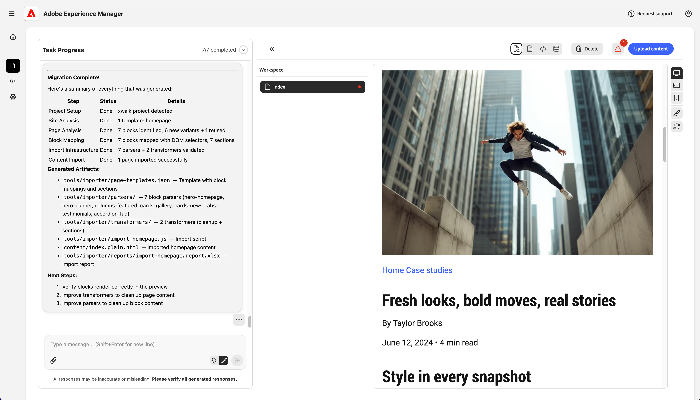

# Getting Started with the Experience Modernization Agent for AEM Authoring Projects {#getting-started-aem-authoring}

For AEM authoring projects using the Universal Editor, preparation of the Experience Modernization Agent differs from the standard Edge Delivery flow. This document covers those setup differences. Once the steps below are complete, follow the main [Getting Started with the Experience Modernization Agent](getting-started.md) guide.

## Create Your Edge Delivery Services Project Repo {#create-repo}

1. Use the [`aem-block-collection-xwalk`](https://github.com/adobe-rnd/aem-block-collection-xwalk) repository as your template (not the standard Edge Delivery Services boilerplate).
1. Follow the [Universal Editor tutorial](https://www.aem.live/developer/ue-tutorial) to set up your repo.
   * Stop when you are asked to create a site in AEM.
1. Delete `paths.json` and commit this change to `main`.
1. Add the [AEM Code Connector](https://github.com/apps/aem-code-connector/installations/select_target) app to your repo.
   * This allows the console to inspect your code.

## Create a New Site in AEM {#create-site}

1. In the AEM Sites console, select **Create** > **Site from template**.
1. Select the **AEM Site with Edge Delivery Services Template**.
   * Don't see it listed? [Install the template.](https://github.com/adobe-rnd/aem-boilerplate-xwalk/releases)
1. Keep the **name** of the site (not the title) as provided.
   * The site name is used as the unique identifier.
   * The title can be changed for display.
1. Click **Create**. 
   * You are redirected to the Sites page.
   * Refresh the page if the new site does not appear immediately.
1. If you have not already done it when [setting up your repo,](#create-repo) update `fstab.yaml` so it points to your AEM host, git owner, and git repo and commit those changes to `main`.
   * See [Configure content source](/help/implementing/cloud-manager/edge-delivery/configure-content-source.md) for instructions.

## Continue with the Standard Getting Started Steps {#continue}

Once the above steps are complete, you can continue with the standard getting started guide to begin migrating your content.

Follow these steps from the standard guide.

1. [Prepare an Edge Delivery GitHub Repository](/help/ai-in-aem/agents/brand-experience/modernization/getting-started.md#prepare-repo)
1. [Open the Experience Modernization Console](/help/ai-in-aem/agents/brand-experience/modernization/getting-started.md#open-console)
1. [Connect Your GitHub Repository](/help/ai-in-aem/agents/brand-experience/modernization/getting-started.md#connect-repo)
1. [Start Prompting](/help/ai-in-aem/agents/brand-experience/modernization/getting-started.md#start-prompting)

Once you complete those steps to migrate the content, continue with the following steps.

## Validate Content {#validate-content}

Validate the content of the selected page in the preview panel. Any errors will be displayed by clicking the **Errors** button. 
Continue your chat conversation with the agent to fix the errors. Use the **Add to chat** feature to target fixes to specific elements of the page, parser files, or transformer files.

## Upload Content {#upload-content}

To upload your content to AEM:

1. Make sure you are in the **Content** view and click the **Upload content** button on the top-right.
1. In the **Create content package** dialog, choose the pages to include in the package.
   * Optionally enter a **Package name** (defaults to the site name if left empty).
   * Use **Select all**, **Clear selection**, **Expand all**, or **Collapse all** to manage the list.
1. Click **Create package**.

   

1. After the package is created, the **Upload content package** dialog shows that the package is ready.
   1. You can **Download package** to save it locally, or proceed to upload.
   1. Under **Upload to AEM**, confirm the **AEM site** and **AEM host** (pre-filled from your project settings).
      * Optionally leave **Upload images** checked to include images.
   1. Click **Upload to AEM**.

   

1. The dialog shows upload progress as pages and assets are sent to AEM. When the upload finishes, a success message and the upload log are displayed. Click **Close** to dismiss the dialog.

   

Your imported content is now in AEM. Continue with [Push Code Changes](getting-started.md#push-code-changes) in the main getting started guide.

## Additional Resources {#additional-resources}

* [Getting Started with the Experience Modernization Agent](getting-started.md) - Full workflow including console, prompting, upload, and preview
* [Experience Modernization Console](console.md) - Console reference
* [Universal Editor tutorial](https://www.aem.live/developer/ue-tutorial) - Set up an AEM authoring and Universal Editor project
* [`aem-block-collection-xwalk`](https://github.com/adobe-rnd/aem-block-collection-xwalk) - Template repository for AEM authoring and Universal Editor projects
