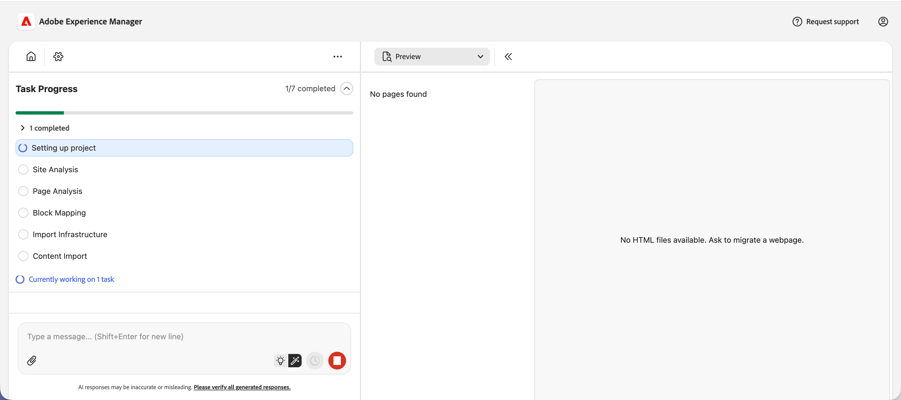
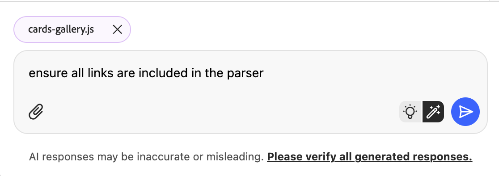
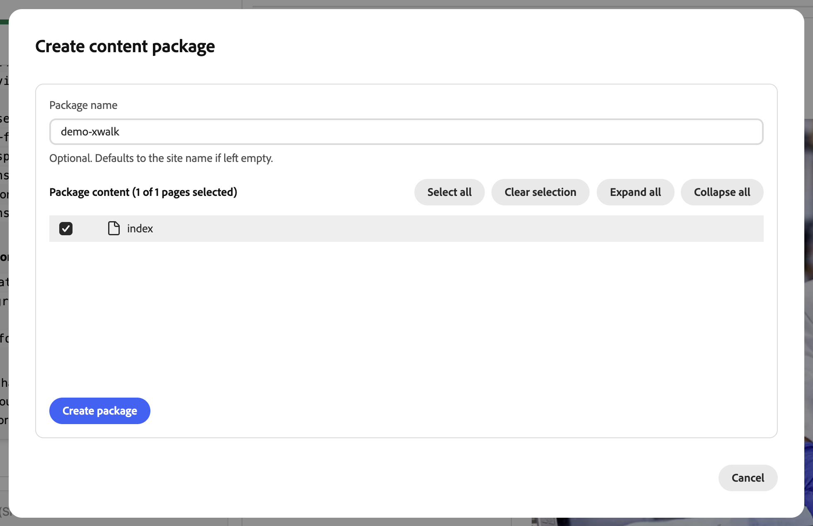
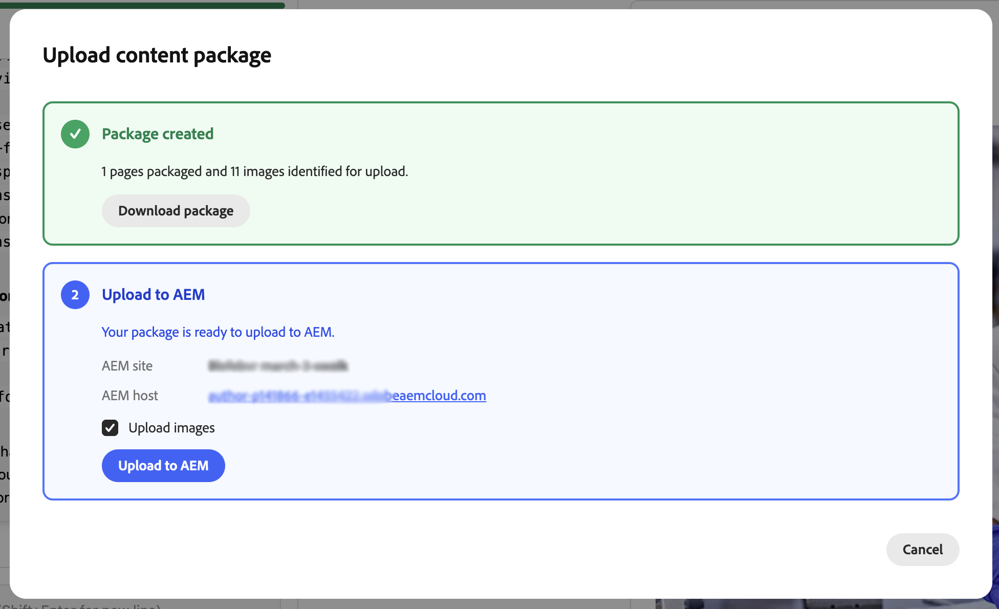
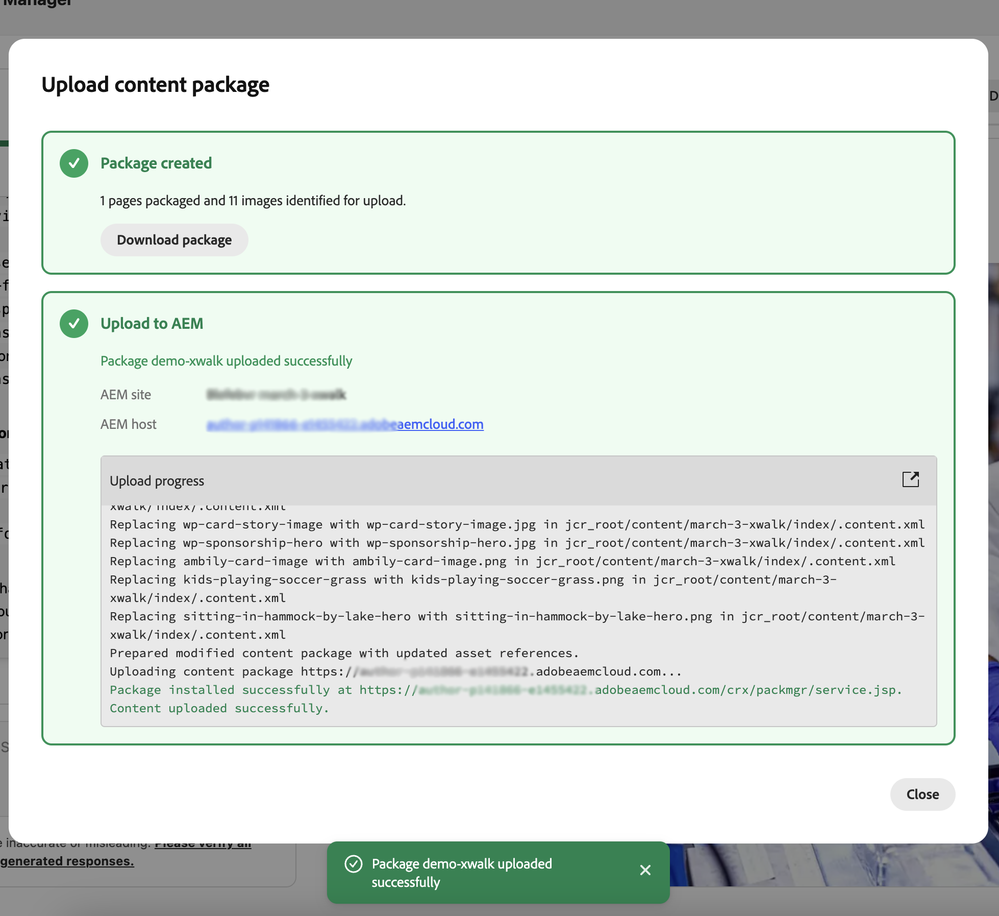

# Getting Started with the Experience Modernization Agent for AEM Sites and Universal Editor Projects {#getting-started-xwalk}

For AEM Sites and Universal Editor projects, preparation for the Experience Modernization Agent differs from the standard Edge Delivery flow. This page covers only those setup differences. Once the steps below are complete, follow the main [Getting Started with the Experience Modernization Agent](getting-started.md) guide.

## Create your EDS project repo (GitHub) {#create-repo}

1. Use the [aem-block-collection-xwalk](https://github.com/adobe-rnd/aem-block-collection-xwalk) repository as your template (not the standard Edge Delivery boilerplate).
1. Follow the [Universal Editor tutorial](https://www.aem.live/developer/ue-tutorial) to set up your repo.
1. Delete `paths.json` and commit this change to `main`.
1. Add the [AEM Code Connector](https://github.com/apps/aem-code-connector) app to your repo: [Install AEM Code Connector](https://github.com/apps/aem-code-connector/installations/select_target).
   * This allows the console to inspect your code.
1. Add [AEM Code Sync](https://github.com/apps/aem-code-sync) (separate from the Code Connector app) to your repo: [Install AEM Code Sync](https://github.com/apps/aem-code-sync/installations/select_target).
   * This allows Edge Delivery Services to sync your code.

## Create a new AEM Site {#create-site}

1. In the AEM Sites console, select **Create** > **Site from template**.
1. Select the **AEM Site with Edge Delivery Services Template**.
   * Don't see it listed? Install the template using the product instructions for your environment.
1. Keep the **name** of the site (not the title) as provided.
   * The site name is used as the unique identifier; the title can be changed for display.
1. Click **Create**. You are redirected to the Sites page; refresh the page if the new site does not appear immediately.
1. In your GitHub repository, update `fstab.yaml` so it points to your AEM host, git owner, and git repo. See [Configure content source](/help/implementing/cloud-manager/edge-delivery/configure-content-source.md) for instructions.
1. Commit these changes to `main` to trigger a deployment.

## Continue with the standard getting started steps {#continue}

Once the above steps are complete, you can continue with the standard getting started guide to begin migrating your content:

* [Prepare an Edge Delivery GitHub Repository](getting-started.md#prepare-repo)
* [Open the Experience Modernization Console](getting-started.md#open-console)
* [Connect Your GitHub Repository](getting-started.md#connect-repo)
* [Start Prompting](getting-started.md#start-prompting)

## Validate content {#validate-content}

Validate the content of the selected page in the preview panel. Any errors will be displayed by clicking the **Errors** button. 
Continue your chat conversation with the agent to fix the errors. Use the **Add to chat** feature to target fixes to specfic elements of the page, parser files, or transfromer files.

## Upload content {#upload-content}

To upload your content to AEM:

1. Make sure you are in the **Content** view and click the **Upload content** button on the top-right.
1. In the **Create content package** dialog, choose the pages to include in the package. Optionally enter a **Package name** (defaults to the site name if left empty). Use **Select all**, **Clear selection**, **Expand all**, or **Collapse all** to manage the list. Click **Create package**.

   

1. After the package is created, the **Upload content package** dialog shows that the package is ready. You can **Download package** to save it locally, or proceed to upload. Under **Upload to AEM**, confirm the **AEM site** and **AEM host** (pre-filled from your project settings). Optionally leave **Upload images** checked to include images. Click **Upload to AEM**.

   

1. The dialog shows upload progress as pages and assets are sent to AEM. When the upload finishes, a success message and the upload log are displayed. Click **Close** to dismiss the dialog.

   

Your imported content is now in AEM. Continue with [Push Code Changes](getting-started.md#push-code-changes) in the main getting started guide.

## Additional resources {#additional-resources}

* [Getting Started with the Experience Modernization Agent](getting-started.md) - Full workflow including console, prompting, upload, and preview
* [Experience Modernization Console](console.md) - Console reference
* [Universal Editor tutorial](https://www.aem.live/developer/ue-tutorial) - Set up an AEM XWalk/Universal Editor project
* [aem-block-collection-xwalk](https://github.com/adobe-rnd/aem-block-collection-xwalk) - Template repository for XWalk/UE projects
