# Getting Started with the Experience Modernization Agent {#getting-started}

Learn the first steps to get started using the Experience Modernization Agent and the Experience Modernization Console.

>[!NOTE]
>
>If you are interested in using the Experience Modernization Console, you can request access through your account manager to ensure a smooth onboarding experience.

## Prepare an Edge Delivery GitHub Repository {#prepare-repo}

>[!NOTE]
>
>Using an AEM Sites and Universal Editor project? Follow [Getting Started for AEM Sites/Universal Editor](/help/ai-in-aem/agents/brand-experience/modernization/getting-started-aem-authoring.md) setup steps.

1. Select an [Edge Delivery Services](/help/edge/overview.md) repository for use with the Experience Modernization Console.
   * This can be an existing Edge Delivery Services project or you can create a new one following the [developer tutorial](https://www.aem.live/developer/tutorial) using the [boilerplate repository.](https://github.com/adobe/aem-boilerplate)
1. Ensure that the [AEM Code Connector](https://github.com/apps/aem-code-connector) is installed in the repository.
   * This allows the console to inspect your code.
1. Ensure that the [AEM Code Sync GitHub app](https://github.com/apps/aem-code-sync) is installed in the repository.
   * This allows Edge Delivery Services to sync your code.
   * If your repo is based the on the tutorial, this step is already complete.

## Open the Experience Modernization Console {#open-console}

1. Navigate to [`aemcoder.adobe.io`.](https://aemcoder.adobe.io)
1. Log in with your Adobe ID.

## Connect Your GitHub Repository {#connect-repo}

The console prompts you for a repository when you first sign in.

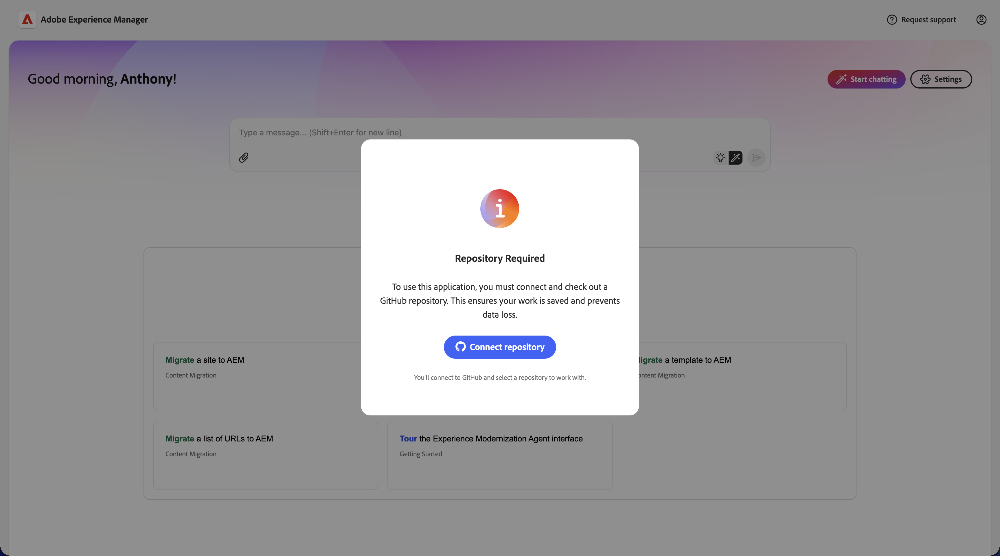

1. Click **Connect repository**.
1. This opens the AEM Code Connector app on a new browser tab. Click **Authorize AEM Code Connector**.
1. Back in the console, specify the Preview URL of the site. The preview URL can be obtained by previewing any document in the site, or by constructing it from branch, site-name and org. The system will retrieve the associated Github Project automatically, in some cases you may be asked to provide the github coordinates too.
   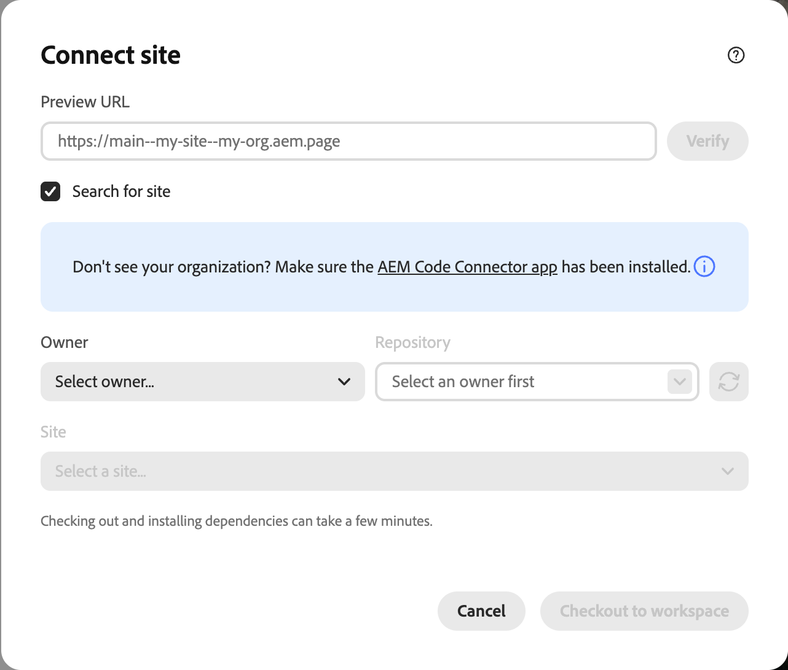
1. When prompted to **Replace existing workspace**, click **Replace workspace**.
   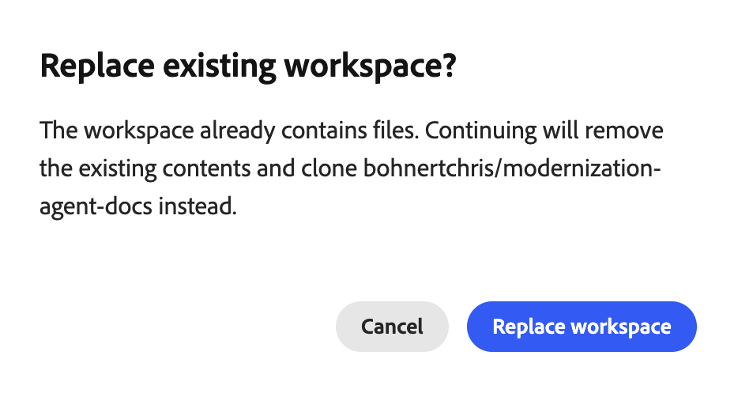

Your GitHub project is now connected to the console and you are on the home screen.

## Start Prompting {#start-prompting}

Now that your console can access your code, you are ready to start prompting.

1. To get started you can import the content of a site:
   * "Migrate the page `https://wknd-trendsetters.site`."
1. This imports the content of the site.
   * The console observes separation of concerns and handles content and presentation separately.
   * The initial import of a site's content may take several minutes.
   * The console presents you with ongoing feedback as it begins its work, including an overview of its planned steps.
   
1. Once the site is imported, the **Workspace** panel shows the pages. Select a page to preview it in the right panel.
  
1. Now that you have content, you can prompt to import the styles from the same source.
   * "Import the general styles from `https://wknd-trendsetters.site`."
1. As with the initial content import, the import may take several minutes and the console provides feedback as it processes your request and imports the styles. Once the task is complete, click **Refresh preview** in the right panel to view the styled content.
   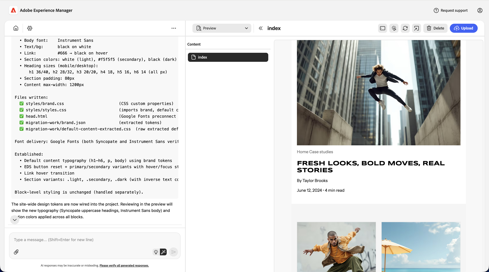

Now you have both the content and styles imported into the console.

>[!TIP]
>
>[Check out the prompting guide](/help/ai-in-aem/agents/brand-experience/modernization/prompting-guide.md) for more ideas on how to prompt the agent and what its skills can do.

## Upload Content {#upload-content}

>[!TIP]
>
>If you are working on an AEM Sites and Universal Editor project, uploading content to AEM works slightly differently. Refer to [Getting Started with the Experience Modernization Agent for AEM Sites/Universal Editor Projects](/help/ai-in-aem/agents/brand-experience/modernization/getting-started-aem-authoring.md#upload-content) for specific upload instructions.

To upload your content to [Document Authoring](https://da.live):

1. Make sure you are in the **Content** view and then click the **Upload content** button on the top-right.
   * By default you are in **Content** view when entering the console.
   * Your view is indicated by the highlighted icon in the sidebar along the left side of the console.
1. The **Upload content** dialog opens with the destination org and repo pre-filled from your `fstab.yaml`.
   * If an `fstab.yaml` is not present in your connected repository, you will need to manually enter your **Organization** and **Repository**..
   * If you used the boilerplate, an `fstab.yaml` is provided.
1. Select the files you want to upload and click **Upload**.
   
1. The console indicates upload process by graying the **Upload** button.
   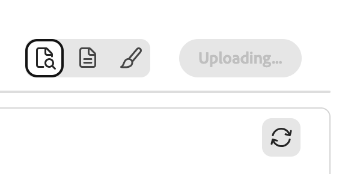
1. Once complete, a notification appears at the bottom of the console.
   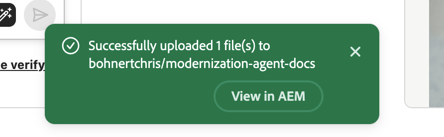

To access the uploaded content in Document Authoring, optionally click **View in AEM** in the notification when the upload completes, or navigate to `https://da.live/#/{organization}/{repository}`.

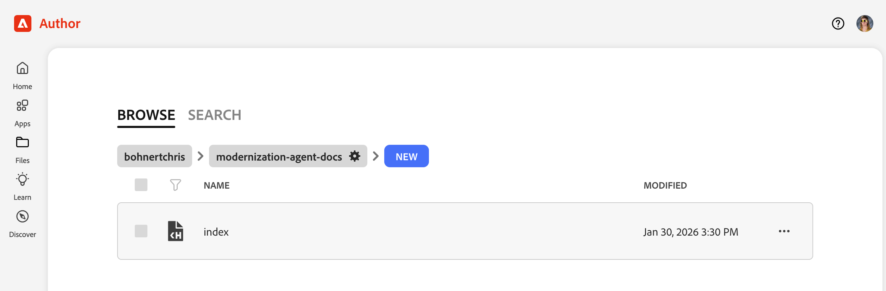

Your imported content is now in Document Authoring.

## Push Code Changes {#push-code-changes}

Once you are satisfied with the changes you have made to your code, you can push them to your GitHub repository.

1. Switch to **Code** view (`</>` icon in the left sidebar) and then the **Git Changes** tab (branch icon at the top-right).
   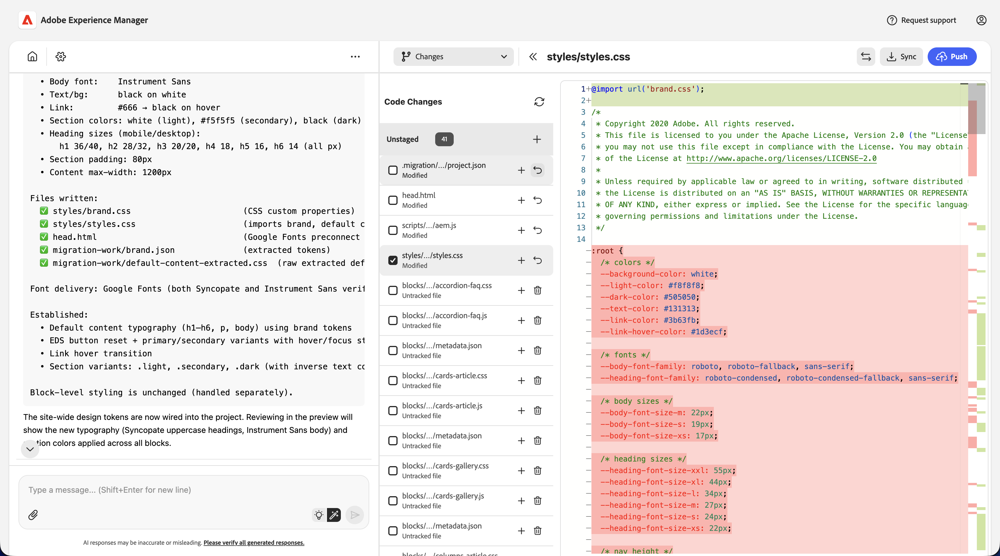
1. In the list of files changed, if some files show up as untracked, click their `+` button to stage them.
1. Click the **GitHub actions** button at the top-right and then select **Push** from the drop-down.
1. In the **Push changes** dialog, choose to push changes to a new PR (default) or the current branch and click **Confirm** to push.
   * When in doubt, you can push to the current branch to keep things simple.
1. Once complete, a notification appears at the bottom of the console.
   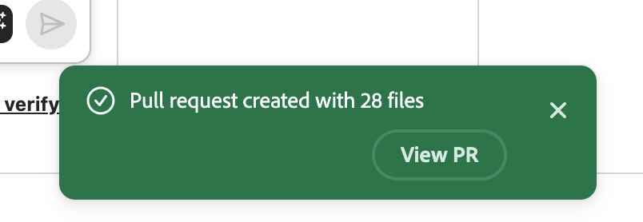

If you wish to directly access the pushed changes in GitHub, click **View PR** in the notification when the push completes.

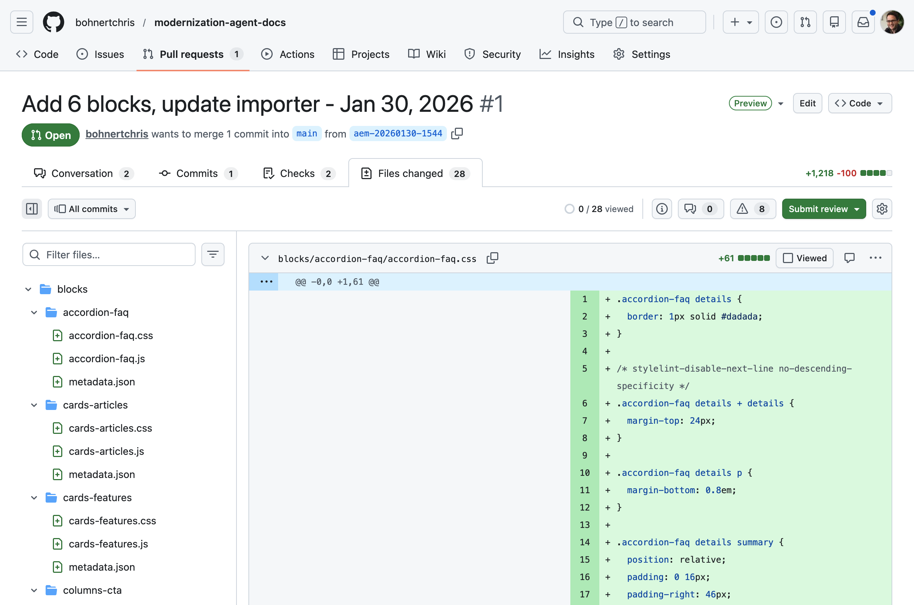

Your code is now in GitHub.

## Preview Site {#preview-site}

To view the changes in the preview environment:

1. Go back to Document Authoring.
   * It may still be open in a browser tab you opened after clicking **View in AEM** after uploading the content.
   * Or navigate to `https://da.live/#/{organization}/{repository}`
1. Open one of the pages that you previously uploaded to AEM.
1. Click the paper plane icon (top right) and select **Preview**.
   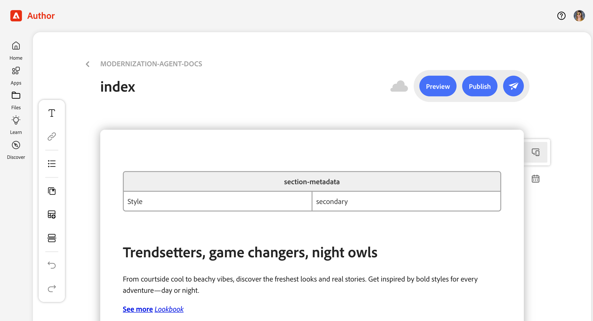

Congratulations! Your migrated content and styles are now live on the AEM preview environment.

If you pushed your code to a branch other than `main`, the preview opened from Document Authoring will not show the styles. Change to the branch by updating the URL of the preview and you can see your styles.

## Additional Resources {#additional-resources}

The following documents may be useful as you continue to explore the Experience Modernization Agent and its console.

* [Experience Modernization Console](/help/ai-in-aem/agents/brand-experience/modernization/console.md) - Details on the console, it's views, options, and capabilities
* [Prompting Guide for Experience Modernization Agent](/help/ai-in-aem/agents/brand-experience/modernization/prompting-guide.md) - Ideas on how to prompt the agent and what its skills can do
* [Edge Delivery Services developer tutorial](https://www.aem.live/developer/tutorial) - Useful if you are new to AEM and Edge Delivery Services projects
* [Document Authoring](https://da.live) - Useful if you are new to Document Authoring for content management
