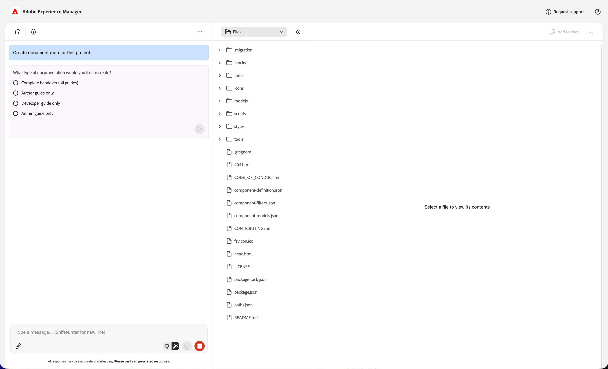
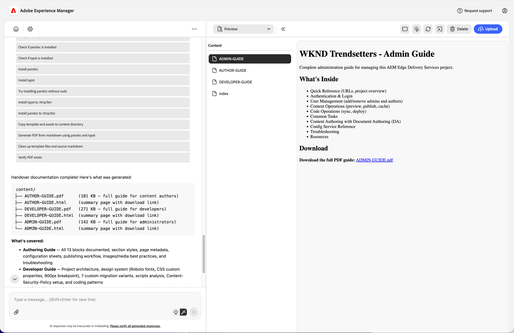

# Project Documentation Skill {#project-documentation}

Learn how the Experience Modernization Agent's documentation skill can help you accelerate project handovers.

## Accelerating Project Handovers {#project-handovers}

[The Experience Modernization Agent](/help/ai-in-aem/agents/brand-experience/modernization/overview.md) can automatically generate project documentation guides for AEM Edge Delivery Services projects featuring:

* **Project walkthrough** - Explanation of the project setup, structure, and conventions, generated without manual effort
* **Module &amp; component organization** - Clear documentation of how blocks, modules, and components are organized and how they relate to each other
* **Role-based guides** - Targeted documentation for authors, developers, and administrators, so each team member gets exactly what they need

This simplifies project handovers for AEM Edge Delivery Services projects.

## Prerequisites {#prerequisites}

Ensure the following before using this skill.

* Your project must be checked out to the workspace in the console.
* You must have admin permissions for the project for which you're creating documentation.
* Agent permissions must be allowed in the console.
  * Select the option **Allow LLM to access admin.hlx.page on my behalf** [in the settings of the console.](/help/ai-in-aem/agents/brand-experience/modernization/console.md#settings-view)
  * If this option is not enabled, the the agent will generate the documentation based on the code base accessible to it.
  
## Creating Project Documentation {#creating-documentation}

Once the prerequisites are fulfilled, you simply need to ask the agent to create documentation for your project.

1. In the chat ask "Create documentation of this project."
1. Provide the organization name of the project if the agent asks for it.
1. The agent will ask which documentation you would like to create. Normally, you would select **All**.

   

1. Once created, the guides are placed in your workspace. Select one to view a description and click the link to download the full PDF.

   

You can save the PDF directly to provide to your teams or upload it as part of the rest of the DA content.

>[!NOTE]
>
>If you are not authorized to access the Edge Delivery Services admin API or the option **Allow LLM to access admin.hlx.page on my behalf** [in the settings of the console.](/help/ai-in-aem/agents/brand-experience/modernization/console.md#settings-view) is not enabled, the agent will generate the documentation based on the code base accessible to it.

## Troubleshooting {#troubleshooting}

The following are common error messages encountered when using the project documentation skill and how to solve them.

### "Access Denied" or "Unauthorized" {#unauthorized}

* **Cause:** Missing admin permissions or agent permissions not enabled
* **Solution:**
  1. Verify you have admin access to the project
  1. Select the option **Allow LLM to access admin.hlx.page on my behalf** [in the settings of the console.](/help/ai-in-aem/agents/brand-experience/modernization/console.md#settings-view)

### "Project Not Found" {#not-found}

* **Cause:** Repository not checked out in workspace
* **Solution:**
  1. Check out the project repository
  1. Ensure you're in the correct workspace

### "Config API Error" {#api-error}

* **Cause:** Unable to access Edge Delivery Services config service API
* **Solution:**
  1. Select the option **Allow LLM to access admin.hlx.page on my behalf** [in the settings of the console.](/help/ai-in-aem/agents/brand-experience/modernization/console.md#settings-view)
  1. Check your network/VPN connection
  1. Confirm admin access to the project
