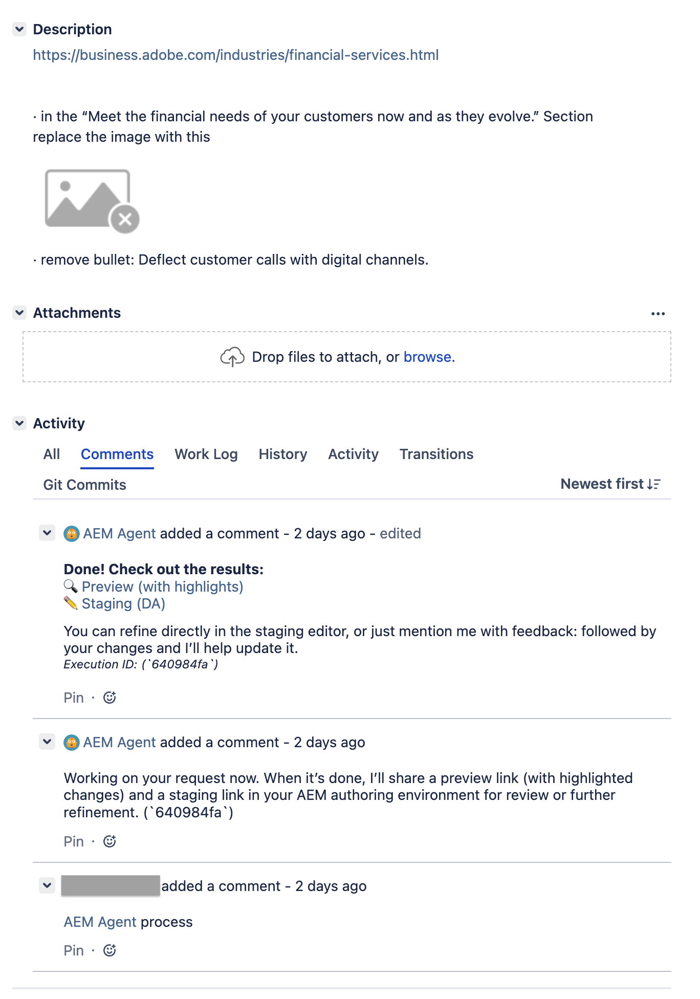

# Content Update Skill {#content-update}

The content update skill of the Experience Production Agent automates content production to accelerate everyday tasks for Adobe Experience Manager (AEM) as a Cloud Service and Edge Delivery Services.

## Overview {#overview}

The content update skill transforms the details that you provide, either through natural language or visuals, into content updates on your page. You supply the URL of a page that needs updating, together with details of what needs updating, and the agent skill completes your task.

## Capabilities {#capabilities}

You can access the content update skill from:

* [Jira](#jira)

<!--
* AI Assistant
-->

## Personas {#personas}

The skill is primarily focused on simplifying and accelerating tasks for the personas:

* Content Authors
* Marketing 
* Digital Product Manager 

## Limitations {#limitations}

Currently the limitations in place are: 

* Only available on AEM as a Cloud Service. 
  * Not available on AEM On-prem, nor Managed Services.

## Jira {#jira}

Using the content update skill with Jira allows you to create a ticket with instructions that automate your edits.

### Activation {#activation}

To activate and gain access to the content update skill for use with Jira you need to email Adobe. To get started you can contact:

* `experience-production-agent@adobe.com`
* or reach out to their account team

To speed up the process it helps to provide the following information:

* For AEM as a Cloud Service
  * You need to provide your:
    * Organization ID
    * `product_id` 
    * `profile_id`

  * These values could be found using the following steps:
    * Your administrator needs to visit https://adminconsole.adobe.com/
    * Select **Adobe Experience Manager as a Cloud Service**
    * Select the appropriate AEM instance
    * Select the profile that allows read and write operations for the content in question
    * Grab the browser URL
    * Extract `product_id` and `profile_id` from the URL. 
      For example, https://adminconsole.adobe.com/products/profiles/users

* Edge Delivery Document Authoring
  * Provide your Adobe team with the following information:
    * Relevant domains
    * Relevant Github information:
      * Org
      * Repo
      * Branch

### Create a ticket {#create-a-ticket}

Create a Jira ticket (of any type). 

There are two essential details needed in the **Description** field of your ticket:

1. The public facing URL of the page you need to edit.

1. The changes needed. 

   Currently the skill supports the following range of formats to describe your changes:

   * Natural Language in the ticket description
     * for example "Change the headline from X to Y"
   * Annotated PDF attached
     * for example, create a PDF of your page and add annotations detailing what you want changed
   * Comments in attached PDF
     * for example, create a PDF of your page and add comments detailing what you want changed
   * Annotated screenshot attached
     * for example, take a screenshot of part of your page and add annotations detailing what you want changed
   * Microsoft Word file attached, containing natural language changes

### Invoke the agent from your ticket {#invoke-the-agent-from-your-ticket}

To use the agent, add a comment to your ticket. In the comment mention the agent with the `@` symbol, together with the command it should execute; for example:

* `@aemagent@adobe.com process`

Currently, the agent understands the commands:

* `process` - process the request
* `cancel` - cancel a processing request
* `retry` - re-process a request
* `feedback` - apply feedback to a previous generation
* `reprocess` - reprocess the original request

<!--
for feedback, but this is command
  * for example: "update headline to I love AEM!"
-->

### How the agent interacts {#how-the-agent-interacts}

After you issue a command to the agent, it responds with comments in the Jira. The comments detail the agent's progress, and actions taken.

In the case of a `process` command to trigger updates, the responses might follow the sequence:

* The initial comment confirms that the agent has started.

* Once the task is completed. the agent responds with another comment containing details of the actions taken. 
  * The content updates made by the agent are non-destructive - this means that they are made to a preview instance. 
  * The comment contains links to the updates, so that you can review and publish as required, or assign the Jira to whoever will be responsible.

* The following image shows an example Jira that triggers the `process`command for the content update skill:

  
