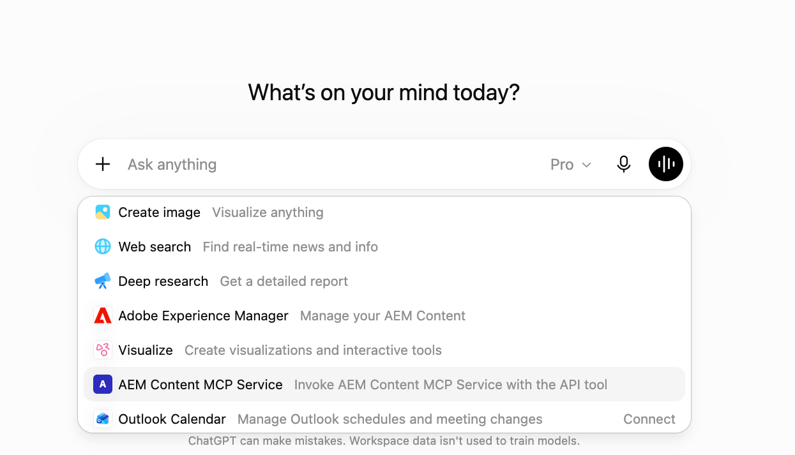
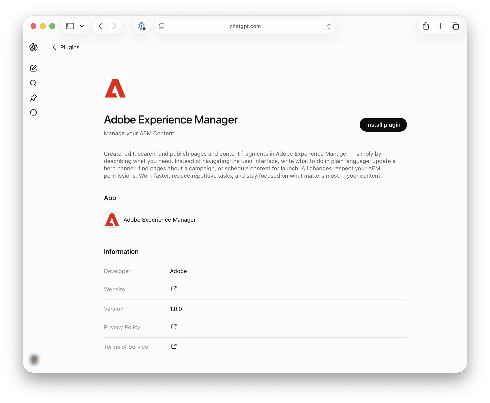
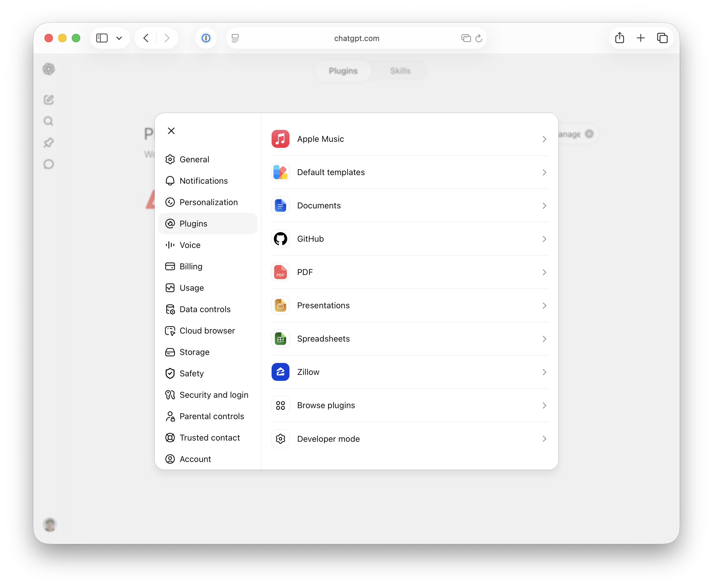
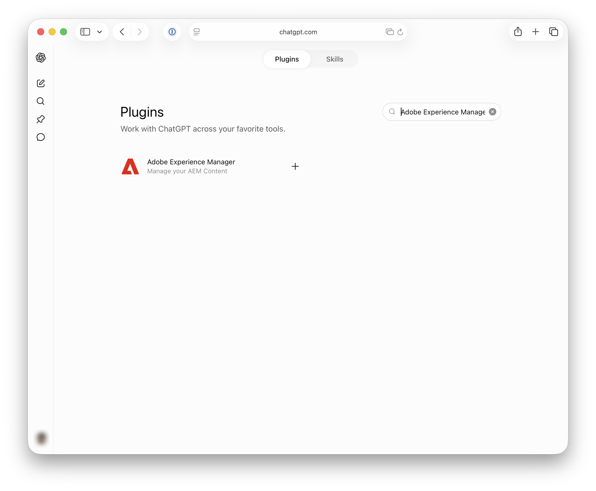
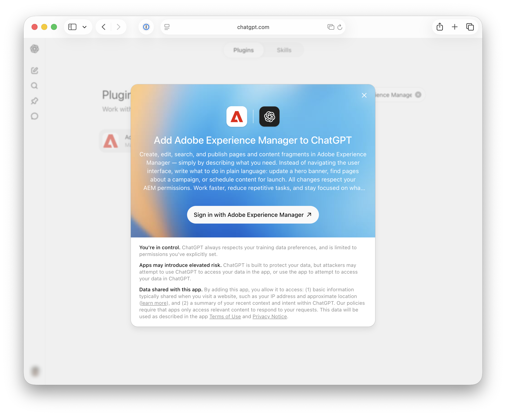
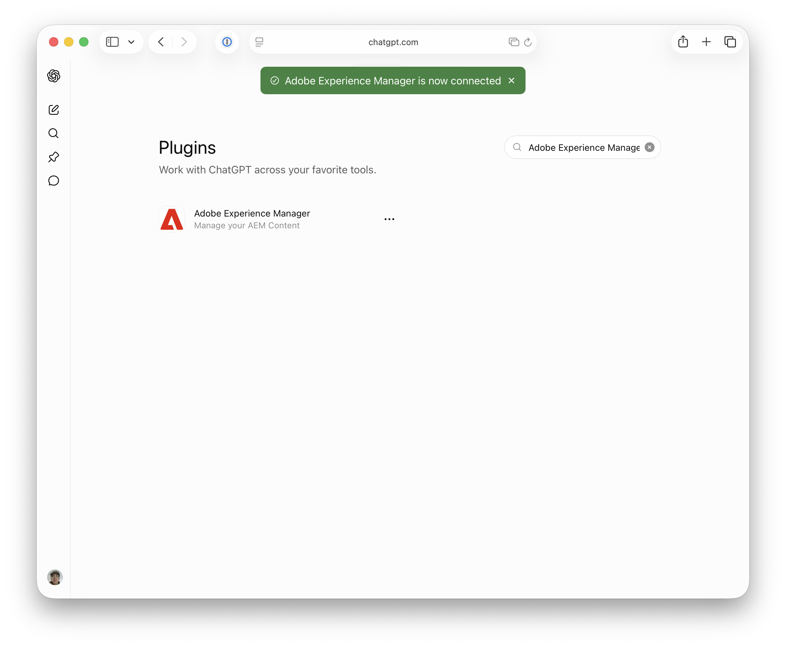

# Setting Up OpenAI ChatGPT with AEM MCP {#setup-chatgpt}

This article covers two separate ways to use OpenAI ChatGPT with AEM:

- Manually configure one or more of AEM's MCP servers in ChatGPT (the servers described at [Using MCP with AEM as a Cloud Service — MCP servers](/help/ai-in-aem/mcp-support/using-mcp-with-aem-as-a-cloud-service.md#mcp-servers)).
- Install the Adobe Experience Manager plugin from the ChatGPT plugin marketplace. It currently has feature parity with Content MCP Server and will expose a growing subset of tools available in AEM's MCP servers.

## Manually configure AEM's MCP servers in ChatGPT {#manually-configure-aems-mcp-servers-in-chatgpt}

This section describes the **manual configuration** approach, where you add one or more of AEM's MCP servers to ChatGPT as custom plugins.

* Add one or more AEM MCP server URLs in the area where MCP connections or tools are configured.
* Trigger the connection and sign in with your Adobe ID when redirected.
* In a chat, reference the configured AEM Tools in your prompts, for example:

   ```
   "Using the configured AEM MCP tools, list all sites in the author environment."
   ```

>[!NOTE]
>
>The OpenAI ChatGPT user interface is subject to change and is not definitive. These instructions are for illustrative purposes.

1. Open **Settings** so you can reach the area where MCP connections or tools are configured.

   

1. In **Plugins**, select **Developer mode**.

   

1. Enable **Developer mode** so you can add and configure a custom plugin.

   

1. In the left navigation menu, select **Plugins** again, then select **Browse plugins**.

   

1. Select the plus sign (**+**) in the upper-right corner to add an app entry for your AEM MCP server.

   

1. Complete the **New Plugin** form—for example, name the plugin and enter your AEM MCP server URL and any other required fields—then **Create**.

   

1. Confirm **AEM Content MCP Service** (or your configured plugin) appears under **Plugins** so ChatGPT can use it.

   

1. In a chat, write a prompt that tells ChatGPT to use the configured **AEM Tools** (for example, to query author content or sites).

   

## Install the Adobe Experience Manager plugin (ChatGPT plugin marketplace) {#install-adobe-experience-manager-plugin}

This section describes the **installable plugin** from the ChatGPT plugin marketplace (as opposed to adding a custom MCP server URL). It includes a subset of the tools available in AEM's MCP servers.

>[!NOTE]
>
>The OpenAI ChatGPT user interface is subject to change and is not definitive. These instructions are for illustrative purposes.

You can reach the Adobe Experience Manager plugin in either of two ways. Use whichever is more convenient, then continue with the sign-in steps that follow.

**Option 1: Open the plugin page directly**

Go to the [Adobe Experience Manager plugin page](https://chatgpt.com/plugins/plugin_asdk_app_6a35d3c1258081919c084a1fd22cd02d) and choose **Install plugin**.

   

**Option 2: Find the plugin in the marketplace**

1. From **Settings**, choose **Plugins**, then at the bottom of the list choose **Browse plugins**.

   

1. Search for **Adobe Experience Manager**, then select it.

   

**Sign in and confirm**

After you locate or install the plugin using either option above, complete the connection:

1. Choose **Sign in with Adobe Experience Manager** and log in to AEM when redirected.

   

1. Confirm the green banner indicates that Adobe Experience Manager is now connected.

   
