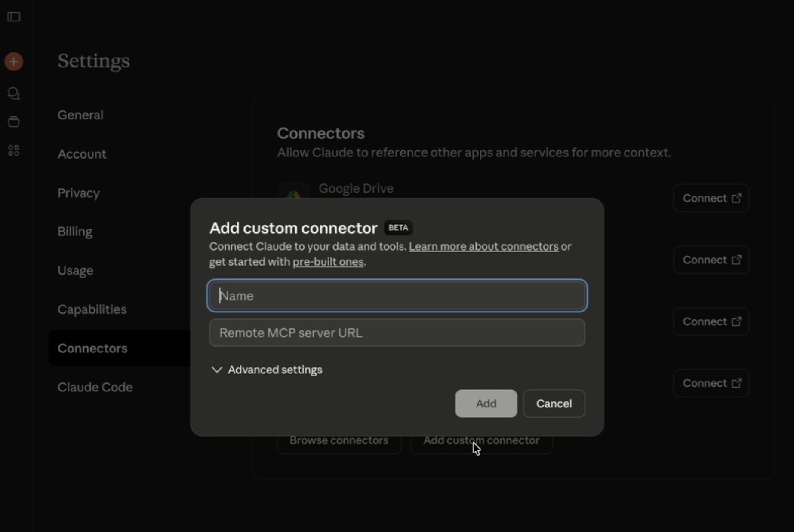
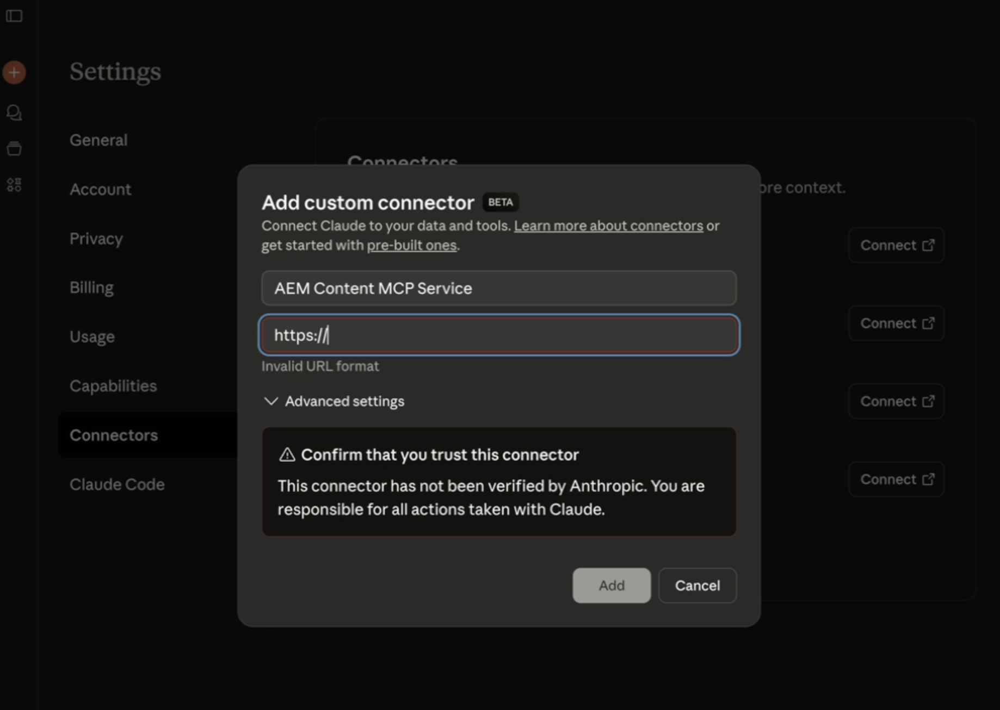
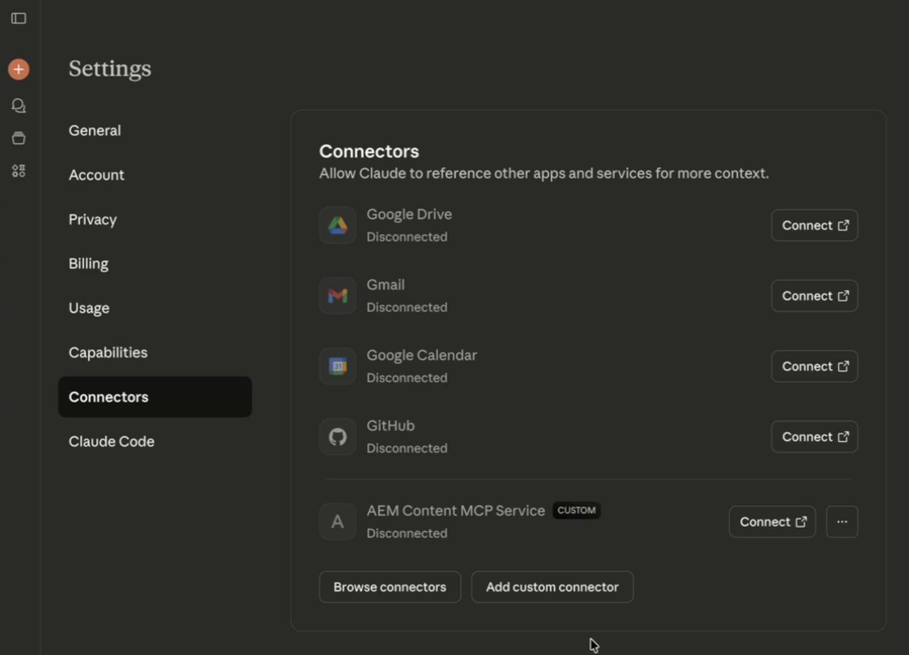
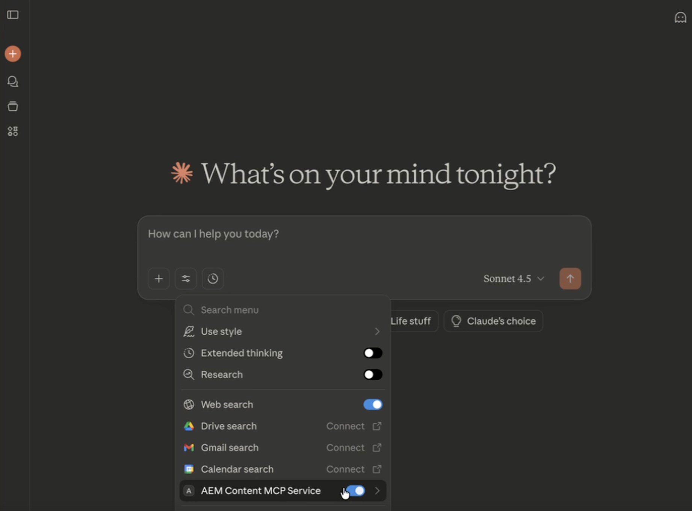

# Setting Up Anthropic Claude with AEM MCP {#setup-claude}

Follow these steps to connect Anthropic Claude to AEM's MCP servers.

* In Claude's MCP configuration, register one or more AEM MCP server URLs.
* Complete the Adobe login flow.
* Optionally, enable auto-confirm for certain tools in the configuration area. This option is recommended for search or read-only operations.
* Ensure that the MCP server is selected before starting your conversation.
* Ask Claude to perform AEM-related tasks. Claude selects the AEM Tools exposed by the MCP server based on your prompt.

To configure Claude for AEM MCP, follow the steps below:

>[!NOTE]
>
>The Claude user interface is subject to change and is not definitive. These instructions are for illustrative purposes.

1. Open the account menu in the lower-left corner of the Claude web app and choose **Settings** to open the Settings area. Your browser may show the destination as the general settings URL.

   

1. In the Settings sidebar, select **Connectors**. On the Connectors page, choose **Add custom connector** to register a custom MCP endpoint.

   

1. In the **Add custom connector** dialog, enter a display name (for example, **AEM Content MCP Service**) and your AEM MCP server URL, then choose **Add**. Use **Advanced settings** only when your deployment requires extra options.

   

1. On the Connectors list, find your custom connector entry (it shows a **CUSTOM** label) and choose **Connect** to sign in and link the connector to your Claude account.

   

1. When the connector appears in the list with its URL, choose **Configure** next to **AEM Content MCP Service** to open the connector details and continue setup.

   

1. On the **Tool permissions** page, review the default (for example, **Needs approval**), then set each AEM tool to **Always allow**, **Ask for permission**, or **Never allow** according to your security policy.

   

1. Open a conversation. Select the tools and model menu (sliders icon) to the left of the message field, enable **AEM Content MCP Service** under Connectors, then enter your prompt so Claude can use the MCP tools for that chat.

   

## Adobe Experience Manager Claude Connector {#aem-claude-connector}

To install the **Adobe Experience Manager Claude Connector**, open **Settings** > **Connectors** in Claude. You can also open the Connectors page directly at [https://claude.ai/settings/connectors](https://claude.ai/settings/connectors). The connector registers an MCP server that exposes a growing set of tools for AEM workflows.

