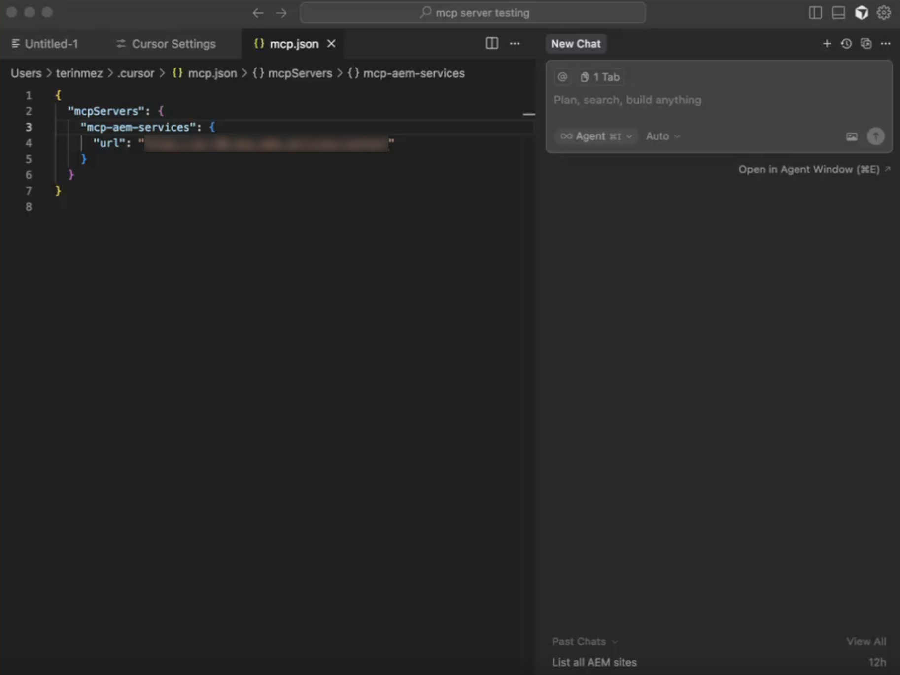
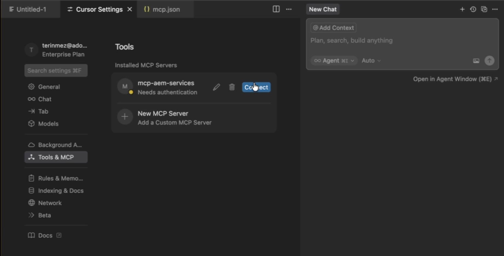
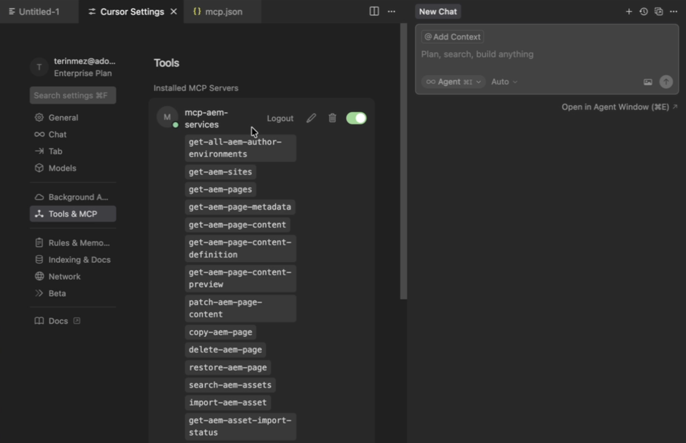
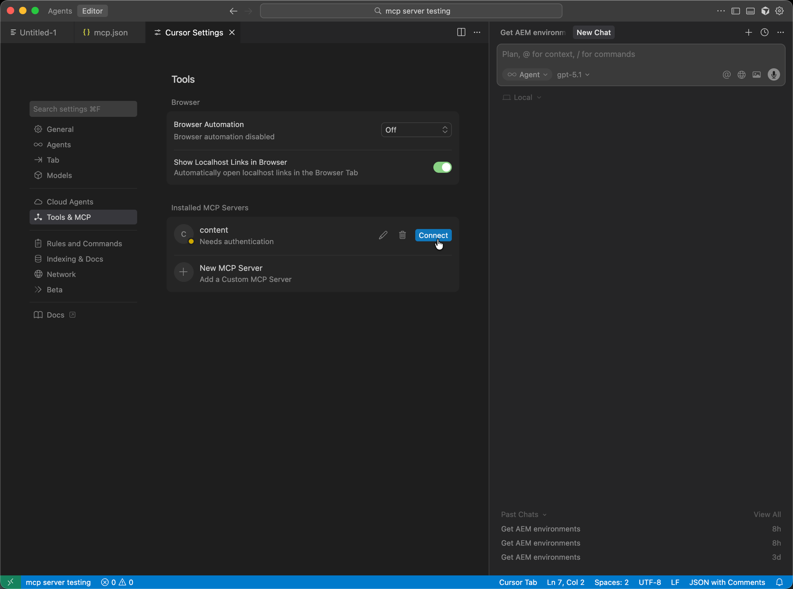
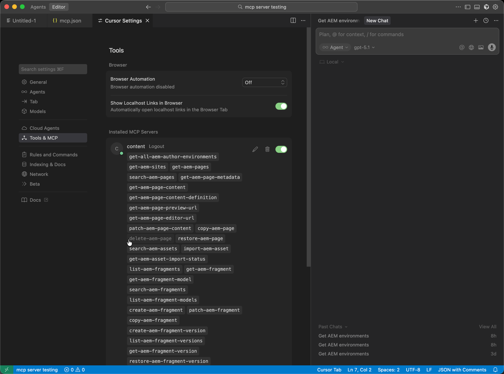

# Setting Up Cursor with AEM MCP {#setup-cursor}

Follow these steps to connect Cursor to AEM's MCP servers.

* In Cursor's MCP settings, create a new MCP server entry with one or more AEM MCP URLs.
* Authenticate with your Adobe ID when prompted.
* Optionally, enable or disable individual tools by clicking on the tool names. All tools are enabled by default.
* Use Cursor's editor or chat to invoke AEM Tools as part of development or content workflows.

>[!NOTE]
>
>The Cursor user interface is subject to change and is not definitive. These instructions are for illustrative purposes.

1. Open **Cursor Settings** so you can configure how Cursor connects to MCP servers.

   

1. Open **Tools and MCP**, then choose **Add Custom MCP** to start a custom MCP server entry.

   

1. On the custom MCP server form, enter the **Name**, your AEM MCP **URL** (or URLs), and any other required fields, then **Save**.

   

1. When the connection dialog appears, complete sign-in by pressing **Connect** so the new MCP server is authorized.

   

1. In **Chat** or the editor, write prompts that invoke **AEM Tools** so the configured MCP server participates in your workflow.

   
