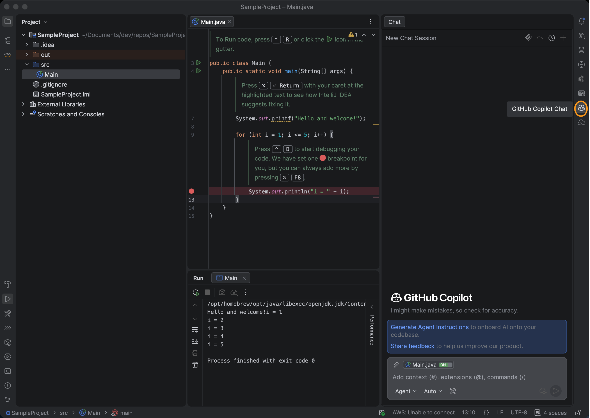
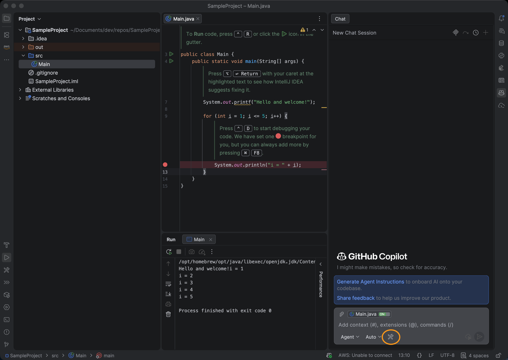
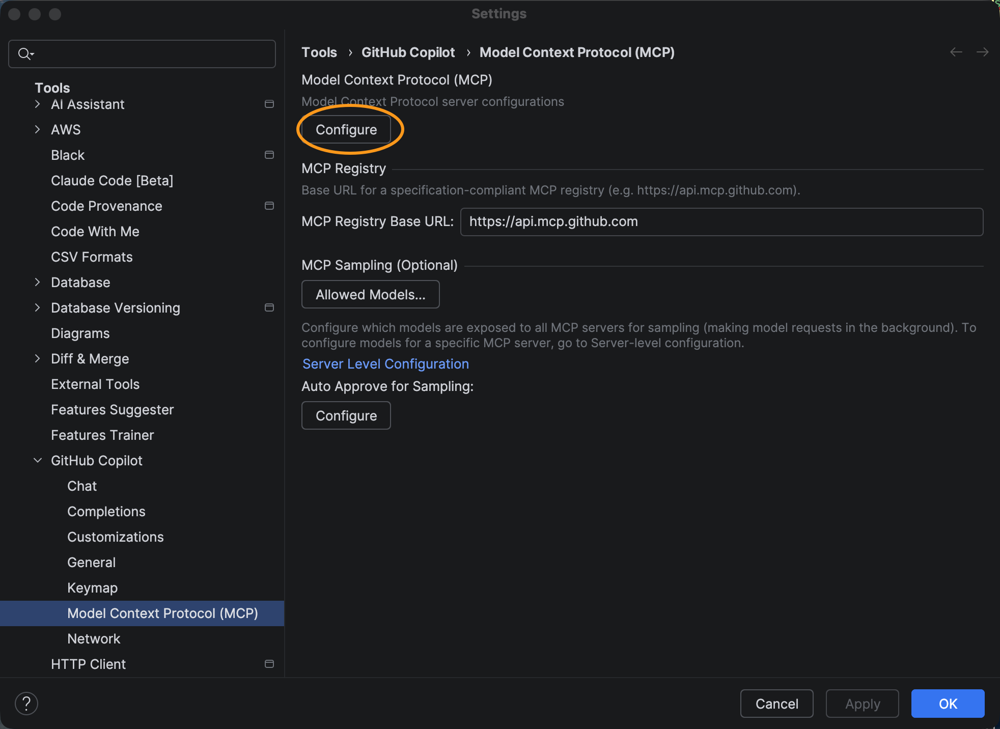
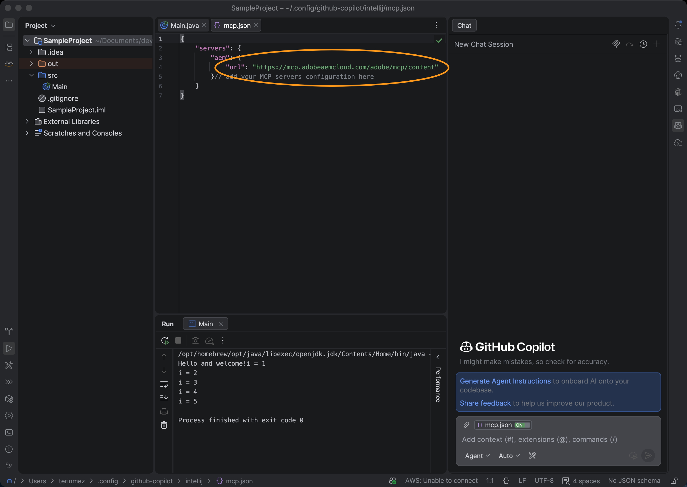
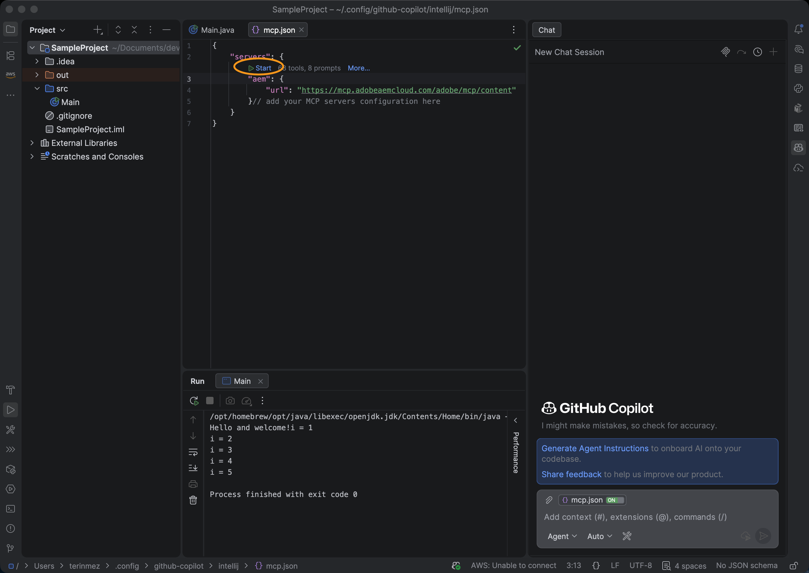
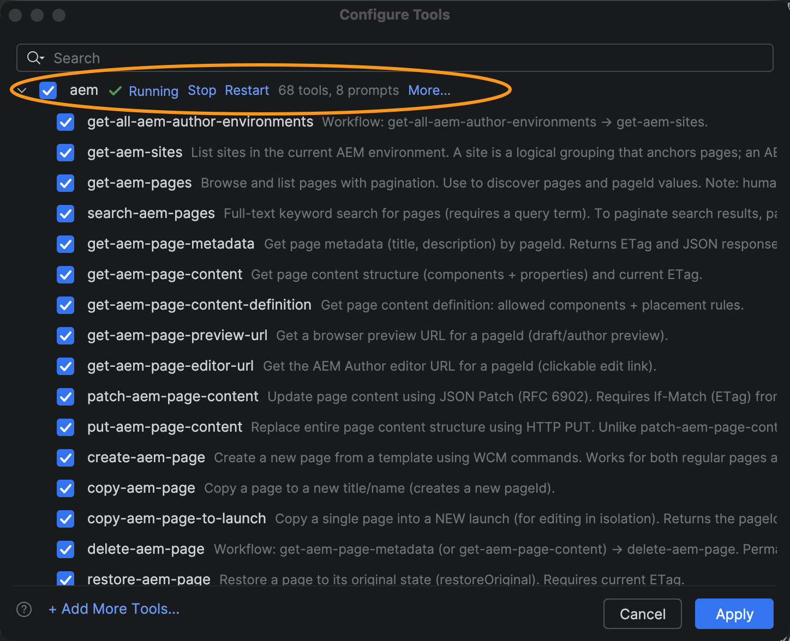

# Setting Up JetBrains with GitHub Copilot and AEM MCP {#setup-jetbrains-copilot}

Follow these steps to connect GitHub Copilot in a JetBrains IDE (such as IntelliJ IDEA, WebStorm, or PyCharm) to AEM's MCP servers.

* Open GitHub Copilot Chat in your JetBrains IDE by clicking the **GitHub Copilot Chat** icon on the right side of the editor.
* Click the **settings** icon in the Copilot Chat panel to open the MCP configuration.
* In **Settings**, navigate to **Tools > GitHub Copilot > Model Context Protocol (MCP)** and click **Configure** to open the `mcp.json` configuration file.
* Add one or more AEM MCP server URLs to the `mcp.json` file. For example:

   ```json
   {
     "servers": {
       "aem": {
         "url": "https://mcp.adobeaemcloud.com/adobe/mcp/content"
       }
     }
   }
   ```

* Save the file. GitHub Copilot detects the new server configuration automatically and shows a **Start** action.
* Click the **Start** action and When prompted, sign in with your Adobe ID to complete the authentication flow.
* You can review and manage discovered tools by clicking the **tools** indicator that appears in the Copilot Chat panel. Optionally, enable or disable individual tools.
* Use GitHub Copilot Chat to invoke AEM tools as part of your development or content workflows.












