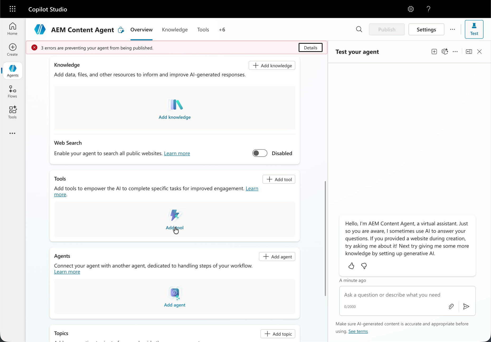
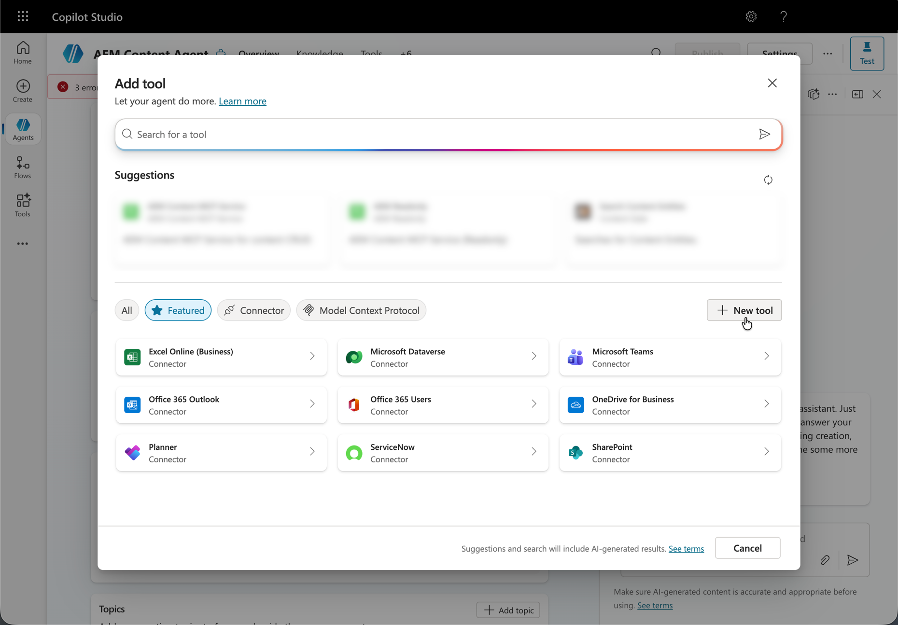
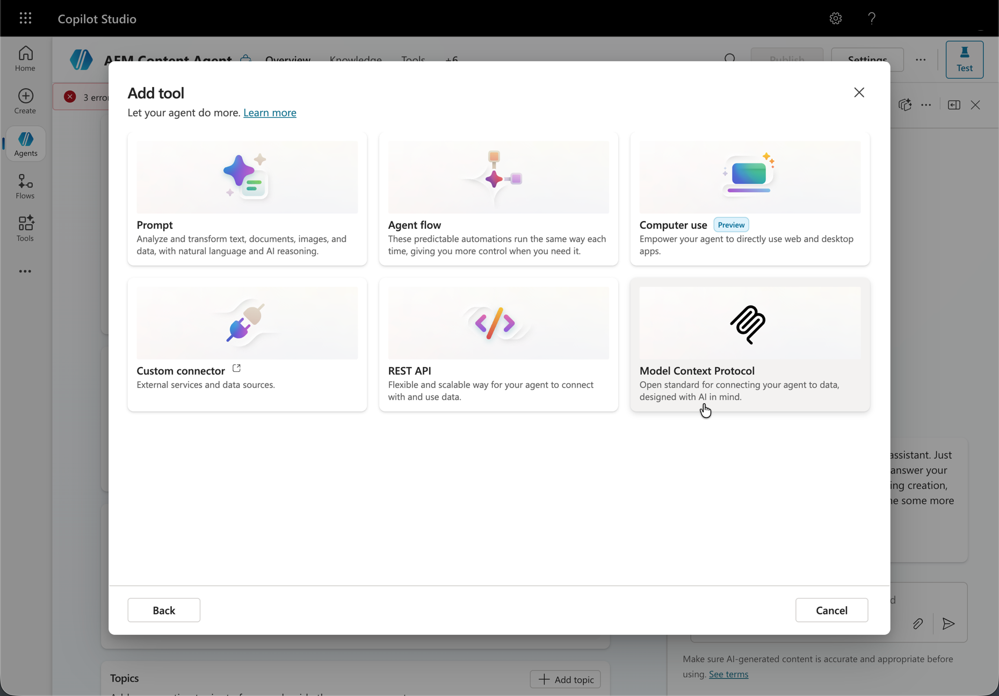
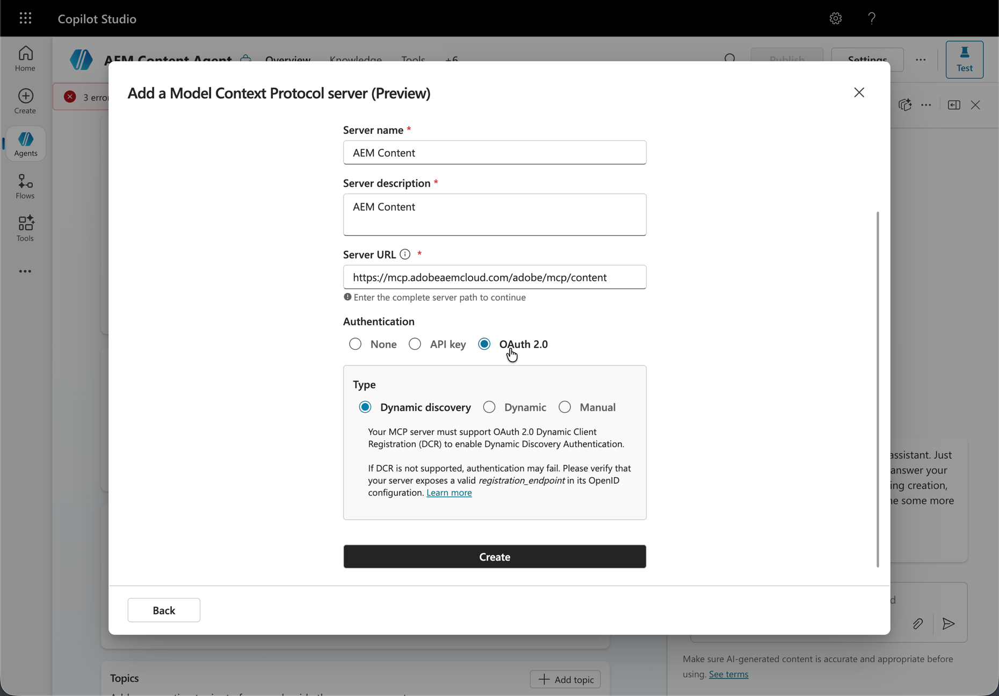
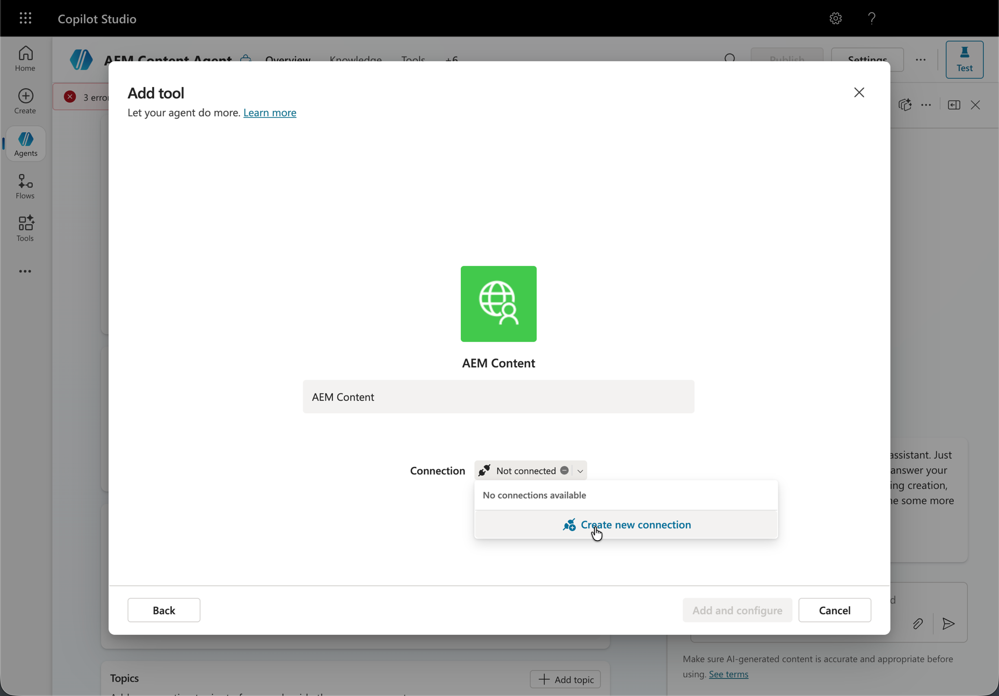
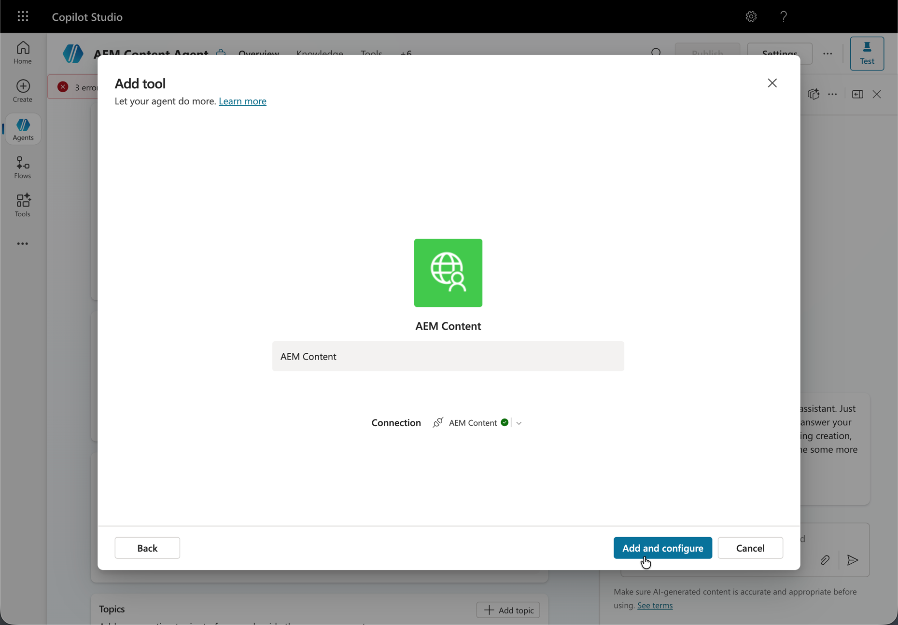
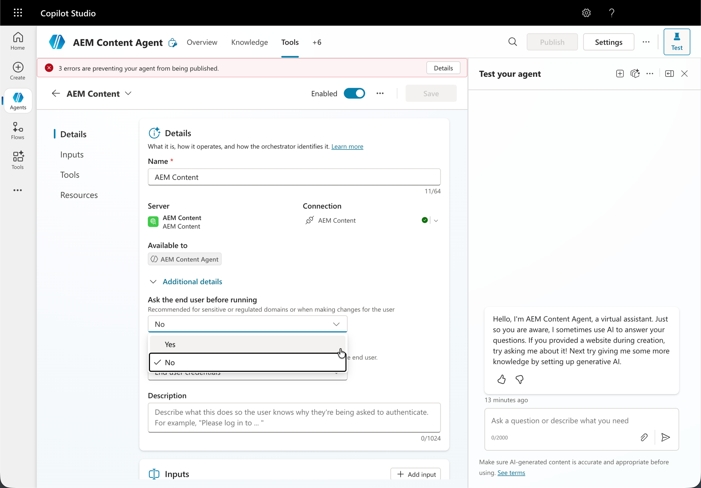
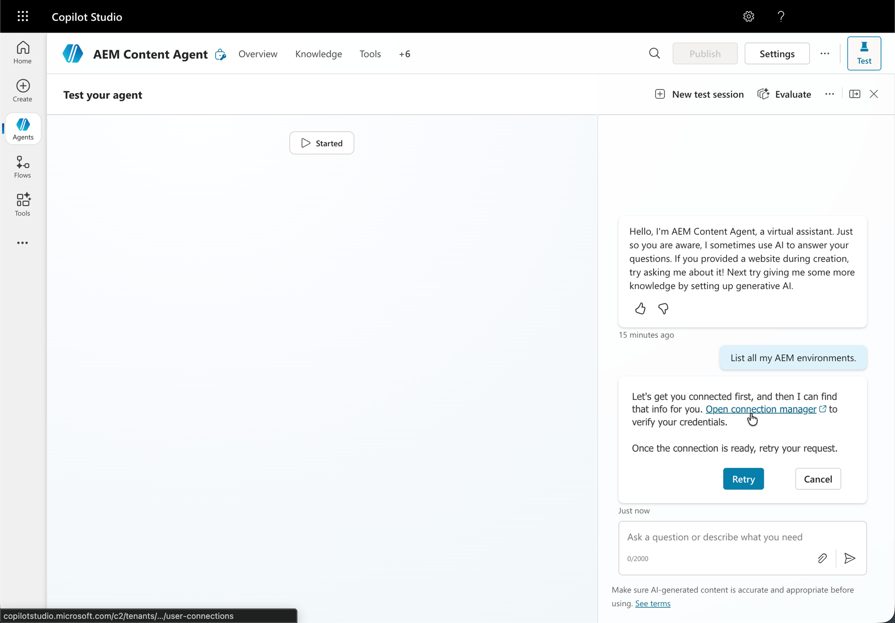
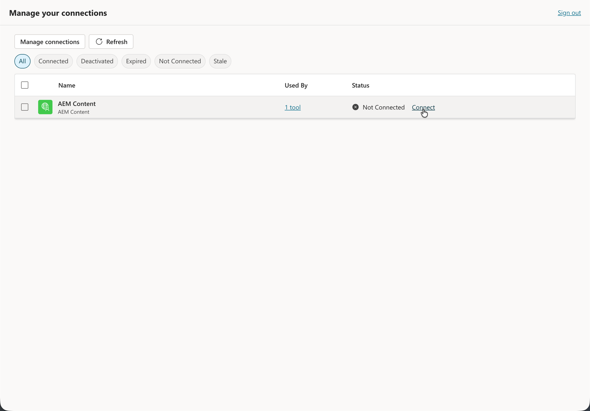
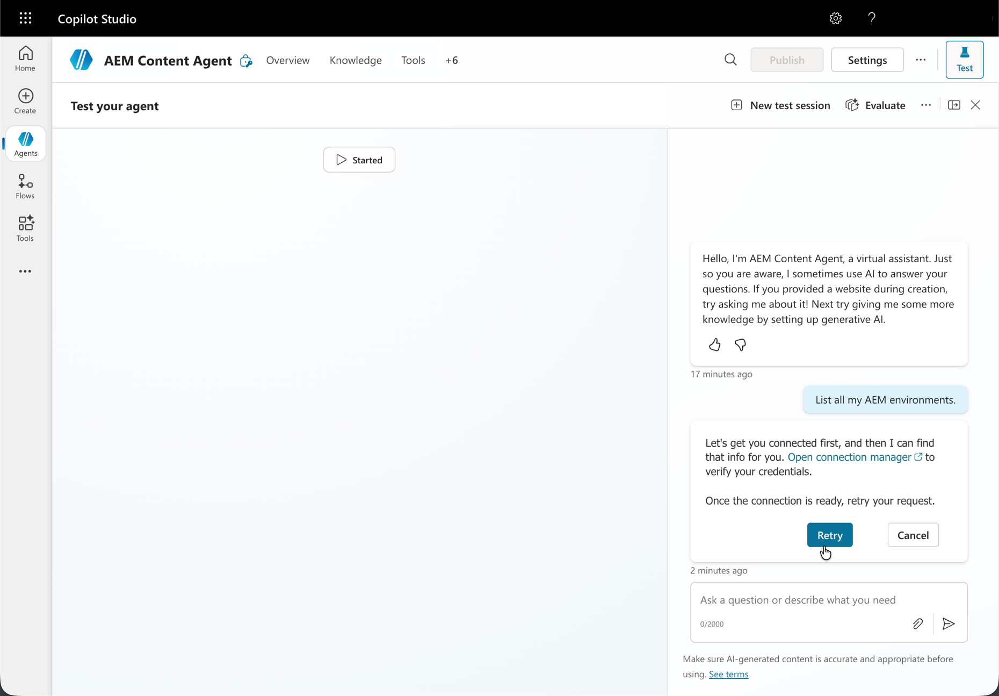

# Setting Up Microsoft Copilot Studio with AEM MCP {#setup-microsoft-copilot-studio}

Follow these steps to connect Microsoft Copilot Studio to AEM's MCP servers.

>[!NOTE]
>
>The Microsoft Copilot Studio user interface is subject to change and is not definitive. These instructions are for illustrative purposes.

1. In **Agents**, start the flow to add an agent that will use AEM MCP tools.

   * Create a new agent.

   

1. Open the tools area for that agent so you can register how it calls external capabilities.

   * Navigate to the tool section and click **Add tool**.

   

1. Decide whether to reuse an existing integration or define a new MCP-backed tool.

   * Select an existing tool or create a new one.

   

1. When you create a new MCP tool, continue through the **Model Context Protocol** server step, including preview mode when it appears.

   * Configure a new MCP tool pointing to one or more AEM MCP server **URLs**.

   

1. Define how this MCP endpoint is reached by the agent, including whether access is shared or dedicated.

   * Establish a connection, which can be **shared** or **dedicated** between agents.

   

1. On **Add and configure**, supply or confirm MCP tool details so the agent can reach your AEM environment.

   

1. Finish fields on the MCP tool form (for example, server **URLs** and authentication-related options).

   * Optionally, enable **auto-confirm mode** or require **end-user confirmation** for all tool interactions.

   

1. Validate connectivity to the MCP server; complete browser-based sign-in when Copilot Studio redirects you.

   * Sign in using your **Adobe ID** when redirected.

   

1. Before running a test, open **Manage Connections** (or the **connection manager**) and assign the right connection to your session.

   * When testing your agent, open the **connection manager** first to assign a connection to your session.

   

1. In the test experience, run the agent against your AEM MCP connection.

   * When testing your agent, press **Retry** after you assign a connection in the **connection manager**.

   
