# Using MCP with AEM as a Cloud Service {#using-mcp-with-aem-as-a-cloud-service}

## Introduction {#introduction}

Many Adobe Experience Manager (AEM) teams now work in Integrated Development Environments (IDEs) and chat-based applications such as Cursor, ChatGPT, Anthropic Claude, and Microsoft Copilot Studio. These applications support the Model Context Protocol (MCP), which allows applications to expose back-end tools to large language models (LLMs) in a standardized way.

With AEM's MCP integration, different personas can collaborate around the same content:

* **Developers** can orchestrate content operations and workflows from their IDE or chat application
* **Practitioners** and content architects can manage sites, content fragments, and assets with AI assistance while staying within AEM's existing permission model.

>[!IMPORTANT]
>
> For scenarios that modify or delete content, practitioners should use the AI Assistant interface rather than invoking MCP tools directly, because the AEM Agents run by AI Assistant include built-in safeguards.
>

This article explains what AEM's MCP functionality provides, which MCP applications are supported, how to configure it, and how to use it in practice.

## Why MCP is Useful for AEM Customers {#why-mcp-is-useful-for-aem-customers}

Modern IDE and chat applications use MCP as a way for an LLM to call tools exposed behind MCP servers. Instead of writing code against low-level API specifications, customers can describe their intent in natural language (*"update the hero banner for this campaign across all pages"*) and let the LLM invoke the appropriate MCP tools, which in turn interact with AEM's APIs.

Key benefits include:

* **Natural-language interaction instead of API plumbing**
MCP tools describe what operations are available and how to call them. The LLM uses these schemas to decide which tools to invoke and with which parameters.
* **Consistent experience across applications**
The same AEM MCP tools can be used from multiple MCP-compatible applications, allowing teams to work where they are most productive while calling the same underlying AEM capabilities.
* **Security and governance preserved**
Requests to AEM MCP tools run under the authenticated user's identity, and each tool enforces the user's existing AEM permissions. AI-assisted operations follow the same access rules as manual work in AEM.

## MCP Servers Provided by AEM {#mcp-servers-provided-by-aem}

AEM exposes MCP servers as HTTP endpoints. The endpoints listed below are relative to:

`https://mcp.adobeaemcloud.com/adobe/mcp/`

### MCP Servers {#mcp-servers}

| **MCP Server**            | **Endpoint** | **Description**                                                                                                                                                                                                                                                                                          |
|---------------------------|---|----------------------------------------------------------------------------------------------------------------------------------------------------------------------------------------------------------------------------------------------------------------------------------------------------------|
| **Content**               | `/content` | All low-level content operations, including create, read, update, and delete (CRUD) for pages, fragments and assets.                                                                                                                                                                                     |
| **Content (read-only)**   | `/content-readonly` | Read-only content operations (Get, List/Search) for pages, fragments, and assets.                                                                                                                                                                                                                        |
| **Cloud Manager**         | `/cloudmanager` | Manage Cloud Manager entities including programs, environments, repositories and pipelines, which can also be triggered.   *This MCP Server is now in **beta**; to request access, email [aemcs-mcp-feedback@adobe.com](mailto:aemcs-mcp-feedback@adobe.com) with a description of your use case.* |
| **Experience Governance** | `/experience-governance`  | Evaluate content (text, images, pages) against brand governance rules, and manage brand configurations and checks.                                                                                                                                                                                       |

The specific tools exposed by each MCP server may evolve over time. In practice, you can ask your MCP-enabled application to discover tools via a prompt such as:

*"List all AEM MCP tools available from this server and describe what they do."*

The MCP client will use the MCP protocol to retrieve the tool list and schemas, which the LLM can then use.

## Supported MCP Applications {#supported-mcp-applications}

AEM's MCP servers are designed to work with a defined set of MCP-compatible applications. The following applications are supported:

* Anthropic Claude
* Cursor
* OpenAI ChatGPT
* Microsoft Copilot Studio

Each application provides its own configuration experience, but the high-level steps are similar.

## Setup Overview {#setup-overview}

Configuring MCP for AEM involves two main parts:

1. **Configuration in each MCP client application** so that the application knows how to connect to the AEM MCP servers and perform OAuth login
1. **Select the MCP Server** before starting to prompt, so that the MCP client knows to use it.

### AEM Configuration {#aem-configuration}

By default, access to AEM's MCP servers is governed by the permissions that individual users have within AEM. When a user authenticates through an MCP client application, the MCP tools enforce the same access rules as manual operations in AEM. A user can only perform actions they are already authorized to perform.

#### Permitted MCP Client Applications {#permitted-mcp-client-applications}

The following MCP client applications are permitted by default:

* ChatGPT
* Claude
* MS Copilot Studio
* Cursor

#### Restricting MCP Servers {#restricting-mcp-servers}

All MCP servers are allowlisted by default. As an administrator, you have the option to restrict access to specific MCP servers at the organization, program, or environment level. This gives you granular control over which MCP capabilities are available to users within your organization.

#### Managing MCP Client Access {#managing-mcp-client-access}

Administrators can also disable access for specific MCP client applications if your organization's policies require it. If you would like Adobe to enable support for additional MCP client products, send a link to the product website. If you need to allowlist a custom MCP client, reach out as well.

For all MCP server related requests, feel free to contact us at **aemcs-mcp-feedback@adobe.com**

### MCP Client Application Configuration {#mcp-client-application-configuration}

This step is performed by each user (or by an administrator of the MCP client application, where supported). Configuration details vary slightly between applications. MCP clients are evolving rapidly, and support for remote MCP servers is being actively developed. You may need to enable Developer Mode to access the functionality for adding remote servers, but the general process is:

1. Add the AEM MCP server URL(s)
   * Configure the MCP endpoint(s) from the table above. For example:`https://mcp.adobeaemcloud.com/adobe/mcp/content-readonly`
1. Trigger the connection
   * Save or activate the configuration so the MCP client application attempts to connect to the AEM MCP server
1. Sign in with Adobe ID
   * When prompted, complete the Adobe login flow so the application can obtain OAuth tokens tied to your Adobe ID
1. Verify discovered tools
   * Once authenticated, the application will discover MCP tools from the server. You can then start prompting the LLM to perform AEM operations.

Below are examples of how this looks in each supported application at a high level.

### ChatGPT {#chatgpt}

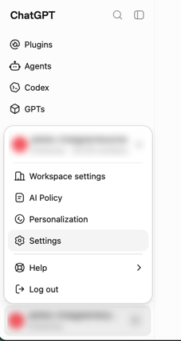

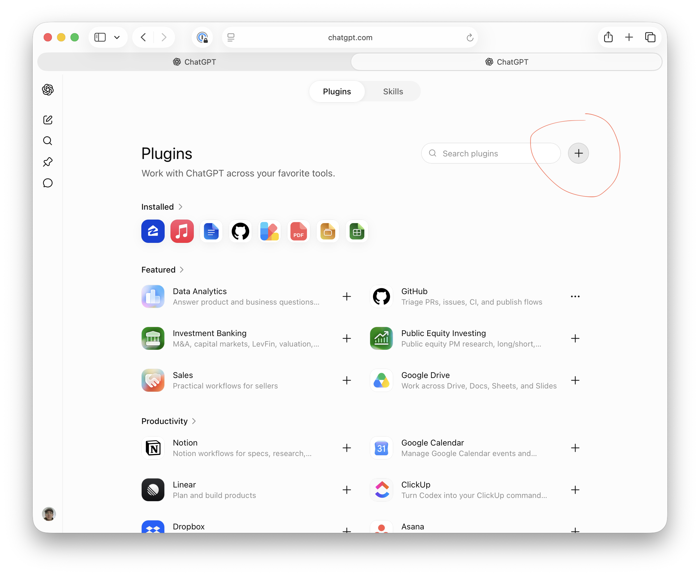

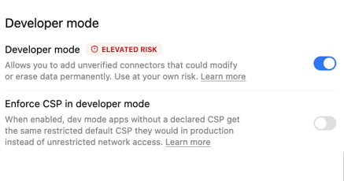

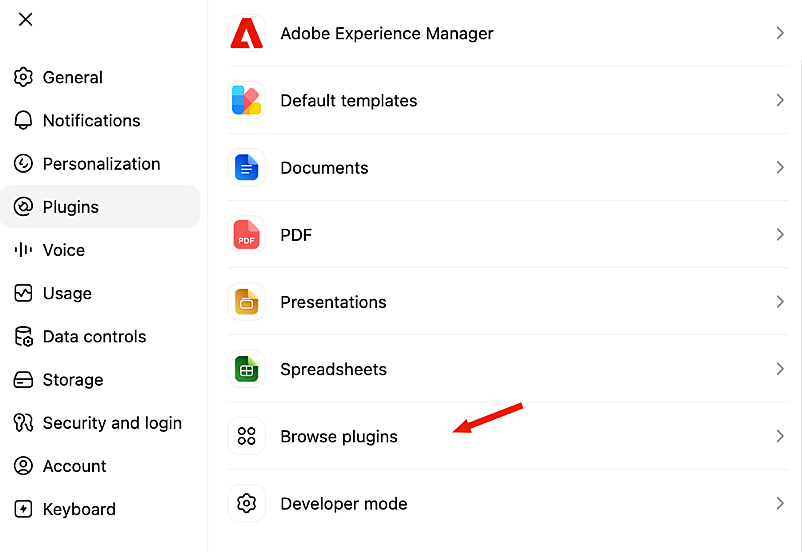

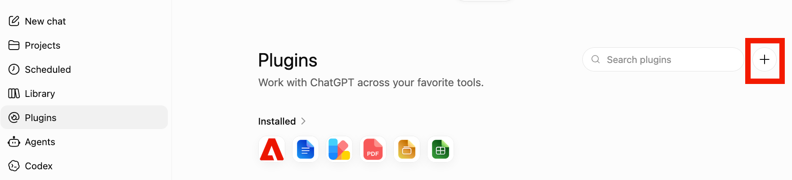

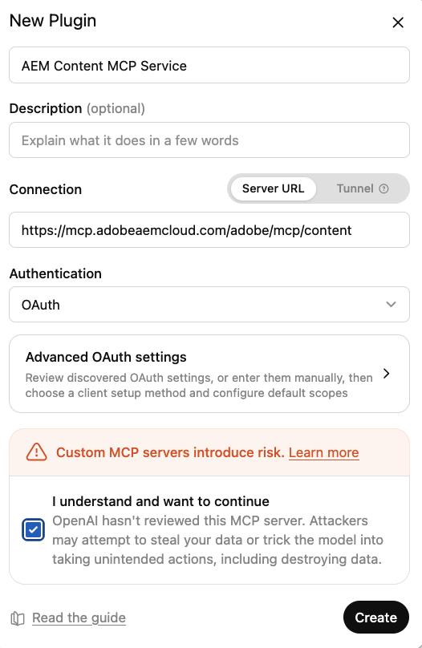

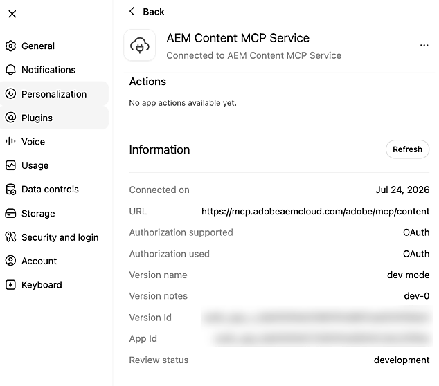

* Add the AEM MCP server URL(s) in the area where MCP connections or tools are configured
* Trigger the connection and sign in with your Adobe ID when redirected
* In a chat, reference the configured AEM tools in your prompts, for example:

   *"Using the configured AEM MCP tools, list all sites in our author environment."*

### Claude {#claude}

* In Claude's MCP configuration, register the AEM MCP server URL(s)
* Complete the Adobe login flow
* Optionally, enable auto-confirm for certain tools in the configuration area. This is recommended for search or read-only operations.
* Ensure the MCP server is selected before starting your conversation
* Ask Claude to perform AEM-related tasks; Claude will select AEM tools exposed by the MCP server based on your prompt.

### Cursor {#cursor}

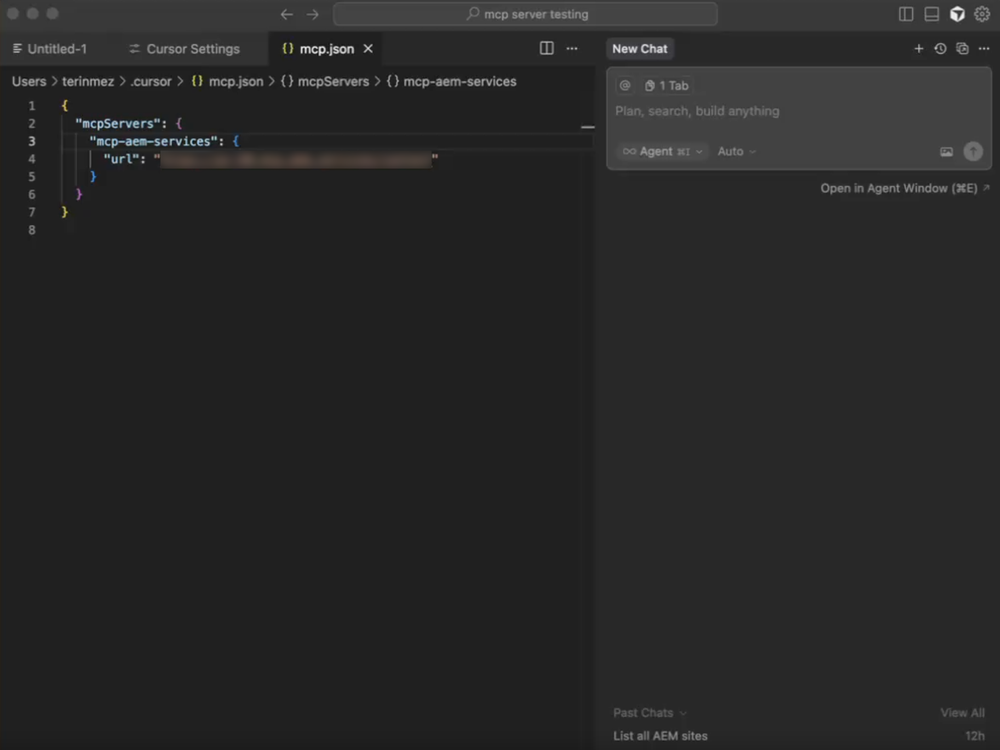

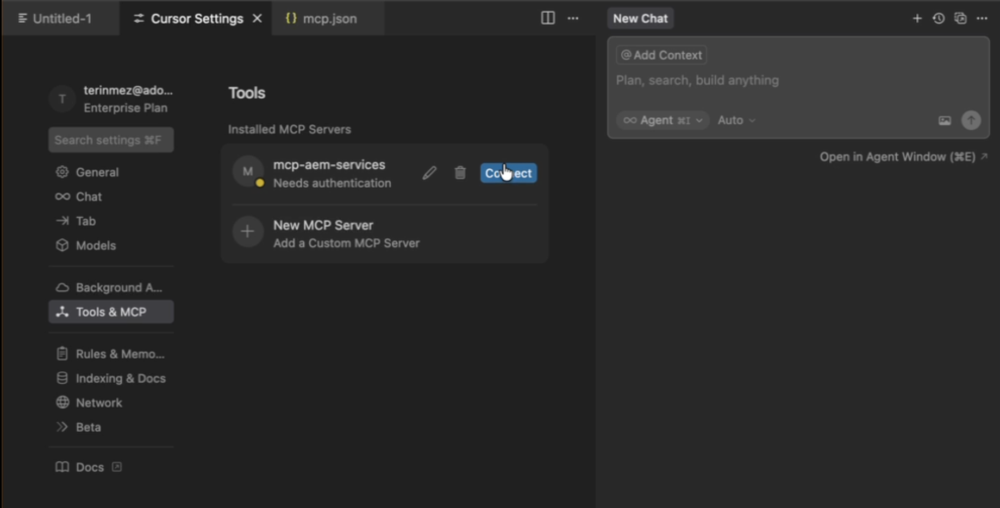

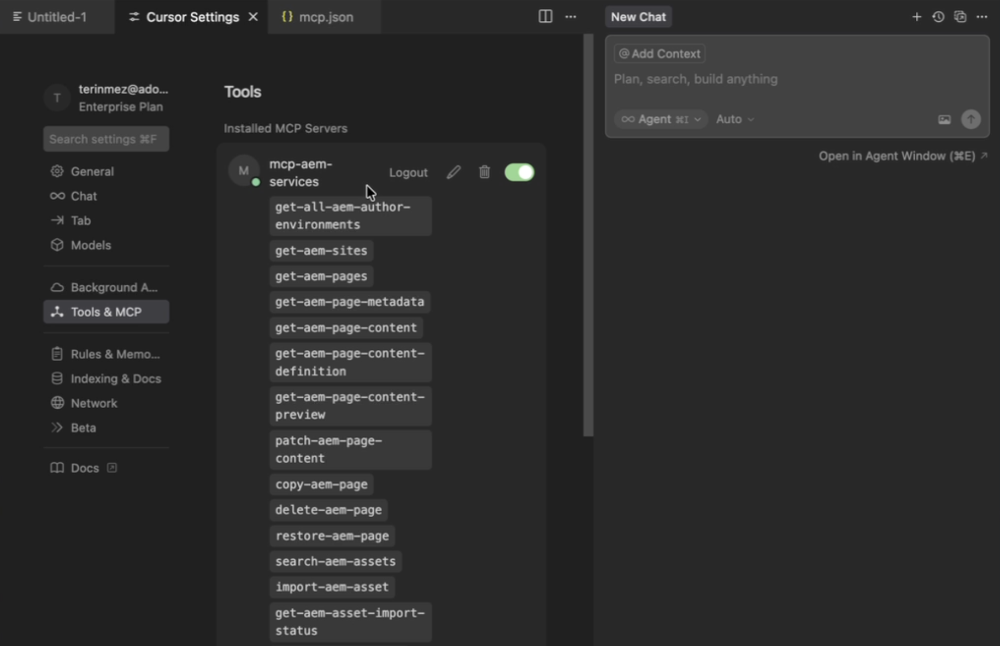

* In Cursor's MCP settings, create a new MCP server entry with the AEM MCP URL(s)
* Authenticate with your Adobe ID when prompted
* Optionally, enable or disable individual tools by clicking on the tool names. All tools are enabled by default.
* Use Cursor's editor or chat to invoke AEM tools as part of development or content workflows.

### Microsoft Copilot Studio {#microsoft-copilot-studio}

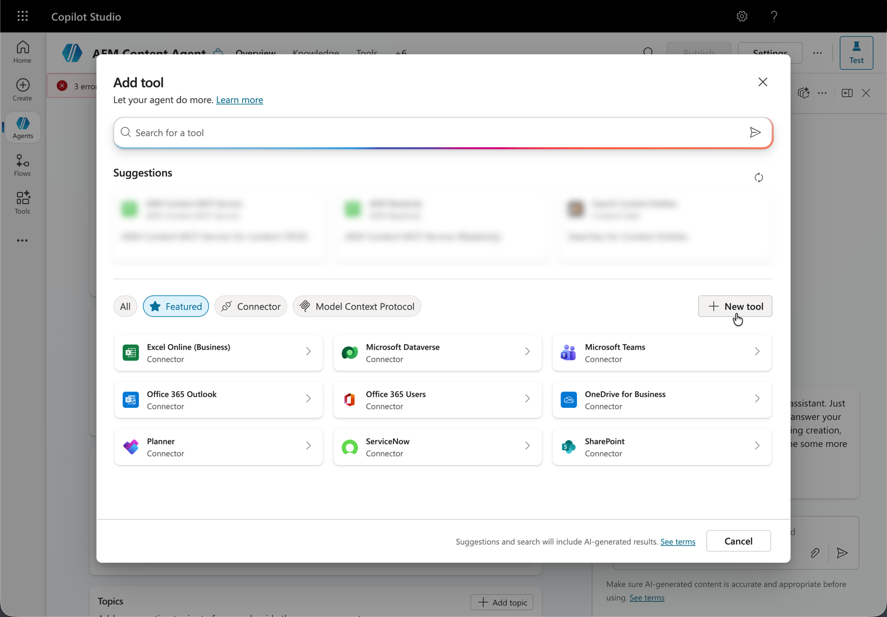

* Create a new agent
* Navigate to the tool section and click **Add tool**
* Select an existing tool or create a new one
* Configure a new MCP tool pointing to the AEM MCP server URL(s)
* Establish a connection, which can be shared or dedicated between agents
* Sign in using your Adobe ID when redirected
* Optionally, enable auto-confirm mode or require end-user confirmation for all tool interactions
* When testing your agent, open the connection manager first to assign a connection to your session, then press **Retry**.

## Authentication {#authentication}

The Adobe-hosted MCP servers implement OAuth and are integrated with Adobe's identity system.

* When an MCP client application connects to an AEM MCP server, users see an Adobe login dialog and authenticate with their **Adobe ID**
* After successful login, the system verifies that the MCP client application is permitted in your organization and that the requested MCP server is allowed. If either check fails, an error message is displayed.

* Once verified, the MCP server issues tokens that the application uses for subsequent tool calls
* MCP tools respect the user's AEM permissions. A user without permission to modify a content fragment in AEM will not be able to modify it via MCP either.

This ensures that AI-assisted operations comply with your existing AEM security and governance model.

## Using MCP with AEM {#using-mcp-with-aem}

Once AEM and your MCP client applications are configured, you can work in your application of choice and prompt the LLM to perform AEM operations. The LLM reads the MCP tool schemas, chooses which tools to call, and sequences them as needed to fulfill your request.

>[!IMPORTANT]
>
>For best results, especially with prompts that contain multiple steps or target different content types such as images and text, enable a thinking model or select the Thinking option in your MCP client rather than relying on Auto mode.

### Example Usecases {#example-usecases}

Some representative scenarios include:

* **Environment discovery**
  * List environments and licenses to decide where to run a workflow.

* **Sites management**
  * List sites
  * Create, read, update, and delete pages and page content.

* **Content Fragment management**
  * Search for content fragments
  * Create new fragments
  * Update existing fragments when campaign messaging changes.

* **Assets management**
  * Import assets
  * Find existing assets
  * Publish assets.

### Example Workflows {#example-workflows}

The following examples illustrate how an LLM might chain MCP tools together.

1. **Working with a content fragment referenced by a page**
   * **Get page content** – Call a tool such as `get-aem-page-content` to retrieve the page and locate the `fragmentPath` property.
   * **Resolve the fragment path** – Use `resolve_fragment_path` to convert the path to a UUID.
   * **Fetch fragment data** – Call `get_fragment` to retrieve the current fields.
   * **Update the fragment** – Call `patch_fragment` to apply changes to the fragment content.
1. **Creating new content based on a model**
   * **Discover models** – Use `list_models` to see which content fragment models are available.
   * **Inspect a model** – Use `get_model` to understand the model's field schema.
   * **Create content** – Use `create_fragment` to create a new fragment with values derived from your prompt.
1. **Safely updating existing content**
   * **Read current data** – Use `get_fragment` to retrieve the existing data and an ETag.
   * **Apply a JSON Patch** – Use `patch_fragment` with the ETag and a JSON Patch document to update the fragment, supporting optimistic concurrency.

From the user's perspective, these workflows can be initiated with prompts such as:

*"Create a new content fragment for the spring campaign based on our hero banner model and fill in its fields from this brief."*

The LLM chooses and coordinates the necessary MCP tools automatically.

## Expectation Management {#expectation-management}

When working with LLMs through MCP, keep the following in mind:

* **Highly capable but not infallible**
LLMs can accomplish complex tasks but are prone to occasional errors. The same prompt may yield slightly different results or presentations without an obvious reason. Always review outputs before applying changes to production content.

* **Evolving capabilities**
LLM models are continuously improving. Over time, they become smarter at discovering new ways to combine MCP tools to achieve your goals. A task that required multiple prompts today may work seamlessly with a single prompt tomorrow.

* **Human oversight is essential**
Think of the LLM as a knowledgeable assistant that needs supervision. It has broad knowledge and can devise creative solutions, but it benefits from your guidance and review. Verify results, especially for critical operations, and provide feedback when the output does not match your expectations.

* **Be cautious with auto-acknowledging tool executions**
Some MCP client applications, such as Claude, offer the option to auto-acknowledge tool executions requested by the LLM. While this can be convenient for read-only operations like searching or retrieving content, exercise caution with tools that update or delete content. Review each tool execution request before confirming actions that modify your AEM environment.

## Limitations {#limitations}

AEM's MCP servers are currently intended to be configured in ChatGPT, Claude, Cursor, and Microsoft Copilot Studio.

If you would like to use a different MCP client application, feel free to reach out at **aemcs-mcp-feedback@adobe.com** to request support for additional clients or to allowlist a custom one.
