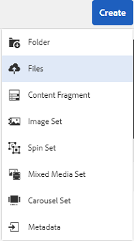

title: Add your digital assets to [!DNL Adobe Experience Manager].
description: Add your digital assets to [!DNL Adobe Experience Manager] as a [!DNL Cloud Service].
feature: Asset Ingestion, Asset Management, Asset Processing, Upload
role: User, Admin
exl-id: 0e624245-f52e-4082-be21-13cc29869b64
---
# Add digital assets to [!DNL Adobe Experience Manager] as a [!DNL Cloud Service] [!DNL Assets] {#add-assets-to-experience-manager}

[!DNL Adobe Experience Manager Assets] accepts many types of digital assets from many sources. It stores the binaries and created renditions, can do asset processing using various workflow and [!DNL Adobe Sensei] services, allows for distribution through many channels across many surfaces.

[!DNL Adobe Experience Manager] enriches the binary content of the uploaded digital files with rich metadata, smart tags, renditions, and other Digital Asset Management (DAM) services. You can upload various types of files, such as images, documents, and raw image files, from your local folder or a network drive to [!DNL Experience Manager Assets]

In addition to the most commonly used browser upload, other methods of adding assets to the [!DNL Experience Manager] repository exist. These other methods include desktop clients, like Adobe Asset Link or [!DNL Experience Manager] desktop app, upload and ingestion scripts that customers would create, and automated ingestion integrations added as [!DNL Experience Manager] extensions.

| Upload method       | When to use?   | Primary Persona |
|---------------------|----------------|-----------------|
| [Assets Console user interface](#upload-assets)  | Occasional upload, ease of press and drag, finder upload. Do not use to upload many assets. | All users |
| [Upload API](#upload-using-apis) | For dynamic decisions during upload. | Developer |
| [[!DNL Experience Manager] desktop app](https://experienceleague.adobe.com/docs/experience-manager-desktop-app/using/using.html) | Low volume asset ingestion, but not for migration. | Administrator, Marketer |
| [[!DNL Adobe Asset Link]](https://helpx.adobe.com/enterprise/using/adobe-asset-link.html) | Useful when creatives and marketers work on assets from within the supported [!DNL Creative Cloud] desktop apps. | Creative, Marketer |
| [Asset bulk ingestor](#asset-bulk-ingestor)  | Recommended for large-scale migrations and occasional bulk ingestions. Only for supported datastores. | Administrator, Developer |

>[Important]
>
>Assets that you upload in experience Manager
>
>The first 100 characters in the file name should be used as

1. In the [!DNL Assets] user interface, navigate to the location where you want to add digital assets.
1. To upload the assets, do one of the following:

    * On the toolbar, click **[!UICONTROL Create]** > **[!UICONTROL Files]**. You can rename the file in the presented dialog if needed.
    * In a browser that supports HTML5, drag the assets directly on the [!DNL Assets] user interface. The dialog to rename file is not displayed.

   

   To select multiple files, select the `Ctrl` or the `Command` key and select the assets in the file picker dialog. When using an iPad, you can select only one file at a time.

1. To cancel an ongoing upload, click close (`X`) next to the progress bar. When you cancel the upload operation, [!DNL Assets] deletes the partially uploaded portion of the asset.
If you cancel an upload operation before the files are uploaded, [!DNL Assets] stops uploading the current file and refreshes the content. However, files that are already uploaded are not deleted.

   

Follow the below procedures: 

* Select assets
* Select File
* Select Adobe: Dont add other space `Ctrl` or the `Command` key and select the assets in the file picker dialog. 

