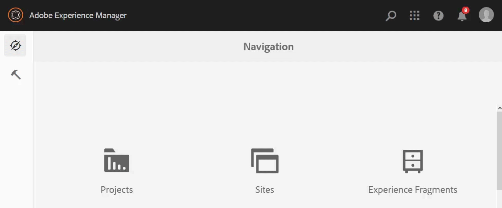

<!--
Original scope of this article for Core Assets for all a11y topics is around the following topics. This has changed since then but keeping this list of topics for posterity's sake.

* Convert the absolute doc links to relative links.
* Add an overview
* Compile a list of enhancements done in the last ~1 year.
* Top-level actions supported, such as clickable UI elements, keyboard shortcuts, popup dialogs, etc.)
* Specific user tasks supported, such as, download assets, datepicker, editing metadata, etc.
* Support matrix of user tasks with browsers and screen readers + OSes combinations
* Exceptions that users should be aware of.
* CTA – what is next and more info from AEM team:
  * Link to ACRs on a.com.
  * Generic a11y info by Adobe to begin with.
  * Examples of other a11y DX Docs from Elle.
  * Link to a11y-specific channels to report issues, seek support, or request enhancements, if any. Available info from Elle.
-->

# Accessibility in [!DNL Adobe Experience Manager Assets] as a Cloud Service {#accessibility-in-aem-assets}

Adobe is committed to make products for all users, including people with disabilities. [!DNL Adobe Experience Manager] is continuously enhanced to meet the needs of all types of users. [!DNL Experience Manager] publishes conformance information that details standards it adheres to, outlines the accessibility features in the product, and describes the level of compliance. It helps users understand the extent of the adherence.

[!DNL Adobe Experience Manager] provides varying levels of support for the following standards:

* [Web Content Accessibility Guidelines (WCAG) 2.1](https://www.w3.org/TR/WCAG/).
* [Revised Section 508](https://www.access-board.gov/guidelines-and-standards/communications-and-it/about-the-ict-refresh/final-rule/text-of-the-standards-and-guidelines).
* [WAI-ARIA](https://www.w3.org/WAI/standards-guidelines/aria/).
* [EN 301 549](https://en.wikipedia.org/wiki/EN_301_549).

To access the report detailing the levels of compliance, see [Accessibility conformance reports ](https://www.adobe.com/accessibility/compliance.html) (ACR) page for all Adobe solutions.

## Assistive technologies {#at-support}

Users with disabilities frequently rely on hardware and software to access web content. These tools are known as assistive technologies. [!DNL Adobe Experience Manager Assets] work with the following assistive technologies to let users use the core functionalities:

* Screen readers.
* Speech recognition software.
* Keyboard usage – navigation and shortcuts.
* UI magnifying tools.

## [!DNL Experience Manager Assets] use cases that are accessible {#accessible-assets-use-cases}

In [!DNL Experience Manager], the accessibility features address two key requirements of [!DNL Experience Manager] users and their customers.

For content designers and creators, there are features to create and publish accessible content that is used in turn by their customers and website visitors. The content can be used by individuals with disabilities with the help of assistive technologies. For details, see [web accessibility guidelines](/help/onboarding/accessibility/web-accessibility.md).

Also, [!DNL Experience Manager] lets its users and administrators with disabilities access user interface and controls to create and manage content. The individual with disabilities can use assistive technologies to navigate, use, and manage the [!DNL Assets] capability.

The core features in [!DNL Assets] are more accessible than before and are regularly updated to improve compliance with global standards. The CRUD operations in Assets have some degree of accessibility built into those. DAM workflows like adding, managing, searching, and distributing assets are accessible with the help of keyboard shortcuts, screen reader text, color contrast, and so on.

## Support for use of keyboard {#keyboard-use}

Many user interface elements that are clickable or actionable with a pointer can also be engaged with using keyboard. Using a keyboard, users can focus upon UI elements and take an appropriate action. Users can directly use keyboard shortcuts to trigger a command or an action without having to focus on UI elements and trigger it using keyboard. For example, users can open the timeline of an asset in the left side by browsing to the UI control using a keyboard and pressing Return and by pressing `alt + 2` keyboard shortcut.

<!-- TBD items:

* The button/menu to toggle between list view and card view exposes relevant info to the screen readers. What about column view option? This info can go into ‘basic handling’ info aka article to ‘understand and use the workspace’.
* How to open and browse through the profile popup dialog in [!DNL Experience Manager] UI using a keyboard? The navigation does not match the order of visual display of options on the UI. This info can go into ‘basic handling’ info aka article to ‘understand and use the workspace’. What about setting preferences and impersonating a user?
* Using the [!DNL Experience Manager] tag browser and operating the buttons like delete tag? This info can go into ‘basic handling’ info aka article to ‘understand and use the workspace’.
* Read-only form fields can be focused with the keyboard. Can users tab to these fields to understand the contents and are they able to copy text from the fields?
-->

### Keyboard shortcuts in Assets {#keyboard-shortcuts}

<!-- TBD: Add here only those keyboard shortcuts that work for/with Assets. Do with Oct release.
-->

| User interface or scenario | Keyboard shortcut | Action |
|---|---|---|
| Column view in Assets user interface | Up and Down arrow keys | Navigate to files and folders within the same hierarchy. |
| Column view in Assets user interface | Left and Right arrow keys | Navigate to files and folders above or below the current folder. |
| Browsing folders in Assets | `/` | Invoke search by opening Omnisearch box. |
| Assets Console | &#96; | Toggle side rails |
| Assets Console | Alt + 1 | Open the content tree. |
| Assets Console | Alt + 2  | Open [!UICONTROL Navigation] siderail. |
| Assets Console | Alt + 3  | Display [!UICONTROL Timeline] of a selected asset. |
| Assets Console | Alt + 4  | Open Live Copy references of the selected asset. |
| Assets Console | Alt + 5  | Invoke search and search within the selected folder. |
| Asset or folder is selected | Backspace | Delete the selected asset or folder. |
| Asset or folder is selected | `p` | Open Properties page of the selected asset. |
| Asset or folder is selected | `e` | Edit the selected asset. |
| Asset or folder is selected | `m` | Move the selected asset. |
| Asset or folder is selected | Ctrl + c | Copy the selected asset. |
| Asset or folder is selected | Esc | Deselect the selection. |
| Dialog box opens and is in the focus | Esc | Close dialog box. |
| Inside a folder in DAM | Ctrl + v | Paste the copied asset. |
| Assets Console | Ctrl + A | Select all assets. |
| Asset property pages | Ctrl + S | Save changes. |
| Assets Console | `?` | See a list of keyboard shortcuts. |

Most keyboard shortcuts that apply to [!DNL Experience Manager] Consoles also apply to Assets. See [Keyboard Shortcuts for Consoles](https://docs.adobe.com/content/help/en/experience-manager-65/authoring/essentials/keyboard-shortcuts.html). See how to [enable or disable the keyboard shortcuts](/help/sites-cloud/authoring/getting-started/keyboard-shortcuts.md).

## Sign in and navigate [!DNL Assets] user interface {#login}

Users can use keyboard to navigate to and fill in the sign in field to log in. The error messages due to incorrect username and password combinations on login page are announced by screen readers each time the error occurs.

After logging in, DAM users can navigate to [!DNL Assets] user interface using keyboard. The keyboard navigation order is left-to-right and top-to-bottom. When navigating using a keyboard, any actionable option that is focused is highlighted with better color contrast and is narrated by a screen reader. The state - expanded or collapsed - of the focused options in the menu is announced by a screen reader.

If a user expands the help or user profile option from the menu, the appropriate option or status are announced by screen reader. If a user expands the user profile option, the available options can be selected using a keyboard. For example, a user can impersonate a different user. The user interface option and error message

*Figure: Navigating through the options at the top of Experience Manager user interface using `Tab` key.*

If a user searches for a string from the [!UICONTROL Help] option, a narrator announces 'Searching Help' to indicate that a search is in progress.

## Browse existing assets and view related information {#browse}

In the [!DNL Assets] user interface, users can use keyboard to browse through the list of existing digital assets in DAM repository, preview or download an asset, see generated renditions, switch views, see the generated renditions, see timeline and version history, see comments and references, and view and manage metadata.

<!-- TBD: Not sure about the following list items mean:

In Experience Manager header section, when navigating in browse mode, screen reader now announces,
  
  * Suggestions to search in Omnisearch.
  * The state as expanded or collapsed for Solutions, Help, Inbox and User options.
  * The Searching Help status message that is displayed when user enters a search string in Search for Help field under Help option
  * The error message if incorrect value is entered in Impersonate as field under User option and focus correctly moves to the text field (NPR-33804).

Review CQ-4282133 before adding - Close button in a coral-dialog wasn't accessible through keyboard, due to which user cannot trigger close button through keyboard press in version preview dialog. After fix, user can close dialog through close button using keyboard.

* CQ-4273122 - Assets of video/audio type will have aria-label in format "Multimedia player: <Title>" so users relying on screen-reader will get to know that they are video/audio assets.
-->

When browsing the assets repository, the following functionality improves accessibility:

* Screen reader announces text alternatives that depict the purpose or functionality of the icons instead of their names.
* Users can access and focus the interactive user interface options in References list of assets using keyboard keys.
* The elements in each row in list view are announced as the elements of the same row by screen readers.
* User focus when navigating using `Tab` key can move to the close option in version preview.
* When using keyboard to browse, the highlighted actionable user interface options have more prominent visual focus with enhanced contrast. It makes the focused area more identifiable to the user.
* Use of the `Esc` key to remove the quick action icons from thumbnail view does not remove the keyboard focus from the last focused item.
* With an asset selected, pressing Alt + 4 keyboard shortcut opens the References list. Using `Tab` key, users can navigate through the none-zero reference entries.
* Comments on an asset are available in the asset timeline. It is accessible by keyboard.
* View Settings in Experience Manager are accessible by keyboard. User can navigate through the available card sizes using arrow keys, and select and tab through to navigate through and set other elements in the existing View Settings view.

<!-- TBD: Gradually,  as more enhancements are done in these categories, add more content.

## Add and upload digital assets {#upload}

## Configure and administer [!DNL Assets] {#config-admin}

* List the a11y fixes in workflows to configure and administer [!DNL Experience Manager Assets]?
* Some enhancements in Processing profiles creation or application to a folder?
* Some enhancements to metadata properties UI?

-->

## Manage digital assets {#manage-assets}

Many asset management tasks such as CRUD operations, downloading an asset, adding metadata are accessible to various degree. Assets lets you accomplish the tasks using various assistive technologies, specially a screen reader and a keyboard.

See a video demonstration of how to use a keyboard to [browse the repository and download an asset](https://youtu.be/K3dgqMRQJys).

For metadata operations that are typically done by roles such as marketers and administrators the following features improve accessibility:

* [!UICONTROL Save & Close] option on asset Properties page can now be accessed using the keyboard.
* Screen readers announce the options to delete the selected tags in Basic tab of asset Properties buttons to delete the selected tags.
* Date picker popup dialog can be used using a keyboard. Datepicker is used to set on-times and off-times.
* The drag functionality using keyboard correctly functions in Metadata Schema Editor in browse mode of screen reader.
* A user can move the focus using keyboard to the Add User or Group field under Closed User Group in the Permissions tab of folder Properties.

## Search digital assets {#search}

A quick and seamless asset search experience boosts content velocity. The content velocity use cases are are part of core [!DNL Assets] functionality. To start a search from the Omnisearch bar, users can use keyboard shortcut `/` or use `Tab` along with screen readers to quickly locate the search option. The screen reader narrates the name of the option as [!UICONTROL Search Button] when focus is on search option . Users can press `Return` to open the Omnisearch box. The screen reader not only narrates the keyword typed in search box but also narrates the auto-complete suggestions offered by [!DNL Experience Manager Assets]. Users can use a combination of arrow keys, `Return`, and `Tab` to access the various options to trigger a search.

Search functionality is made further accessible by the following functionality:

* Page title, as available to a screen reader, helps to identify the page as assets' search page.
* Users search for assets from within the Omnisearch bar. Use either the keyboard keys or the keyboard shortcut `/` to access Omnisearch bar.
* Start typing the search keyword and use keyboard to select the auto-suggestions. Press the Return key to accept an auto-suggested string and search assets for it.
* Screen readers can identify and announce the mixed state checkboxes (in which unless you select all the nested predicates the first-level checkboxes are not selected and are stricken through) in Filters panel when filtering search results.
* User focus moves to the search options after Omnisearch box is closed.

When filtering search results:

* Search result page has an informative titles for better understanding of screen reader users.
* A screen reader announces the options in search filter as expandable accordions.
* Predicates that have mixed-state buttons are announced by screen readers.

## Share assets {#share-assets}

<!-- TBD: Accessibility in DA, BP, AAL? Asked CCE team for AAL content?
-->

When sharing assets, the following functionalities improve the accessibility:

* A user can move the focus using keyboard within Search and Add Email Address field in the link sharing dialog.

* In the link sharing dialog, when navigating in browse mode, the screen readers,

  * Do not narrate the table information as soon as the dialog is loaded.
  * Can navigate to all the listed auto-suggestions.
  * Narrate the displayed auto-suggestions for Add Email Address and Search fields.

## Accessibility in [!DNL Dynamic Media] {#dynamic-media-accessibility}

When using Dynamic Media, the following functionality helps make it accessible:

* A user can focus to `Flyout`, `InlineZoom`, `Shoppable_Banner`, `Zoom_dark`, `Zoom_light`, `ZoomVertical_dark`, and `ZoomVertical_light` options using `Tab` key in asset details Viewers in [!DNL Dynamic Media].

## Accessible documentation {#accessible-docs}

[!DNL Experience Manager] provides accessible documentation that can be consumed by people with disabilities. The following helps make the content offering accessible for now, while Adobe continues to improve the template and the content:

* Screen readers can read the text.
* Images and illustrations have alt text available.
* Keyboard navigation is possible.
* Contrast ratios help highlight some parts of the documentation website.

<!-- 
## More resources for accessibility {#a11y-resources}

TBD: If anyone is aware of AEM-specific resources that help users leverage any accessibility features or use any assistive technology with AEM, please share or leave a link here.
-->

## Enhancements in [!DNL Experience Manager Assets] releases {#rn-fixes}

For a list of specific enhancements done in each individual release, see the [release notes](https://docs.adobe.com/content/help/en/experience-manager-cloud-service/release-notes/home.html) of the respective releases.

>[!MORELIKETHIS]
>
>* [AEM accessibility guidance](/help/onboarding/accessibility/web-accessibility.md)
>* [Conformance reports for Adobe solutions](https://www.adobe.com/accessibility/compliance.html)
