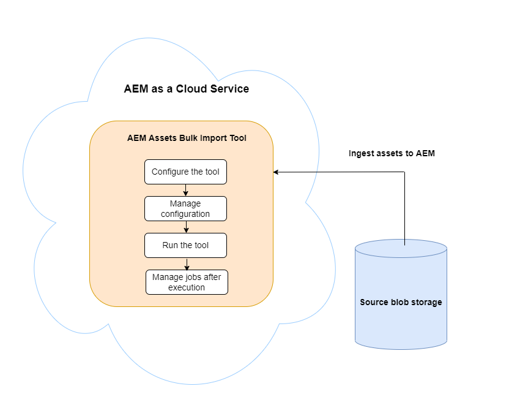
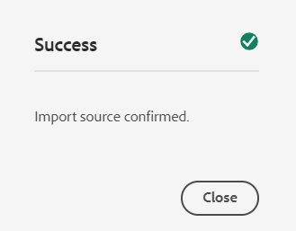
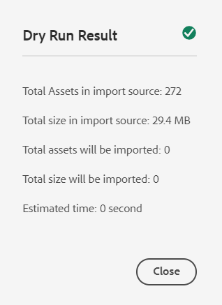
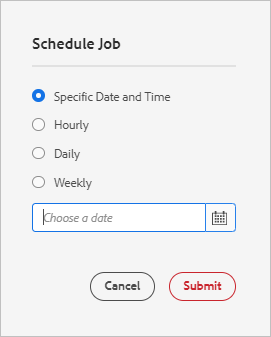
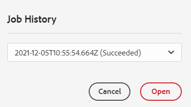
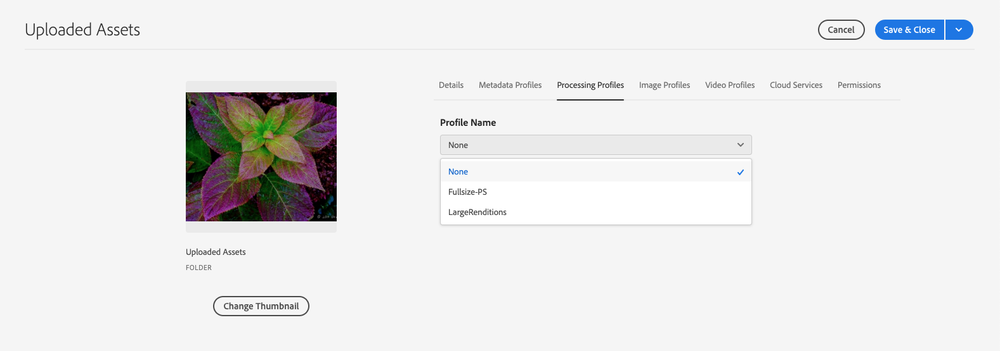

# Add digital assets to [!DNL Adobe Experience Manager] as a [!DNL Cloud Service] [!DNL Assets] {#add-assets-to-experience-manager}

<table>
    <tr>
        <td>
            <sup style= "background-color:#008000; color:#FFFFFF; font-weight:bold"><i>New</i></sup> <a href="/help/assets/dynamic-media/dm-prime-ultimate.md"><b>Dynamic Media Prime and Ultimate</b></a>
        </td>
        <td>
            <sup style= "background-color:#008000; color:#FFFFFF; font-weight:bold"><i>New</i></sup> <a href="/help/assets/assets-ultimate-overview.md"><b>AEM Assets Ultimate</b></a>
        </td>
        <td>
            <sup style= "background-color:#008000; color:#FFFFFF; font-weight:bold"><i>New</i></sup> <a href="/help/assets/integrate-aem-assets-edge-delivery-services.md"><b>AEM Assets integration with Edge Delivery Services</b></a>
        </td>
        <td>
            <sup style= "background-color:#008000; color:#FFFFFF; font-weight:bold"><i>New</i></sup> <a href="/help/assets/aem-assets-view-ui-extensibility.md"><b>UI Extensibility</b></a>
        </td>
          <td>
            <sup style= "background-color:#008000; color:#FFFFFF; font-weight:bold"><i>New</i></sup> <a href="/help/assets/dynamic-media/enable-dynamic-media-prime-and-ultimate.md"><b>Enable Dynamic Media Prime and Ultimate</b></a>
        </td>
    </tr>
    <tr>
        <td>
            <a href="/help/assets/search-best-practices.md"><b>Search Best Practices</b></a>
        </td>
        <td>
            <a href="/help/assets/metadata-best-practices.md"><b>Metadata Best Practices</b></a>
        </td>
        <td>
            <a href="/help/assets/product-overview.md"><b>Content Hub</b></a>
        </td>
        <td>
            <a href="/help/assets/dynamic-media-open-apis-overview.md"><b>Dynamic Media with OpenAPI capabilities</b></a>
        </td>
        <td>
            <a href="https://developer.adobe.com/experience-cloud/experience-manager-apis/"><b>AEM Assets developer documentation</b></a>
        </td>
    </tr>
</table>

[!DNL Adobe Experience Manager Assets] accepts many types of digital assets from many sources. It stores the binaries and created renditions, can do asset processing using various workflow and [!DNL Adobe Sensei] services, allows for distribution through many channels across many surfaces.

[!DNL Adobe Experience Manager] enriches the binary content of the uploaded digital files with rich metadata, smart tags, renditions, and other Digital Asset Management (DAM) services. You can upload various types of files, such as images, documents, and raw image files, from your local folder or a network drive to [!DNL Experience Manager Assets].

In addition to the most commonly used browser upload, other methods of adding assets to the [!DNL Experience Manager] repository exist. These other methods include desktop clients, like Adobe Asset Link or [!DNL Experience Manager] desktop app, upload and ingestion scripts that customers would create, and automated ingestion integrations added as [!DNL Experience Manager] extensions.

While you can upload and manage any binary file in [!DNL Experience Manager], most commonly used file formats have support for additional services, like metadata extraction or preview/rendition generation. See [supported file formats](file-format-support.md) for details.

You can also choose to have additional processing done on the uploaded assets. Several asset processing profiles can be configured on the folder, into which assets are uploaded, to add specific metadata, renditions, or image-processing services. See [process assets when uploaded](#process-when-uploaded).

[!DNL Assets] provide the following upload methods. Adobe recommends that you understand your use case and applicability of an upload option before using it.

| Upload method       | When to use?   | Primary Persona |
|---------------------|----------------|-----------------|
| [Assets Console user interface](#upload-assets)  | Occasional upload, ease of press and drag, finder upload. Do not use to upload many assets. | All users |
| [Upload API](#upload-using-apis) | For dynamic decisions during upload. | Developer |
| [[!DNL Experience Manager] desktop app](https://experienceleague.adobe.com/docs/experience-manager-desktop-app/using/using.html) | Low volume asset ingestion, but not for migration. | Administrator, Marketer |
| [[!DNL Adobe Asset Link]](https://helpx.adobe.com/enterprise/using/adobe-asset-link.html) | Useful when creatives and marketers work on assets from within the supported [!DNL Creative Cloud] desktop apps. | Creative, Marketer |
| [Asset bulk ingestor](#asset-bulk-ingestor)  | Recommended for large-scale migrations and occasional bulk ingestions. Only for supported datastores. | Administrator, Developer |

## Upload assets {#upload-assets}

<!-- #ENGCHECK do we support pausing? I couldn't get pause to show with 1.5GB upload.... If not, this should be removed#

   You can pause the uploading of large assets (greater than 500 MB) and resume it later from the same page. Select the **[!UICONTROL Pause]** icon beside progress bar that appears when an upload starts.

   The size above which an asset is considered a large asset is configurable. For example, you can configure the system to consider assets above 1000 MB (instead of 500 MB) as large assets. In this case, **[!UICONTROL Pause]** appears on the progress bar when assets of size greater than 1000 MB are uploaded.

   The [!UICONTROL Pause] option does not show if a file greater than 1000 MB is uploaded with a file less than 1000 MB. However, if you cancel the less than 1000 MB file upload, the **[!UICONTROL Pause]** option appears.

   To modify the size limit, configure the `chunkUploadMinFileSize` property of the `fileupload` node in the CRX repository.

   When you click the **[!UICONTROL Pause]** icon, it toggles to a **[!UICONTROL Play]** icon. To resume uploading, click **[!UICONTROL Play]** option.
-->

<!-- #ENGCHECK do we support pausing? I couldn't get pause to show with 1.5GB upload.... If not, this should be removed#
   The ability to resume uploading is especially helpful in low-bandwidth scenarios and network glitches, where it takes a long time to upload a large asset. You can pause the upload operation and continue later when the situation improves. When you resume, uploading starts from the point where you paused it.
-->

<!-- #ENGCHECK assuming this is not relevant? remove after confirming#
   During the upload operation, [!DNL Experience Manager] saves the portions of the asset being uploaded as chunks of data in the CRX repository. When the upload completes, [!DNL Experience Manager] consolidates these chunks into a single block of data in the repository.

   To configure the cleanup task for the unfinished chunk upload jobs, go to `https://[aem_server]:[port]/system/console/configMgr/org.apache.sling.servlets.post.impl.helper.ChunkCleanUpTask`.
-->

To upload a file (or multiple files), you can either select them on your desktop and drag on the user interface (web browser) to the destination folder. Alternatively, you can initiate upload from the user interface.

>[!IMPORTANT]
>
>Assets that you upload into Experience Manager that have a file name greater than 100 characters have a shortened name when they are used in Dynamic Media.
>
>The first 100 characters in the file name are used as is; any remaining characters are replaced by an alphanumeric string. This renaming method ensures a unique name when the asset is used in Dynamic Media. It is also meant to accommodate the maximum asset file name length allowed in Dynamic Media.


1. In the [!DNL Assets] user interface, navigate to the location where you want to add digital assets.
1. To upload the assets, do one of the following:

    * On the toolbar, click **[!UICONTROL Create]** > **[!UICONTROL Files]**. You can rename the file in the presented dialog if needed.
    * In a browser that supports HTML5, drag the assets directly on the [!DNL Assets] user interface. The dialog to rename file is not displayed.

   

   To select multiple files, select the `Ctrl` or the `Command` key and select the assets in the file picker dialog. When using an iPad, you can select only one file at a time.

1. To cancel an ongoing upload, click close (`X`) next to the progress bar. When you cancel the upload operation, [!DNL Assets] deletes the partially uploaded portion of the asset.
If you cancel an upload operation before the files are uploaded, [!DNL Assets] stops uploading the current file and refreshes the content. However, files that are already uploaded are not deleted.

1. The upload progress dialog in [!DNL Assets] displays the count of successfully uploaded files and the files that failed to upload.
In addition, the [!DNL Assets] user interface displays the most recent asset that you upload or the folder that you created first.

>[!NOTE]
>
>To upload nested folder hierarchies, see [bulk upload assets](#bulk-upload).

<!-- #ENGCHECK I'm assuming this is no longer relevant.... If yes, this should be removed#

### Serial uploads {#serialuploads}

Uploading numerous assets in bulk consumes significant I/O resources, which may adversely impact the performance of [!DNL Assets]. In particular, if you have a slow internet connection, the time to upload drastically increases due to a spike in disk I/O. Moreover, your web browser may introduce additional restrictions to the number of POST requests [!DNL Assets] can handle for concurrent asset uploads. As a result, the upload operation fails or terminate prematurely. In other words, [!DNL Assets] may miss some files while ingesting a bunch of files or altogether fail to ingest any file.

To overcome this situation, [!DNL Assets] ingests one asset at a time (serial upload) during a bulk upload operation, instead of the concurrently ingesting all the assets.

Serial uploading of assets is enabled by default. To disable the feature and allow concurrent uploading, overlay the `fileupload` node in CRX-DE and set the value of the `parallelUploads` property to `true`.

### Streamed uploads {#streamed-uploads}

If you upload many assets to [!DNL Experience Manager], the I/O requests to server increase drastically, which reduces the upload efficiency and can even cause some upload task to time out. [!DNL Assets] supports streamed uploading of assets. Streamed uploading reduces the disk I/O during the upload operation by avoiding asset storage in a temporary folder on the server before copying it to the repository. Instead, the data is transferred directly to the repository. This way, the time to upload large assets and the possibility of timeouts is reduced. Streamed upload is enabled by default in [!DNL Assets].

>[!NOTE]
>
>Streaming upload is disabled for [!DNL Experience Manager] running on JEE server with servlet-api version lower than 3.1.
-->

### Handling uploads for existing assets {#handling-upload-existing-file}

You can upload an asset with the same path (same name and same location) as an existing asset. However, a warning dialog is displayed with the following options:

* Replace existing asset: If you replace an existing asset, the metadata for the asset and any prior modifications (for example, annotations and cropping) you made to the existing asset are deleted.

   >[!NOTE]
   >
   >The option to replace assets is not available if the asset is locked or checked out.

* Create another version: A new version of the existing asset is created in the repository. You can view the two versions in the [!UICONTROL Timeline] and can revert to the previously existing version if necessary.
* Keep both: If you choose to keep both assets, the new asset is renamed.

To retain the duplicate asset in [!DNL Assets], click **[!UICONTROL Keep]**. To delete the duplicate asset you uploaded, click **[!UICONTROL Delete]**.

### Filename handling and forbidden characters {#filename-handling}

[!DNL Experience Manager Assets] prevents you from uploading assets with the forbidden characters in their filenames. If you try to upload an asset with filenames containing a disallowed character or more, [!DNL Assets] displays a warning message and stops the upload until you remove these characters or upload with an allowed name.

To suit specific file-naming conventions for your organization, the [!UICONTROL Upload Assets] dialog lets you specify long names for the files that you upload. The following (space-separated list of) characters are not supported:

* Invalid characters for asset name: `* / : [ \\ ] | # % { } ? &`
* Invalid characters for asset folder name: `* / : [ \\ ] | # % { } ? \" . ^ ; + & \t`

## Bulk upload assets {#bulk-upload}

The bulk asset ingestor can handle many assets efficiently. However, a large-scale ingestion is not just a broad file dump or a casual migration. For a large-scale ingestion to be a meaningful project that serves your business purpose and is efficient, plan the migration and curate the assets organization. All ingestions are different so instead of generalizing, factor in the nuanced repository composition and business needs. The following are some overarching suggestions to plan and execute a bulk ingestion:

* Curate assets: Remove assets that are not needed in the DAM. Consider removing unused, obsolete, or duplicate assets. Such housekeeping reduces the data transferred and assets ingested leading to faster ingestions.
* Organize assets: Consider organizing the content in some logical order, say by file size, file format, use case, or priority. In general, large complex files require more processing. You can also consider ingesting large files separately using the file size filtering option (described below).
* Stagger ingestions: Consider breaking up your ingestion into multiple bulk ingestion projects. q lets you see content sooner and update your ingestion as necessary. For example, you can ingest processing-intensive assets during non-peak hours or gradually in multiple chunks. However, you can ingest smaller and simpler assets that do not require much processing in one go.

To upload larger number of files, use one of the following approaches. Also, see the [use cases and methods](#upload-methods-comparison)

* [Asset upload APIs](developer-reference-material-apis.md#asset-upload): Use a custom upload script or tool that uses APIs to add additional handling of assets (for example, translate metadata or rename files), if necessary.
* [[!DNL Experience Manager] desktop app](https://experienceleague.adobe.com/docs/experience-manager-desktop-app/using/using.html): Useful for creative professionals and marketers who upload assets from their local file system. Use it to upload nested folders available locally.
* [Bulk ingestion tool](#asset-bulk-ingestor): Use for ingestion of large amounts of assets either occasionally or initially when deploying [!DNL Experience Manager].

### Asset Bulk Import tool {#asset-bulk-ingestor}

The tool is provided only to the administrators' group to use for large-scale ingestion of assets from Azure or S3 datastores. See a video walk-through of the configuration and ingestion.

>[!VIDEO](https://video.tv.adobe.com/v/329680/?quality=12&learn=on)

The following image illustrates the various stages when you ingest assets to Experience Manager from a data store:



**Prerequisites**

An external storage account or bucket from Azure or AWS is required to use this feature.

>[!NOTE]
>
>Create the storage account container or bucket as private and accept connections only from authorized requests. However, additional restrictions on ingress network connections are not supported.

>[!NOTE]
>
>External storage accounts may have different file/folder name rules than the Bulk Import tool. See [Handling filenames during bulk import](#filename-handling-bulkimport) for more details on disallowed/escaped names.


### Configure the Bulk Import tool {#configure-bulk-ingestor-tool} 

To configure the Bulk Import tool, follow these steps:

1. Navigate to **[!UICONTROL Tools]** > **[!UICONTROL Assets]** > **[!UICONTROL Bulk Import]**. Select the **[!UICONTROL Create]** option.

1. Specify a title for the bulk import configuration in the **[!UICONTROL Title]** field.

1. Select the data source type from the **[!UICONTROL Import Source]** drop-down list. 

1. Provide the values to create a connection with the data source. For example, if you select **Azure Blob Storage** as the data source, specify the values for Azure storage account, Azure blob container, and Azure access key.

1. Select the required authentication mode from the drop-down list. **Azure Access Key** provides complete access to the Azure storage account, whereas **Azure SAS Token** allows the administrator to limit the capabilities of the token using permissions and expiration policies.

1. Provide the name of the root folder that contains assets in the data source in the **[!UICONTROL Source Folder]** field.

1. (Optional) Provide the minimum file size of assets in MB to include them in the ingestion process in the **[!UICONTROL Filter by Min Size]** field.

1. (Optional) Provide the maximum file size of assets in MB to include them in the ingestion process in the **[!UICONTROL Filter by Max Size]** field.

1. (Optional) Specify comma-separated list of MIME types to exclude from the ingestion in the **[!UICONTROL Exclude MIME Types]** field. For example, `image/jpeg, image/.*, video/mp4`. See [all supported file formats](/help/assets/file-format-support.md).

1. Specify comma-separated list of MIME types to include from the ingestion in the **[!UICONTROL Include MIME Types]** field. See [all supported file formats](/help/assets/file-format-support.md).

1. Select the **[!UICONTROL Delete source file after import]** option to delete the original files from the source data store after the files are imported into [!DNL Experience Manager].

1. Select the **[!UICONTROL Import Mode]**. Select **Skip**, **Replace**, or **Create Version**. Skip mode is the default and in this mode, the ingestor skips to import an asset if it exists already. See the meaning of [replace and create version options](#handling-upload-existing-file).

1. To define a location in DAM where assets are to be imported using the **[!UICONTROL Assets Target Folder]** field, specify a path. For example, `/content/dam/imported_assets`.

1. (Optional) Specify the metadata file to import, provided in CSV format, in the **[!UICONTROL Metadata File]** field. Specify the CSV file in the source blob location and refer to the path while configuring Bulk Import tool. The CSV file format referenced in this field is the same as the CSV file format when you [Import and export asset metadata in bulk](https://experienceleague.adobe.com/docs/experience-manager-cloud-service/content/assets/admin/metadata-import-export.html). If you select the **Delete source file after import** option, filter CSV files either using the **Exclude** or **Include MIME Type** or **Filter by Path/File** fields. You can use a regular expression to filter CSV files in these fields.

1. Click **[!UICONTROL Save]** to save the configuration.

### Manage the Bulk Import tool configuration {#manage-bulk-import-configuration}

After creating the Bulk Import tool configuration, you can perform tasks to evaluate the configuration before bulk ingesting assets to your Experience Manager instance. To view the available options to manage your Bulk Import tool configuration, select the configuration available at **[!UICONTROL Tools]** > **[!UICONTROL Assets]** > **[!UICONTROL Bulk Import]**.

### Edit the configuration {#edit-configuration}

 To edit the configuration details, select the configuration, and then click **[!UICONTROL Edit]**. You cannot edit the title of the configuration and the import data source while performing the edit operation.

### Delete the configuration {#delete-configuration}

Select the configuration and click **[!UICONTROL Delete]** to delete the Bulk Import configuration.

### Validate connection to the data source {#validate-connection}

To validate the connection to the data source, select the configuration, and then click **[!UICONTROL check]**. If the connection is successful, Experience Manager displays the following message:



### Invoke a test run for the Bulk Import job {#invoke-test-run-bulk-import}

Select the configuration and click **[!UICONTROL Dry Run]** to invoke a test run for the Bulk Import job. Experience Manager displays the following details about the Bulk Import job:



### Handling filenames during bulk import {#filename-handling-bulkimport}

When you import assets or folders in bulk, [!DNL Experience Manager Assets] imports the whole structure of what exists in the import source. [!DNL Experience Manager] follows the inbuilt rules for special characters in the asset and folder names, therefore these filenames need sanitization. For both folder name and asset name, the title defined by the user remains unchanged and is stored in `jcr:title`. 

During bulk import, [!DNL Experience Manager] look for the existing folders  to avoid reimporting the assets and folders, and also verifies the sanitization rules applied in the parent folder where the import takes place. If the sanitization rules are applied in the parent folder, the same rules are applied to the import source. For new import, the following sanitization rules are applied to manage the filenames of assets and folders.  

**Disallowed names in bulk import**

The following characters are not allowed in file and folder names:

* Control and Private Use Characters (0x00 to 0x1F, \u0081, \uE000)
* File or folder names ending with a dot (.)

Files or folders with names matching these conditions are skipped during the import process and marked as failed.

**Handling asset name in bulk import**

For asset filenames, the JCR name and path is sanitized using the API: `JcrUtil.escapeIllegalJcrChars`.

* Unicode characters are not changed
* Replace the special characters with their URL Escape Code, for example, `new%asset.png` is updated to `new%25asset.png`:

  ```
                  URL escape code   

  "               %22
  %               %25
  '               %27
  *               %2A
  /               %2F
  :               %3A
  [               %5B
  \n              %0A
  \r              %0D
  \t              %09
  ]               %5D
  |               %7C
  ```

**Handling folder name in bulk import**

For folder filenames, the JCR name and path is sanitized using the API: `DamUtil.getSanitizedFolderName`.

* Upper case characters are converted to lower case
* Unicode characters are not changed
* Replace the special characters with dash ('-'), for example, `new folder` is updated to `new-folder`:

  ```
  
  "                           
  #                         
  %                           
  &                          
  *                           
  +                          
  .                           
  :                           
  ;                          
  ?                          
  [                           
  ]                           
  ^                         
  {                         
  }                         
  |                           
  /         It is used for split folder in cloud storage and is pre-handled, no conversion here.
  \         Not allowed in Azure, allowed in AWS.
  \t
  space     It is the space character.

  ```

<!-- 
[!DNL Experience Manager Assets] manages the forbidden characters in the filenames while you upload assets or folders. [!DNL Experience Manager] updates only the node names in the DAM repository. However, the `title` of the asset or folder remains unchanged.

Following are the file naming conventions that are applied while uploading assets or folders in [!DNL Experience Manager Assets]:

| Characters &Dagger; | When occurring in file names | When occurring in folder names | Example |
|---|---|---|---|
| `. / : [ ] | *` | Replaced with `-` (hyphen). | Replaced with `-` (hyphen). A `.` (dot) in the filename extension is retained as is. | Replaced with `-` (hyphen). | `myimage.jpg` remains as is and `my.image.jpg` changes to `my-image.jpg`. |
| `% ; # , + ? ^ { } "` and whitespaces | Whitespaces are retained | Replaced with `-` (hyphen). | `My Folder.` changes to `my-folder-`. |
| `# % { } ? & .` | Replaced with `-` (hyphen). | NA. | `#My New File.` changes to `-My New File-`. |
| Uppercase characters | Casing is retained as is. | Changed to lowercase characters. | `My New Folder` changes to `my-new-folder`. |
| Lppercase characters | Casing is retained as is. | Casing is retained as is. | NA. |

&Dagger; The list of characters is a whitespace-separated list.
-->

#### Schedule a one-time or a recurring bulk import {#schedule-bulk-import}

To schedule a one-time or a recurring bulk import, execute the following steps:

1. Create a bulk import configuration.
1. Select the configuration and select **[!UICONTROL Schedule]** from the toolbar.
1. Set a one-time ingestion or schedule an hourly, a daily, or a weekly schedule. Click **[!UICONTROL Submit]**.

   


#### View the Assets target folder {#view-assets-target-folder}

To view the Assets target location where the assets are imported after running the Bulk Import job, select the configuration,  and then click **[!UICONTROL View Assets]**.

#### Run the Bulk Import tool {#run-bulk-import-tool}

After [configuring the Bulk Import tool](#configure-bulk-ingestor-tool) and optionally [managing the Bulk Import tool configuration](#manage-bulk-import-configuration), you can run the configuration job to start the bulk ingestion of assets.

To start the Bulk Import process, navigate to **[!UICONTROL Tools]** > **[!UICONTROL Assets]** > **[!UICONTROL Bulk Import]**, select the [Bulk Import configuration](#configure-bulk-ingestor-tool), and then click **[!UICONTROL Run]**. Click **[!UICONTROL Run]** again to confirm.

Experience Manager updates the status of the job to **Processing** and to **Succeeded** upon successful completion of the job. To view the imported assets in Experience Manager, click **View Assets**.

When the job is in progress, you can also select the configuration and click **Stop** to stop the bulk ingestion process. Click **Run** again to resume the process. You can also click **Dry Run** to know the details of the assets that are still pending import.

#### Manage jobs after execution {#manage-jobs-after-execution}

Experience Manager enables you to see the history of the bulk import jobs. The Job history comprises the status of the job, job creator, logs, along with other details such as the start date and time, create date and time, and finish date and time.

To access the job history for a configuration, select the configuration and click **[!UICONTROL Job History]**. Select a job and click **Open**.

 

Experience Manager displays the job history. On the Bulk Import job history page, you can also click **Delete** to delete that job for the Bulk Import configuration. 


## Upload assets using desktop clients {#upload-assets-desktop-clients}

In addition to web browser user interface, [!DNL Experience Manager] supports other clients on desktop. They also provide upload experience without the need to go to the web browser.

* [[!DNL Adobe Asset Link]](https://helpx.adobe.com/enterprise/using/adobe-asset-link.html) provides access to assets from [!DNL Experience Manager] in Adobe Photoshop, Adobe Illustrator, and Adobe InDesign desktop applications. You can upload the currently open document into [!DNL Experience Manager] directly from Adobe Asset Link user interface from within these desktop applications.
* [[!DNL Experience Manager] desktop app](https://experienceleague.adobe.com/docs/experience-manager-desktop-app/using/using.html) simplifies working with assets on desktop, independent on their file type or native application that handles them. It is useful to upload files in nested folder hierarchies from your local file system, as browser upload only supports uploading flat file lists.

## Process assets when uploaded {#process-when-uploaded}

To do additional processing on the uploaded assets, you can apply processing profiles on the upload folders. The profiles are available in the **[!UICONTROL Properties]** page of a folder in [!DNL Assets]. A digital asset without an extension or with an incorrect extension is not processed as desired. For example, when uploading such assets, either nothing happens or an incorrect processing profile may apply to the asset. Users can still store the binary files in the DAM.



The following tabs are available:

* [Metadata profiles](metadata-profiles.md) let you apply default metadata properties to assets uploaded into that folder.
* [Processing profiles](asset-microservices-configure-and-use.md) let you generate more renditions than are possible by default.

Also, if [!DNL Dynamic Media] is enabled on your deployment, the following tabs are available:

* [[!DNL Dynamic Media] Image profiles](dynamic-media/image-profiles.md) let you apply specific cropping (**[!UICONTROL Smart Cropping]** and pixel cropping) and sharpening configuration to the uploaded assets.
* [[!DNL Dynamic Media] Video profiles](dynamic-media/video-profiles.md) let you apply specific video encoding profiles (resolution, format, parameters).

>[!NOTE]
>
>[!DNL Dynamic Media] cropping and other operations on assets are non-destructive, that is, the operations do not change the uploaded original. Instead, it provides parameters to crop or transform when delivering the assets.

For folders that have a processing profile assigned, the profile name appears on the thumbnail in the card view. In the list view, the profile name appears in the **[!UICONTROL Processing Profile]** column.

## Upload or ingest assets using APIs {#upload-using-apis}

Technical details of the upload APIs and protocol, and links to open-source SDK and sample clients is provided in [asset upload](developer-reference-material-apis.md#asset-upload) section of the developer reference.

## Tips, best practices, and limitations {#tips-limitations}

* Direct binary upload is a new method to upload assets. It is supported by default by the product capabilities and clients, like [!DNL Experience Manager] user interface, [!DNL Adobe Asset Link], and [!DNL Experience Manager] desktop app. Any custom code that is customized or extended by customers technical teams must use the new upload APIs and protocols.

* Adobe recommends adding not more than 1000 assets in each folder in [!DNL Experience Manager Assets]. If you try to do so, you may get an alert message saying, "This directory contains 1000+ items. Uploads and new folder creations may be delayed." While you can still add more assets to a folder, you may experience performance issues such as slower navigation to such folders.

* When you select **[!UICONTROL Replace]** in the [!UICONTROL Name Conflict] dialog, the asset ID is regenerated for the new asset. This ID is different from the ID of the previous asset. If [Assets Insights](/help/assets/assets-insights.md) is enabled to track impressions or clicks with [!DNL Adobe Analytics], the regenerated asset ID invalidates the data-captured for the asset on [!DNL Analytics].

* Some upload methods do not stop you from uploading assets with [forbidden characters](#filename-handling) in the filenames. The characters are replaced with `-` symbol.

* Uploading assets using the browser only supports flat file lists and not nested folder hierarchies. To upload all assets inside nested folder, consider using [desktop app](#upload-assets-desktop-clients).

* Bulk import method imports the entire folder structure as it exists on the data source. However, only the non-empty folders are created in [!DNL Experience Manager].


<!-- TBD: Link to file name handling in DA docs when it is documented. 
-->

**See also**

* [Translate Assets](translate-assets.md)
* [Assets HTTP API](mac-api-assets.md)
* [Assets supported file formats](file-format-support.md)
* [Search assets](search-assets.md)
* [Connected assets](use-assets-across-connected-assets-instances.md)
* [Asset reports](asset-reports.md)
* [Metadata schemas](metadata-schemas.md)
* [Download assets](download-assets-from-aem.md)
* [Manage metadata](manage-metadata.md)
* [Search facets](search-facets.md)
* [Manage collections](manage-collections.md)
* [Bulk metadata import](metadata-import-export.md)
* [Publish Assets to AEM and Dynamic Media](/help/assets/publish-assets-to-aem-and-dm.md)

>[!MORELIKETHIS]
>
>* [[!DNL Adobe Experience Manager] desktop app](https://experienceleague.adobe.com/docs/experience-manager-desktop-app/using/introduction.html)
>* [About [!DNL Adobe Asset Link]](https://www.adobe.com/creativecloud/business/enterprise/adobe-asset-link.html)
>* [[!DNL Adobe Asset Link] documentation](https://helpx.adobe.com/enterprise/using/adobe-asset-link.html)
>* [Technical reference for asset upload](developer-reference-material-apis.md#asset-upload)
