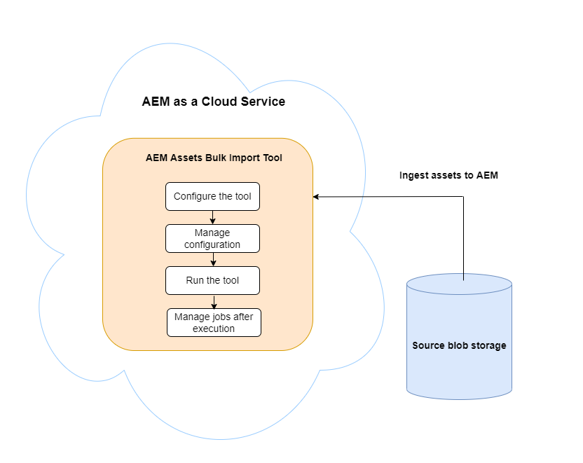
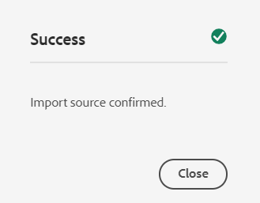
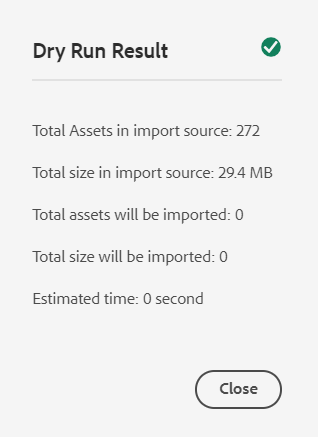
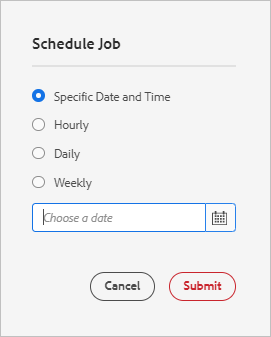
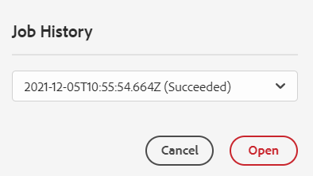
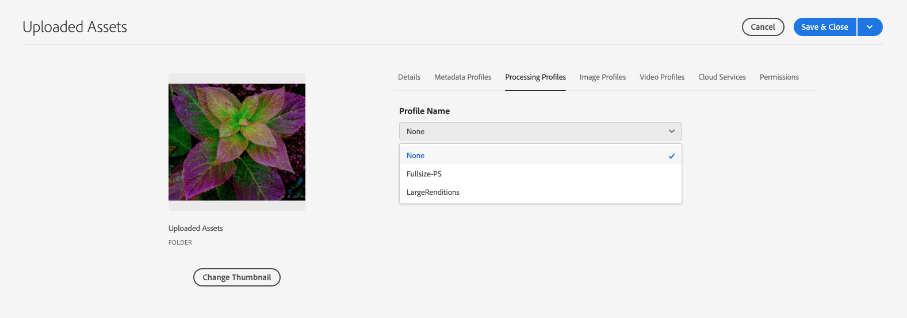

# Add digital assets to [!DNL Adobe Experience Manager] as a [!DNL Cloud Service] [!DNL Assets] {#add-assets-to-experience-manager}

[!DNL Adobe Experience Manager Assets] accepts many types of digital assets from many sources. It stores the original binaries and generated renditions, processes assets using workflows and [!DNL Adobe AI] services, and distributes content across many channels and surfaces.

[!DNL Adobe Experience Manager] automatically enriches the binary content of uploaded digital files, making assets more searchable, reusable, and ready for delivery. [!DNL Experience Manager] enriches these files with **rich metadata**, **smart tags**, **renditions**, and other **Digital Asset Management (DAM)** services. You can upload various types of files, such as images, documents, and raw image files, from your local folder or a network drive to [!DNL Experience Manager Assets].

## Methods for adding assets to the repository

In addition to the most commonly used browser upload, other methods of adding assets to the [!DNL Experience Manager] repository exist. These other methods include desktop clients, like [!DNL Adobe Asset Link] or [!DNL Experience Manager] desktop app, upload and ingestion scripts that customers would create, and automated ingestion integrations added as [!DNL Experience Manager] extensions.

## Additional services and processing

While you can upload and manage any binary file in [!DNL Experience Manager], most commonly used file formats support additional services, like metadata extraction or preview/rendition generation. See [supported file formats](file-format-support.md) for details.

You can also choose to have additional processing done on the uploaded assets. Several asset processing profiles can be configured on the folder, into which assets are uploaded, to add specific metadata, renditions, or image-processing services automatically, ensuring assets meet delivery requirements without manual intervention. See [process assets when uploaded](#process-when-uploaded).

## Upload methods overview

[!DNL Assets] provide the following upload methods. Adobe recommends that you understand your use case and the applicability of each upload option before using it, because the right method depends on volume, workflow, and the personas involved.

| Upload method       | When to use?   | Primary Persona |
|---------------------|----------------|-----------------|
| [Assets Console user interface](#upload-assets)  | Occasional upload, ease of press and drag, finder upload. Do not use to upload many assets. | All users |
| [Upload API](#upload-using-apis) | For dynamic decisions during upload. | Developer |
| [Experience Manager desktop app](https://experienceleague.adobe.com/docs/experience-manager-desktop-app/using/using.html) | Low volume asset ingestion, but not for migration. | Administrator, Marketer |
| [Adobe Asset Link](https://helpx.adobe.com/enterprise/using/adobe-asset-link.html) | Useful when creatives and marketers work on assets from within the supported [!DNL Creative Cloud] desktop apps. | Creative, Marketer |
| [Asset bulk ingestor](#asset-bulk-ingestor)  | Recommended for large-scale migrations and occasional bulk ingestions. Only for supported datastores. | Administrator, Developer |

## Upload assets {#upload-assets}

<!--
 #ENGCHECK do we support pausing? I couldn't get pause to show with 1.5GB upload.... If not, this should be removed#

   You can pause the uploading of large assets (greater than 500 MB) and resume it later from the same page. Select the **[!UICONTROL Pause]** icon beside progress bar that appears when an upload starts.

   The size above which an asset is considered a large asset is configurable. For example, you can configure the system to consider assets above 1000 MB (instead of 500 MB) as large assets. In this case, **[!UICONTROL Pause]** appears on the progress bar when assets of size greater than 1000 MB are uploaded.

   The [!UICONTROL Pause] option does not show if a file greater than 1000 MB is uploaded with a file less than 1000 MB. However, if you cancel the less than 1000 MB file upload, the **[!UICONTROL Pause]** option appears.

   To modify the size limit, configure the `chunkUploadMinFileSize` property of the `fileupload` node in the CRX repository.

   When you click the **[!UICONTROL Pause]** icon, it toggles to a **[!UICONTROL Play]** icon. To resume uploading, click **[!UICONTROL Play]** option.
-->

<!--
 #ENGCHECK do we support pausing? I couldn't get pause to show with 1.5GB upload.... If not, this should be removed#
   The ability to resume uploading is especially helpful in low-bandwidth scenarios and network glitches, where it takes a long time to upload a large asset. You can pause the upload operation and continue later when the situation improves. When you resume, uploading starts from the point where you paused it.
-->

<!--
 #ENGCHECK assuming this is not relevant? remove after confirming#
   During the upload operation, [!DNL Experience Manager] saves the portions of the asset being uploaded as chunks of data in the CRX repository. When the upload completes, [!DNL Experience Manager] consolidates these chunks into a single block of data in the repository.

   To configure the cleanup task for the unfinished chunk upload jobs, go to `https://[aem_server]:[port]/system/console/configMgr/org.apache.sling.servlets.post.impl.helper.ChunkCleanUpTask`.
-->

[!DNL Adobe Experience Manager Assets] supports two methods for uploading a single file or multiple files. **Drag and drop** the files directly from your desktop onto the [!DNL Assets] user interface (web browser) and into the destination folder, or **initiate the upload from within the [!DNL Assets] user interface** using the Create menu. Both methods add digital assets to the folder location you select.

>[!IMPORTANT]
>
>[!DNL Assets] uploaded into [!DNL Experience Manager] with a file name **greater than 100 characters** are given a shortened name when they are used in [!DNL Dynamic Media].
>
>The first **100 characters** of the file name are preserved as is, and any remaining characters are replaced by an alphanumeric string. This renaming method ensures a unique name when the asset is used in [!DNL Dynamic Media], preventing naming collisions between assets. It also accommodates the **maximum asset file name length** allowed in [!DNL Dynamic Media], so the truncation keeps every asset compliant with that limit.

1. In the [!DNL Assets] user interface, navigate to the location where you want to add digital assets.
1. To upload the assets, use one of the following methods:

    * On the toolbar, click **[!UICONTROL Create]** > **[!UICONTROL Files]**. You can rename the file in the presented dialog if needed.
    * In a browser that supports HTML5, drag the assets directly onto the [!DNL Assets] user interface. In this method, the rename-file dialog is not displayed.

   

   To select multiple files, hold the `Ctrl` key (Windows) or the `Command` key (macOS) and select the assets in the file picker dialog. When using an iPad, you can select only one file at a time.

1. To cancel an ongoing upload, click close (`X`) next to the progress bar. Because canceling stops the transfer in progress, [!DNL Assets] deletes the partially uploaded portion of the current asset to avoid leaving an incomplete file. If you cancel an upload operation before all files are uploaded, [!DNL Assets] stops uploading the current file and refreshes the content. However, files that have already finished uploading are not deleted and remain in the destination folder.

1. The upload progress dialog in [!DNL Assets] displays the count of successfully uploaded files and the files that failed to upload, giving you a clear status of the batch. In addition, the [!DNL Assets] user interface displays the most recent asset that you uploaded or the folder that you created first.

>[!NOTE]
>
>To upload nested folder hierarchies, see [bulk upload assets](#bulk-upload).

<!--
 #ENGCHECK I'm assuming this is no longer relevant.... If yes, this should be removed#

### Serial uploads {#serialuploads}

Uploading numerous assets in bulk consumes significant I/O resources, which may adversely impact the performance of [!DNL Assets]. In particular, if you have a slow internet connection, the time to upload drastically increases due to a spike in disk I/O. Moreover, your web browser may introduce additional restrictions to the number of POST requests [!DNL Assets] can handle for concurrent asset uploads. As a result, the upload operation fails or terminate prematurely. In other words, [!DNL Assets] may miss some files while ingesting a bunch of files or altogether fail to ingest any file.

To overcome this situation, [!DNL Assets] ingests one asset at a time (serial upload) during a bulk upload operation, instead of the concurrently ingesting all the assets.

Serial uploading of assets is enabled by default. To disable the feature and allow concurrent uploading, overlay the `fileupload` node in CRX-DE and set the value of the `parallelUploads` property to `true`.

### Streamed uploads {#streamed-uploads}

If you upload many assets to [!DNL Experience Manager], the I/O requests to server increase drastically, which reduces the upload efficiency and can even cause some upload task to time out. [!DNL Assets] supports streamed uploading of assets. Streamed uploading reduces the disk I/O during the upload operation by avoiding asset storage in a temporary folder on the server before copying it to the repository. Instead, the data is transferred directly to the repository. This way, the time to upload large assets and the possibility of timeouts is reduced. Streamed upload is enabled by default in [!DNL Assets].

>[!NOTE]
>
>Streaming upload is disabled for [!DNL Experience Manager] running on JEE server with servlet-api version lower than 3.1.
-->

### Handling uploads for existing assets {#handling-upload-existing-file}

Uploading an asset with the same path—identical name and location—as an existing asset triggers a warning dialog that presents three resolution options: **Replace existing asset**, **Create another version**, or **Keep both**. Each option handles the duplicate differently:

* **Replace existing asset**: Replacing an existing asset overwrites it entirely, so the metadata and any prior modifications—for example, annotations and cropping—applied to the existing asset are permanently deleted. This occurs because the replacement writes over the stored asset rather than preserving its history.

   >[!NOTE]
   >
   >The option to replace assets is not available if the asset is locked or checked out.

* **Create another version**: A new version of the existing asset is created in the repository, preserving the earlier state so no work is lost. You can view the two versions in the [!UICONTROL Timeline] and can revert to the previously existing version if necessary.
* **Keep both**: If you choose to keep both assets, the new asset is renamed so that both the original and the newly uploaded asset coexist.

To retain the duplicate asset in [!DNL Assets], click **[!UICONTROL Keep]**. To delete the duplicate asset you uploaded, click **[!UICONTROL Delete]**.

### Filename handling and forbidden characters {#filename-handling}

**[!DNL Adobe Experience Manager] (AEM) [!DNL Assets] blocks the upload of any asset whose filename contains a forbidden character.** When a filename includes one or more disallowed characters, [!DNL Assets] displays a warning message and blocks the upload until the disallowed characters are removed or the file is renamed with an allowed name. This safeguard runs at the point of upload, so problematic filenames are caught before the asset enters the repository.

**Why these restrictions exist**

Filename character restrictions ensure that asset and folder names remain compatible across file systems, storage layers, and web URLs. Characters such as slashes, colons, and other reserved symbols carry special meaning in file paths and URLs, so restricting them prevents naming conflicts, broken links, and delivery errors downstream.

To suit specific file-naming conventions for your organization, the [!UICONTROL Upload Assets] dialog lets users specify long file names during upload. The following (space-separated list of) characters are not supported:

* **Invalid characters for asset name:** `* / : [ \\ ] | # % { } ? &` or `;=` (a semicolon followed by an equals sign)
* **Invalid characters for asset folder name:** `* / : [ \\ ] | # % { } ? \" . ^ ; + & \t`

**Examples of invalid filenames:**

* `JPG_JD_small file ~!)$@;(-_=+^',..jpg`
* `JPG_JD_small file ~!)$@;=(-_+^',..jpg`

Both examples are rejected because they contain reserved characters from the lists above. To upload successfully, remove the forbidden characters or replace them with allowed alternatives before retrying the upload.

## Bulk upload assets {#bulk-upload}

The bulk asset ingestor handles large volumes of assets efficiently. A large-scale ingestion is not a broad file dump or a casual migration. To make a large-scale ingestion a meaningful project that serves your business purpose efficiently, plan the migration and curate the asset organization deliberately. Because every ingestion is different, factor in your specific repository composition and business needs rather than applying generic rules. The following best practices help you plan and execute a bulk ingestion:

* **Curate assets**: Remove assets that are not needed in the Digital Asset Management (DAM) repository. Consider removing unused, obsolete, or duplicate assets. This housekeeping reduces the data transferred and the number of assets ingested, which results in faster, more reliable ingestions.
* **Organize assets**: Consider organizing the content in a defined logical order, say by file size, file format, use case, or priority. Large, complex files require more processing time and system resources, so isolating them prevents processing bottlenecks. You can also consider ingesting large files separately using the file size filtering option (described below).
* **Stagger ingestions**: Consider breaking up your ingestion into multiple bulk ingestion projects. Staggered ingestion lets you see content sooner and adjust your ingestion as necessary. For example, you can ingest processing-intensive assets during non-peak hours or gradually in multiple chunks. However, you can ingest smaller and simpler assets that do not require much processing in one go.

To upload a larger number of files, use one of the following approaches. Also, see the [use cases and methods](#upload-methods-comparison)

* [Asset upload APIs](developer-reference-material-apis.md#asset-upload): Use a custom upload script or tool that uses APIs to add additional handling of assets (for example, translate metadata or rename files), if necessary.
* [Experience Manager desktop app](https://experienceleague.adobe.com/docs/experience-manager-desktop-app/using/using.html): Useful for creative professionals and marketers who upload assets from their local file system. Use it to upload nested folders available locally.
* [Bulk ingestion tool](#asset-bulk-ingestor): Use for ingestion of large amounts of assets either occasionally or initially when deploying [!DNL Experience Manager].

### Asset Bulk Import tool {#asset-bulk-ingestor}

The **Asset Bulk Import tool** is available only to the **administrators' group** for large-scale ingestion of assets from **Microsoft Azure Blob Storage** or **Amazon Simple Storage Service (S3)** datastores. Access is restricted to administrators because bulk ingestion is a privileged, high-volume operation that moves large numbers of assets directly into the repository and requires elevated permissions to configure securely. See a video walk-through of the configuration and ingestion.

>[!VIDEO](https://video.tv.adobe.com/v/329680/?quality=12&learn=on)

The following image illustrates the various stages when administrators ingest assets into [!DNL Adobe Experience Manager] from a data store. Ingestion proceeds through a staged pipeline in which assets are read from the connected object storage, transferred, and processed into [!DNL Experience Manager], ensuring large batches are handled reliably:



**Prerequisites**

An external storage account or bucket from **Microsoft Azure** or **Amazon Web Services (AWS)** is required to use this feature. The bulk import process reads source assets directly from this external account, so a properly configured Azure or AWS storage location is a mandatory precondition.

>[!NOTE]
>
>Create the storage account container or bucket as **private** and accept connections only from **authorized requests**. Configuring the storage as private restricts access to trusted, authenticated callers, which protects the source assets from unauthorized access during ingestion. However, additional restrictions on ingress network connections are not supported.

>[!NOTE]
>
>External storage accounts may enforce different file and folder naming rules than the Bulk Import tool. See [Handling filenames during bulk import](#filename-handling-bulkimport) for more details on disallowed and escaped names.

### Configure the Bulk Import tool {#configure-bulk-ingestor-tool}

To configure the Bulk Import tool in [!DNL Adobe Experience Manager], follow these steps:

1. Navigate to **[!UICONTROL Tools]** > **[!UICONTROL Assets]** > **[!UICONTROL Bulk Import]**. Select the **[!UICONTROL Create]** option.

1. Specify a title for the bulk import configuration in the **[!UICONTROL Title]** field.

1. Select the data source type from the **[!UICONTROL Import Source]** drop-down list.

1. Provide the values to create a connection with the data source. For example, if you select **Azure Blob Storage** as the data source, specify the values for Azure storage account, Azure blob container, and Azure access key.

1. Select the required authentication mode from the drop-down list. The two modes differ in the level of access they grant: **Azure Access Key** provides complete, unrestricted access to the Azure storage account, whereas **Azure SAS Token** allows the administrator to limit the capabilities of the token using permissions and expiration policies. As a result, **Azure SAS Token** is the more restrictive option and grants only scoped, time-bound access.

1. Provide the name of the root folder that contains assets in the data source in the **[!UICONTROL Source Folder]** field.

1. (Optional) Provide the minimum file size of assets in MB to include them in the ingestion process in the **[!UICONTROL Filter by Min Size]** field.

1. (Optional) Provide the maximum file size of assets in MB to include them in the ingestion process in the **[!UICONTROL Filter by Max Size]** field.

1. (Optional) Specify a comma-separated list of MIME types to exclude from the ingestion in the **[!UICONTROL Exclude MIME Types]** field. MIME types identify the file format of each asset, so this filter lets you skip formats you do not want to import. For example, `image/jpeg, image/.*, video/mp4`. See [all supported file formats](/help/assets/file-format-support.md).

1. Specify a comma-separated list of MIME types to include in the ingestion in the **[!UICONTROL Include MIME Types]** field. See [all supported file formats](/help/assets/file-format-support.md).

1. Select the **[!UICONTROL Delete source file after import]** option to delete the original files from the source data store after the files are imported into [!DNL Experience Manager]. This reclaims storage in the source data store and prevents the same files from being re-imported in later runs.

1. Select the **[!UICONTROL Import Mode]**. Select **Skip**, **Replace**, or **Create Version**. **Skip** mode is the default: because a matching asset already exists in the target, the ingestor skips importing it, which prevents overwriting existing content. See the meaning of the [replace and create version options](#handling-upload-existing-file).

1. To define the location in Digital Asset Management (DAM) where [!DNL Experience Manager] imports the assets, specify a path in the **[!UICONTROL Assets Target Folder]** field. For example, `/content/dam/imported_assets`.

1. (Optional) Specify the metadata file to import, provided in CSV format, in the **[!UICONTROL Metadata File]** field. Specify the CSV file in the source blob location and refer to the path while configuring the Bulk Import tool. The CSV file format referenced in this field is the same as the CSV file format used when you [Import and export asset metadata in bulk](https://experienceleague.adobe.com/docs/experience-manager-cloud-service/content/assets/admin/metadata-import-export.html). If you select the **Delete source file after import** option, filter CSV files using either the **Exclude** or **Include MIME Type** fields or the **Filter by Path/File** field, because doing so prevents the metadata CSV itself from being deleted or ingested as an asset. You can use a regular expression to filter CSV files in these fields.

1. Click **[!UICONTROL Save]** to save the configuration.

### Manage the Bulk Import tool configuration {#manage-bulk-import-configuration}

After creating a Bulk Import tool configuration, you can validate and evaluate the configuration before bulk ingesting assets into your [!DNL Experience Manager] instance. Managing the configuration at this stage lets you review its settings, confirm the connection to your asset source, and test the setup. This ensures the configuration behaves as expected and helps prevent ingestion errors before assets are imported at scale.

#### Access the configuration management options {#access-configuration-management-options}

To view the available options for managing your Bulk Import tool configuration, navigate to **[!UICONTROL Tools]** > **[!UICONTROL Assets]** > **[!UICONTROL Bulk Import]**, then select the configuration you want to manage. Selecting the configuration surfaces the management actions available for that specific setup, allowing you to inspect, evaluate, and adjust the configuration before initiating a full bulk import. Because evaluation occurs prior to ingestion, you can identify and resolve configuration issues early, reducing the risk of failed or incomplete asset imports.

### Edit the configuration {#edit-configuration}

To edit the configuration details, follow these steps:

1. Select the configuration you want to modify.
2. Click **[!UICONTROL Edit]** to open the configuration in edit mode.
3. Update the editable configuration details as required, then save your changes.

Two fields remain fixed and cannot be modified during the edit operation: the **title of the configuration** and the **import data source**. These values are locked because they define the configuration's identity and the origin of its imported data, and changing them after creation would break references established when the configuration was first set up. All other configuration details remain available for editing, allowing you to refine settings without recreating the configuration from scratch.

### Delete the configuration {#delete-configuration}

Deleting a Bulk Import configuration permanently removes it from the list of available configurations. Delete a configuration when it is no longer needed, when it was created in error, or when you want to replace it with an updated configuration.

To delete a Bulk Import configuration, follow these steps:

1. Select the configuration you want to remove from the list of Bulk Import configurations.
2. Click **[!UICONTROL Delete]**.

This action removes the selected Bulk Import configuration. Because deleting a configuration removes its saved settings, review the selected configuration carefully before confirming the deletion to ensure you do not remove one that is still in use.

### Validate connection to the data source {#validate-connection}

Validating the connection confirms that [!DNL Experience Manager] can reach the data source and that the supplied credentials and connection parameters are correct before you use the configuration. Running this check first prevents downstream errors caused by unreachable endpoints or invalid authentication.

To validate the connection to the data source, follow these steps:

1. Select the configuration you want to validate.
2. Click **[!UICONTROL check]**.

When the connection is successful, [!DNL Experience Manager] displays a confirmation message indicating that the connection to the data source has been established. This message verifies that the configuration is valid and ready to be used.



#### Troubleshoot a failed connection {#troubleshoot-connection}

If the validation does not succeed, [!DNL Experience Manager] displays an error message instead of the success confirmation. To resolve a failed connection, verify the following:

- **Connection details:** Confirm that the host, port, and endpoint values in the configuration are entered correctly.
- **Credentials:** Ensure the user name, password, or authentication token supplied for the data source are valid and current.
- **Network access:** Confirm that [!DNL Experience Manager] can reach the data source over the network and that firewalls or security rules are not blocking the connection.

After correcting the configuration, click **[!UICONTROL check]** again to re-run the validation. Repeat this process until the success message confirms that the connection is established.

### Invoke a test run for the Bulk Import job {#invoke-test-run-bulk-import}

Select the configuration and click **[!UICONTROL Dry Run]** to invoke a test run for the Bulk Import job. A **Dry Run** validates the selected Bulk Import configuration and its source connection **without importing any assets**, allowing you to confirm that the settings are correct before committing to a full import. Running a test first reduces the risk of failed or partial imports, because it surfaces configuration or connectivity issues in advance rather than during the actual job.

After the test run completes, [!DNL Experience Manager] displays the following details about the Bulk Import job:

- **Connection status** — whether [!DNL Experience Manager] successfully connects to the configured source location using the supplied credentials.
- **[!DNL Assets] detected** — the number of assets found at the source path that match the import criteria.
- **Estimated import scope** — an overview of the content that would be imported, so you can verify the configuration targets the intended files.
- **Warnings or errors** — any issues, such as unreachable paths, invalid credentials, or unsupported assets, that would prevent a successful import.



Review these details to confirm the configuration is correct. If the **Dry Run** reports errors or warnings, resolve them and run the test again before starting the actual Bulk Import job.

### Handling filenames during bulk import {#filename-handling-bulkimport}

When you import assets or folders in bulk, [!DNL Experience Manager Assets] imports the whole structure of what exists in the import source. [!DNL Experience Manager] follows the inbuilt rules for special characters in the asset and folder names, therefore these filenames require sanitization. This ensures that imported names comply with repository rules and do not break asset paths. For both folder name and asset name, the title defined by the user remains unchanged and is stored in the **Java Content Repository (JCR)** property `jcr:title`, which preserves the human-readable title independently of the sanitized technical name.

During bulk import, [!DNL Experience Manager] looks for the existing folders to avoid reimporting the assets and folders, and also verifies the sanitization rules applied in the parent folder where the import takes place. If the sanitization rules are applied in the parent folder, the same rules are applied to the import source. For new import, the following sanitization rules are applied to manage the filenames of assets and folders.

**Disallowed names in bulk import**

The following characters are **not allowed** in file and folder names:

* **Control and Private Use Characters** (0x00 to 0x1F, \u0081, \uE000)
* File or folder names **ending with a dot (.)**

As a result, files or folders with names matching these conditions are skipped during the import process and marked as failed.

**Handling asset name in bulk import**

For asset filenames, [!DNL Experience Manager] sanitizes the JCR name and path using the API: **`JcrUtil.escapeIllegalJcrChars`**.

* Unicode characters are not changed
* Replace the special characters with their URL Escape Code, for example, `new%asset.png` is updated to `new%25asset.png`:

  ```

<!-- 
[!DNL Experience Manager Assets] manages the forbidden characters in the filenames while you upload assets or folders. [!DNL Experience Manager] updates only the node names in the DAM repository. However, the `title` of the asset or folder remains unchanged.

Following are the file naming conventions that are applied while uploading assets or folders in [!DNL Experience Manager Assets]:

| Characters &Dagger; | When occurring in file names | When occurring in folder names | Example |
|---|---|---|---|
| `. / : [ ] | *` | Replaced with `-` (hyphen). | Replaced with `-` (hyphen). A `.` (dot) in the filename extension is retained as is. | Replaced with `-` (hyphen). | `myimage.jpg` remains as is and `my.image.jpg` changes to `my-image.jpg`. |
| `% ; # , + ? ^ { } "` and whitespaces | Whitespaces are retained | Replaced with `-` (hyphen). | `My Folder.` changes to `my-folder-`. |
| `# % { } ? & .` | Replaced with `-` (hyphen). | NA. | `#My New File.` changes to `-My New File-`. |
| Uppercase characters | Casing is retained as is. | Changed to lowercase characters. | `My New Folder` changes to `my-new-folder`. |
| Lppercase characters | Casing is retained as is. | Casing is retained as is. | NA. |

&Dagger; The list of characters is a whitespace-separated list.
-->
                  URL escape code   

  "               %22
  %               %25
  '               %27
  *               %2A
  /               %2F
  :               %3A
  [               %5B
  \n              %0A
  \r              %0D
  \t              %09
  ]               %5D
  |               %7C
  ```

**Handling folder name in bulk import**

For folder filenames, [!DNL Experience Manager] sanitizes the JCR name and path using the API: **`DamUtil.getSanitizedFolderName`**.

* Upper case characters are converted to lower case
* Unicode characters are not changed
* Replace the special characters with dash ('-'), for example, `new folder` is updated to `new-folder`:

  ```
  
  "                           
  #                         
  %                           
  &                          
  *                           
  +                          
  .                           
  :                           
  ;                          
  ?                          
  [                           
  ]                           
  ^                         
  {                         
  }                         
  |                           
  /         It is used for split folder in cloud storage and is pre-handled, no conversion here.
  \         Not allowed in Azure, allowed in AWS.
  \t
  space     It is the space character.

  ```

### Schedule a one-time or a recurring bulk import {#schedule-bulk-import}

To schedule a one-time or a recurring bulk import, execute the following steps:

1. Create a bulk import configuration.
1. Select the configuration and select **[!UICONTROL Schedule]** from the toolbar.
1. Set a one-time ingestion or schedule an hourly, a daily, or a weekly schedule. Click **[!UICONTROL Submit]**. Recurring schedules ensure that new assets in the import source are ingested automatically at the defined interval without manual re-execution.

   

### View the [!DNL Assets] target folder {#view-assets-target-folder}

To view the [!DNL Assets] target location where the assets are imported after running the Bulk Import job, select the configuration, and then click **[!UICONTROL View Assets]**.

### Run the Bulk Import tool {#run-bulk-import-tool}

After [configuring the Bulk Import tool](#configure-bulk-ingestor-tool) and optionally [managing the Bulk Import tool configuration](#manage-bulk-import-configuration), administrators can run the configuration job to start the bulk ingestion of assets.

To start the Bulk Import process, navigate to **[!UICONTROL Tools]** > **[!UICONTROL Assets]** > **[!UICONTROL Bulk Import]**, select the [Bulk Import configuration](#configure-bulk-ingestor-tool), and then click **[!UICONTROL Run]**. Click **[!UICONTROL Run]** again to confirm.

[!DNL Experience Manager] updates the status of the job to **Processing** and to **Succeeded** upon successful completion of the job. To view the imported assets in [!DNL Experience Manager], click **View [!DNL Assets]**.

While the job is in progress, you can control the ingestion process as follows:

* **Stop** — Select the configuration and click **Stop** to halt the bulk ingestion process.
* **Run** — Click **Run** again to resume the process from where it stopped.
* **Dry Run** — Click **Dry Run** to view the details of the assets that are still pending import, without committing the ingestion. This allows administrators to verify the scope of the import before it completes.

### Manage jobs after execution {#manage-jobs-after-execution}

[!DNL Experience Manager] enables you to see the history of the bulk import jobs. The Job history comprises the status of the job, job creator, logs, along with other details such as the start date and time, create date and time, and finish date and time. This history provides a complete audit trail, enabling administrators to track, troubleshoot, and verify each bulk import operation.

#### Viewing Job History for a Bulk Import Configuration {#viewing-job-history}

The **Job History** view lets you review the execution records for a specific Bulk Import configuration, providing visibility into past import runs and their outcomes. To access the job history for a configuration:

1. Select the configuration whose history you want to review.
2. Click **[!UICONTROL Job History]**.
3. Select a specific job from the list.
4. Click **Open** to view the full details of that job.



[!DNL Adobe Experience Manager] displays the job history, allowing you to inspect the status and results of each recorded Bulk Import job. Reviewing this history is useful for confirming that imports completed successfully and for troubleshooting any jobs that did not finish as expected.

On the Bulk Import job history page, you can also click **Delete** to remove that specific Bulk Import job from the configuration. Deleting a job removes its record from the job history for the Bulk Import configuration, helping you keep the history list clean and focused on relevant runs.

## Upload assets using desktop clients {#upload-assets-desktop-clients}

[!DNL Adobe Experience Manager] supports two desktop clients for uploading assets—**[!DNL Adobe Asset Link]** and the **[!DNL Experience Manager] desktop app**—in addition to the web browser user interface (UI). Both desktop clients enable direct asset upload without opening a web browser.

* [Adobe Asset Link](https://helpx.adobe.com/enterprise/using/adobe-asset-link.html) provides direct access to [!DNL Experience Manager] assets from within **Adobe Photoshop**, **Adobe Illustrator**, and **Adobe InDesign** desktop applications. You upload the currently open document into [!DNL Experience Manager] directly from the [!DNL Adobe Asset Link] interface, without leaving Photoshop, Illustrator, or InDesign.
* [Experience Manager desktop app](https://experienceleague.adobe.com/docs/experience-manager-desktop-app/using/using.html) streamlines asset management on the desktop, regardless of the file type or the native application that handles each asset. The desktop app is the preferred client for uploading files in **nested folder hierarchies** from your local file system, because browser upload supports only flat file lists. As a result, when preserving folder structure matters, the [!DNL Experience Manager] desktop app uploads the entire hierarchy in a single operation, whereas the browser requires flattening the files first.

## Process assets when uploaded {#process-when-uploaded}

Apply **processing profiles** on upload folders to perform additional processing on uploaded assets. These profiles are available on the **[!UICONTROL Properties]** page of a folder in [!DNL Assets], and they govern how each asset is transformed after it is added to the folder.



A digital asset without an extension, or with an incorrect extension, is not processed as desired. As a result, when uploading such assets, either nothing happens or an incorrect processing profile may apply, because the system relies on the file extension to select the correct profile. Users can still store the binary files in the Digital Asset Management (DAM) repository, even when the correct profile does not run automatically.

The following tabs are available:

* [Metadata profiles](metadata-profiles.md) apply default **metadata properties** to assets uploaded into that folder, ensuring consistent, searchable metadata across the folder.
* [Processing profiles](asset-microservices-configure-and-use.md) generate more **renditions** than are possible by default, extending the set of derived versions produced from each source asset.

Also, if **[!DNL Dynamic Media]** is enabled on your deployment, the following additional tabs are available:

* [Dynamic Media Image profiles](dynamic-media/image-profiles.md) apply specific cropping (**[!UICONTROL Smart Cropping]** and pixel cropping) and sharpening configuration to the uploaded assets.
* [Dynamic Media Video profiles](dynamic-media/video-profiles.md) apply specific video encoding profiles, including resolution, format, and parameters.

>[!NOTE]
>
>[!DNL Dynamic Media] cropping and other operations on assets are **non-destructive**, meaning the operations do not change the uploaded original. Instead, [!DNL Dynamic Media] provides parameters to crop or transform assets at delivery time. This ensures the source binary remains intact and reusable for other renditions.

For folders that have a processing profile assigned, the profile name appears on the thumbnail in the card view. In the list view, the profile name appears in the **[!UICONTROL Processing Profile]** column.

## Upload or ingest assets using APIs {#upload-using-apis}

The [asset upload](developer-reference-material-apis.md#asset-upload) section of the developer reference provides the complete technical details of the upload APIs and protocol, along with links to an open-source Software Development Kit (SDK) and sample clients. These Application Programming Interfaces (APIs) let developers programmatically upload or ingest assets, enabling automated and repeatable workflows rather than manual uploads. The open-source SDK and sample clients accelerate integration by providing ready-to-use reference implementations that demonstrate how the upload protocol works in practice.

## Asset upload security and best practices {#asset-upload-security-and-best-practices}

Asset upload security governs how files submitted by users or systems are validated, scanned, stored, and served, protecting an application from malicious content, data corruption, and abuse of storage or bandwidth. Securing the upload pipeline is widely regarded as essential, because unrestricted or poorly validated uploads are among the most common vectors for injecting malware, executing unauthorized code, and exhausting server resources.

### Core Upload Security Controls {#core-upload-security-controls}

Effective asset upload security relies on layered controls applied at every stage of the upload lifecycle. Key controls include:

- **File type validation** — Verify each upload against an explicit allowlist of permitted formats rather than a blocklist, because allowlists are far harder to bypass and prevent disguised executable content from slipping through.
- **File size limits** — Enforce maximum size thresholds to prevent denial-of-service conditions caused by oversized uploads that could exhaust disk space or memory.
- **Content inspection** — Inspect the actual file signature (magic bytes) instead of trusting the file extension or client-supplied MIME (Multipurpose Internet Mail Extensions) type, since attackers routinely spoof extensions to disguise harmful files.
- **Malware scanning** — Run uploaded assets through antivirus or malware scanning before making them available, ensuring infected files are quarantined rather than distributed to other users.
- **Filename sanitization** — Strip or normalize special characters, path separators, and control sequences from filenames to prevent path traversal and directory-escape attacks.

### Recommended Best Practices {#recommended-best-practices}

Apply these best practices in sequence to harden the upload workflow:

1. **Validate on the server** — Treat all client-side validation as advisory only, and enforce every check server-side, because client-side controls can be bypassed by a malicious actor.
2. **Store assets outside the web root** — Keep uploaded files in a location that cannot be directly executed by the web server, which prevents an attacker from running an uploaded script as code.
3. **Rename uploaded files** — Assign server-generated, non-predictable identifiers to stored files to avoid overwriting existing assets and to prevent enumeration of stored content.
4. **Restrict permissions** — Grant uploaded files the minimum required read and write permissions, and never mark them as executable, ensuring a compromised file cannot be run.
5. **Authenticate and authorize uploads** — Confirm that the requesting user has permission to upload, which limits exposure to anonymous abuse and unauthorized submissions.
6. **Rate-limit and throttle** — Apply upload rate limits per user or per session to reduce the risk of automated abuse and resource exhaustion.

### Handling and Storage After Upload {#handling-and-storage-after-upload}

Security responsibilities continue after a file is accepted. To protect assets during storage and delivery:

- **Serve assets over encrypted connections** — Deliver uploaded content over HTTPS (Hypertext Transfer Protocol Secure) so files cannot be intercepted or tampered with in transit.
- **Isolate user-generated content** — Serve untrusted uploads from a separate domain or a dedicated **Content Delivery Network (CDN)**, because isolating this content limits the impact of cross-site scripting and cookie-theft attacks.
- **Set correct response headers** — Return accurate `Content-Type` headers and force downloads where appropriate, so browsers do not misinterpret and execute a stored file.
- **Log and audit uploads** — Record upload metadata and access events, which supports incident investigation and helps detect abuse patterns early.

Following these controls and best practices establishes a defense-in-depth approach to asset uploads, reducing the risk that a single missed check leads to a full compromise.

### Direct Binary Upload with presigned URLs {#direct-binary-upload}

[!DNL Adobe Experience Manager] (AEM) as a [!DNL Cloud Service] uploads assets through a **Direct Binary Upload** flow, a three-step sequence: (1) a client requests a **presigned URL**, (2) the binary is uploaded directly to storage using that URL, and (3) the asset is finalized with an authenticated API call. This design offloads the large binary transfer directly to storage while keeping asset registration under authenticated control.

#### URL lifetime and reuse {#url-lifetime-and-reuse}

* Presigned URLs are short-lived, remaining valid for approximately one hour. However, the exact **Time to Live (TTL)** is not a published or guaranteed Service Level Agreement (SLA). Treat the duration as an implementation detail that can change, and do not hard-code the value into integrations.
* A presigned URL must be used immediately as part of a single upload session. It is not designed to be stored and reused later, and it is not intended to be reusable across multiple uploads. Each upload session obtains its own URL.

#### Security of presigned URLs {#security-of-presigned-urls}

* Leaking a presigned URL alone is not sufficient to create an asset, because asset creation and finalization depend on a separate authenticated API call that uses valid credentials and an **`uploadToken`**. If an actor obtains only the presigned URL, that actor cannot complete asset registration without valid authentication and the associated upload token.
* This authentication requirement limits the practical impact of a leaked URL: the required credentials and **`uploadToken`** act as a second control, so exposure of the URL by itself does not permit an unauthorized asset to be registered.
* Treat presigned URLs as sensitive values in your own integrations. Avoid logging them, always use **HTTPS**, and do not persist them beyond the upload session.

### Authentication for programmatic uploads {#authentication-for-programmatic-uploads}

Only **Service credentials (JWT)** support programmatic asset uploads to [!DNL Adobe Experience Manager] (AEM). Two authentication mechanisms exist for AEM API access, and they are **not interchangeable** for asset upload operations. Choosing the wrong credential type is the most common cause of failed upload integrations.

| Credential type | Where it is generated | Whether it is supported for Asset Upload API |
|---|---|---|
|OAuth Server-to-Server (S2S) credentials|Adobe Developer Console| This is **not supported** for asset upload API calls. Because the Asset Upload API rejects this credential type outright, using them results in persistent **403 Forbidden** errors even with a correctly assigned product profile (for example, [!DNL Assets] Collaborator Users). |
|Service credentials (JWT) | AEM Developer Console | This **is supported** for server-to-server asset upload API calls. |

>[!NOTE]
>
>The older asset HTTP API for directly updating an asset's binary is deprecated. New integrations use the **Direct Binary Upload** flow instead, which is the current, supported method for programmatically transferring asset binaries into AEM.

The technical account used for API uploads must have explicit repository-level **Access Control Lists (ACLs)** granted at the path level. Two ACL permissions are required:

- **`jcr:read`** on **`/content/dam`** — grants read access to the digital asset management (DAM) content root.
- **`rep:write`** (or **`jcr:all`**) on the specific target subfolder — grants write access to the destination path where assets are uploaded.

These path-level ACLs are required **in addition to** the correct credential type and the correct administrator console product profile or group membership.

A technical account can be correctly licensed and grouped and still receive **403 Forbidden** errors. This occurs because product-profile or group assignment and repository ACLs are independent controls, and **both are mandatory**. As a result, if the path-level ACLs have not been granted, the account will be denied access even when its credential type and product profile are configured correctly.

### Malware detection and quarantine {#malware-detection-and-quarantine}

**Malware detection** in **[!DNL Adobe Experience Manager] (AEM)** scans every uploaded file and moves any infected file into a dedicated **Quarantine** area, isolating suspect assets from the rest of the repository. When **malware detection** is enabled, the system scans each upload as it arrives and, upon detecting an infection, quarantines the file automatically. This isolates the threat from active workflows and prevents infected assets from being published, downloaded, or distributed to other users.

Access to quarantined assets is governed by **standard [!DNL Adobe Experience Manager] (AEM) permissions**, applied through a dedicated **Quarantine Administrators** group. Because quarantine visibility is not tied to a single fixed role, access can be extended flexibly:

- **Quarantine Administrators** group members hold access to quarantined assets by default.
- **Additional custom groups** can be granted access to the quarantine area when operational or security requirements call for broader oversight.
- **Multiple groups** may therefore hold quarantine visibility simultaneously, rather than the capability being restricted to one role.

This permission model ensures that only authorized users can inspect, release, or remove quarantined content, maintaining a controlled review process for potentially harmful files.

For more information on malware detection and quarantine, see [Malware Detection](https://experienceleague.adobe.com/en/docs/experience-manager-cloud-service/content/assets/manage/malware-detection).

### File type handling and upload restrictions {#file-type-handling-and-upload-restrictions}

* [!DNL Adobe Experience Manager] (AEM) does not impose default file-type restrictions on uploads. It is possible to upload files with **executable extensions** (for example, *.exe* or *.exe.pdf*) as asset renditions.
* This is expected behavior, not a vulnerability. AEM does not render or execute uploaded **active content or scripts**, either in the browser or on the server. Because uploaded files are stored and served only as inert asset renditions rather than executed as code, uploading an executable file does not by itself create a **remote-code-execution (RCE)** risk under AEM's default security model. Organizations with stricter compliance requirements should apply their own upload validation or **allow-listing** if needed, since AEM does not enforce this natively and leaves such controls to the deploying organization.
* Supported file formats and MIME (Multipurpose Internet Mail Extensions) types for asset processing are documented separately. Unsupported types are not fully processed, meaning such unsupported files may not generate the expected renditions.

### Upload reliability best practices {#upload-reliability-best-practices}

#### Optimize assets before upload {#optimize-assets-before-upload}

* For large or specialized asset types such as **video**, **PDF**, and **GIF**, follow the recommended file size limits, encoding settings, and preferred formats. Adhering to these specifications prevents platform performance impact during upload, processing, and preview generation, because oversized or non-standard files place the heaviest load on transcoding and thumbnail-generation steps.

#### Use supported upload paths for business-critical files {#use-supported-upload-paths}

* **Use the supported upload APIs or UI flows** for business-critical files rather than ad hoc folder-level bulk uploads. Supported paths apply consistent validation, encoding, and error handling, which makes them the more reliable choice for files that cannot tolerate corruption or loss.
* Folder-level drag-and-drop uploads occasionally cause **file corruption**, per reported cases. As a result, they are not recommended for critical assets.

#### If a folder-level upload fails or corrupts a file {#folder-level-upload-fails}

Capture evidence immediately, because the underlying cause is frequently environment-specific or file-specific and becomes difficult to diagnose after the fact once that evidence is lost.

1. **Record the exact error message or observed behavior** as soon as it occurs.
2. **Take screenshots** of the failure state and any error dialogs.
3. **Save an HTTP Archive (HAR) file** or **network logs** from the browser session, since these capture the request/response details needed to trace the fault.
4. **Preserve the affected file** so it can be re-tested against the supported upload path.

Capturing this evidence immediately gives support and engineering teams the environment- and file-specific detail required to reproduce and resolve the issue, whereas attempting to diagnose corruption after the fact—without logs or the original error—is often impractical.

## Troubleshooting checklist for upload failures {#troubleshooting-checklist-for-upload-failures}

1. **403 Forbidden on API (Application Programming Interface) upload**: Confirm the credential type first. OAuth S2S (Server-to-Server) credentials from the Adobe Developer Console are **not supported** for the asset upload API. Use the **Service Credentials (JSON Web Token, or JWT)** issued from the [!DNL Adobe Experience Manager] (AEM) Developer console instead. The two credential types are provisioned through different consoles and grant different scopes, which is why substituting one for the other produces a **403 Forbidden** even when the account otherwise appears valid.

2. **403 Forbidden despite correct credentials and group membership**: Confirm the technical account holds explicit **`jcr:read`** on `/content/dam` and **`rep:write/jcr:all`** on the specific target folder. Group or profile membership does not substitute for folder-level Access Control Lists (ACLs), because AEM authorizes asset writes at the repository node level rather than by role alone. As a result, an account can belong to the correct group yet still be denied until the node-level ACLs are set on the exact destination folder.

3. **Upload succeeds but asset fails to appear or binary looks corrupted**: Rule out folder-level bulk upload as the ingestion method. Retry through the standard upload API or the user interface (UI), and capture logs if the issue recurs. Bulk ingestion paths handle binaries differently from the standard API, so isolating the ingestion method is the fastest way to determine whether the corruption originates from the upload path itself.

4. **Security review flags unrestricted file upload**: Clarify that AEM does not execute uploaded active content server-side or in-browser by default. Because that content is never executed, unrestricted file upload is expected platform behavior rather than a defect — the primary risk of stored active content is neutralized when the content cannot run. This holds unless your organization requires additional upload-time validation, in which case that validation should be added as a policy control on top of the default behavior.

5. **Concerned about presigned URL exposure**: A presigned URL is a time-limited, pre-authorized link used to transfer the binary directly to storage. Confirm that the URL was used within its short validity window and that asset finalization still required a separate authenticated call carrying a valid **`uploadToken`**. This two-step design limits the exposure scope of a leaked presigned URL (Uniform Resource Locator), because possession of the URL alone cannot finalize an asset without a valid, separately authenticated `uploadToken`. Consequently, a URL that leaks after its validity window has closed carries no practical write capability.

## Tips, best practices, and limitations {#tips-limitations}

* **Direct binary upload** is a new method to upload assets. It is supported by default by the product capabilities and clients, including the [!DNL Experience Manager] user interface, [!DNL Adobe Asset Link], and the [!DNL Experience Manager] desktop app. Any custom code that is customized or extended by a customer's technical teams must use the new upload Application Programming Interfaces (APIs) and protocols.

* **Large folder handling:** **[!DNL Experience Manager Assets] supports folders containing over 1000 direct children** (assets or subfolders). Once a folder exceeds this **1000-item threshold**, the Admin UI switches to an asynchronously updated index to list the folder contents. Because this index updates asynchronously, newly created folders and assets appear after a **short delay, generally just a few seconds**. When opening such a folder in the Admin View, a banner notifies end users of this behavior, stating the following: "This directory contains 1000+ items. Uploads and new folder creations may be delayed."

* **Replace and asset ID regeneration:** When you select **[!UICONTROL Replace]** in the [!UICONTROL Name Conflict] dialog, the **asset ID is regenerated** for the new asset. This ID differs from the ID of the previous asset. If [Assets Insights](/help/assets/assets-insights.md) is enabled to track impressions or clicks with [!DNL Adobe Analytics], the regenerated asset ID invalidates the data captured for the asset on [!DNL Analytics], because [!DNL Analytics] tracks impressions and clicks against the original asset ID and cannot reconcile the new ID with prior records.

* **Forbidden characters in filenames:** Some upload methods do not prevent users from uploading assets with [forbidden characters](#filename-handling) in the filenames. In these cases, the forbidden characters are replaced with the `-` symbol.

* **Browser upload limitation:** Uploading assets using the browser only supports flat file lists and not nested folder hierarchies. To upload all assets inside a nested folder, use the [desktop app](#upload-assets-desktop-clients), which preserves the folder structure during transfer.

* **Bulk import folder structure:** The bulk import method imports the entire folder structure as it exists on the data source. However, only the non-empty folders are created in [!DNL Experience Manager], meaning empty folders on the source are omitted from the imported hierarchy.


<!--
 TBD: Link to file name handling in DA docs when it is documented. 
-->

**See also**

* [Translate [!DNL Assets]](/help/assets/translate-assets.md)
* [Assets HTTP API](/help/assets/mac-api-assets.md)
* [Assets supported file formats](/help/assets/file-format-support.md)
* [Search assets](/help/assets/search-assets.md)
* [Connected assets](/help/assets/use-assets-across-connected-assets-instances.md)
* [Asset reports](/help/assets/asset-reports.md)
* [Metadata schemas](/help/assets/metadata-schemas.md)
* [Download assets](/help/assets/download-assets-from-aem.md)
* [Manage metadata](/help/assets/manage-metadata.md)
* [Manage [!DNL Dynamic Media] templates](/help/assets/dynamic-media/manage-dynamic-media-templates.md)
* [Manage reports in [!DNL Assets] view](/help/assets/manage-reports-assets-view.md)
* [Search facets](/help/assets/search-facets.md)
* [Manage collections](/help/assets/manage-collections.md)
* [Bulk metadata import](/help/assets/metadata-import-export.md)
* [Publish [!DNL Assets] to AEM and [!DNL Dynamic Media]](/help/assets/publish-assets-to-aem-and-dm.md)

>[!MORELIKETHIS]
>
>* [Adobe [!DNL Experience Manager] desktop app](https://experienceleague.adobe.com/docs/experience-manager-desktop-app/using/introduction.html)
>* [About [!DNL Adobe Asset Link]](https://www.adobe.com/creativecloud/business/enterprise/adobe-asset-link.html)
>* [Adobe Asset Link documentation](https://helpx.adobe.com/enterprise/using/adobe-asset-link.html)
>* [Technical reference for asset upload](developer-reference-material-apis.md#asset-upload)
