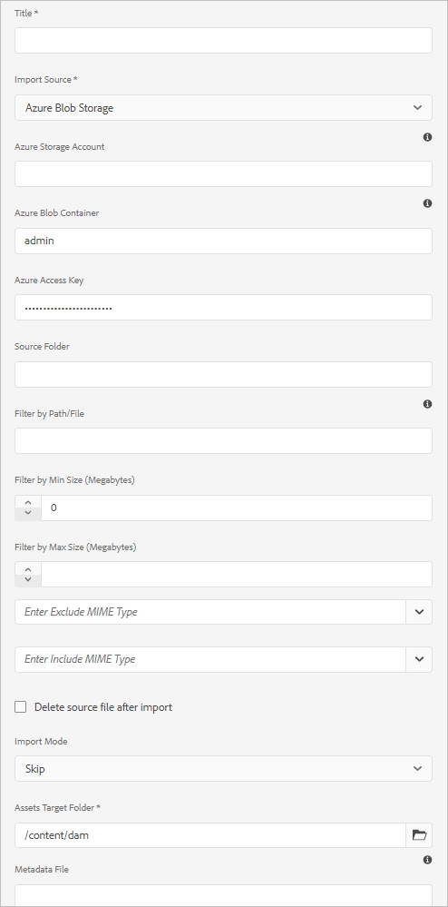

# Add digital assets to Adobe Experience Manager {#add-assets-to-experience-manager}

[!DNL Adobe Experience Manager] enriches the binary content of the uploaded digital files with rich metadata, smart tags, renditions, and other Digital Asset Management (DAM) services. You can upload various types of files, such as images, documents, and raw image files, from your local folder or a network drive to [!DNL Experience Manager Assets].

A number of upload methods are provided. In addition to the most commonly used browser upload, other methods of adding assets to the [!DNL Experience Manager] repository exist, including desktop clients, like Adobe Asset Link or [!DNL Experience Manager] desktop app, upload and ingestion scripts that customers would create, and automated ingestion integrations added as [!DNL Experience Manager] extensions.

We will focus on upload methods for end users here, and provide links to articles describing technical aspects of asset upload and ingestion using [!DNL Experience Manager] APIs and SDKs.

While you can upload and manage any binary file in [!DNL Experience Manager], most commonly used file formats have support for additional services, like metadata extraction or preview/rendition generation. Refer to [supported file formats](file-format-support.md) for details.

You can also choose to have additional processing done on the uploaded assets. A number of asset processing profiles can be configured on the folder, into which assets are uploaded, to add specific metadata, renditions or image processing services. See [process assets when uploaded](#process-when-uploaded).

>[!NOTE]
>
>[!DNL Experience Manager] as a [!DNL Cloud Service] leverages a new way of uploading assets - direct binary upload. It is supported by default by the out of the box product capabilities and clients, like [!DNL Experience Manager] user interface, [!DNL Adobe Asset Link], [!DNL Experience Manager] desktop app, and thus transparent to the end users.
>
>Upload code that is customized or extended by customers technical teams needs to use the new upload APIs and protocols.

Assets as a [!DNL Cloud Service] provides the following upload methods. Adobe recommends that you understand your use case and applicability of an upload option before using it.

| Upload method       | When to use?   | Primary Persona |
|---------------------|----------------|-----------------|
| [Assets Console user interface](#upload-assets)  | Occasional upload, ease of press and drag, finder upload. Do not use to upload a large number of assets. | All users |
| [Upload API](#upload-using-apis) | For dynamic decisions during upload. | Developer |
| [[!DNL Experience Manager] desktop app](https://experienceleague.adobe.com/docs/experience-manager-desktop-app/using/using.html) | Low volume asset ingestion, but not for migration. | Administrator, Marketer |
| [[!DNL Adobe Asset Link]](https://helpx.adobe.com/enterprise/admin-guide.html/enterprise/using/adobe-asset-link.ug.html) | Useful when creatives and marketers work on assets from within the supported [!DNL Creative Cloud] desktop apps. | Creative, Marketer |
| [Asset bulk ingestor](#asset-bulk-ingestor)  | Recommended for large-scale migrations and occasional bulk ingestions. Only for supported datastores. | Administrator, Developer |

## Upload assets {#upload-assets}

<!-- #ENGCHECK do we support pausing? I couldn't get pause to show with 1.5GB upload.... If not, this should be removed#

   You can pause the uploading of large assets (greater than 500 MB) and resume it later from the same page. Tap the **[!UICONTROL Pause]** icon beside progress bar that appears when an upload starts.

   The size above which an asset is considered a large asset is configurable. For example, you can configure the system to consider assets above 1000 MB (instead of 500 MB) as large assets. In this case, **[!UICONTROL Pause]** appears on the progress bar when assets of size greater than 1000 MB are uploaded.

   The [!UICONTROL Pause] option does not show if a file greater than 1000 MB is uploaded with a file less than 1000 MB. However, if you cancel the less than 1000 MB file upload, the **[!UICONTROL Pause]** option appears.

   To modify the size limit, configure the `chunkUploadMinFileSize` property of the `fileupload` node in the CRX repository.

   When you click the **[!UICONTROL Pause]** icon, it toggles to a **[!UICONTROL Play]** icon. To resume uploading, click **[!UICONTROL Play]** option.
-->

<!-- #ENGCHECK do we support pausing? I couldn't get pause to show with 1.5GB upload.... If not, this should be removed#
   The ability to resume uploading is especially helpful in low-bandwidth scenarios and network glitches, where it takes a long time to upload a large asset. You can pause the upload operation and continue later when the situation improves. When you resume, uploading starts from the point where you paused it.
-->

<!-- #ENGCHECK assuming this is not relevant? remove after confirming#
   During the upload operation, [!DNL Experience Manager] saves the portions of the asset being uploaded as chunks of data in the CRX repository. When the upload completes, [!DNL Experience Manager] consolidates these chunks into a single block of data in the repository.

   To configure the cleanup task for the unfinished chunk upload jobs, go to `https://[aem_server]:[port]/system/console/configMgr/org.apache.sling.servlets.post.impl.helper.ChunkCleanUpTask`.
-->

To upload a file (or multiple files), you can either select them on your desktop and drag on the user interface (web browser) to the destination folder. Alternatively, you can initiate upload from from the user interface.

1. In the [!DNL Assets] user interface, navigate to the location where you want to add digital assets.
1. To upload the assets, do one of the following:

    * On the toolbar, click **[!UICONTROL Create]** > **[!UICONTROL Files]**. You can rename the file in the presented dialog if needed.
    * In a browser that supports HTML5, drag the assets directly on the [!DNL Assets] user interface. The dialog to rename file is not displayed.

   

   To select multiple files, select the `Ctrl` or the `Command` key and select the assets in the file picker dialog. When using an iPad, you can select only one file at a time.

1. To cancel an ongoing upload, click close (`X`) next to the progress bar. When you cancel the upload operation, [!DNL Assets] deletes the partially uploaded portion of the asset.
If you cancel an upload operation before the files are uploaded, [!DNL Assets] stops uploading the current file and refreshes the content. However, files that are already uploaded are not deleted.

1. The upload progress dialog in [!DNL Assets] displays the count of successfully uploaded files and the files that failed to upload.
In addition, the [!DNL Assets] user interface displays the most recent asset that you upload or the folder that you created first.

>[!NOTE]
>
>To upload nested folder hierarchies, see [bulk upload assets](#bulk-upload).

<!-- #ENGCHECK I'm assuming this is no longer relevant.... If yes, this should be removed#

### Serial uploads {#serialuploads}

Uploading numerous assets in bulk consumes significant I/O resources, which may adversely impact the performance of [!DNL Assets]. In particular, if you have a slow internet connection, the time to upload drastically increases due to a spike in disk I/O. Moreover, your web browser may introduce additional restrictions to the number of POST requests [!DNL Assets] can handle for concurrent asset uploads. As a result, the upload operation fails or terminate prematurely. In other words, [!DNL Assets] may miss some files while ingesting a bunch of files or altogether fail to ingest any file.

To overcome this situation, [!DNL Assets] ingests one asset at a time (serial upload) during a bulk upload operation, instead of the concurrently ingesting all the assets.

Serial uploading of assets is enabled by default. To disable the feature and allow concurrent uploading, overlay the `fileupload` node in CRX-DE and set the value of the `parallelUploads` property to `true`.

### Streamed uploads {#streamed-uploads}

If you upload many assets to [!DNL Experience Manager], the I/O requests to server increase drastically, which reduces the upload efficiency and can even cause some upload task to time out. [!DNL Assets] supports streamed uploading of assets. Streamed uploading reduces the disk I/O during the upload operation by avoiding asset storage in a temporary folder on the server before copying it to the repository. Instead, the data is transferred directly to the repository. This way, the time to upload large assets and the possibility of timeouts is reduced. Streamed upload is enabled by default in [!DNL Assets].

>[!NOTE]
>
>Streaming upload is disabled for [!DNL Experience Manager] running on JEE server with servlet-api version lower than 3.1.
-->

### Handling uploads when asset already exists {#handling-upload-existing-file}

You can upload an asset with the same path (same name and same location) as that of an existing asset. However, a warning dialog is displayed with the following options:

* Replace existing asset: If you replace an existing asset, the metadata for the asset and any prior modifications (for example annotations, cropping, and so on) you made to the existing asset are deleted.
* Create another version: A new version of the existing asset is created in the repository. You can view the two versions in the [!UICONTROL Timeline] and can revert to the previously existing version if required.
* Keep both: If you choose to keep both assets, the new asset is renamed with the number `1` appended to its name.

>[!NOTE]
>
>When you select **[!UICONTROL Replace]** in the [!UICONTROL Name Conflict] dialog, the asset ID is regenerated for the new asset. This ID is different from the ID of the previous asset.
>
>If Asset Insights is enabled to track impressions or clicks with [!DNL Adobe Analytics], the regenerated asset ID invalidates the data-captured for the asset on [!DNL Analytics].

To retain the duplicate asset in [!DNL Assets], click **[!UICONTROL Keep]**. To delete the duplicate asset you uploaded, click **[!UICONTROL Delete]**.

### File name handling and forbidden characters {#filename-handling}

[!DNL Experience Manager Assets] tries to prevent you from uploading assets with the forbidden characters in their filenames. If you try to upload an asset with file name containing a disallowed character or more, [!DNL Assets] displays a warning message and stops the upload until you remove these characters or upload with an allowed name. Some upload methods do not stop you from uploading assets with forbidden characters in the filenames but replaces the characters with `-`.

To suit specific file naming conventions for your organization, the [!UICONTROL Upload Assets] dialog lets you specify long names for the files that you upload. The following (space-separated list of) characters are not supported:

* invalid characters for asset file name `* / : [ \\ ] | # % { } ? &`
* invalid characters for asset folder name `* / : [ \\ ] | # % { } ? \" . ^ ; + & \t`

## Bulk upload assets {#bulk-upload}

The bulk asset ingestor can handle very large number of assets efficiently. However, a large-scale ingestion is not just a broad file dump or a casual migration. For a large-scale ingestion to be a meaningful project that serves your business purpose and is efficient, plan the migration and curate the assets organization. All ingestions are different so instead of generalizing, factor in the nuanced repository composition and business needs. The following are some overarching suggestions to plan and execute a bulk ingestion:

* Curate assets: Remove assets that are not needed in the DAM. Consider removing unused, obsolete, or duplicate assets. This reduces the data transferred and assets ingested leading to faster ingestions.
* Organize assets: Consider organizing the content in some logical order, say by file size, file format, use case, or priority. In general, large complex files require more processing. You can also consider ingesting large files separately using the file size filtering option (described below).
* Stagger ingestions: Consider breaking up your ingestion into multiple bulk ingestion projects. This allows you to see content sooner and update your ingestion as necessary. For example, you can ingest processing-intensive assets during non-peak hours or gradually in multiple chunks. However, you can ingest smaller and simpler assets that do not require much processing in one go.

To upload larger number of files, use one of the following approaches. Also, see the [use cases and methods](#upload-methods-comparison)

* [Asset upload APIs](developer-reference-material-apis.md#asset-upload-technical): Use a custom upload script or tool that leverages APIs to add additional handling of assets (for example, translate metadata or rename files), if required.
* [[!DNL Experience Manager] desktop app](https://experienceleague.adobe.com/docs/experience-manager-desktop-app/using/using.html): Useful for creative professionals and marketers who upload assets from their local file system. Use it to upload nested folders available locally.
* [Bulk ingestion tool](#asset-bulk-ingestor): Use for ingestion of large amounts of assets either occasionally or initially when deploying [!DNL Experience Manager].

### Asset bulk ingestor tool {#asset-bulk-ingestor}

The tool is provided only to the administrators group to use for large-scale ingestion of assets from Azure or S3 datastores. See a video walk-through of the configuration and ingestion.

>[!VIDEO](https://video.tv.adobe.com/v/329680/?quality=12&learn=on)

To configure the tool, follow these steps:

1. Navigate to **[!UICONTROL Tools]** > **[!UICONTROL Assets]** > **[!UICONTROL Bulk Import]**. Select the **[!UICONTROL Create]** option.

  

1. On [!UICONTROL bulk import configuration] page, provide the required values.

   * [!UICONTROL Title]: A descriptive title.
   * [!UICONTROL Import Source]: Select the applicable datasource.
   * [!UICONTROL Filter by Min Size]: Provide minimum file size of assets in MB.
   * [!UICONTROL Filter by Max Size]: Provide maximum file size of assets in MB.
   * [!UICONTROL Exclude Mime Types]: Comma-separated list of MIME types to exclude from the ingestion. For example, `image/jpeg, image/.*, video/mp4`.
   * [!UICONTROL Include Mime Types]: Comma-separated list of MIME types to include in the ingestion. See [all supported file formats](/help/assets/file-format-support.md).
   * [!UICONTROL Import Mode]: Select Skip, Replace, or Create Version. Skip mode is the default and in this mode the ingestor skips to import an asset if it already exists. See the meaning of [replace and create version options](#handling-upload-existing-file).
   * [!UICONTROL Assets Target Folder]: Import folder in DAM where assets are to be imported. For example, `/content/dam/imported_assets`

1. You can delete, modify, execute and do more with your created ingestor configurations. When you select a bulk import ingestor configuration, the follow option are available in the toolbar.

   * [!UICONTROL Edit]: Edit the selected configuration.
   * [!UICONTROL Delete]: Delete the selected configuration.
   * [!UICONTROL Check]: Validate connection to the datastore.
   * [!UICONTROL Dry Run]: Invoke a test run of the bulk ingestion.
   * [!UICONTROL Run]: Execute the selected configuration.
   * [!UICONTROL Stop]: Terminate an active configuration.
   * [!UICONTROL Schedule]: Set one-time or recurring schedule to ingest assets.
   * [!UICONTROL Job Status]: View the status of the configuration when it is used in an ongoing import job or used for a completed job.
   * [!UICONTROL Job History]: Previous instances of the job.
   * [!UICONTROL View Assets]: View the target folder if it exists.

   

To schedule a one-time or a recurring bulk import, follow these steps:

1. Create a bulk import configuration.
1. Select the configuration and select **[!UICONTROL Schedule]** from the toolbar.
1. Set a one-time ingestion or schedule an hourly, a daily, or a weekly schedule. Click **[!UICONTROL Submit]**.

   

## Upload assets using desktop clients {#upload-assets-desktop-clients}

In addition to web browser user interface, [!DNL Experience Manager] supports other clients on desktop. They also provide upload experience without the need to go to the web browser.

* [[!DNL Adobe Asset Link]](https://helpx.adobe.com/enterprise/using/adobe-asset-link.html) provides access to assets from [!DNL Experience Manager] in Adobe Photoshop, Adobe Illustrator, and Adobe InDesign desktop applications. You can upload the currently open document into [!DNL Experience Manager] directly from Adobe Asset Link user interface from within these desktop applications.
* [[!DNL Experience Manager] desktop app](https://experienceleague.adobe.com/docs/experience-manager-desktop-app/using/using.html) simplifies working with assets on desktop, independent on their file type or native application that handles them. It is particularly useful to upload files in nested folder hierarchies from your local file system, as browser upload only supports uploading flat file lists.

## Process assets when uploaded {#process-when-uploaded}

In order to do additional processing on the uploaded assets, you can apply processing profiles on the upload folders. The profiles are available in the **[!UICONTROL Properties]** page of a folder in [!DNL Assets]. A digital asset without an extension or with an incorrect extension is not processed as desired. For example, when uploading such assets, either nothing happens or an incorrect processing profile may apply to the asset. Users can still store the binary files in the DAM.

The following tabs are available:

* [Metadata profiles](metadata-profiles.md) let you apply default metadata properties to assets uploaded into that folder.
* [Processing profiles](asset-microservices-configure-and-use.md) let you generate more renditions than are possible by default.

Additionally, if [!DNL Dynamic Media] is enabled on your deployment, the following tabs are available:

* [[!DNL Dynamic Media] Image profiles](dynamic-media/image-profiles.md) let you apply specific cropping (**[!UICONTROL Smart Cropping]** and pixel cropping) and sharpening configuration to the uploaded assets.
* [[!DNL Dynamic Media] Video profiles](dynamic-media/video-profiles.md) let you apply specific video encoding profiles (resolution, format, parameters).

>[!NOTE]
>
>[!DNL Dynamic Media] cropping and other operations on assets are non-destructive, that is, the operations do not change the uploaded original. Instead, it provides parameters to crop or transform when delivering the assets.

For folders that have a processing profile assigned, the profile name appears on the thumbnail in the card view. In the list view, the profile name appears in the **[!UICONTROL Processing Profile]** column.

## Upload or ingest assets using APIs {#upload-using-apis}

Technical details of the upload APIs and protocol, and links to open-source SDK and sample clients is provided in [asset upload](developer-reference-material-apis.md#asset-upload-technical) section of the developer reference.

>[!MORELIKETHIS]
>
>* [[!DNL Adobe Experience Manager] desktop app](https://experienceleague.adobe.com/docs/experience-manager-desktop-app/using/introduction.html)
>* [About [!DNL Adobe Asset Link]](https://www.adobe.com/creativecloud/business/enterprise/adobe-asset-link.html)
>* [[!DNL Adobe Asset Link] documentation](https://helpx.adobe.com/enterprise/using/adobe-asset-link.html)
>* [Technical reference for asset upload](developer-reference-material-apis.md#asset-upload-technical)
