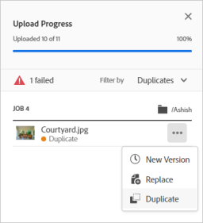

# Upload assets {#add-assets}

| [Search Best Practices](/help/assets/search-best-practices.md) |[Metadata Best Practices](/help/assets/metadata-best-practices.md)|[Content Hub](/help/assets/product-overview.md)|[Dynamic Media with OpenAPI capabilities](/help/assets/dynamic-media-open-apis-overview.md)|[AEM Assets developer documentation](https://developer.adobe.com/experience-cloud/experience-manager-apis/)|
| ------------- | --------------------------- |---------|----|-----|

To add new assets to work with, upload a few assets from your local file system. <!-- TBD: Many of the [common file formats are supported](/help/assets/supported-file-formats-assets-view.md). -->

You can use the following methods to upload one or more assets or a folder containing assets:

* Drag assets or folders on the user interface and follow the on-screen instructions.
* Click **[!UICONTROL Add Assets]** option from the toolbar and add some files to the upload dialog.

<!-- TBD: Update this GIF
 -->

You can use any of these methods to upload assets after creating a folder. To create an empty folder, click **[!UICONTROL Create Folder]** from the toolbar. While [!DNL Assets view] offers a powerful, full-text search functionality, you can also use folders to organize your assets better.

Once you have selected the files, you get a confirmation dialog to add more files or to remove already selected files. To add more files to a selection, click **[!UICONTROL Browse]** and the select **[!UICONTROL Browse files]** or **[!UICONTROL Browse folders]**. Add more files or folders from the same or from a different folder.

Once all files are queued, click **[!UICONTROL Upload]**.

*Figure: Before you upload the selected assets, you can add or remove assets from the queue.*

>[!TIP]
>
>In case you upload a folder structure to Assets view, you do not need to create a .ZIP file with the folder structure, you can upload folder structures directly. A .ZIP file uploaded to Assets view is stored as one ZIP asset and is not extracted automatically after the upload. 

## View upload progress and status {#upload-progress}

When you upload many assets or nested folders to [!DNL Assets view], some assets can fail to upload for various reasons such as duplicate asset and network issues.

To track the upload progress, click **[!UICONTROL Upload Progress]** option on the toolbar. A panel displays the upload progress of all assets.

To view a subset of assets based on the upload progress or status, use the filter in the **[!UICONTROL Upload Progress]** sidebar. The various filters are to display all assets, completed uploads, in-progress uploads, queued assets to be uploaded, paused uploads, duplicate assets, and assets that failed to upload.  

*Figure: Filter the assets that you attempted to upload based on their upload status or upload progress.*

Immediately after the assets are uploaded, [!DNL Assets view] processes the assets to generate thumbnail and process metadata. For many assets, the processing takes some time. If do not see a thumbnail and see a processing message on the placeholder thumbnail, check the folder again after a few minutes. During processing, amongst other things, [!DNL Assets view] generates the renditions, adds smart tags, and indexes the asset details for search.

*Figure: Uploaded assets display processing on the tile these are processed.*

## Asset renditions {#renditions}

[!DNL Assets view] processes the uploaded assets in near real time and for many supported file types, it generates renditions. Created for images, the renditions are resized versions of the uploaded image. You can download not just the asset but also the renditions to use an appropriate version. You can view all the renditions of an asset when you [preview an asset](/help/assets/navigate-assets-view.md#preview-assets).

*Figure: View and download the renditions.*

## Manage failed uploads {#resolve-upload-fails}

If upload of a supported asset fails for some reason, click **[!UICONTROL Retry]** from the [!UICONTROL Upload Progress] pane.

*Figure: Retry if a supported file fails to upload for some reason.*

If you attempt to upload duplicate assets, the assets are not uploaded until you explicitly confirm the upload. At first, the duplicate assets are marked as failed uploads. To resolve, you can simply create a version, delete and replace the existing assets, or create a duplicate copy by renaming the asset. You can resolve such failures one asset at a time or do it in bulk for all failed duplicates in one go.

*Figure: For duplicate assets that fail to upload by default, resolve the issue one asset at a time.*

*Figure: For duplicate assets that fail to upload by default, resolve issues for all assets at once.*

>[!TIP]
>
>You can upload assets to the DAM repository directly from within your [!DNL Creative Cloud] desktop applications. 
<!--TBD
See how [[!DNL Assets view] integrates with [!DNL Adobe Asset Link]](/help/assets/integration-assets-view.md).
-->

## Delete assets or folders {#delete-assets}

Users can delete individual assets or folders that are no longer required. To delete an asset or a folder do one of the following:

* Use the option available on an asset's or a folder's thumbnail.

  

  *Figure: Actions for files and folders are available on the asset or folder tile.*

* Select an asset or a folder and click **[!UICONTROL Delete]**  in the toolbar.

## Next Steps {#next-steps}

* [Watch a video to upload assets in Assets view](https://experienceleague.adobe.com/docs/experience-manager-learn/assets-essentials/basics/creating.html)

* Provide product feedback using the [!UICONTROL Feedback] option available on the Assets view user interface

* Provide documentation feedback using [!UICONTROL Edit this page]  or [!UICONTROL Log an issue]  available on the right sidebar

* Contact [Customer Care](https://experienceleague.adobe.com/?support-solution=General#support)
