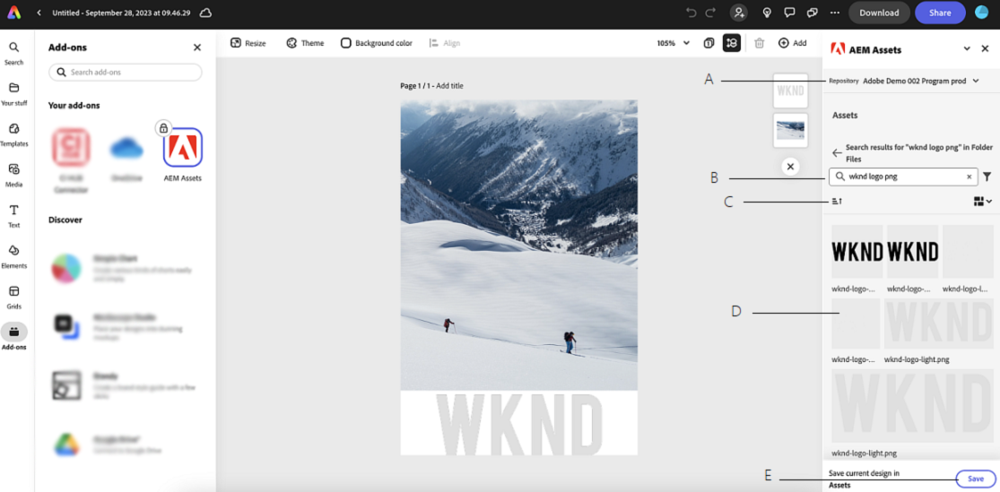
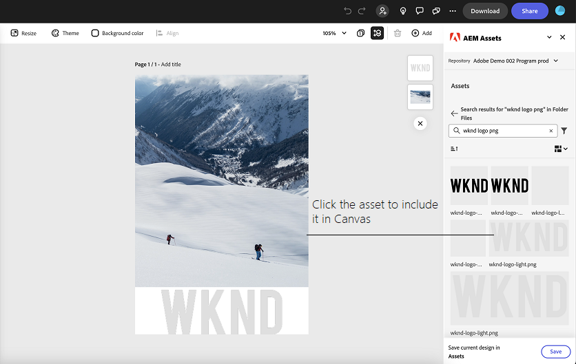
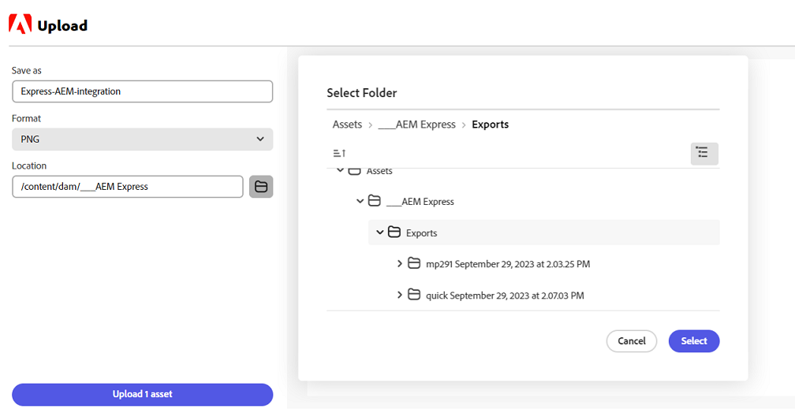

# AEM Assets add-on for Adobe Express {#assets-addon-adobe-express}

AEM Assets add-on for Adobe Express allows you to directly access the assets stored in AEM Assets from within the Adobe Express user interface. You can place content managed in AEM Assets in the Express canvas and then save new or edited content in an AEM Assets repository. The add-on provides the following key benefits:

* Increased content reuse by editing and saving new assets in AEM

* Reduced overall time and effort  to create new assets or create new versions of existing assets

## Prerequisites {#prerequisites}

Entitlements to access Adobe Express and atleast one environment within AEM Assets. The environment can be any of the repositories within Assets as a Cloud Service or Assets Essentials.

## Add AEM Assets add-on to Adobe Express {#access-assets-addon}

Perform the following steps to add AEM Assets add-on to Adobe Express:

1. Open the Adobe Express web application.

1. Open a new blank canvas by loading a new template or a project, or by creating an asset.

1. Click **[!UICONTROL Add-ons]** available in the left navigation pane.

1. Specify **[!UICONTROL AEM Assets]** in the search bar available at the top of the [!UICONTROL Add-ons] section and click the AEM Assets add-on.

   

1. Click **[!UICONTROL Add]**. The add-on displays in the list of **[!UICONTROL Your add-ons]** section. Click the add-on again to display the contents in the right navigation pane. The add-on displays the list of repositories that you are entitled to access along with the list of assets and folders available at the root-level.

   Use the search bar to search assets that you need to use in the canvas.

   

   A. Select your AEM Assets Repository B. Search for assets using the search bar C. Sort the assets in ascending or descending order D. The assets and folders available at the selected location. E. Save your changes in AEM Assets

## Use AEM Assets in Adobe Express editor {#use-aem-assets-in-express}

After adding AEM Assets add-on to Adobe Express, you can start using PNG and JPEG images stored in AEM Assets repository within the Express canvas. Navigate to the appropriate folder and click the asset to include it in the canvas.

## Save Adobe Express projects in AEM Assets {#save-express-projects-in-assets}

After incorporating appropriate modifications in the Express canvas, you can save it in AEM Assets repository. 

1. Click **[!UICONTROL Save]** to open the **[!UICONTROL Upload]** dialog. 
1. Specify a name and format for the asset. You can save the contents of the canvas in PNG or JPEG format types.

1. Click the folder icon adjacent to the **[!UICONTROL Location]** field, navigate to the location where you need to save the asset, and click **[!UICONTROL Select]**. The name of the folder displays in the **[!UICONTROL Location]** field. 

1. Click **[!UICONTROL Upload]** to upload the asset to AEM Assets.

   
