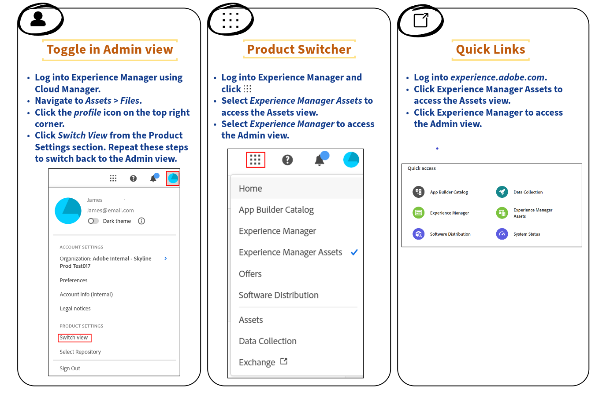

# Approve assets for Content Hub {#approve-assets-content-hub}

>[!AVAILABILITY]
>
>Content Hub guide is now available in PDF format. Download the entire guide and use Adobe Acrobat AI Assistant to answer your queries. 
>
>[!BADGE Content Hub Guide PDF]{type=Informative url="https://helpx.adobe.com/content/dam/help/en/experience-manager/aem-assets/content-hub.pdf"}

Only the **approved, latest version of an asset** is available for use within Content Hub, ensuring **brand consistency** across all channels and applications. Brand Managers and Marketers maintain strict control over brand assets, so every asset published to Content Hub reflects the current, sanctioned state of the brand.

## Why asset approval matters

Asset approval acts as the quality gate that separates work-in-progress content from production-ready content. This ensures that only vetted, on-brand material reaches downstream channels, because unapproved or outdated assets are withheld from circulation. In practice, the approval workflow delivers several benefits:

- **Enforces brand consistency** — teams reuse only assets that have been reviewed and cleared for distribution.
- **Prevents outdated content** — only the latest approved version surfaces, so superseded files are not accidentally reused.
- **Centralizes control** — Brand Managers and Marketers govern which assets are eligible for use, keeping ownership of brand standards in one place.
- **Reduces risk** — restricting circulation to approved assets lowers the chance of off-brand or unlicensed content reaching public-facing channels.

By making the approved, current version the single available option, Content Hub removes ambiguity for the marketers and creators who pull assets for campaigns and applications.

## Approving assets with AEM Assets as a Cloud Service

Brand Managers and Marketers can approve assets using **Adobe Experience Manager (AEM) Assets as a Cloud Service**, the digital asset management platform that governs how assets move from creation to distribution. Approving through AEM Assets as a Cloud Service establishes a controlled review path before an asset becomes available in Content Hub.

As a result, asset management is streamlined into a controlled and efficient process for handling assets: assets progress through a defined approval step, and only those that pass are exposed to end users within Content Hub. This structured handoff supports a repeatable, governed workflow, so that brand teams retain oversight while marketers gain quick, reliable access to the correct, approved assets.

## Before you begin {#pre-requisites}

Before you begin, ensure that you meet the following prerequisites:

* Access to **Adobe Experience Manager (AEM) Assets as a Cloud Service**. This access is required to view and manage assets within the environment.

* **Write permissions** to edit asset metadata. Write permissions authorize you to modify metadata values and are required to edit the **[!UICONTROL Status]** field available in [asset properties](/help/assets/manage-organize-assets-view.md##manage-asset-status) for an asset. Without write access to metadata, the **[!UICONTROL Status]** field cannot be set or updated.

Meeting both prerequisites ensures that you can access AEM Assets as a Cloud Service and successfully edit the asset **[!UICONTROL Status]** field from asset properties.

## Approve assets for Content Hub{#approve-assets-for-content-hub}

Assets marked as `approved` in Assets as a Cloud Service become available in Content Hub automatically. The `approved` status acts as the visibility gate: only assets that carry this status are surfaced in Content Hub, ensuring that unreviewed or in-progress content is not exposed to Content Hub users.

>[!NOTE]
>
>Assets as a Cloud Service and Content Hub must use the same organization for the assets to display in Content Hub. Because Content Hub reads approved assets from within its own organization, an organization mismatch prevents the assets from appearing—so verifying that both services share the same organization is a prerequisite for synchronization.

To set the asset status to `approved` using the Assets view within AEM as a Cloud Service, complete these steps:

1. Select the asset, and click **[!UICONTROL Details]** in the toolbar.

1. In the **[!UICONTROL Basic]** tab, select the asset status as `approved` from the **[!UICONTROL Status]** drop-down list.
1. Click **[!UICONTROL Save]**. Saving commits the `approved` status, which triggers the asset's automatic availability in Content Hub.

   >[!VIDEO](https://video.tv.adobe.com/v/3433172)

To approve assets from the Admin view instead of the Assets view, see [Approve assets using Admin view](/help/assets/approve-assets.md#approve-assets).

## Bulk Approve assets for Content Hub using Assets view {#bulk-approve-assets-content-hub}

Bulk approve assets using Assets view for Adobe Experience Manager (AEM) Assets as a Cloud Service. Once approved in bulk, these assets are published to Content Hub as a single action, eliminating the need to approve each asset individually. Bulk approval sets the status of many assets at once, which makes them immediately discoverable and usable in Content Hub.

To bulk approve assets within a folder in Assets view:

1. Select the asset(s) and click **[!UICONTROL Bulk Metadata Edit]**.

1. Select **[!UICONTROL Approved]** in the **[!UICONTROL Status]** field available in the [!UICONTROL Properties] section in the right pane.

1. Click **[!UICONTROL Save]**.

After you save, the selected assets carry the **[!UICONTROL Approved]** status, and this approved status is applied to every asset included in the bulk selection at once. Because the status change is applied simultaneously across the selection, the approved assets become available in Content Hub without any further per-asset action.

## Set approval target {#set-approval-target}

Assets view enables you to publish approved assets to Dynamic Media with OpenAPI capabilities, Content Hub, or both based on the value that you set in the **Approval Target** field on the Asset Details page, which determines the publish destination for each approved asset.

To set approval target:

1. Select the asset, and click **[!UICONTROL Details]** in the toolbar.

1. In the **[!UICONTROL Basic]** tab, select the asset status from the **[!UICONTROL Status]** drop-down list. The possible values are **Approved**, **Rejected**, and **No Status** (default).

1. If you select **Approved** in step 2, select an approval target. The possible values are **Delivery** and **Content Hub**.

   * **Delivery** is the default option selected in the drop-down menu, and it publishes the asset to both [Dynamic Media with OpenAPI](/help/assets/dynamic-media-open-apis-overview.md) and [Content Hub](/help/assets/product-overview.md) when both destinations are enabled for Experience Manager Assets. This ensures the widest possible distribution of the approved asset across both delivery channels.

   * Selecting **Content Hub** publishes the asset exclusively to Content Hub, so the asset is not delivered through Dynamic Media with OpenAPI. Content Hub appears as an option only when it is enabled for Experience Manager Assets.

   * If you do not select an option from the drop-down list, the default option enabled for your Adobe Experience Manager (AEM) as a Cloud Service environment is automatically applied to the asset. As a result, every approved asset receives a valid publish destination even without an explicit selection.

   

   For more information on the available options, see [Default Approval Target and publish destinations for approved assets](#default-approval-target-options-publish-destinations).

1. Specify other asset properties and click **[!UICONTROL Save]**.

### Additional considerations for setting the approval target

* When you are not using the default metadata form and cannot view the **[!UICONTROL Approval Target]** field, [edit your metadata form](/help/assets/metadata-assets-view.md#metadata-forms) to drag the **[!UICONTROL Approval for]** field from the available components onto your metadata form, then click **[!UICONTROL Save]**. This makes the approval target selectable within your customized form.

* When you select the approval target as `Content Hub` using the Assets view, the assets become available in Content Hub to users who belong to the same organization.

### Default Approval Target and publish destinations for approved assets {#default-approval-target-options-publish-destinations}

The `Approval Target` dropdown list displays whenever **Dynamic Media (DM) with OpenAPI**, **Content Hub**, or both are enabled on your Adobe Experience Manager (AEM) as a Cloud Service environment. The following table sets out the exact prerequisites for displaying the `Approval Target` dropdown list, the default approval target applied to approved assets, and the resulting publish destination, based on the enablement of Dynamic Media (DM) with OpenAPI and Content Hub:

| Dynamic Media with OpenAPI| Content Hub | Approval Target dropdown list displays?| Default approval target for approved assets | Publish destination |
| --- | --- | --- | --- |---|
| Enabled | Enabled | Yes | Delivery | Dynamic Media with OpenAPI and Content Hub |
| Not enabled | Enabled | Yes | Content Hub | Content Hub |
| Enabled | Not enabled | Yes | Delivery | Dynamic Media with OpenAPI|
| Not enabled | Not enabled | No | N/A | N/A |

### How the default approval target is determined

The default approval target follows directly from which capabilities are active in your environment:

- **Both enabled:** When Dynamic Media with OpenAPI and Content Hub are both enabled, the `Approval Target` dropdown displays and the default approval target is **Delivery**. As a result, approved assets publish to **Dynamic Media with OpenAPI and Content Hub**, making them available across both delivery paths.
- **Only Content Hub enabled:** When Content Hub is enabled but Dynamic Media with OpenAPI is not, the dropdown displays and the default approval target is **Content Hub**. Approved assets therefore publish to **Content Hub**, because it is the only active destination.
- **Only Dynamic Media with OpenAPI enabled:** When Dynamic Media with OpenAPI is enabled but Content Hub is not, the dropdown displays and the default approval target is **Delivery**. Approved assets publish to **Dynamic Media with OpenAPI**, its single active delivery path.
- **Neither enabled:** When neither capability is enabled, the `Approval Target` dropdown does not display, no default approval target applies, and there is no publish destination. This happens because there is no active delivery or hub capability to route approved assets to.

In short, the `Approval Target` dropdown appears in every configuration except when both Dynamic Media with OpenAPI and Content Hub are disabled. The default target defaults to **Delivery** whenever Dynamic Media with OpenAPI is enabled, and to **Content Hub** when only Content Hub is enabled. This ensures approved assets are routed automatically to the correct publish destination for the enabled capabilities.

## Automate approval for newly ingested assets in Admin view {#automate-approval-newly-ingested-assets}

After switching from Assets view to Admin view, administrators can configure folder settings so that all new assets added to the folder get approved automatically. This ensures newly ingested assets become immediately available for downstream use without waiting on manual review, because the approval status is applied through the metadata profile at ingestion.

Administrators can switch between Admin view and Assets view through the view toggle available in the Experience Manager interface, allowing them to move between asset browsing and administrative configuration as needed.

Follow these steps to automate approval for newly ingested assets in Adobe Experience Manager (AEM) Admin view:

1. Create a folder in the author environment (https://author-pXXX-eYYY.adobeaemcloud.com). Replace _XXX_ with your program ID and _YYY_ with the environment ID from the Experience Manager.
1. Navigate to **[!UICONTROL Tools]** > **[!UICONTROL Assets]** > **[!UICONTROL Metadata Profiles]**. Metadata profiles define the default metadata values automatically applied to assets within a folder, which is the mechanism used here to set approval status.
1. Click **[!UICONTROL Create]** in the top right side of the page.
1. Add a Profile title and click **[!UICONTROL Create]**. The metadata profile is successfully created.
1. Select the newly created metadata profile and click **[!UICONTROL Edit _(e)_]**.  The **[!UICONTROL Edit Metadata Profile]** form opens with the **[!UICONTROL Basic]** tab highlighted. 
1. Drag and drop a **[!UICONTROL Single Line Text Field]** from the **[!UICONTROL Build Form]** section in right side to Metadata section in the form.
1. Click the newly added field, and then do the following updates in the **[!UICONTROL Settings]** panel:
    1. Change the **[!UICONTROL Field Label]** to _Approved Assets_.
    1. Update the **[!UICONTROL Map to property]** to _./jcr:content/metadata/dam:status_. 
    1. Change the Default value to _approved_.

1. Similar to Step 6, drag a **[!UICONTROL Single Line Text Field]** from the **[!UICONTROL Build Form]** section in right side to Metadata section in the form.
1. Click the newly added field, and then do the following updates in the **[!UICONTROL Settings]** panel:
    1. Change the **[!UICONTROL Field Label]** to _Activation Target_.
    1. Update the **[!UICONTROL Map to property]** to _./jcr:content/metadata/dam:activationTarget_. 
    1. Change the Default value to _contenthub_.
    
1. Click **[!UICONTROL Save]**.
1. In the **[!UICONTROL Metadata Profiles]** page, select the newly created metadata profile.
1. Click **[!UICONTROL Apply Metadata Profile to Folder(s)]** from the top action bar.
1. Select the folder(s) you need to approve and click **[!UICONTROL Apply]**.
  The permission for the entire folder is set for approval and any assets uploaded to this folder is automatically approved.
   
   >[!VIDEO](https://video.tv.adobe.com/v/3427431)

>[!NOTE]
> 
>This approach approves the newly created assets in the folder. For existing assets in the folder, you need to manually select and approve them.

## Manage assets uploaded using Content Hub {#manage-assets-uploaded-using-content-hub}

[Content Hub users with rights to add assets](/help/assets/deploy-content-hub.md#onboard-content-hub-users-add-assets) can [add assets to the Content Hub](/help/assets/upload-brand-approved-assets.md) either from the local file system or import assets from OneDrive or Dropbox data sources. All assets display at the **top-level in Content Hub**, irrespective of the folder structure available on your local file system or on the OneDrive and Dropbox data sources. This flat, top-level display is intentional because it enhances the search capabilities, allowing users to locate assets directly rather than navigating through nested folders.

### How Auto-approval controls asset visibility

The display of assets uploaded using Content Hub is determined by whether you have [enabled the Auto-approval toggle](/help/assets/configure-content-hub-ui-options.md#configure-import-options-content-hub). This single setting controls whether uploaded assets appear immediately or require a manual approval step:

* **Auto-approval enabled:** If the **[!UICONTROL Auto-approval]** toggle is enabled, the assets that you upload using Content Hub are **automatically available**. As a result, no additional approval action is required before the assets display.

* **Auto-approval disabled:** If the **[!UICONTROL Auto-approval]** toggle is disabled, the assets that you upload using Content Hub **do not display automatically**. Instead, the assets are held in the **`hydrated-assets` folder** of your Assets as a Cloud Service environment. Because these assets remain unapproved, they stay hidden until reviewed. To make them display in Content Hub, navigate to the `hydrated-assets` folder and [bulk edit](#bulk-approve-assets-content-hub) the status of those assets to **`Approved`**.

## Frequently asked questions {#faqs-content-hub-approved-assets}

### What is the purpose of approving assets for Adobe Experience Manager (AEM) Assets Content Hub in Experience Manager as a Cloud Service? {#approving-assets-content-hub}

Approving assets guarantees that only the **latest and approved versions** of digital content are available for use within **Adobe Experience Manager (AEM) Assets Content Hub**. This approval step functions as a quality gate: unverified, outdated, or off-brand assets are prevented from circulating, while sanctioned versions are promoted for distribution. As a result, it maintains strict **brand consistency** across all channels and applications.

Because AEM Assets Content Hub serves as a centralized, self-service repository for approved marketing and creative assets, approval is the control that separates work-in-progress files from ready-to-publish materials. This ensures every downstream team pulls from a single, trusted source of truth.

#### Key Benefits of the Asset Approval Workflow

- **Version control:** Only the current, approved iteration of each asset is surfaced, eliminating the risk of teams reusing outdated files.
- **Brand governance:** Enforcing approval before distribution keeps logos, imagery, and messaging aligned with brand standards across every channel.
- **Streamlined asset management:** The controlled process simplifies discovery and reuse for **brand managers and marketers**, reducing time spent locating and validating the correct files.
- **Reduced errors and rework:** By blocking unapproved content from reaching production, the workflow lowers the chance of costly brand-inconsistent releases.

#### Who Benefits Most

This controlled approval process directly supports brand managers and marketers who depend on trusted, on-brand assets. Because approved content is centralized and clearly designated, these teams can confidently self-serve the right materials, accelerating campaign delivery while preserving brand integrity.

### What are the prerequisites required to approve assets for AEM Assets Content Hub?

To approve assets for **Adobe Experience Manager (AEM) Assets Content Hub**, you must meet two prerequisites: access to **AEM Assets as a Cloud Service**, and **write permissions** to edit asset metadata — specifically the **Status** field in asset properties.

#### Prerequisites for Approving Content Hub Assets

1. **Access to AEM Assets as a Cloud Service** — approval is performed within the AEM Assets as a Cloud Service environment, so an active, authorized account is required.
2. **Write permissions on asset metadata** — you must be able to edit asset properties, and in particular the **Status** field, which governs the approval state of each asset.

Without both of these, an asset cannot be moved through the approval process, because approval is applied by updating metadata rather than by a separate stand-alone action.

#### Why the Status Field Matters

The **Status** field in asset properties records whether an asset is approved and therefore eligible to surface in Content Hub. Because approval is driven by this metadata value, editing rights on the **Status** field are the decisive permission: a user with read-only access can view assets but cannot change their approval state. As a result, granting a reviewer the appropriate write permissions to edit asset metadata is what enables them to approve — or hold back — assets within AEM Assets Content Hub.

### How do you approve a single asset using the Assets view in AEM as a Cloud Service so that it is available in AEM Assets Content Hub?

To approve a single asset in the **Assets view** of **Adobe Experience Manager (AEM) as a Cloud Service** and make it available in **AEM Assets Content Hub**, set the asset's approval status to **Approved** and save. Only assets marked as **Approved** are surfaced in AEM Assets Content Hub, because the approval status acts as the gating control that determines whether an asset is published for distribution to Content Hub users.

#### Steps to Approve an Asset for Content Hub

1. **Select the asset** you want to approve in the Assets view.
2. Click **Details** in the toolbar to open the asset's metadata panel.
3. Navigate to the **Basic** tab.
4. Open the **Status** drop-down list and choose **Approved**.
5. Click **Save** to apply the change.

Once saved, the asset is made available in **AEM Assets Content Hub**. Setting the status to **Approved** ensures the asset moves from an unpublished state into the approved pool that Content Hub draws from, allowing authorized users to discover, access, and distribute the asset. This approval-driven workflow keeps unfinished or unauthorized assets out of Content Hub until they are explicitly cleared.

### Can assets be approved in bulk for AEM Assets Content Hub, and if so, how?

Yes. **Assets can be approved in bulk** in a single operation within Adobe Experience Manager (AEM) Assets Content Hub, eliminating the need to approve each asset individually. Bulk approval sets the **Status** metadata to **Approved** across every selected asset at once, which then makes those assets available for use in the Content Hub.

#### How to Bulk-Approve Assets

Follow these steps to approve multiple assets simultaneously:

1. Open the **Assets** view.
2. **Select multiple assets** that you want to approve.
3. Click **Bulk Metadata Edit**.
4. Under **Properties**, select **Approved** in the **Status** field.
5. Click **Save** to apply the change to all selected assets.

Once saved, all selected assets are marked **Approved** and become available in Adobe Experience Manager (AEM) Assets Content Hub. Because the approval is applied through a single **Bulk Metadata Edit** action, this method ensures consistent status values across large sets of assets and streamlines the process of making approved content ready for distribution.

### How does the asset approval process work in AEM Assets Content Hub? {#asset-approval-content-hub}

The asset approval process in **Adobe Experience Manager (AEM) Assets Content Hub** is controlled by a single setting: the **Auto-approval toggle**. This toggle determines whether uploaded assets become visible immediately or require manual review before they appear in Content Hub.

The behavior depends on whether the toggle is enabled or disabled:

- **When the Auto-approval toggle is enabled:** Assets uploaded through **AEM Assets Content Hub** are automatically available. As a result, contributors do not need to take any additional steps for their uploads to display in Content Hub.
- **When the Auto-approval toggle is disabled:** Uploaded assets are instead placed in the **hydrated-assets** folder in **Assets as a Cloud Service**. Because these assets are held in a pending state, administrators must manually bulk edit the status of these assets to **Approved** before the assets display in Content Hub.

This manual approval path functions as a governance and quality-control gate: assets are staged in the **hydrated-assets** folder until an administrator reviews them and sets their status to **Approved**, ensuring that only vetted content becomes visible to Content Hub users.

### What is the Approval Target field in AEM Assets view and how does it affect asset publishing?

The **Approval Target** field in the Adobe Experience Manager (AEM) Assets view controls where approved assets are published. Located on the Asset Details page, this field lets you specify the publish destination for an asset once it has been approved, ensuring that content reaches the correct delivery channels.

**Available Approval Target options:**

- **Delivery** — publishes the approved asset to **both Dynamic Media with OpenAPI and Content Hub**. Choose this option when the asset must be available across multiple delivery channels, because it makes the approved content accessible through both destinations simultaneously.
- **Content Hub** only — publishes the approved asset exclusively to **Content Hub**. Choose this option when the asset is intended solely for Content Hub distribution rather than broader delivery.

If no option is selected, the default configured for your Assets as a Cloud Service environment is applied automatically. This ensures that every approved asset still routes to a defined publish destination even when an explicit **Approval Target** is not chosen.

For more information, see [Default Approval Target and publish destinations for approved assets](#default-approval-target-options-publish-destinations).

### What happens if you do not see the Approval Target field on the AEM Assets View asset details page?

The missing **Approval Target** field on the Adobe Experience Manager (AEM) Assets View asset details page indicates that the required metadata component is not included in your active metadata form. When the **Approval for** field is absent from the metadata schema, the **Approval Target** control does not render on the asset details page, and you cannot assign approval targets to your assets. The resolution is to add the missing field to your metadata form.

#### Steps to Restore the Approval Target Field

1. **Edit your metadata form** in Adobe Experience Manager (AEM) Assets.
2. **Drag the Approval for field** from the available components onto your form.
3. **Click Save** to apply the updated metadata schema.

Because the fields shown on the asset details page are controlled by the metadata form, adding the **Approval for** component makes the **Approval Target** field visible again. This allows you to set approval targets for assets directly from the Assets View asset details page.

### How can you automate approval for newly ingested assets in AEM Assets Admin view?

You automate approval for newly ingested assets in the **Adobe Experience Manager (AEM) Assets Admin view** by applying a **metadata profile** that sets the asset status to **approved** by default. Any asset uploaded into a folder governed by that profile inherits the approved status automatically, eliminating the need for manual, asset-by-asset review.

#### Steps to Configure Automatic Approval

1. **Create a folder** in the author environment to hold the assets you want auto-approved.
2. Navigate to **Tools** > **Assets** > **Metadata Profiles**.
3. **Create and edit a metadata profile.**
4. Add a **Single Line Text Field** and label it **Approved Assets**.
5. Map the field to the property path **`./jcr:content/metadata/dam:status`**.
6. Set the field's **default value** to **`approved`**.
7. **Apply the metadata profile to the folder** created in step 1.

#### How This Works

Because the metadata profile is bound to the folder, every asset added to that folder inherits the profile's default metadata values at ingestion. As a result, the **`dam:status`** property is written as **`approved`** the moment a new asset lands in the folder, so the asset is treated as approved without any additional action. This ensures a consistent, folder-level approval workflow: rather than approving assets individually, administrators define the approved status once at the profile level, and AEM propagates it to all newly ingested assets in that location.

### Who can access approved assets in Adobe Experience Manager (AEM) Assets Content Hub, and what controls govern access?

Approved assets in **Adobe Experience Manager (AEM) Assets Content Hub** are accessible **only to users who belong to the same organization**. Membership in the organization is the primary boundary that determines who can view, retrieve, and use approved content, ensuring that distribution stays contained within authorized teams rather than exposed to external parties.

**Strict controls guarantee that only the latest, approved versions are accessible.** Because outdated or unapproved files are withheld from circulation, teams consistently work from a single source of truth. This **directly maintains brand consistency** and reduces the risk of misusing off-brand, expired, or unlicensed material.

#### Access Governance Controls

The Content Hub enforces access through several layered mechanisms:

- **Organization-scoped access** — Only users who are part of the same organization can access approved assets, keeping distribution within authorized boundaries.
- **Version control on approved assets** — Only the latest, approved version of an asset is made available, so users cannot retrieve superseded or unapproved files.
- **Brand consistency enforcement** — By surfacing solely approved assets, the platform ensures that every downstream use aligns with current brand standards.
- **Security containment** — Restricting access to organization members and approved versions helps protect assets from unauthorized use and inadvertent exposure.

#### Why These Controls Matter

Access controls in a digital asset management (DAM) environment exist to balance broad usability with governance. In AEM Assets Content Hub, this balance is achieved by combining organization-based permissions with version governance. As a result, marketers, designers, and other approved users can confidently pull assets knowing they are working with the correct, current, and compliant materials — which strengthens both brand integrity and content security across the organization.

### Why is my approved asset not visible in Content Hub?

**Content Hub displays only assets whose `dam.status` metadata is set to `approved`.** If an asset does not appear in Adobe Experience Manager (AEM) Assets Content Hub, the most common cause is that its **`dam.status`** metadata value has not reached the **Approved** state — visibility is driven entirely by this metadata flag, not by a separate publish action or folder placement.

#### The core requirement

There is **no separate publish action** beyond the standard AEM approval workflow, and Content Hub has **no folder-creation capability**. Assets are organized purely through **metadata filters and collections**, not through a folder hierarchy. Because of this metadata-driven model, an asset becomes discoverable in Content Hub only after its review status is correctly approved in the underlying Digital Asset Management (DAM) repository.

#### Why approved assets may still be hidden

For assets ingested through integrations such as **Workfront**, the integration **does not automatically set the review status to `Approved`**. Ingestion and approval are two distinct stages: the integration brings the asset into AEM DAM, but it does not perform the approval step. As a result, **approval in AEM DAM must still happen manually or through a configured workflow** before the ingested assets appear in Content Hub. Until that approval occurs, the asset remains present in the DAM but excluded from Content Hub display.

#### Requirements checklist for Content Hub visibility

An asset appears in Content Hub only when all of the following are true:

- The asset's **`dam.status`** metadata is set to **`approved`**.
- Approval has been applied **manually in AEM DAM** or through a **configured approval workflow** — not assumed from ingestion alone.
- The asset matches the relevant **metadata filters and collections** used to organize Content Hub (there is no folder hierarchy to place assets in).
- For integration-sourced assets (for example, **Workfront**), a deliberate approval action has been completed after ingestion, because the integration itself does not mark assets as **Approved**.

For more information on why uploaded assets are not displayed automatically in AEM Assets Content Hub, see [Upload brand approved assets to Content Hub](https://experienceleague.adobe.com/en/docs/experience-manager-cloud-service/content/assets/content-hub/upload-brand-approved-assets).

**See also**

* [Translate Assets](/help/assets/translate-assets.md)
* [Assets HTTP API](/help/assets/mac-api-assets.md)
* [Assets supported file formats](/help/assets/file-format-support.md)
* [Search assets](/help/assets/search-assets.md)
* [Connected assets](/help/assets/use-assets-across-connected-assets-instances.md)
* [Asset reports](/help/assets/asset-reports.md)
* [Metadata schemas](/help/assets/metadata-schemas.md)
* [Download assets](/help/assets/download-assets-from-aem.md)
* [Manage metadata](/help/assets/manage-metadata.md)
* [Manage Dynamic Media templates](/help/assets/dynamic-media/manage-dynamic-media-templates.md)
* [Manage reports in Assets view](/help/assets/manage-reports-assets-view.md)
* [Search facets](/help/assets/search-facets.md)
* [Manage collections](/help/assets/manage-collections.md)
* [Bulk metadata import](/help/assets/metadata-import-export.md)
* [Publish Assets to AEM and Dynamic Media](/help/assets/publish-assets-to-aem-and-dm.md)
