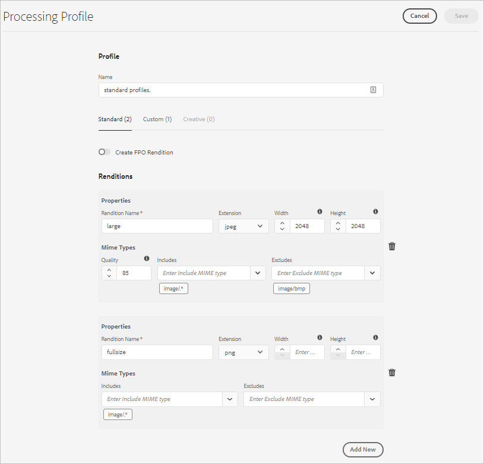

# Get started using asset microservices {#get-started-using-asset-microservices}

<!--

* Current capabilities of asset microservices offered. If workers have names then list the names and give a one-liner description. (The feature-set is limited for now and continues to grow. So will this article continue to be updated.)
* How to access the microservices. UI. API. Is extending possible right now?
* Detailed list of what file formats and what processing is supported by which workflows/workers process.
* How/where can admins check what's already configured and provisioned.
* How to create new config or request for new provisioning/purchase.

* [DO NOT COVER?] Exceptions or limitations or link back to lack of parity with AEM 6.5.

-->

Asset microservices provide a scalable and resilient processing of assets using cloud services, which are managed by Adobe for optimal handling of different asset types and processing options.

Asset processing is carried out based on configuration in **[!UICONTROL Processing Profiles]**, which provide a default set up, and allow the administrator to add more specific asset processing configuration. To allow for extensibility and full customization, asset processing allows for an optional configuration of post-processing workflows, which are then created and maintained by the administrator.

A high-level flow for asset processing in Experience Manager as a Cloud Service is presented below.

<!-- Proposed DRAFT diagram for asset microservices flow - see section "asset-microservices-flow.png (asset-microservices-configure-and-use.md)" in the PPTX deck

https://adobe-my.sharepoint.com/personal/gklebus_adobe_com/_layouts/15/guestaccess.aspx?guestaccesstoken=jexDC5ZnepXSt6dTPciH66TzckS1BPEfdaZuSgHugL8%3D&docid=2_1ec37f0bd4cc74354b4f481cd420e07fc&rev=1&e=CdgElS
-->

>[!NOTE]
>
> For customers updating from previous versions of Experience Manager - asset processing described in this section replaces the "DAM Update Asset" workflow model used for asset ingestion processing before. Most of the standard rendition generation and metadata-related steps are replaced by the asset microservices processing, and remaining steps, if any, can be replaced by the post-processing workflow configuration.

## Get started with asset processing {#get-started}

Asset processing with asset microservices is pre-configured with a default configuration, ensuring that the default renditions required by the system are available. It also ensure that metadata extraction and text extraction operations are available. Users can start uploading or updating assets immediately and basic processing is available by default.

For specific rendition generation or asset processing requirements, an AEM administrator can create additional [!UICONTROL Processing Profiles]. Users can assign one or more of the available profiles to specific folders to get additional processing done. Say for example, to generate web, mobile, and tablet specific renditions. The following video illustrates how to create and apply [!UICONTROL Processing Profiles] and how to access the created renditions.

>[!VIDEO](https://video.tv.adobe.com/v/29832?quality=9)

To change existing profile, see [configurations for asset microservices](#configure-asset-microservices).
To create custom processing profiles specific to your custom requirements, say to integrate with other systems, see [post-processing workflows](#post-processing-workflows).

## Configurations for asset microservices {#configure-asset-microservices}

To configure asset microservices, administrators can use configuration user interface under **[!UICONTROL Tools > Assets > Processing Profiles]**.

### Default configuration {#default-config}

With the default configuration, only the [!UICONTROL standard] processing profile is configured. It is a built-in one, and cannot be modified. It is always executed to ensure that all the processing required by the application is taking place.

The standard processing profile provides the following processing configuration:

* Standard thumbnails used by Asset user interface (48, 140, and 319 px)
* Large preview (web rendition - 1280 px)
* Metadata extraction
* Text extraction

### Supported file formats {#supported-file-formats}

Asset microservices provide support for a wide variety of file formats in terms of the ability to generate renditions or extract metadata. See [supported file formats](file-format-support.md) for the full list.

### Add additional processing profiles {#processing-profiles}

Additional processing profiles can be added using the **[!UICONTROL Create]** action.

Each processing profile configuration includes a list of renditions. For each rendition, you can specify the following:

* rendition name
* rendition format (JPEG, PNG, or GIF are supported)
* rendition width and height in pixels (if not specified, the full pixel size of the original is assumed)
* rendition quality (for JPEG) in percent
* Included and excluded MIME types define, which asset types the processing profile applies to

When a new processing profile is saved, it is added to the list of configured processing profiles. These processing profiles can then be applied to folders in the folder hierarchy to make them effective for asset uploads and assets done there.

#### Rendition width and height {#rendition-width-height}

Rendition width and height specification provides maximum sizes of the generated output image. Asset microservice tries to produce the largest possible rendition, which width and height is not bigger than the specified width and height, respectively. The aspect ratio is preserved, that is the same as the original.

An empty value means that asset processing assumes the pixel dimension of the original.

#### MIME type inclusion rules {#mime-type-inclusion-rules}

When an asset with a specific mime type is processed, the mime type is first checked against the excluded mime types value for the rendition specification. If it matches that list, this specific rendition is not generated for the asset ("blacklisting").

Otherwise, the mime type is checked against the included mime type, and if it matches the list, the rendition is generated ("whitelisting").

#### Special FPO rendition {#special-fpo-rendition}

Processing profile can include a special "FPO rendition", which is used when [Adobe Asset Link](https://helpx.adobe.com/enterprise/using/adobe-asset-link.html) is used with Adobe InDesign to place direct links to assets from Experience Manager into InDesign documents.

Please refer to Adobe Asset Link [documentation](https://helpx.adobe.com/enterprise/using/manage-assets-using-adobe-asset-link.html) to understand if you need to turn it on for your processing profile.

## Use asset microservices to process assets {#use-asset-microservices}

Once additional processing profiles are created, they need to be applied to specific folders for Experience Manager to use them in asset processing for assets uploaded or updated in these folders. The built-in, standard processing profile is always executed.

There are two ways to get processing profiles applied to folders:

* Administrators can select a processing profile definition in **[!UICONTROL Tools > Assets > Processing Profiles]**, and use **[!UICONTROL Apply Profile to Folder(s)]** action. It opens a content browser that allow you to navigate to specific folders, select them and confirm the application of the profile.
* Users can select a folder in the Assets user interface, use **[!UICONTROL Properties]** action to open folder properties screen, click on the **[!UICONTROL Processing Profiles]** tab, and in the drop-down, select the right processing profile for that folder. The choice will be save upon **[!UICONTROL Save & Close]** action.

>[!NOTE]
>
>Only one processing profile can be applied to a specific folder. If you need more renditions generated, you can add more rendition definitions to the processing profile.

After a processing profile is applied to a folder, all the new assets uploaded (or updated) in this folder or any of it's sub-folders are processed using the additional processing profile configured. This additional processing is in addition to the standard, default profile. If you apply multiple profiles to a folder, the uploaded or updated assets are processed using each of these profiles.

>[!NOTE]
>
>When assets are uploaded to a folder, Experience Manager checks the containing folder's properties for a processing profile. If none is applied, it goes up in the folder tree until it finds a processing profile applied, and uses it for the asset. That means that a processing profile applied to a folder works for the entire tree, but can be over-ridden with another profile applied to a sub-folder.

Users can check that the processing actually took place by opening a newly-uploaded asset for which processing has finished, opening asset preview, and clicking on the left-hand rail's **[!UICONTROL Renditions]** view. The specific renditions in the processing profile, for which the specific asset's type matches the mime type inclusion rules, should be visible and accessible.

*Figure: Example of two additional renditions generated by a processing profile applied to the parent folder*

## Post-processing workflows {#post-processing-workflows}

For situation, where additional processing of assets is required that cannot be achieved using the processing profiles, additional post-processing workflows can be added to the configuration. This allows for adding fully customized processing on top of the configurable processing using asset microservices.

Post-processing workflows, if configured, are automatically executed by AEM after the microservices processing finishes. There is no need to add workflow launchers manually to trigger them.

Examples include:

* custom workflow steps for processing assets, for example, Java code to generate renditions from proprietary file formats.
* integrations to add metadata or properties to assets from external systems, for example, product or process information.
* additional processing done by external services

Adding a post-processing workflow configuration to Experience Manager is comprised of the following steps:

* Creating one or more workflow models. We'll call them "post-processing workflow models," but they are regular AEM workflow models.
* Adding specific workflow steps to these models. These steps will be execution on the assets based on workflow model configuration.
* The last step of such a model must be the `DAM Update Asset Workflow Completed Process` step. This is required to ensure that AEM knows the processing has ended and the asset can be marked as processed ("New")
* Creating a configuration for the Custom Workflow Runner Service, which allows for configuring execution of a post-processing workflow model either by path (folder location) or regular expression

### Creating post-processing workflow models

Post-processing workflow models are regular AEM workflow models. Please create different ones if you need different processing for different repository locations or asset types.

Processing steps should be added based on needs. You can use any supported out-of-the-box steps available, as well as any custom-implemented workflow steps.

The last step of each of the post-processing workflows needs to be the `DAM Update Asset Workflow Completed Process`. This ensure that asset is properly marked as "processing completed."

### Configuring post-processing workflow execution

To configure the post-processing workflow models to be executed for assets uploaded or updated in the system after the asset microservices processing finishes, the Custom Workflow Runner service needs to be configured.

The Custom Workflow Runner service (`com.adobe.cq.dam.processor.nui.impl.workflow.CustomDamWorkflowRunnerImpl`) is an OSGi service and provides two options for configuration:

* Post-processing workflows by path (`postProcWorkflowsByPath`): Multiple workflow models can be listed, based on different repository paths. Paths and models should be separated by a colon. Simple repository paths are supported and should be mapped to a workflow model in the `/var` path. For example: `/content/dam/my-brand:/var/workflow/models/my-workflow`.
* Post-processing workflows by expression (`postProcWorkflowsByExpression`): Multiple workflow models can be listed, based on different regular expressions. Expressions and models should be separated by a colon. The regular expression should point to the Asset node directly, and not one of the renditions or files. For example: `/content/dam(/.*/)(marketing/seasonal)(/.*):/var/workflow/models/my-workflow`.

>[!NOTE]
>
>Configuration of the Custom Workflow Runner is a configuration of an OSGi service. See [deploy to Experience Manager](/help/implementing/deploying/overview.md) for information on how to deploy an OSGi configuration.
> OSGi web console, unlike in on-premise and managed services deployments of AEM, is not directly available in the cloud service deployments.

For details, on which of the standard workflow steps can be used in the post-processing workflow, please see [Workflow steps in post-processing workflow](developer-reference-material-apis.md#post-processing-workflows-steps) in the developer reference.
