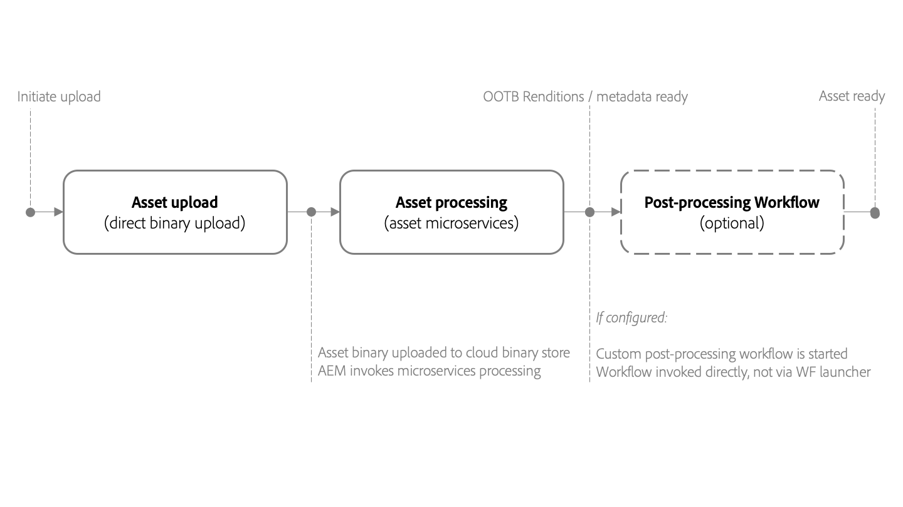
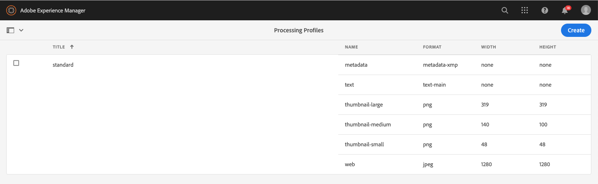
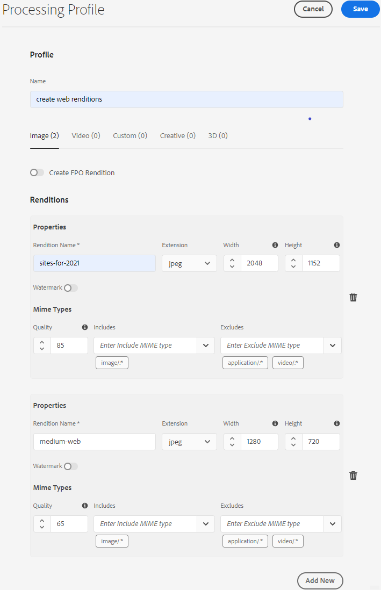
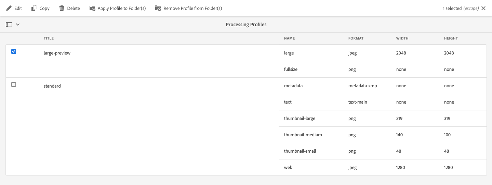
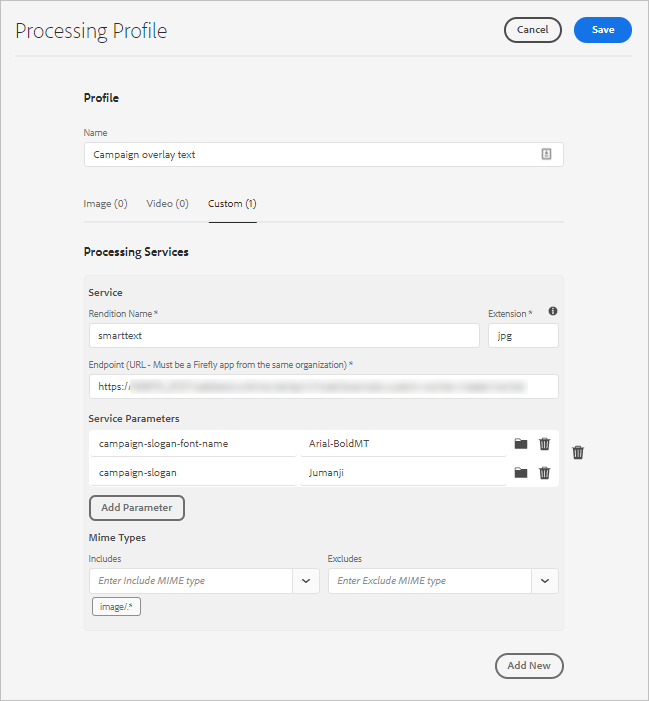
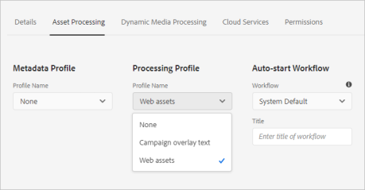
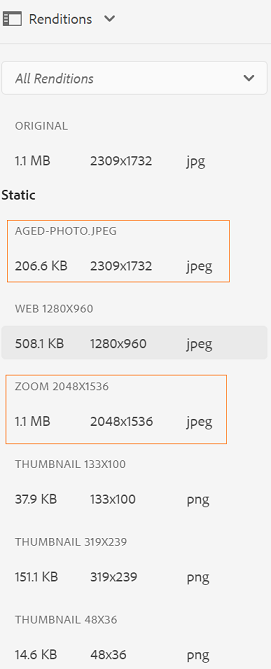
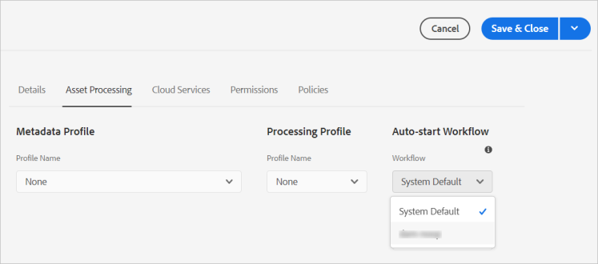

# Use asset microservices and processing profiles {#get-started-using-asset-microservices}

<table>
    <tr>
        <td>
            <i>New</i> <a href="/help/assets/dynamic-media/dm-prime-ultimate.md"><b>Dynamic Media Prime and Ultimate</b></a>
        </td>
        <td>
            <i>New</i> <a href="/help/assets/assets-ultimate-overview.md"><b>AEM Assets Ultimate</b></a>
        </td>
        <td>
            <i>New</i> <a href="/help/assets/integrate-aem-assets-edge-delivery-services.md"><b>AEM Assets integration with Edge Delivery Services</b></a>
        </td>
        <td>
            <i>New</i> <a href="/help/assets/aem-assets-view-ui-extensibility.md"><b>UI Extensibility</b></a>
        </td>
          <td>
            <i>New</i> <a href="/help/assets/dynamic-media/enable-dynamic-media-prime-and-ultimate.md"><b>Enable Dynamic Media Prime and Ultimate</b></a>
        </td>
    </tr>
    <tr>
        <td>
            <a href="/help/assets/search-best-practices.md"><b>Search Best Practices</b></a>
        </td>
        <td>
            <a href="/help/assets/metadata-best-practices.md"><b>Metadata Best Practices</b></a>
        </td>
        <td>
            <a href="/help/assets/product-overview.md"><b>Content Hub</b></a>
        </td>
        <td>
            <a href="/help/assets/dynamic-media-open-apis-overview.md"><b>Dynamic Media with OpenAPI capabilities</b></a>
        </td>
        <td>
            <a href="https://developer.adobe.com/experience-cloud/experience-manager-apis/"><b>AEM Assets developer documentation</b></a>
        </td>
    </tr>
</table>

Asset microservices provide for scalable and resilient processing of assets using cloud-native applications (also called workers). Adobe manages the services for optimal handling of different asset types and processing options.

Asset microservices lets you process a [broad range of file types](/help/assets/file-format-support.md) covering more formats out-of-the-box than what is possible with previous versions of [!DNL Experience Manager]. For example, thumbnail extraction of PSD and PSB formats is now possible but previously required third-party solutions such as [!DNL ImageMagick].

Asset processing depends on the configuration in **[!UICONTROL Processing Profiles]**. Experience Manager provides a basic default setup and lets administrators add more specific asset processing configuration. Administrators create, maintain, and modify the configurations of post-processing workflows, including optional customization. Customizing the workflows lets developers extend the default offering.

<!-- Proposed DRAFT diagram for asset microservices flow - see section "asset-microservices-flow.png (asset-microservices-configure-and-use.md)" in the PPTX deck

https://adobe-my.sharepoint.com/personal/gklebus_adobe_com/_layouts/15/guestaccess.aspx?guestaccesstoken=jexDC5ZnepXSt6dTPciH66TzckS1BPEfdaZuSgHugL8%3D&docid=2_1ec37f0bd4cc74354b4f481cd420e07fc&rev=1&e=CdgElS
-->

>[!NOTE]
>
>The asset processing described here replaces the `DAM Update Asset` workflow model that exists in the previous versions of [!DNL Experience Manager]. The asset microservices processing replaces most of the standard rendition generation and metadata-related steps, and the post-processing workflow configuration can replace the remaining steps, if any.

## Understand asset processing options {#get-started}

[!DNL Experience Manager] allows for the following levels of processing.

| Option | Description | Use cases covered |
|---|---|---|
|[Default configuration](#default-config)|It is available as is and cannot be modified. This configuration provides a basic rendition generation capability.| <ul> <li>Standard thumbnails used by [!DNL Assets] user interface (48, 140, and 319 pixels) </li> <li> Large preview (web rendition - 1280 pixels) </li><li> Metadata and text extraction.</li></ul> |
|[Custom configuration](#standard-config) | Configured by administrators by way of the user interface. More options are provided for rendition generation by extending the default option. Extend the out-of-the-box option to provide different formats and renditions. | <ul><li>FPO (For Placement Only) rendition. </li> <li>Change file format and resolution of images</li> <li> Conditionally apply to configured file types. </li> </ul> |
|[Custom profile](#custom-config) | Configured by administrators via user interface to use custom code through custom applications to call [Asset Compute Service](https://experienceleague.adobe.com/en/docs/asset-compute/using/introduction). Supports more complex requirements in a cloud-native and scalable method. | See [allowed use cases](#custom-config). |

<!-- To create custom processing profiles specific to your custom requirements, say to integrate with other systems, see [post-processing workflows](#post-processing-workflows).
-->

## Supported file formats {#supported-file-formats}

Asset microservices provide support for a wide variety of file formats to process, generate renditions, or extract metadata. See [supported file formats](file-format-support.md) for the full list of MIME types and the functionality supported for each type.

## Default configuration {#default-config}

Some defaults are pre-configured to ensure that the default renditions required in Experience Manager are available. The default configuration also ensures that metadata extraction and text extraction operations are available. Users can start uploading or updating assets immediately and basic processing is available by default.

With the default configuration, only the most basic processing profile is configured. Such a processing profile is not visible on the user interface and you cannot modify it. It always executes to process uploaded assets. Such a default processing profile ensures that the basic processing required by [!DNL Experience Manager] is completed on all assets.

<!-- 
-->

## Standard configuration {#standard-config}

[!DNL Experience Manager] provides capabilities to generate more specific renditions for common formats as per the user's needs. An administrator can create additional [!UICONTROL Processing Profiles] to facilitate such rendition creation. Users then assign one or more of the available profiles to specific folders to get the additional processing done. Say, for example, the additional processing can generate renditions for web, mobile, and tablet. The following video illustrates how to create and apply [!UICONTROL Processing Profiles] and how to access the created renditions.

* **Rendition width and height**: Rendition width and height specification provide maximum sizes of the generated output image. Asset microservices tries to produce the largest possible rendition, which width and height is not bigger than the specified width and height, respectively. The aspect ratio is preserved, that is the same as the original. An empty value means that asset processing assumes the pixel dimension of the original.

* **MIME type inclusion rules**: When an asset with a specific MIME type is processed, the MIME type is first checked against the excluded MIME types value for the rendition specification. If it matches that list, this specific rendition is not generated for the asset (blocked list). Otherwise, the MIME type is checked against the included MIME type, and if it matches the list, the rendition is generated (allowed list).

* **Special FPO rendition**: When placing large-sized assets from [!DNL Experience Manager] into [!DNL Adobe InDesign] documents, a creative professional waits for a substantial time after they [place an asset](https://helpx.adobe.com/indesign/using/placing-graphics.html). Meanwhile, the user is blocked from using [!DNL InDesign]. This interrupts creative flow and negatively impacts the user experience. Adobe enables temporarily placing small-sized renditions in [!DNL InDesign] documents to begin with, which can be replaced with full-resolution assets On-demand later. [!DNL Experience Manager] provides renditions that are used only for placement. These FPO renditions have a small file size but are of the same aspect ratio.

The processing profile can include an FPO (For Placement Only) rendition. See the [!DNL Adobe Asset Link] [documentation](https://helpx.adobe.com/enterprise/using/manage-assets-using-adobe-asset-link.html) to understand if you need to turn it on for your processing profile. For more information, see the [Adobe Asset Link complete documentation](https://helpx.adobe.com/enterprise/using/adobe-asset-link.html).

### Create a standard profile {#create-standard-profile}

1. Administrators access **[!UICONTROL Tools]** > **[!UICONTROL Assets]** > **[!UICONTROL Processing Profiles]**. Click **[!UICONTROL Create]**.
1. Provide a name that helps you uniquely identify the profile when applying to a folder.
1. To generate FPO renditions, on the **[!UICONTROL Image]** tab, enable **[!UICONTROL Create FPO Rendition]**. Input a **[!UICONTROL Quality]** value from 1&ndash;100.
1. To generate other renditions, click **[!UICONTROL Add New]** and provide the following information:

   * File name of each rendition.
   * File format (PNG, JPEG, GIF, or WebP) of each rendition.
   * Width and height in pixels of each renditions. If the values are not specified, the full pixel size of the original image is used.
   * Quality in percent of each JPEG and WebP rendition.
   * Included and excluded MIME types to define the applicability of a profile.

   

1. Click **[!UICONTROL Save]**.

<!-- TBD: Update the video link when a new video is available from Tech Marketing.

The following video demonstrates the usefulness and usage of standard profile.

>[!VIDEO](https://video.tv.adobe.com/v/29832?quality=9)
-->

<!-- This image was removed per cqdoc-15624, as requested by engineering.
  
 -->

## Custom profile and use cases {#custom-config}

The [!DNL Asset Compute Service] supports a variety of use cases, including default processing and processing Adobe-specific formats like Photoshop files. It also allows for implementing custom or organization-specific processing. The DAM Update Asset workflow customization required in the past is either handled automatically or by way of Processing Profiles configuration. If these processing options do not meet your business needs, Adobe recommends developing and using the [!DNL Asset Compute Service] to extend the default capabilities. For an overview, see [understand extensibility and when to use it](https://experienceleague.adobe.com/en/docs/asset-compute/using/extend/understand-extensibility).

>[!NOTE]
>
>Adobe recommends using a custom application only when the business requirements cannot be accomplished using the default configurations or the standard profile.

It can transform image, video, document, and other file formats into different renditions including thumbnails, extracted text and metadata, and archives.

Developers can use the [!DNL Asset Compute Service] to [create custom applications](https://experienceleague.adobe.com/en/docs/asset-compute/using/extend/develop-custom-application) for the supported use cases. [!DNL Experience Manager] can call these custom applications from the user interface by using custom profiles that administrators configure. [!DNL Asset Compute Service] supports the following use cases of invoking external services:

* Use [!DNL Adobe Photoshop]'s [ImageCutout API](https://developer.adobe.com/photoshop/photoshop-api-docs/) and save the result as a rendition.
* Call third-party systems to make changes, for example, a PIM system.
* Use the [!DNL Photoshop] API to generate a variety of renditions based on the Photoshop template.
* Use the [Adobe Lightroom API](https://developer.adobe.com/photoshop/photoshop-api-docs/) to optimize the ingested assets and save them as renditions.

>[!NOTE]
>
>You cannot edit the standard metadata using the custom applications. You can only modify custom metadata.

### Create a custom profile {#create-custom-profile}

1. Administrators access **[!UICONTROL Tools]** > **[!UICONTROL Assets]** > **[!UICONTROL Processing Profiles]** > **[!UICONTROL Create]**.
1. On the Processing Profile page, click the **[!UICONTROL Custom]** tab, then click **[!UICONTROL Add New]**. 
1. In the Name text field, type the desired file name of the rendition, then provide the following information.

   * File name of each rendition and a supported file extension.
   * [Endpoint URL of an App Builder custom app](https://experienceleague.adobe.com/en/docs/asset-compute/using/extend/deploy-custom-application). The app must be from the same organization as the Experience Manager account is.
   * Add Service Parameters to [pass extra information or parameters to the custom application](https://experienceleague.adobe.com/en/docs/asset-compute/using/extend/develop-custom-application#extend).
   * Included and excluded MIME types to limit the processing to a few specific file formats.

1. Near the upper-right corner of the page, click **[!UICONTROL Save]**.

The custom applications are headless [Project App Builder](https://developer.adobe.com/app-builder/docs/overview/) apps. Your custom application gets all the provided files if they are set up with a processing profile. The application must filter the files.

>[!CAUTION]
>
>If the App Builder app and [!DNL Experience Manager] account are not from the same organization, the integration does not work.

### An example of a custom profile {#custom-profile-example}

To illustrate custom profile's usage, let's consider a use case to apply some custom text to campaign images. You can create a processing profile that uses the Photoshop API to edit the images.

Asset Compute Service integration allows Experience Manager to pass these parameters to the custom application using the [!UICONTROL Service Parameters] field. The custom application then calls the Photoshop API and passes these values to the API. For example, you can pass font name, text color, text weight and text size to add the custom text to campaign images.

<!-- TBD: Check screenshot against the interface. -->

*Figure: Use the [!UICONTROL Service Parameters] field to pass added information to predefined parameters build into the custom application. In this example, when campaign images are uploaded, the images are updated with `Jumanji` text in `Arial-BoldMT` font.*

## Use processing profiles to process assets {#use-profiles}

Create and apply additional custom Processing Profiles to specific folders. This workflow allows Experience Manager to process assets that are uploaded to or updated in these folders. The default, in-built standard processing profile is always executed but is not visible on the user interface. If you add a custom profile, then both profiles are used to process the uploaded assets.

Apply processing profiles to folders using one of the following methods:

* Administrators can select a processing profile definition in **[!UICONTROL Tools]** > **[!UICONTROL Assets]** > **[!UICONTROL Processing Profiles]**, and use the **[!UICONTROL Apply Profile to Folders]** action. It opens a content browser that lets you navigate to specific folders and select them, then confirm the application of the profile.
* Users can select a folder in the Assets user interface and use the **[!UICONTROL Properties]** action to open the folder properties screen. On the **[!UICONTROL Asset Processing]** tab, they can select the appropriate processing profile for that folder from the [!UICONTROL Processing Profile] list. To save the changes, click **[!UICONTROL Save & Close]**.
  

* Users can select folders or specific assets in Assets user interface to apply a processing profile, then select  **[!UICONTROL Reprocess Assets]** option from the options available on the top.

>[!TIP]
>
>Only one processing profile can be applied to a folder. To generate more renditions, add more rendition definitions to the existing processing profile.

After a processing profile is applied to a folder, all the new assets uploaded (or updated) in this folder or any of its sub-folders are processed using the additional processing profile configured. This processing is in addition to the standard, default profile.

>[!NOTE]
>
>A processing profile applied to a folder works for the entire tree, but can be overridden with another profile applied to a sub-folder. When assets are uploaded to a folder, Experience Manager checks the containing folder's properties for a processing profile. If none is applied, a parent folder in the hierarchy is checked for a processing profile to apply.

To verify that assets are processed, preview the generated renditions in the [!UICONTROL Renditions] view in the left rail. Open the asset preview and open the left rail to access the **[!UICONTROL Renditions]** view. The specific renditions in the processing profile, for which the specific asset's type matches the MIME type inclusion rules, should be visible and accessible.

*Figure: Example of two additional renditions generated by a processing profile applied to the parent folder.*

## Post-processing workflows {#post-processing-workflows}

For a situation where additional processing of assets is required that cannot be achieved using the Processing Profiles, additional post-processing workflows can be added to the configuration. Post-processing lets you add completely customized processing on top of the configurable processing using asset microservices.

After the microservices processing finishes, [!DNL Experience Manager] automatically runs post-processing workflows, or [Auto-start workflows](https://experienceleague.adobe.com/en/docs/experience-manager-learn/assets/configuring/auto-start-workflows), if configured. There is no need to add workflow launchers manually to trigger the workflows. The examples include:

* Custom workflow steps to process assets.
* Integrations to add metadata or properties to assets from external systems, for example, product or process information.
* Additional processing is done by external services.

To add a post-processing workflow configuration to [!DNL Experience Manager], follow these steps:

* Create one or more workflow models. These custom models are called *post-processing workflow models* in this documentation. They are regular [!DNL Experience Manager] workflow models.
* Add the required workflow steps to these models. Review the steps from the default workflow and add all required default steps to the custom workflow. The steps are run on the assets based on a workflow model configuration. For example, if you want smart tagging to happen automatically upon asset upload, add the step to your custom post-processing workflow model.
* Add the [!UICONTROL DAM Update Asset Workflow Completed Process] step at the end. Adding this step ensures that Experience Manager knows when the processing ends and the asset can be marked as processed, that is *New* is displayed on the asset.
* Create a configuration for the Custom Workflow Runner Service that lets you configure execution of a post-processing workflow model either by a path (folder location) or by a regular expression.

For details about which standard workflow step can be used in the post-processing workflow, see [workflow steps in post-processing workflow](developer-reference-material-apis.md#post-processing-workflows-steps) in the developer reference.

### Create post-processing workflow models {#create-post-processing-workflow-models}

Post-processing workflow models are regular [!DNL Experience Manager] workflow models. Create different models if you need different processing for different repository locations or asset types.

The processing steps are added as required. You can use both the supported steps that are available, and any custom-implemented workflow steps.

Ensure that the last step of each post-processing workflows is `DAM Update Asset Workflow Completed Process`. The final step ensures that Experience Manager recognizes when asset processing is complete.

### Configure post-processing workflow execution {#configure-post-processing-workflow-execution}

After the asset microservices complete the processing of the uploaded assets, you can define a post-processing workflow to process the assets more. To configure post-processing using workflow models, you can do one of the following:

* [Apply a workflow model in the folder Properties](#apply-workflow-model-to-folder).
* [Configure the Custom Workflow Runner service](#configure-custom-workflow-runner-service).

#### Apply a workflow model to a folder {#apply-workflow-model-to-folder}

For typical post-processing use cases, consider using the method to apply a workflow to a folder. To apply a workflow model in the folder [!UICONTROL Properties], follow these steps:

1. Create a workflow model.
1. Select a folder, click **[!UICONTROL Properties]** from the toolbar, and then click the **[!UICONTROL Assets Processing]** tab.
1. Under **[!UICONTROL Auto-start Workflow]**, select the required workflow, provide a title of the workflow, and then save the changes.

   

#### Configure the Custom Workflow Runner Service {#configure-custom-workflow-runner-service}

You can configure the Custom Workflow Runner Service for the advanced configurations that cannot be readily fulfilled by applying a workflow to a folder. For example, a workflow that uses a regular expression. The Adobe CQ DAM Custom Workflow Runner (`com.adobe.cq.dam.processor.nui.impl.workflow.CustomDamWorkflowRunnerImpl`) is an OSGi service. It provides the following two options for configuration:

* Post-processing workflows by path (`postProcWorkflowsByPath`): Multiple workflow models can be listed, based on different repository paths. Separate paths and models using a colon. Simple repository paths are supported. Map them to a workflow model in the `/var` path. For example: `/content/dam/my-brand:/var/workflow/models/my-workflow`.
* Post-processing workflows by expression (`postProcWorkflowsByExpression`): Multiple workflow models can be listed, based on different regular expressions. Separate expressions and models with a colon. Point the regular expression to point to the Asset node directly, and not one of the renditions or files. For example: `/content/dam(/.*/)(marketing/seasonal)(/.*):/var/workflow/models/my-workflow`.

To know how to deploy an OSGi configuration, see [deploy to [!DNL Experience Manager]](/help/implementing/deploying/overview.md). 

#### Disable post-processing workflow execution

When post-processing is not needed, create and use an "empty" Workflow Model in the **Auto-start Workflow** selection.

##### Create the Disabled Auto-start Workflow Model

1. Navigate to **Tools** > **Workflow** > **Models**.
1. Click **Create** > **Create Model** form the top action bar.
1. Provide a title and name for the new Workflow Model, for example:
    * Title: Disable Auto-start Workflow
    * Name: disable-auto-start-workflow
1. Click **Done** to create the workflow model.
1. Select and edit the created Workflow Model
1. In the workflow model editor, click **Step 1** from the model definition and delete it.
1. From the side panel, click **Steps**.
1. Drag the **DAM Update Asset Workflow Completed** step into the model definition.
1. Click **Page Information** (next to the **Side Panel** toggle), and click **Open Properties**.
1. Under the Basic tab, click **Transient Workflow**.
1. From the top action bar, click **Save & Close**.
1. From the top action bar, click **Sync**.
1. Close the workflow model editor.

##### Apply the Disabled Auto-start Workflow Model

Follow the steps outlined in [apply a workflow model to a folder](#apply-workflow-model-to-folder) and set the **Disable Auto-start Workflow** as the **Auto-start Workflow** for folders that do not require post-processing of assets.

## Best practices and limitations {#best-practices-limitations-tips}

* Consider your needs for all types of renditions when designing workflows. If you do not foresee the need of a rendition in the future, remove its creation step from the workflow. Renditions cannot be deleted in bulk afterwards. Undesired renditions may take up large amounts of storage space after prolonged use of [!DNL Experience Manager]. For individual assets, you can remove renditions manually from the user interface. For multiple assets, you can either customize [!DNL Experience Manager] to delete specific renditions or delete the assets and upload them again.
* Currently, the support is limited to generating renditions. Generating new asset is not supported.
* Currently, the file size limit for metadata extraction is approximately 15 GB. When uploading very large assets, sometimes the metadata extraction operation fails.

**See also**

* [Translate Assets](translate-assets.md)
* [Assets HTTP API](mac-api-assets.md)
* [Assets supported file formats](file-format-support.md)
* [Search assets](search-assets.md)
* [Connected assets](use-assets-across-connected-assets-instances.md)
* [Asset reports](asset-reports.md)
* [Metadata schemas](metadata-schemas.md)
* [Download assets](download-assets-from-aem.md)
* [Manage metadata](manage-metadata.md)
* [Search facets](search-facets.md)
* [Manage collections](manage-collections.md)
* [Bulk metadata import](metadata-import-export.md)
* [Publish Assets to AEM and Dynamic Media](/help/assets/publish-assets-to-aem-and-dm.md)

>[!MORELIKETHIS]
>
>* [Introduction to Asset Compute Service](https://experienceleague.adobe.com/en/docs/asset-compute/using/introduction).
>* [Understand the extensibility and when to use it](https://experienceleague.adobe.com/en/docs/asset-compute/using/extend/understand-extensibility).
>* [How to create custom applications](https://experienceleague.adobe.com/en/docs/asset-compute/using/extend/develop-custom-application).
>* [Supported MIME types for various use cases](/help/assets/file-format-support.md).

<!-- TBD: 
* How/where can admins check what's already configured and provisioned.
* How/where to request for new provisioning/purchase.
-->
