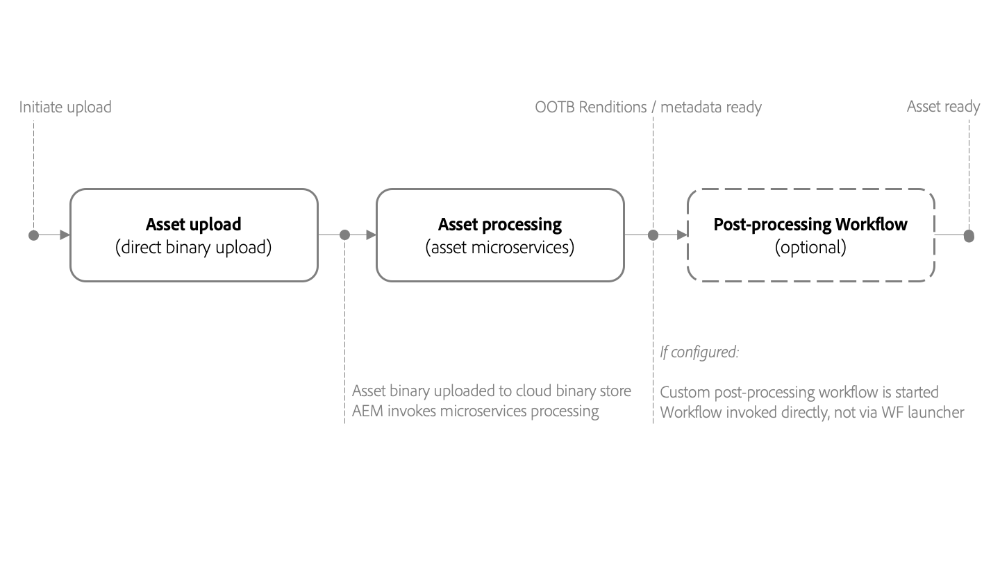
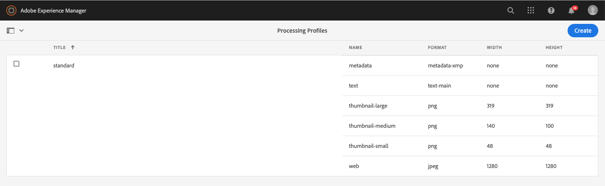
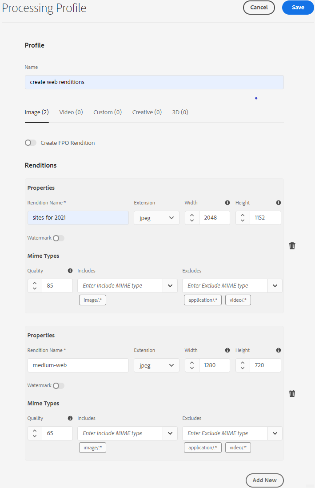
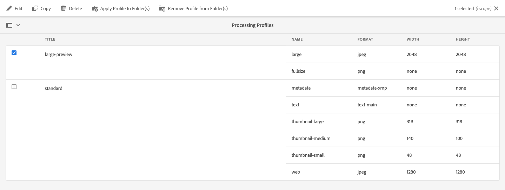
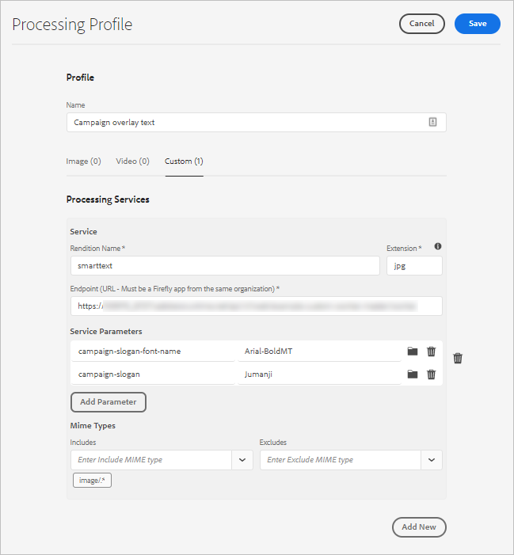
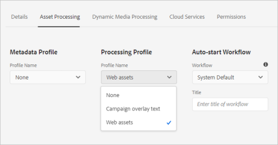
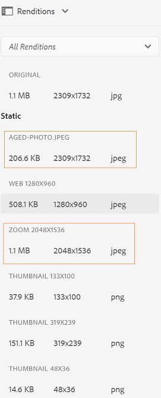
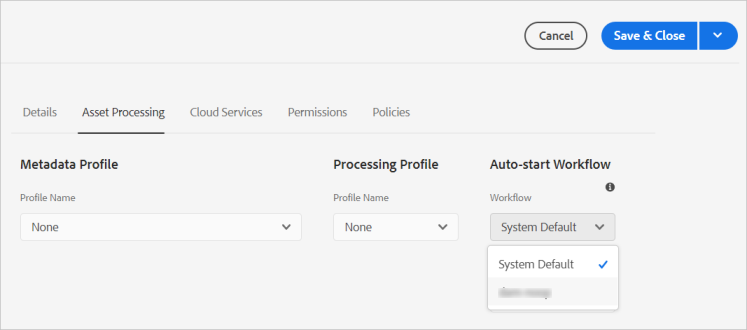

# Use asset microservices and processing profiles {#get-started-using-asset-microservices}

Asset microservices deliver **scalable and resilient asset processing** through **cloud-native applications**, also called **workers** — independently scaling processing units that run in the cloud to handle assets on demand. Because these workers scale elastically, processing capacity expands automatically during high-volume ingestion and contracts when idle, which improves both throughput and reliability compared with fixed-capacity processing.

Adobe manages these services directly, ensuring optimal handling of different asset types and processing options. This managed approach means administrators do not need to provision, tune, or maintain the underlying processing infrastructure, allowing teams to focus on asset configuration rather than operational overhead.

## Supported file types and formats

Asset microservices process a [broad range of file types](/help/assets/file-format-support.md), covering **more formats out-of-the-box than previous versions of [!DNL Experience Manager]**. This expanded native support removes the dependency on external tooling for many common workflows.

For example, **thumbnail extraction of PSD ([!DNL Photoshop] Document) and PSB ([!DNL Photoshop] Big) formats is now supported natively**. In previous versions this required third-party solutions such as **[!DNL ImageMagick]**. Handling these formats directly within the platform simplifies pipelines, reduces integration complexity, and eliminates the maintenance burden of external dependencies.

## Processing Profiles configuration

Asset processing is governed by the configuration defined in **[!UICONTROL Processing Profiles]**. [!DNL Experience Manager] ships with a basic default setup and lets administrators add more specific asset processing configuration to match their requirements.

<!--
 Proposed DRAFT diagram for asset microservices flow - see section "asset-microservices-flow.png (asset-microservices-configure-and-use.md)" in the PPTX deck

https://adobe-my.sharepoint.com/personal/gklebus_adobe_com/_layouts/15/guestaccess.aspx?guestaccesstoken=jexDC5ZnepXSt6dTPciH66TzckS1BPEfdaZuSgHugL8%3D&docid=2_1ec37f0bd4cc74354b4f481cd420e07fc&rev=1&e=CdgElS
-->

Administrators are responsible for the following configuration tasks:

- **Create** new post-processing workflow configurations for specific asset processing needs.
- **Maintain** existing configurations to keep processing behavior aligned with organizational standards.
- **Modify** configurations, including optional customization of post-processing workflows.

Developers can extend the default offering by customizing these workflows. Because the post-processing workflow is configurable, developers add processing steps beyond the standard capabilities, tailoring the pipeline to specialized use cases.

## Relationship to the legacy DAM Update Asset workflow

>[!NOTE]
>
>The asset processing described here replaces the `DAM Update Asset` workflow model that exists in the previous versions of [!DNL Experience Manager]. Asset microservices processing replaces most of the standard rendition generation and metadata-related steps. The post-processing workflow configuration can replace the remaining steps, if any, so that the complete processing pipeline is handled through the new model.

## Understand asset processing options {#get-started}

[!DNL Experience Manager] (AEM) supports three progressive levels of asset processing: **Default configuration**, **Custom configuration**, and **Custom profile**. These options form a tiered escalation model — beginning with ready-to-use defaults, extending to administrator-defined customizations, and culminating in fully programmable, cloud-native processing for advanced requirements. Selecting the right level depends on how much control your organization needs over rendition formats, resolutions, and file-type handling.

| Option | Description | Use cases covered |
|---|---|---|
|[Default configuration](#default-config)|This configuration is available out of the box and cannot be modified. It delivers essential, ready-to-use rendition generation, making it suitable for standard asset workflows without administrator setup.| <ul> <li>Standard thumbnails used by the [!DNL Assets] user interface (**48**, **140**, and **319** pixels) </li> <li> Large preview (**web rendition — 1280 pixels**) </li><li> **Metadata and text extraction**.</li></ul> |
|[Custom configuration](#standard-config) | Configured by administrators through the user interface. It extends the default option to provide additional rendition generation controls, enabling different formats and renditions beyond the out-of-the-box defaults. | <ul><li>**FPO (For Placement Only)** rendition. </li> <li>Change file format and resolution of images.</li> <li> Conditionally apply processing to configured file types. </li> </ul> |
|[Custom profile](#custom-config) | Configured by administrators via the user interface to run custom code through custom applications that call the [Asset Compute Service](https://experienceleague.adobe.com/en/docs/asset-compute/using/introduction), Adobe's service for programmatically processing assets. This supports more complex requirements in a cloud-native and scalable method, because processing runs on managed cloud infrastructure that scales with demand rather than on fixed local resources. | See [allowed use cases](#custom-config). |

<!--
 To create custom processing profiles specific to your custom requirements, say to integrate with other systems, see [post-processing workflows](#post-processing-workflows).
-->

## Supported file formats {#supported-file-formats}

Asset microservices provide support for an extensive range of image, document, video, and audio file formats. Across these supported formats, asset microservices deliver three core capabilities:

- **Process files** — Ingest and transform assets so they are ready for downstream use within the digital asset management workflow.
- **Generate renditions** — Produce alternate versions of an asset, such as resized thumbnails, previews, or format-converted copies. Renditions ensure that a single source asset can be delivered in the size, resolution, or format each channel requires.
- **Extract metadata** — Read embedded and technical metadata (for example, dimensions, color profile, or authoring details) directly from each file. This makes assets searchable, discoverable, and consistently cataloged.

The specific functionality available depends on the file type. Each supported format is identified by its **Multipurpose Internet Mail Extensions (MIME) type**, the standardized identifier that tells the system how a file should be interpreted and which processing operations apply to it.

For the complete list of supported MIME types and the functionality available for each type, see [supported file formats](file-format-support.md).

## Default configuration {#default-config}

[!DNL Experience Manager] ships with pre-configured defaults that immediately make the **default renditions** required by the platform available. Renditions are the alternate versions of an asset—such as previews, thumbnails, and web-optimized derivatives—that [!DNL Experience Manager] generates from an original upload. The default configuration also guarantees that core operations run automatically, so that:

- **Metadata extraction** captures descriptive information embedded in each uploaded asset.
- **Text extraction** pulls readable text content from supported file types.
- **Default renditions** are produced so assets are ready for use across [!DNL Experience Manager].

As a result, users can start uploading or updating assets immediately, and basic processing is available by default without any additional setup.

### The default processing profile

With the default configuration, [!DNL Experience Manager] applies only the most basic processing profile. A **processing profile** defines the set of operations—renditions, metadata handling, and text extraction—that [!DNL Experience Manager] performs on ingested assets. This default processing profile is not visible in the user interface, and you cannot modify it.

This default processing profile always executes to process uploaded assets, ensuring that the baseline processing required by [!DNL Experience Manager] is completed on every asset. Because it runs unconditionally, no asset enters the system without receiving the essential renditions and extraction operations [!DNL Experience Manager] depends on for search, preview, and delivery.

<!--
 
-->

## Standard configuration {#standard-config}

[!DNL Experience Manager] provides capabilities to generate more specific renditions for common formats as per the user's needs. An administrator can create additional [!UICONTROL Processing Profiles] to facilitate such rendition creation. Users then assign one or more of the available profiles to specific folders to get the additional processing done. For example, the additional processing can generate renditions for web, mobile, and tablet, ensuring that each asset is delivered at a size optimized for its target device and channel. [See this video to understand, how to create and apply [!UICONTROL Processing Profiles] and how to access the created renditions](https://experienceleague.adobe.com/en/docs/experience-manager-learn/assets/content-automation/creative-operations).

* **Rendition width and height**: The rendition width and height specification defines the maximum sizes of the generated output image. Asset microservices produces the largest possible rendition whose width and height do not exceed the specified values, respectively. The aspect ratio is preserved so that it remains the same as the original, which ensures the generated rendition is not distorted or stretched relative to the source asset. An empty value means that asset processing assumes the pixel dimension of the original.

* **MIME type inclusion rules**: The Multipurpose Internet Mail Extensions (MIME) type determines whether a rendition is generated for a given asset. When an asset with a specific MIME type is processed, the MIME type is first checked against the excluded MIME types value for the rendition specification. If it matches that list, this specific rendition is not generated for the asset (blocked list). Otherwise, the MIME type is checked against the included MIME type, and if it matches the list, the rendition is generated (allowed list).

* **Special FPO (For Placement Only) rendition**: When placing large-sized assets from [!DNL Experience Manager] into [!DNL Adobe InDesign] documents, a creative professional waits for a substantial time after they [place an asset](https://helpx.adobe.com/indesign/using/placing-graphics.html). Meanwhile, the creative professional is blocked from using [!DNL InDesign]. As a result, this interrupts creative flow and negatively impacts the user experience. To address this, Adobe enables temporarily placing small-sized renditions in [!DNL InDesign] documents to begin with, allowing the creative professional to resume work immediately; these placeholders can be replaced with full-resolution assets On-demand later. [!DNL Experience Manager] provides renditions that are used only for placement. These For Placement Only (FPO) renditions have a small file size but retain the same aspect ratio as the original, so layouts composed against them remain accurate when the full-resolution assets are swapped in.

The processing profile can include an FPO (For Placement Only) rendition. See the [!DNL Adobe Asset Link] [documentation](https://helpx.adobe.com/enterprise/using/manage-assets-using-adobe-asset-link.html) to understand if you need to turn it on for your processing profile. For more information, see the [Adobe Asset Link complete documentation](https://helpx.adobe.com/enterprise/using/adobe-asset-link.html).

### Create a standard profile {#create-standard-profile}

1. Administrators access **[!UICONTROL Tools]** > **[!UICONTROL Assets]** > **[!UICONTROL Processing Profiles]**. Click **[!UICONTROL Create]**.
1. Provide a descriptive name that helps administrators uniquely identify the profile when applying it to a folder, because the profile name is what determines how the profile is selected during folder assignment.
1. To generate FPO (For Placement Only) renditions—low-resolution placeholder versions of an image used for layout, previews, and reference before final high-resolution assets are available—open the **[!UICONTROL Image]** tab and enable **[!UICONTROL Create FPO Rendition]**. Input a **[!UICONTROL Quality]** value from 1&ndash;100, where a higher value produces a higher-quality FPO rendition.
1. To generate additional renditions—alternate versions of the original image derived at different sizes, formats, or quality levels—click **[!UICONTROL Add New]** and provide the following information:

   * **File name** of each rendition, used to identify the generated output.
   * **File format** of each rendition, selected from PNG, JPEG, GIF, or WebP.
   * **Width and height in pixels** of each rendition. If the width and height values are not specified, the full pixel size of the original image is used, which ensures the rendition retains the source image's native dimensions.
   * **Quality in percent** of each JPEG and WebP rendition, controlling the compression level and resulting file size for these formats.
   * **Included and excluded MIME (Multipurpose Internet Mail Extensions) types**, which define the applicability of a profile by specifying which asset types the rendition rules apply to and which are omitted.

   

1. Click **[!UICONTROL Save]** to store the profile and make it available for assignment to folders.

<!--
 TBD: Update the video link when a new video is available from Tech Marketing.

The following video demonstrates the usefulness and usage of standard profile.

>[!VIDEO](https://video.tv.adobe.com/v/29832?quality=9)
-->

<!--
 This image was removed per cqdoc-15624, as requested by engineering.
  
 -->

## Custom profile and use cases {#custom-config}

The **[!DNL Asset Compute Service]** supports a wide variety of use cases, including default processing and the processing of Adobe-specific formats such as [!DNL Photoshop] files. The service also enables implementing custom or organization-specific processing tailored to unique requirements. Customization that previously required the Digital Asset Management (DAM) Update Asset workflow is now either handled automatically or through **Processing Profiles** configuration. When these processing options do not meet specific business needs, Adobe recommends developing and deploying the **[!DNL Asset Compute Service]** to extend the default capabilities. For an overview, see [understand extensibility and when to use it](https://experienceleague.adobe.com/en/docs/asset-compute/using/extend/understand-extensibility).

>[!NOTE]
>
>Adobe recommends using a custom application only when the business requirements cannot be accomplished using the default configurations or the standard profile.

The **[!DNL Asset Compute Service]** transforms image, video, document, and other file formats into multiple renditions, including **thumbnails, extracted text and metadata, and archives**. This allows organizations to automatically generate the derivative assets they need for delivery, search, and downstream workflows.

Developers can use the **[!DNL Asset Compute Service]** to [create custom applications](https://experienceleague.adobe.com/en/docs/asset-compute/using/extend/develop-custom-application) for the supported use cases. [!DNL Experience Manager] calls these custom applications directly from the user interface by using **custom profiles** that administrators configure. As a result, custom processing becomes available to end users without manual intervention. The **[!DNL Asset Compute Service]** supports the following use cases for invoking external services:

* Use [!DNL Adobe Photoshop]'s [ImageCutout API](https://developer.adobe.com/photoshop/photoshop-api-docs/) to remove backgrounds or isolate subjects, and save the result as a rendition for reuse.
* Call third-party systems to make changes, for example, a **Product Information Management (PIM)** system, so that asset processing stays synchronized with external business data.
* Use the **[!DNL Photoshop] API** to generate a variety of renditions based on a [!DNL Photoshop] template, ensuring consistent, brand-aligned output at scale.
* Use the [Adobe Lightroom API](https://developer.adobe.com/photoshop/photoshop-api-docs/) to optimize the ingested assets and save them as renditions, improving visual quality automatically during ingestion.

>[!NOTE]
>
>You cannot edit the standard metadata using the custom applications. You can only modify custom metadata.

### Create a custom profile {#create-custom-profile}

A **custom Processing Profile** in Adobe [!DNL Experience Manager] lets administrators route assets to a **headless App Builder application** that generates one or more custom **renditions**. Follow these steps to create one:

1. Administrators access **[!UICONTROL Tools]** > **[!UICONTROL Assets]** > **[!UICONTROL Processing Profiles]** > **[!UICONTROL Create]**.
1. On the Processing Profile page, click the **[!UICONTROL Custom]** tab, then click **[!UICONTROL Add New]**.
1. In the Name text field, type the desired file name of the rendition, then provide the following information.

   * File name of each rendition and a **supported file extension**.
   * [**Endpoint URL** (Uniform Resource Locator) of an App Builder custom app](https://experienceleague.adobe.com/en/docs/asset-compute/using/extend/deploy-custom-application). The app must be from the **same organization** as the [!DNL Experience Manager] account.
   * Add **Service Parameters** to [pass extra information or parameters to the custom application](https://experienceleague.adobe.com/en/docs/asset-compute/using/extend/develop-custom-application#extend).
   * Included and excluded **MIME (Multipurpose Internet Mail Extensions) types** to limit the processing to a few specific file formats.

1. Near the upper-right corner of the page, click **[!UICONTROL Save]**.

The custom applications are **headless [Project App Builder](https://developer.adobe.com/app-builder/docs/overview/) apps** — meaning they run without a user interface and execute automatically as part of the asset processing pipeline. A custom application receives all files provided to it when the application is associated with a processing profile. The application must filter the files, because it processes every asset it is handed; filtering ensures that only the intended, relevant file formats are transformed and that unsupported or unwanted inputs are ignored.

>[!CAUTION]
>
>The App Builder app and the [!DNL Experience Manager] account **must belong to the same organization**. If they belong to different organizations, the integration fails and the custom processing does not run. This organizational match is required for the endpoint connection to be authorized.

### An example of a custom profile {#custom-profile-example}

A custom processing profile applies custom text to campaign images by using the Adobe **[!DNL Photoshop] API** to edit those images automatically. This example illustrates a common use case: adding branded or campaign-specific text overlays to assets as they are ingested into [!DNL Experience Manager].

#### How the custom profile passes parameters to the [!DNL Photoshop] API

The **[!DNL Asset Compute Service]** integration enables [!DNL Experience Manager] to pass these parameters to the custom application through the **[!UICONTROL Service Parameters]** field. The custom application then calls the **[!DNL Photoshop] API** and passes these values to the API. This ensures the imaging logic runs consistently every time an asset is processed, rather than requiring manual editing.

Through the **[!UICONTROL Service Parameters]** field, you can pass the following parameters to add custom text to campaign images:

- **Font name** — specifies the typeface applied to the overlaid text.
- **Text color** — defines the color of the applied text.
- **Text weight** — sets the boldness or thickness of the text.
- **Text size** — determines the dimensions of the rendered text.

<!-- TBD: Check screenshot against the interface. -->

*Figure: Use the [!UICONTROL Service Parameters] field to pass added information to predefined parameters built into the custom application. In this example, because the profile is applied on ingestion, uploading a campaign image automatically triggers the update, and the images are rendered with `Jumanji` text in the `Arial-BoldMT` font.*

## Use processing profiles to process assets {#use-profiles}

Create and apply additional custom Processing Profiles to specific folders. This workflow allows [!DNL Experience Manager] to process assets that are uploaded to or updated in these folders. The default, in-built standard processing profile is always executed but is not visible on the user interface. If you add a custom profile, then [!DNL Experience Manager] uses both profiles to process the uploaded assets. This ensures the standard default processing is always applied while your custom renditions are added on top.

### Methods to apply processing profiles to folders

Apply processing profiles to folders using any of the following three methods:

* Administrators can select a processing profile definition in **[!UICONTROL Tools]** > **[!UICONTROL Assets]** > **[!UICONTROL Processing Profiles]**, and use the **[!UICONTROL Apply Profile to Folders]** action. It opens a content browser that lets you navigate to specific folders and select them, then confirm the application of the profile.
* Users can select a folder in the [!DNL Assets] user interface and use the **[!UICONTROL Properties]** action to open the folder properties screen. On the **[!UICONTROL Asset Processing]** tab, the user can select the appropriate processing profile for that folder from the [!UICONTROL Processing Profile] list. To save the changes, click **[!UICONTROL Save & Close]**.

  

* Users can select folders or specific assets in [!DNL Assets] user interface to apply a processing profile, then select  **[!UICONTROL Reprocess Assets]** option from the options available on the top.

>[!TIP]
>
>**Only one processing profile can be applied to a folder.** To generate more renditions, add more rendition definitions to the existing processing profile.

After a processing profile is applied to a folder, all new assets uploaded (or updated) in that folder or any of its sub-folders are automatically processed using the additional configured processing profile. As a result, folder-level processing propagates down the entire folder tree. This processing is in addition to the standard, default profile.

>[!NOTE]
>
>A processing profile applied to a folder works for the entire tree, but can be overridden with another profile applied to a sub-folder. When assets are uploaded to a folder, [!DNL Experience Manager] checks the containing folder's properties for a processing profile. If none is applied, a parent folder in the hierarchy is checked for a processing profile to apply.

To verify that assets are processed, preview the generated renditions in the [!UICONTROL Renditions] view in the left rail. Open the asset preview and open the left rail to access the **[!UICONTROL Renditions]** view. The specific renditions in the processing profile, for which the specific asset's type matches the MIME type inclusion rules, are visible and accessible.

*Figure: Example of two additional renditions generated by a processing profile applied to the parent folder.*

## Post-processing workflows {#post-processing-workflows}

**Post-processing workflows** add completely customized asset processing on top of the configurable processing performed by asset microservices. Use them whenever additional processing of assets is required that **cannot** be achieved using Processing Profiles alone. By adding these workflows to the configuration, administrators extend [!DNL Experience Manager] beyond its standard processing capabilities to meet specialized requirements.

After the microservices processing finishes, [!DNL Experience Manager] **automatically** runs post-processing workflows, or [Auto-start workflows](https://experienceleague.adobe.com/en/docs/experience-manager-learn/assets/configuring/auto-start-workflows), if configured. Because [!DNL Experience Manager] triggers these workflows automatically upon completion of microservices processing, there is no need to add workflow launchers manually. Common examples include:

* **Custom workflow steps** to process assets.
* **Integrations** that add metadata or properties to assets from external systems—for example, product or process information.
* **Additional processing** performed by external services.

To add a post-processing workflow configuration to [!DNL Experience Manager], follow these steps:

1. **Create one or more workflow models.** These custom models are called *post-processing workflow models* in this documentation. They are regular [!DNL Experience Manager] workflow models.
2. **Add the required workflow steps to these models.** Review the steps from the default workflow and add all required default steps to the custom workflow. [!DNL Experience Manager] runs these steps on the assets based on the workflow model configuration. For example, to make smart tagging happen automatically upon asset upload, add the smart tagging step to your custom post-processing workflow model.
3. **Add the [!UICONTROL DAM Update Asset Workflow Completed Process] step at the end.** This step is essential: it signals to [!DNL Experience Manager] when processing ends so the asset can be marked as processed—that is, **New** is displayed on the asset. Without this final step, [!DNL Experience Manager] cannot reliably determine that processing has completed.
4. **Create a configuration for the Custom Workflow Runner Service.** This configuration lets administrators define the execution of a post-processing workflow model either by a path (folder location) or by a regular expression.

For details about which standard workflow step can be used in the post-processing workflow, see [workflow steps in post-processing workflow](developer-reference-material-apis.md#post-processing-workflows-steps) in the developer reference.

### Create Post-Processing Workflow Models in Adobe [!DNL Experience Manager] {#create-post-processing-workflow-models}

Post-processing workflow models are standard **Adobe [!DNL Experience Manager] (AEM)** workflow models used to process digital assets within the **Digital Asset Management (DAM)** repository. Create separate models when different processing is required for distinct repository locations or asset types, because tailoring a model to each scenario ensures that assets are handled according to their specific needs.

**Building the workflow:** Assemble each post-processing workflow from the processing steps that match your requirements. You can combine:

- **Supported (out-of-the-box) steps** that ship with [!DNL Experience Manager]
- **Custom-implemented workflow steps** built to meet specialized processing needs

**Key requirement — the final step:** The last step of every post-processing workflow must be **`DAM Update Asset Workflow Completed Process`**. This step signals completion to [!DNL Experience Manager]. As a result, [!DNL Experience Manager] recognizes when asset processing has finished and can transition the asset out of its in-progress state. Omitting this final step leaves the platform unable to detect that processing is complete, which can leave assets stuck in an unresolved workflow status.

### Configure post-processing workflow execution {#configure-post-processing-workflow-execution}

After the asset microservices complete the processing of the uploaded assets, you can define a post-processing workflow to apply additional transformations, enrichment, or custom operations to the assets. To configure post-processing using workflow models, use one of the following methods:

* [Apply a workflow model in the folder Properties](#apply-workflow-model-to-folder).
* [Configure the Custom Workflow Runner service](#configure-custom-workflow-runner-service).

#### Apply a workflow model to a folder {#apply-workflow-model-to-folder}

For typical post-processing use cases, apply a workflow directly to a folder. This is the simplest and most common approach. To apply a workflow model in the folder [!UICONTROL Properties], follow the below steps:

1. Create a workflow model.
1. Select a folder, click **[!UICONTROL Properties]** from the toolbar, and then click the **[!UICONTROL Assets Processing]** tab.
1. Under **[!UICONTROL Auto-start Workflow]**, select the required workflow, provide a title of the workflow, and then save the changes.

   

#### Configure the Custom Workflow Runner Service {#configure-custom-workflow-runner-service}

Configure the Custom Workflow Runner Service for advanced configurations that cannot be readily fulfilled by applying a workflow to a folder. For example, a workflow that uses a regular expression to selectively target specific asset paths. This service is useful because it lets you map different workflow models to different repository locations or naming patterns, which folder-level configuration alone cannot achieve. The Adobe CQ Digital Asset Management (DAM) Custom Workflow Runner (`com.adobe.cq.dam.processor.nui.impl.workflow.CustomDamWorkflowRunnerImpl`) is an OSGi (Open Service Gateway initiative) service. It provides the following two options for configuration:

* **Post-processing workflows by path** (`postProcWorkflowsByPath`): Multiple workflow models can be listed, based on different repository paths. Separate paths and models using a colon. Simple repository paths are supported. Map them to a workflow model in the `/var` path. For example: `/content/dam/my-brand:/var/workflow/models/my-workflow`.
* **Post-processing workflows by expression** (`postProcWorkflowsByExpression`): Multiple workflow models can be listed, based on different regular expressions. Separate expressions and models with a colon. Point the regular expression to the Asset node directly, and not one of the renditions or files. For example: `/content/dam(/.*/)(marketing/seasonal)(/.*):/var/workflow/models/my-workflow`.

To know how to deploy an OSGi configuration, see [deploy to [!DNL Experience Manager]](/help/implementing/deploying/overview.md).

#### Disable post-processing workflow execution

When post-processing is not needed, disable execution by creating and applying an "empty" Workflow Model in the **Auto-start Workflow** selection. This prevents unnecessary workflow processing on folders that do not require it.

##### Create the Disabled Auto-start Workflow Model

1. Navigate to **Tools** > **Workflow** > **Models**.
1. Click **Create** > **Create Model** from the top action bar.
1. Provide a title and name for the new Workflow Model, for example:
    * Title: Disable Auto-start Workflow
    * Name: disable-auto-start-workflow
1. Click **Done** to create the workflow model.
1. Select and edit the created Workflow Model.
1. In the workflow model editor, click **Step 1** from the model definition and delete it.
1. From the side panel, click **Steps**.
1. Drag the **DAM Update Asset Workflow Completed** step into the model definition.
1. Click **Page Information** (next to the **Side Panel** toggle), and click **Open Properties**.
1. Under the Basic tab, click **Transient Workflow**. A transient workflow does not persist its execution history in the repository, which reduces overhead and improves processing performance.
1. From the top action bar, click **Save & Close**.
1. From the top action bar, click **Sync**.
1. Close the workflow model editor.

##### Apply the Disabled Auto-start Workflow Model

Follow the steps outlined in [apply a workflow model to a folder](#apply-workflow-model-to-folder) and set the **Disable Auto-start Workflow** as the **Auto-start Workflow** for folders that do not require post-processing of assets.

## Best practices and limitations {#best-practices-limitations-tips}

**Best practices**

* Consider your needs for all types of renditions when designing workflows. If you do not foresee the need of a rendition in the future, remove its creation step from the workflow. **Renditions cannot be deleted in bulk afterwards**. Because unused renditions cannot be removed collectively, undesired renditions may accumulate and consume large amounts of storage space after prolonged use of Adobe [!DNL Experience Manager] (AEM). For individual assets, you can remove renditions manually from the user interface. For multiple assets, you can either customize [!DNL Experience Manager] to delete specific renditions or delete the assets and upload them again.

**Current limitations**

* Currently, the support is limited to generating renditions. **Generating new assets is not supported**.
* The file size limit for metadata extraction is **approximately 15 GB**. When uploading very large assets, the metadata extraction operation can fail for files that exceed this threshold.

**See also**

* [Translate [!DNL Assets]](/help/assets/translate-assets.md)
* [Assets HTTP API](/help/assets/mac-api-assets.md)
* [Assets supported file formats](/help/assets/file-format-support.md)
* [Search assets](/help/assets/search-assets.md)
* [Connected assets](/help/assets/use-assets-across-connected-assets-instances.md)
* [Asset reports](/help/assets/asset-reports.md)
* [Metadata schemas](/help/assets/metadata-schemas.md)
* [Download assets](/help/assets/download-assets-from-aem.md)
* [Manage metadata](/help/assets/manage-metadata.md)
* [Manage Dynamic Media templates](/help/assets/dynamic-media/manage-dynamic-media-templates.md)
* [Manage reports in [!DNL Assets] view](/help/assets/manage-reports-assets-view.md)
* [Search facets](/help/assets/search-facets.md)
* [Manage collections](/help/assets/manage-collections.md)
* [Bulk metadata import](/help/assets/metadata-import-export.md)
* [Publish [!DNL Assets] to AEM and Dynamic Media](/help/assets/publish-assets-to-aem-and-dm.md)

>[!MORELIKETHIS]
>
>* [Introduction to [!DNL Asset Compute Service]](https://experienceleague.adobe.com/en/docs/asset-compute/using/introduction).
>* [Understand the extensibility and when to use it](https://experienceleague.adobe.com/en/docs/asset-compute/using/extend/understand-extensibility).
>* [How to create custom applications](https://experienceleague.adobe.com/en/docs/asset-compute/using/extend/develop-custom-application).
>* [Supported MIME types for various use cases](/help/assets/file-format-support.md).

<!--
 TBD: 
* How/where can admins check what's already configured and provisioned.
* How/where to request for new provisioning/purchase.
-->
