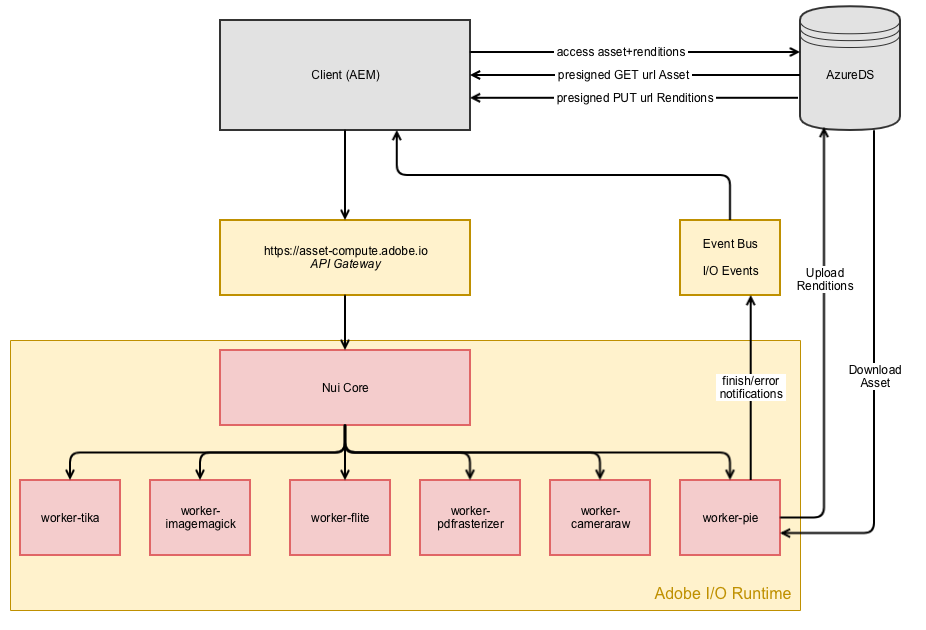

# Asset microservices overview of asset ingestion and processing {#asset-microservices-overview}

<!--
First half of content at https://git.corp.adobe.com/aklimets/project-nui/blob/master/docs/Project-Nui-Asset-Compute-Service.md is useful for this article.
-->

Adobe Experience Manager as a Cloud Service provides a cloud-native way of levering AEM applications and capabilities. One of the key elements of this new architecture is asset ingestion and processing, powered by Asset Microservices.

Asset microservices provide a scalable, resilient processing of assets using cloud services provided by Adobe for optimal handling of different asset types. Key benefits include:

* Scalable architecture that allows for resource-intensive asset processing
* Efficient indexing and text extractions that does not impact the performance of your AEM environments.
* Minimize the need for workflows to handle asset processing in the AEM environment, freeing up resources and minimizing load on AEM
* Improved resilience of asset processing, as potential issues handling problematic files (e.g., corrupted files, extremely large ones) won't impact the AEM environment
* Simplified configuration of asset processing for the administrator in AEM Tools UI
* Assets processing setup managed and maintained by Adobe to provide best known configuration for handling renditions, metadata, and text extraction for various file types
* Ability to configure post-processing workflow to add customer-specific actions and integrations

Asset microservices help to avoid the need for third-party rendering tools (like ImageMagick), and greatly simplify configuration of the system, while providing good results for common file types out of the box.

## High-level architecture

A high-level architecture diagram depicts the key elements of asset ingestion and processing.

<!-- Proposed DRAFT diagram for asset microservices overview - see section "Asset processing - high-level diagram" in the PPTX deck

https://adobe-my.sharepoint.com/personal/gklebus_adobe_com/_layouts/15/guestaccess.aspx?guestaccesstoken=jexDC5ZnepXSt6dTPciH66TzckS1BPEfdaZuSgHugL8%3D&docid=2_1ec37f0bd4cc74354b4f481cd420e07fc&rev=1&e=CdgElS
-->

Key steps of the ingestion and processing using asset microservices include:

* Clients (e.g, web browser, desktop clients like Adobe Asset Link) send an upload request to AEM and start uploading the binary directly to the binary cloud storage. 
* When the direct binary upload completes, the client notifies AEM
* AEM sends a request for procesing the assets to asset microservices. The request content depends on Processing Profiles configuration in AEM that specify, which renditions should be generated
* Assets microservices backend receives the request, dispatches it to one or more  microservices based on the request. Each microservice can access the original binary directly from the binary cloud store
* Results of the processing (like renditions) are stored in the Binary Cloud Storage
* AEM is notified that the processing is complete along with direct pointers to the generated binaries (renditions), which are then available in AEM for the uploaded asset

This is the basic flow of asset ingestion and processing. If configured, AEM can also start customer's workflow model to do post-processing of the asset - e.g., to execute some customized steps that are specific to customer envrionment, like fetching information from customer's enterprise systems to add to asset properties.

The ingestion and processing flow shows a few key concepts leveraged by the asset microservices architecture for AEM:

* **Direct Binary Access** - assets are transported (and uploaded) to the Cloud Binary Store once, and then AEM, asset microservices, and finally clients get direct access to them to carry out their work. This minimizes the load on networks and duplication of binaries stored
* **Externalized processing** - processing of assets is done outside of AEM environment, and saves its resources (CPU, memory) for providing key Digital Asset Management functionalities and supporting interactive work with system end users

<!-- GK: The diagram below is way too technical and uses internal project names. -->

*Figure: Data flow diagram for asset microservices*

>[!MORELIKETHIS]
>
>[Supported file formats](file-format-support.md)
