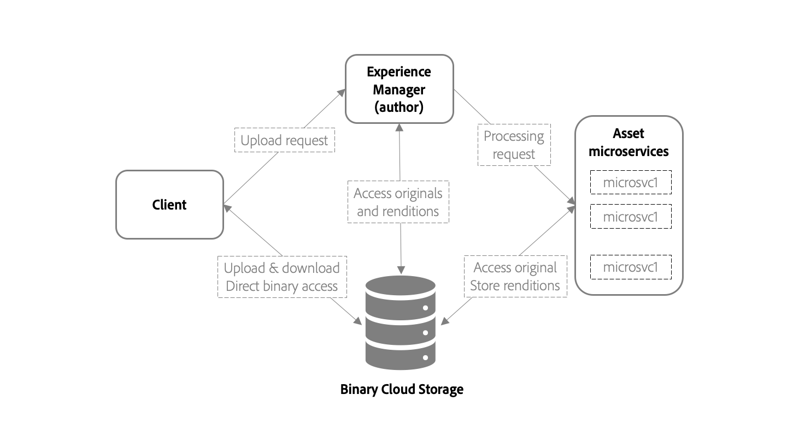

# Overview of asset ingestion and processing with asset microservices {#asset-microservices-overview}

| [Search Best Practices](/help/assets/search-best-practices.md) |[Metadata Best Practices](/help/assets/metadata-best-practices.md)|[Content Hub](/help/assets/product-overview.md)|[Dynamic Media with OpenAPI capabilities](/help/assets/dynamic-media-open-apis-overview.md)|[AEM Assets developer documentation](https://developer.adobe.com/experience-cloud/experience-manager-apis/)|
| ------------- | --------------------------- |---------|----|-----|

Adobe Experience Manager as a [!DNL Cloud Service] provides a cloud-native method to use Experience Manager applications and capabilities. One of the key elements of this new architecture is asset ingestion and processing, powered by asset microservices. Asset microservices provide a scalable and resilient processing of assets using cloud services. Adobe manages the cloud services for optimal handling of different asset types and processing options. The key benefits of cloud-native asset microservices are:

* Scalable architecture that allows for seamless processing for resource-intensive operations.
* Efficient indexing and text extractions that does not impact the performance of your Experience Manager environments.
* Minimize the need for workflows to handle asset processing in the Experience Manager environment. This frees up resources, minimizes load on Experience Manager, and provides scalability.
* Improved resilience of asset processing. Potential issues when handling atypical files, such as corrupted files or extremely large files, do not impact the deployment's performance anymore.
* Simplified configuration of asset processing for the administrators.
* Assets processing setup is managed and maintained by Adobe to provide best known configuration for handling renditions, metadata, and text extraction for various file types
* Native Adobe file processing services are used where applicable, providing high-fidelity output and [efficient handling of Adobe proprietary formats](file-format-support.md).
* Ability to configure post-processing workflow to add user-specific actions and integrations.

Asset microservices help to avoid the need for third-party rendering tools and methods (like [!DNL ImageMagick] and FFmpeg transcoding) and simplify configurations, while providing basic functionality for the common file formats by default.

## High-level architecture {#asset-microservices-architecture}

A high-level architecture diagram depicts the key elements of asset ingestion and processing and flow of assets across the system.

<!-- Proposed DRAFT diagram for asset microservices overview - see section "Asset processing - high-level diagram" in the PPTX deck

https://adobe-my.sharepoint.com/personal/gklebus_adobe_com/_layouts/15/guestaccess.aspx?guestaccesstoken=jexDC5ZnepXSt6dTPciH66TzckS1BPEfdaZuSgHugL8%3D&docid=2_1ec37f0bd4cc74354b4f481cd420e07fc&rev=1&e=CdgElS
-->

The key steps of the ingestion and processing using asset microservices are:

* Clients, such as web browsers or Adobe Asset Link, send an upload request to [!DNL Experience Manager] and start uploading the binary directly to the binary cloud storage.
* When the direct binary upload completes, the client notifies [!DNL Experience Manager].
* [!DNL Experience Manager] sends a processing request to asset microservices. The request contents depends on the processing profiles configuration in [!DNL Experience Manager] that specify, which renditions to generate.
* Asset microservices back-end receives the request, dispatches it to one or more microservices based on the request. Each microservice accesses the original binary directly from the binary cloud store.
* Results of the processing, such as renditions, are stored in the binary cloud storage.
* Experience Manager is notified that the processing is complete along with direct pointers to the generated binaries (renditions). The generated renditions are available in [!DNL Experience Manager] for the uploaded asset.

This is the basic flow of asset ingestion and processing. If configured, Experience Manager can also start custom workflow model to do post-processing of the asset. For example, execute customized steps that are specific to your environment, such as fetch information from an enterprise system and add to asset properties.

The ingestion and processing flow are key concepts of the asset microservices architecture for Experience Manager.

* **Direct binary access**: Assets are transported (and uploaded) to the Cloud Binary Store once configured for Experience Manager environments, and then [!DNL Experience Manager], asset microservices, and finally clients get direct access to them to carry out their work. This minimizes the load on networks and duplication of binaries stored
* **Externalized processing**: Processing of assets is done outside of [!DNL Experience Manager] environment, and saves its resources (CPU, memory) for providing key Digital Asset Management (DAM) functionalities and supporting interactive work with the system for end users

## Asset upload with direct binary access {#asset-upload-with-direct-binary-access}

Experience Manager clients, which are a part of product offering, all support upload with direct binary access by default. These include upload using web interface, Adobe Asset Link, and [!DNL Experience Manager] desktop app.

You can use custom upload tools, which work directly with [!DNL Experience Manager] HTTP APIs. You can use these APIs directly, or use and extend the following open-source projects that implement the upload protocol:

* [Open-source upload library](https://github.com/adobe/aem-upload)
* [Open-source command-line tool](https://github.com/adobe/aio-cli-plugin-aem)

For more information, see [upload assets](add-assets.md).

## Add custom asset post-processing {#add-custom-asset-post-processing}

While most customers should get all their asset processing needs from the configurable asset microservices, some might need additional asset processing. This is especially true if assets need to be processed based on information coming from other systems via integrations. In cases like that, custom post-processing workflows can be used.

Post-processing workflows are regular [!DNL Experience Manager] workflow models, created and managed in [!DNL Experience Manager] Workflow editor. Customers can configure the workflows to carry out additional processing steps on an asset, including using available out-of-the-box workflow steps and custom workflows.

Adobe Experience Manager can be configured to automatically trigger the post-processing workflows after asset processing completes.

<!-- TBD asgupta, Engg: Create some asset-microservices-data-flow-diagram.
-->

**See also**

* [Translate Assets](translate-assets.md)
* [Assets HTTP API](mac-api-assets.md)
* [Assets supported file formats](file-format-support.md)
* [Search assets](search-assets.md)
* [Connected assets](use-assets-across-connected-assets-instances.md)
* [Asset reports](asset-reports.md)
* [Metadata schemas](metadata-schemas.md)
* [Download assets](download-assets-from-aem.md)
* [Manage metadata](manage-metadata.md)
* [Search facets](search-facets.md)
* [Manage collections](manage-collections.md)
* [Bulk metadata import](metadata-import-export.md)
* [Publish Assets to AEM and Dynamic Media](/help/assets/publish-assets-to-aem-and-dm.md)

>[!MORELIKETHIS]
>
>* [Get started using asset microservices](asset-microservices-configure-and-use.md)
>* [Supported file formats](file-format-support.md)
>* [Adobe Asset Link](https://helpx.adobe.com/enterprise/using/adobe-asset-link.html)
>* [[!DNL Experience Manager] desktop app](https://experienceleague.adobe.com/docs/experience-manager-desktop-app/using/introduction.html)
>* [Apache Oak documentation on direct binary access](https://jackrabbit.apache.org/oak/docs/features/direct-binary-access.html)
