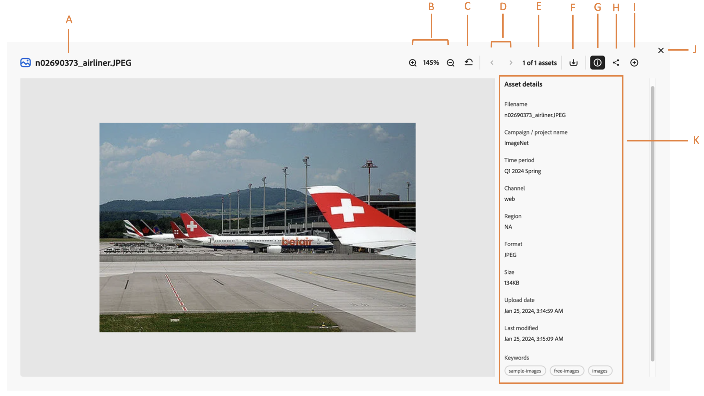

# Preview asset and its properties in Content Hub {#asset-properties}

<table>
    <tr>
        <td>
            <i>New</i> <a href="/help/assets/dynamic-media/dm-prime-ultimate.md"><b>Dynamic Media Prime and Ultimate</b></a>
        </td>
        <td>
            <i>New</i> <a href="/help/assets/assets-ultimate-overview.md"><b>AEM Assets Ultimate</b></a>
        </td>
        <td>
            <i>New</i> <a href="/help/assets/integrate-aem-assets-edge-delivery-services.md"><b>AEM Assets integration with Edge Delivery Services</b></a>
        </td>
        <td>
            <i>New</i> <a href="/help/assets/aem-assets-view-ui-extensibility.md"><b>UI Extensibility</b></a>
        </td>
          <td>
            <i>New</i> <a href="/help/assets/dynamic-media/enable-dynamic-media-prime-and-ultimate.md"><b>Enable Dynamic Media Prime and Ultimate</b></a>
        </td>
    </tr>
    <tr>
        <td>
            <a href="/help/assets/search-best-practices.md"><b>Search Best Practices</b></a>
        </td>
        <td>
            <a href="/help/assets/metadata-best-practices.md"><b>Metadata Best Practices</b></a>
        </td>
        <td>
            <a href="/help/assets/product-overview.md"><b>Content Hub</b></a>
        </td>
        <td>
            <a href="/help/assets/dynamic-media-open-apis-overview.md"><b>Dynamic Media with OpenAPI capabilities</b></a>
        </td>
        <td>
            <a href="https://developer.adobe.com/experience-cloud/experience-manager-apis/"><b>AEM Assets developer documentation</b></a>
        </td>
    </tr>
</table>

>[!AVAILABILITY]
>
>Content Hub guide is now available in PDF format. Download the entire guide and use Adobe Acrobat AI Assistant to answer your queries. 
>
>[!BADGE Content Hub Guide PDF]{type=Informative url="https://helpx.adobe.com/content/dam/help/en/experience-manager/aem-assets/content-hub.pdf"}

[!DNL The Content Hub] allows you to view information about the asset which is critical for efficient asset distribution. It is the collection of all the data available for an asset.

Viewing asset preview and its properties help you further categorize assets and is helpful as the amount of digital information grows. It is possible to manage a few hundred files based on just the filenames, thumbnails, and memory. However, this approach is not scalable when the number of people involved, and the number of managed assets increase. In addition, the value of a digital asset grows, as the asset becomes:

* More accessible - systems and users can find it easily.
* Easier to act on - you have full information on assets' visuals and related information, to be able to act on them faster and with more trust.
* Complete - asset carries more information and context.

## Prerequisites {#prerequisites}

[Content Hub users](deploy-content-hub.md#onboard-content-hub-users) can perform actions mentioned in this article.

## Preview asset and its properties {#properties-ui}

Before you use, share, or download an asset, you can view it more closely. The preview feature lets you view not just the images but a few other supported asset types as well. You can not only view the asset but also view its detailed information and take other actions. To view information of an asset, navigate to the asset or [search](search-assets.md) the asset and then click the asset to open its properties. The following figure demonstrates the fields available on an asset properties page: 

* **A:** Title of an asset 
* **B:** Percentage of zoom or preview asset more closely by zooming in or out 
* **C:** Undo zoom to the previously selected percentage 
* **D:** Proceed to previous or next asset 
* **E:** Assets count
* **F:** Download the asset 
* **G:** Edit asset using [!DNL Adobe Express]
* **H:** Collapse or preview information of an asset 
* **I:** Share the asset 
* **J:** Add asset to [!DNL Collection] 
* **K:** Close preview screen
* **L:** Information of an asset which includes title, format, size, resolution, tags, color tags, and smart tags. 

## Supported asset formats {#supported-formats}

[!DNL Content Hub] supports all asset types and formats that the underlying [!DNL Assets] repository supports. The following table lists key file formats in [!DNL the Content Hub], which provide additional support for previewing assets visually:

<table> 
    <tbody>
     <tr>
      <th><strong>File type</strong></th>
      <th><strong>Supported formats</strong></th>
     </tr>
     <tr>
      <td>Image</td>
      <td>
        <ul>
            <li>[!UICONTROL JPEG]</li> 
            <li>[!UICONTROL PNG]</li> 
            <li>[!UICONTROL SVG]</li>
        </ul>
      </td>
     </tr>
     <tr>
      <td>Video</td>
      <td>
        <ul>
            <li>[!UICONTROL Quicktime]</li>  
            <li>[!UICONTROL MP4]</li> 
        </ul>
      </td>
     </tr>
      <tr>
      <td>Document</td>
      <td>
        <ul>
            <li>[!UICONTROL txt] (Plain)</li>  
            <li>[!UICONTROL Doc/Docx]</li> 
            <li>[!UICONTROL XML]</li>
        </ul>
      </td>
     </tr>
     <tr>
      <td>Print media</td>
      <td>
        <ul>
            <li>[!UICONTROL PDF]</li>  
        </ul>
      </td>
     </tr>  
    </tbody>
   </table>

### Derived properties {#derived-properties}

Some properties for assets shown in [!DNL Content Hub] are derived, or generated automatically, when assets are uploaded to [!DNL Assets] and then approved for availability on [!DNL Content Hub]. The following is a list of some of them:

* **Size:** Size represents the size of the asset binary stored in the underlying repository. 

<!--* **Tags:** Tags help you categorize assets that can be browsed and searched more efficiently. Tagging helps in propagating the appropriate taxonomy to other users and workflows. -->

* **Smart Tags:** [!DNL The Content Hub] uses Adobe Sensei's smart content services to train assets using recognition algorithm on the tags-based structure. This content intelligence is then used to apply relevant tags on a different set of assets. Smart Tags increase the content velocity of your projects by helping that you find relevant assets quickly. The smart tags are an example of asset information that is not contained in the image. [!DNL Experience Manager Assets] automatically applies smart tags to assets, by default. 

* **Color Tags:** [Color tags](#https://experienceleague.adobe.com/docs/experience-manager-cloud-service/content/assets/manage/color-tag-images.html?lang=en) help you recognize an asset using colors that are automatically identified in an asset using Adobe's Sensei AI capabilities.

* Upload date

* Uploaded by

* Last modified

* Last modified by

There are also properties that are specified while adding assets to Content Hub. For more information, see [Add brand approved assets to Content Hub](upload-brand-approved-assets.md). Those properties are also displayed on the asset properties page.

Administrators can also configure the properties, which are displayed for each asset:

* In the asset preview UI: see [Configure Content Hub user interface](configure-content-hub-ui-options.md#configure-asset-details-content-hub).
* On asset cards in search results or collections: see [Configure Content Hub user interface](configure-content-hub-ui-options.md#asset-card).

<!--

### Date range {#date-range} 

The date range allows you to select dates you want to see the assets. You can customize date range by choosing the start and end dates. 

-->
