# Asset reports {#asset-reports}

| Version | Article link |
| -------- | ---------------------------- |
| AEM 6.5  |    [Click here](https://experienceleague.adobe.com/docs/experience-manager-65/assets/administer/asset-reports.html?lang=en)                  |
| AEM as a Cloud Service     | This article         |

Asset reporting lets you assess the utility of your [!DNL Adobe Experience Manager Assets] deployment. With [!DNL Assets], you can generate various reports for your digital assets. The reports provide useful information about your system's usage, how users interact with assets, and which assets are <!-- downloaded and --> shared.

Use the information in the reports to derive key success metrics to measure the adoption of [!DNL Assets] within your enterprise and by customers.

The [!DNL Assets] reporting framework uses [!DNL Sling] jobs asynchronously to process report requests in an ordered manner. It is scalable for large repositories. Asynchronous report processing increases the efficiency and speed with which reports are generated.

The report management interface is intuitive and includes fine-grained options and controls to access archived reports and view report run statuses (success, failed, and queued).

When a report is generated, you are notified via <!-- through an email (optional) and --> an inbox notification. You can view, download, or delete a report from the report listing page, where all the previously generated reports are displayed.

AEM Assets provides several distinct reporting mechanisms for different purposes. Confusing one for another or misconfiguring the permissions needed to run them is the most common source of **My report is empty or stuck or missing** error types.

[!DNL Experience Manager Assets] generates the following standard reports for you:

* Upload
* Download
* Expiration
* Modification
* Publish
* [!DNL Brand Portal] publish
* Disk Usage
* Files
* Link Share

## Report types {#report-types} 

The table below describes the available report types and what each report measures.

| Report or tool|What it measures| Description|
|---|---|---|
| Upload or download (expiration, activity) reports under **[!UICONTROL Tools]** > **[!UICONTROL Assets]** > **[!UICONTROL Reports]**|Event-based: only assets uploaded or downloaded by you within the selected date range.|Assets created by the system or service processes (for example, a `contentbackflow-import-service` integration) are not included, even if they exist in the target folder, the report is not a folder inventory, it is a log of the upload or download events.|
| Disk usage report|File count and total storage size in megabytes for a folder and its subfolders.|This is useful for license or cost allocation accounting across teams sharing a Digital Asset Management (DAM).|
| Publish or files report with the **[!UICONTROL References]** column|Reference counts per asset, so you can identify high-usage assets ahead of a bulk restructuring.|AEM does not store a **date this asset started being used** flag. To find the oldest asset in a tree, generate a **Files** report with the widest possible date range and sort or filter on the creation date instead.|
| DAM **Export Metadata** feature|A full metadata dump for the selected assets.|Use this instead of the **Reports** tool when you need every metadata property rather than a curated column set.|
| Dynamic Media delivery report (**[!UICONTROL Assets View]** UI)|Per-asset hit counts or delivery volume for Dynamic Media (Scene7) served assets over a date range.|Covers the Dynamic Media URLs only.|
| Adobe analytics through the experience platform tags in Dynamic Media viewers|User interactions, click tracking, traffic sources, geographic data.|It is required for anything beyond simple hit counts, and is required for assets delivered through direct `publish` URLs rather than Dynamic Media. Publish-URL traffic is not visible in any AEM Assets report.|

Dynamic Media license billing is based on the aggregated page views or visits, and not a per-operation (transcode or crop or download) breakdown. The DM Delivery Report and CDN or asset reports do not natively split usage by the operation type, so do not expect an operation-level cost report out of the box.

### Permissions required to generate and use reports {#permissions-required-to-generate-and-use-reports}

* Asset reports (**[!UICONTROL Tools]** > **[!UICONTROL Assets]** > **[!UICONTROL Reports]**) are restricted with the administrator product profile at the IMS level. This is by design, there is no configuration or alternate role that grants non-administrators the ability to review, create, or download the Asset reports.
* If you need to run the expiration or scheduled reports, you must not be granted write access to `/libs/dam/gui`. The correct permission structure is:
   * Read access to `/libs/dam/gui`
   * Write access to `/var/dam/reports`
* Excess `/libs` write access is a common misconfiguration. This does not just fail to work, it can silently corrupt the report generation for sharing the affected group.

## Generate reports {#generate-reports}

<!--
 Removed download report.
* Upload
* Download
* Expiration
* Modification
* Publish
* [!DNL Brand Portal] publish
* Disk Usage
* Files
* Link Share
-->

[!DNL Adobe Experience Manager] administrators can easily generate and customize these reports for your implementation. An administrator can follow these steps to generate a report:

1. In [!DNL Experience Manager] interface, click **[!UICONTROL Tools]** > **[!UICONTROL Assets]** > **[!UICONTROL Reports]**.

   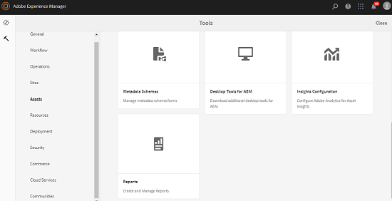

1. On the [!UICONTROL Asset Reports] page, click **[!UICONTROL Create]** from the toolbar.
1. From the **[!UICONTROL Create Report]** page, choose the report you want to create and click **[!UICONTROL Next]**.

   >[!NOTE]
   >
   >Entitle yourself to an **AEM Administrator product profile** to create a **Download** report. See [Assigning AEM Product Profiles](https://experienceleague.adobe.com/en/docs/experience-manager-cloud-service/content/onboarding/journey/assign-profiles-aem) to entitle yourself to an AEM Administrator product profile.

   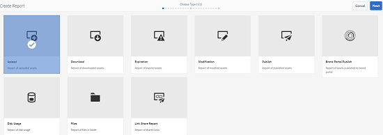

1. Configure report details, such as title, description, thumbnail, and folder path. By default, the folder path is `/content/dam`. You can specify a different path to execute the report on a specific folder.

   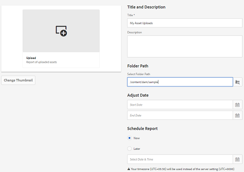

   Choose the date range for your report. You can choose to generate the report now or at a future date and time.

   >[!NOTE]
   >
   >If you choose to schedule the report later, ensure that you specify the date and time in the Date and Time fields. If you do not specify any value, the report engine treats it as a report that is to be generated instantly.

   Configuration fields may differ based on the type of report you create. For example, the **[!UICONTROL Disk Usage]** report provides options to include asset renditions when calculating the disk space used by assets. You can choose to include or exclude assets in sub-folders for disk usage calculation.

   >[!NOTE]
   >
   >The **[!UICONTROL Disk Usage]** report does not include date range fields because it indicates current disk space usage only.

   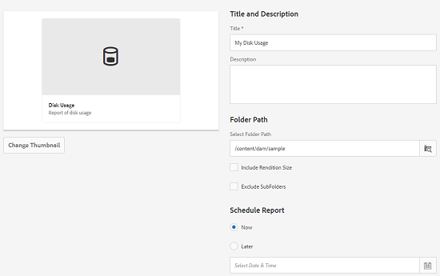

   When you create the **[!UICONTROL Files]** report, you can include/exclude sub-folders. However, you cannot include asset renditions for this report.

   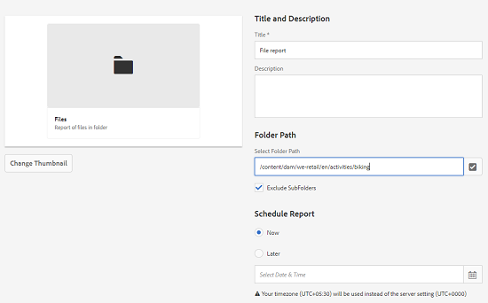

   The **[!UICONTROL Link Share]** report displays URLs to assets that are shared with external users from within [!DNL Assets]. <!-- It includes email ids of the user who shared the assets, emails ids of users with which the assets are shared, share date, and expiration date for the link. --> The columns are not customizable.

   The **[!UICONTROL Link Share]** report, does not include options for sub-folders and renditions because it merely publishes the shared URLs that appear under `/var/dam/share`.

   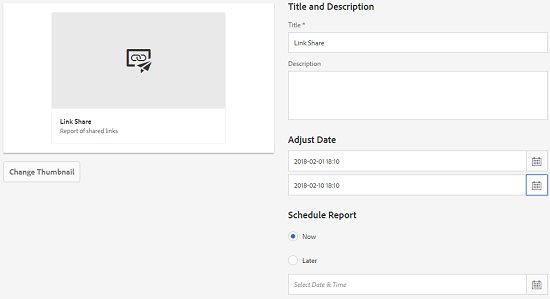

1. Click **[!UICONTROL Next]** from the toolbar.

1. In the **[!UICONTROL Configure Columns]** page, some columns are selected to appear in the report by default. You can select more columns. Cancel the selection of a column to exclude it in the report.

   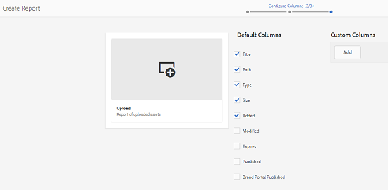

   To display a custom column name or property path, configure the properties for the asset binary under the `jcr:content` node in CRX. Alternatively, add it through a property path picker.

   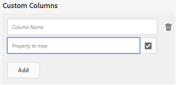

1. Click **[!UICONTROL Create]** from the toolbar. A message notifies that report generation has been initiated.
1. On the [!UICONTROL Asset Reports] page, the report generation status is based on the current state of the report job, for example, [!UICONTROL Success], [!UICONTROL Failed], [!UICONTROL Queued], or [!UICONTROL Scheduled]. The same status appears in the notifications inbox. To view the report page, click the report link. Alternatively, select the report, and click **[!UICONTROL View]** from the toolbar.

   <!--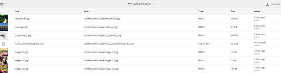-->
   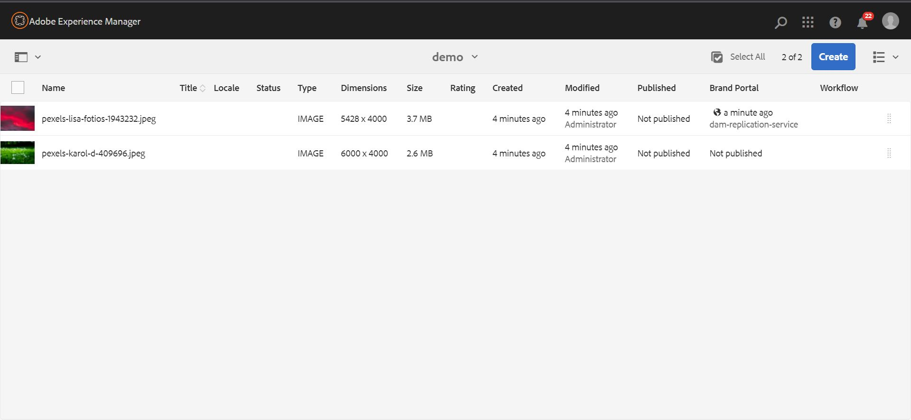

   Click **[!UICONTROL Download]** from the toolbar to download the report in CSV format.

   >[!NOTE]
   >
   >You can generate reports based on the events generated during the past 360 days. Experience Manager retains the user ID data for 30 days.

## Add custom columns to reports {#add-custom-columns}

You can add custom columns to the following reports to display more data for your custom requirements:

<!--
 Remove download report.
* Upload
* Download
* Expiration
* Modification
* Publish
* [!DNL Brand Portal] publish
* Files
-->

* Upload
* Expiration
* Modification
* Publish
* [!DNL Brand Portal] publish
* Files

To add custom columns to these reports, follow these steps:

1. In the [!DNL Manager interface], click **[!UICONTROL Tools]** > **[!UICONTROL Assets]** > **[!UICONTROL Reports]**.
1. On the [!UICONTROL Asset Reports] page, click **[!UICONTROL Create]** from the toolbar.

1. From the **[!UICONTROL Create Report]** page, choose a report to create. Click **[!UICONTROL Next]**.

1. Configure the report details such as title, description, thumbnail, folder path, and date range as applicable. Click **[!UICONTROL Next]**.

1. Select the applicable information from the list of **[!UICONTROL Default Columns]**. To display a custom column, specify the name of the column under **[!UICONTROL Custom Columns]**.

   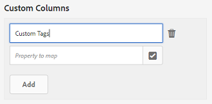

1. Add the property path under the `jcr:content` node in CRXDE using the property path picker. Alternatively, type the path in the property path field.

   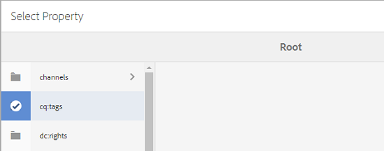

   To add more custom columns, click **[!UICONTROL Add]** and repeat the above steps.

1. Click **[!UICONTROL Create]** from the toolbar. A message notifies that the report generation is initiated.

<!--
 TBD: How to configure purge now? Is it using OSGi configurations?

## Configure purging service {#configure-purging-service}

To remove reports that you no longer require, configure the DAM Report Purge service from the web console to purge existing reports based on their quantity and age.

1. Access the web console (configuration manager) from `https://[aem_server]:[port]/system/console/configMgr`.
1. Open the **[!UICONTROL DAM Report Purge Service]** configuration.
1. Specify the frequency (time interval) for the purging service in the `scheduler.expression.name` field. You can also configure the age and the quantity threshold for reports.
1. Save the changes.
-->

## Troubleshooting information {#tips-troubleshoot}

* If the [!UICONTROL Disk Usage Report] does not generate and if you are using [!DNL Dynamic Media], ensure that all assets are processed correctly. To resolve, reprocess the assets and generate the report again.

<!--
 These notes were present in generate report section above. Removing commented text from in between the instructions to preserve the numbering of the ordered list.

TBD: How do enable this in CS now? Is it done using some OSGi config now?
   >[!NOTE]
   >
   >Before you can generate an **[!UICONTROL Asset Downloaded]** report, ensure that the Asset Download service is enabled. From the web console (`https://[aem_server]:[port]/system/console/configMgr`), open the **[!UICONTROL Day CQ DAM Event Recorder]** configuration, and select the **[!UICONTROL Asset Downloaded (DOWNLOADED)]** option in Event Types if not already selected.
-->

<!--
 Removed download report.
   >[!NOTE]
   >
   >By default, the Content Fragments and link shares are included in the asset [!UICONTROL Download] report. Select the appropriate option to create a report of link shares or to exclude Content Fragments from the download report.

   >[!NOTE]
   >
   >The [!UICONTROL Download] report displays details of only those assets which are downloaded after selecting individually or are downloaded using Quick Action. However, it does not include the details of the assets that are inside a downloaded folder.
-->

* Check for an unexpected node at `/libs/dam/gui/content/reports`. If you have write access to `/libs/dam/gui` and trigger the report creation, AEM creates a stray `generatereport.export.json` node there. Its presence causes report-generation requests to be routed to the default servlet instead of the intended report-generation servlet, so the report never appears in the listing and no email notification is sent for anyone, not just the one who created the node.
   * To fix the issue, remove `create/modify/delete` permissions on `/libs/dam/gui` from the affected users or groups, then delete the stray node, then retest.
* Check for a `NullPointerException` tied to the report configuration. If no values were selected under **[!UICONTROL Configure]** columns when creating the report, the `reportColumns` value is null and the report gets stuck in a queued state indefinitely. This also blocks the report deletion or cancellation. 
   * To fix the issue, recreate the report and explicitly select the default columns.
* Confirm the requesting user has the administrator product profile. A non-administrator cannot see or use the **Reports** feature at all.
* Distinguish report ran but looks incomplete whether the report is broken. If an **Upload** or **Download** report is missing in assets you expect to see, first confirm whether those assets were created by a named user versus a `system/import` process, and whether they fall within the selected date range, before treating it as a defect.
* Periodically audit for users or groups with `/libs` write access who only need the report-generation capability. This prevents the stray-node failure mode before it happens.

**See also**

* [Translate Assets](/help/assets/translate-assets.md)
* [Assets HTTP API](/help/assets/mac-api-assets.md)
* [Assets supported file formats](/help/assets/file-format-support.md)
* [Search assets](/help/assets/search-assets.md)
* [Connected assets](/help/assets/use-assets-across-connected-assets-instances.md)
* [Asset reports](/help/assets/asset-reports.md)
* [Metadata schemas](/help/assets/metadata-schemas.md)
* [Download assets](/help/assets/download-assets-from-aem.md)
* [Manage metadata](/help/assets/manage-metadata.md)
* [Manage Dynamic Media templates](/help/assets/dynamic-media/manage-dynamic-media-templates.md)
* [Manage reports in Assets view](/help/assets/manage-reports-assets-view.md)
* [Search facets](/help/assets/search-facets.md)
* [Manage collections](/help/assets/manage-collections.md)
* [Bulk metadata import](/help/assets/metadata-import-export.md)
* [Publish Assets to AEM and Dynamic Media](/help/assets/publish-assets-to-aem-and-dm.md)

