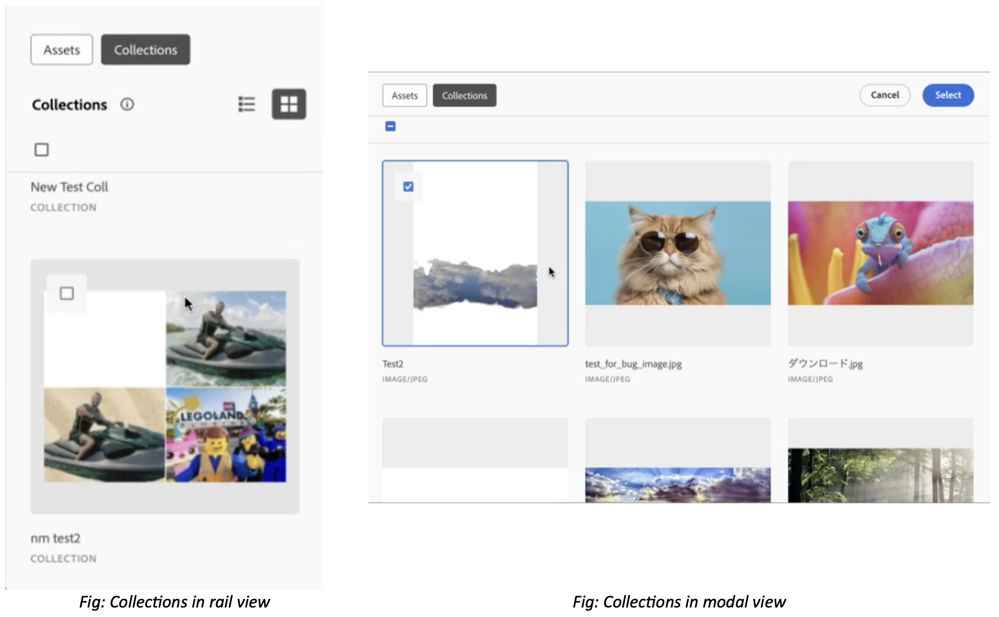

# Asset Selector Collections {#asset-selector-collections}

| [Search Best Practices](/help/assets/search-best-practices.md) |[Metadata Best Practices](/help/assets/metadata-best-practices.md)|[Content Hub](/help/assets/product-overview.md)|[Dynamic Media with OpenAPI capabilities](/help/assets/dynamic-media-open-apis-overview.md)|[AEM Assets developer documentation](https://developer.adobe.com/experience-cloud/experience-manager-apis/)|
| ------------- | --------------------------- |---------|----|-----|

A collection is a set of assets, folders, or other collections within Asset Selector. Use collections to share assets between users. Unlike folders, a collection can include assets from different locations. 

The Micro Front-end Collections in Asset Selector is available out of the box in read only mode. It fetches assets and collections directly from the [!DNL Experience Manager Assets] repository that you have access to.

>[!NOTE]
>
>Ensure that you have permissions to access an [!DNL Experience Manager Assets] [imsOrg](/help/assets/asset-selector-properties.md) and Collections.

The Micro Front-end Collections in Asset Selector is available out of the box in read only mode. It fetches assets and collections directly from the Experience Manager Assets repository that you have access to and inherits the properties of public and private folders from your Experience Manager Assets repository. See more about [creating a public or private collection in Assets view](/help/assets/manage-collections-assets-view.md#create-collection).

You can view Collections in Asset Selector in both rail view and modal view. 

  

<!--
Additionally, you can [customize](/help/assets/asset-selector-customization.md) the `featureSet` property to enable or disable collections in Asset Selector. See [enable or disable Collections tab](#enable-disable-collections-tab).-->

Moreover, you can also customize the selection of assets under the Collections tab. To do this, you can customize it using `handleSelection`. See [handling selection of Assets using Object Schema](/help/assets/asset-selector-customization.md#handling-selection).

## View collections {#view-collections}

Asset Selector allows you to view collections in either a  list view or a  grid view. See [types of view in Asset Selector](overview-asset-selector.md#types-of-view).

## Drag and drop assets to collection {#collection-drag-and-drop}

You can drag and drop an asset to Collections directly from the [!DNL Assets as a Cloud Service] view in the Author environment. To do this, drag the asset from the Assets tab to the Collections workarea of Asset Selector application to build rich applications.

>[!NOTE]
>
>* The drag and drop of an asset is possible only in rail view.
>* You can drag and drop files only (assets) and not the folders.

On the other hand, you can also [enable or disable drag and drop of assets in the collections](asset-selector-customization.md#enable-disable-drag-and-drop) directly.

## Disable selection of asset in Collections {#disable-selection-collection}

Disable selection is used to hide or disable the assets or folders from being selectable. It hides the select checkbox from the card or asset which refrains it from getting selected. See [disable selection](/help/assets/asset-selector-customization.md#disable-selection).

## Enable or disable Collections tab {#enable-disable-collections-tab}

Asset Selector allows you to customize the components as per the requirement and usability. To enable or disable Collections tab in Asset Selector, you can use `featureSet` property in the following manner:

* **Enable Collections tab:** To enable collections tab, you need to provide `collections` as value to the array. By default, Collections tab is enabled out of the box for all the users. For example, `featureSet:["collections"]`
* **Disable Collections tab:** To disable collections tab, you need to provide an empty array as its value. For example, `featureSet:[ ]`

>[!MORELIKETHIS]
>
>* [Asset Selector customizations](/help/assets/asset-selector-customization.md)
>* [Integrate Asset Selector with various applications](/help/assets/integrate-asset-selector.md)
>* [Asset Selector properties](/help/assets/asset-selector-properties.md)
