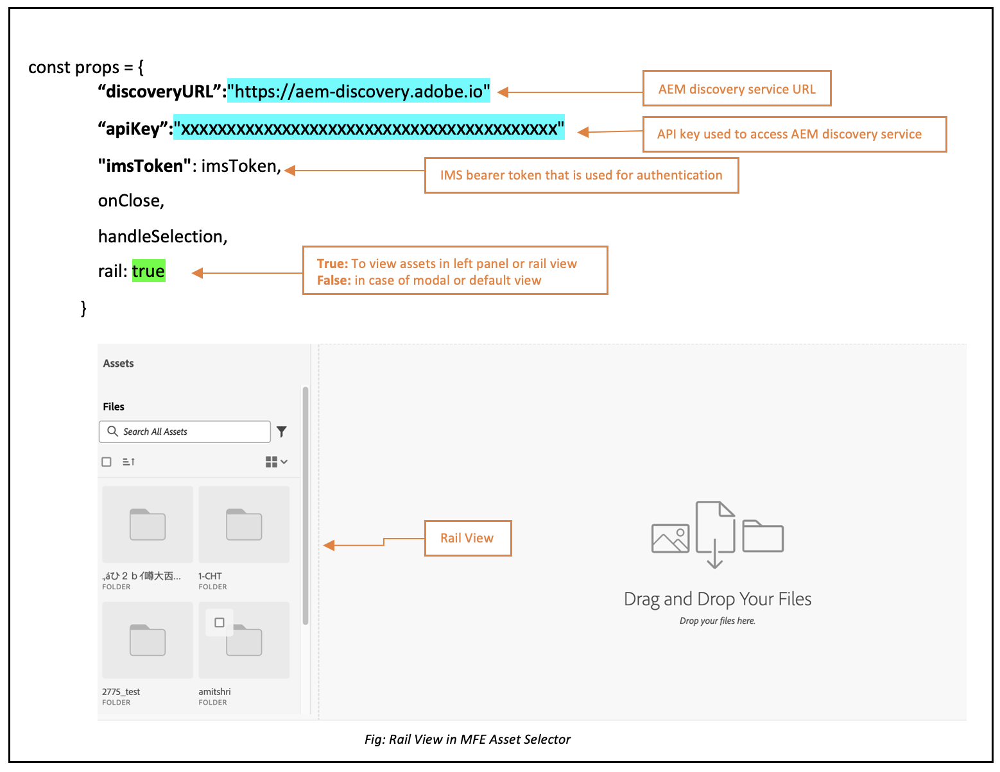
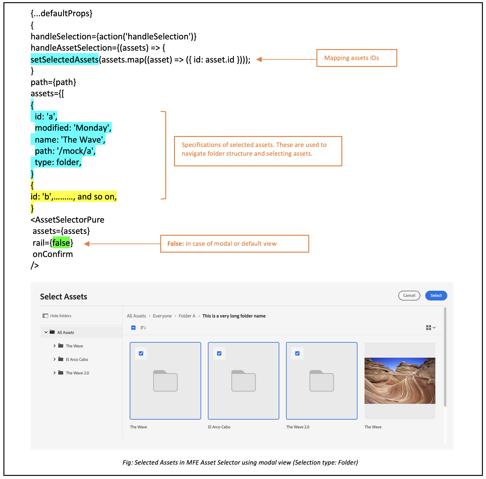
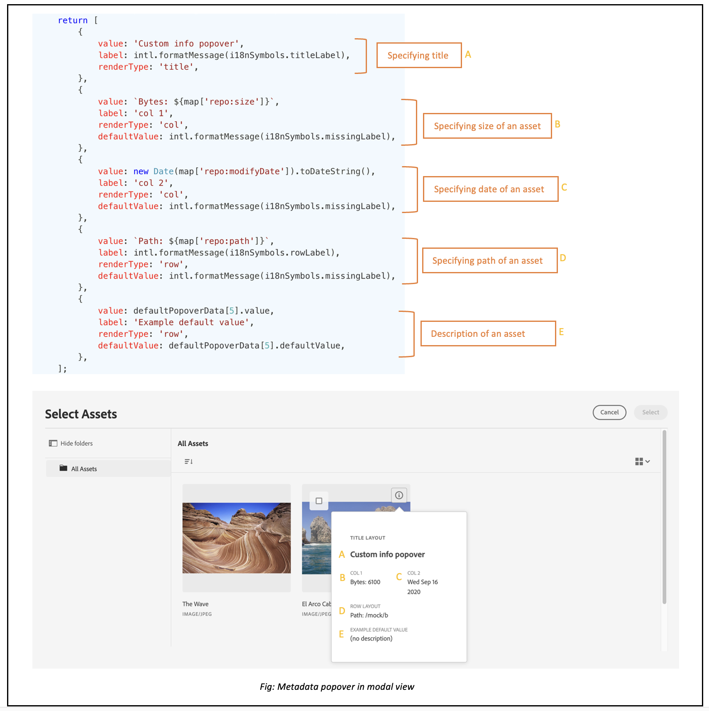
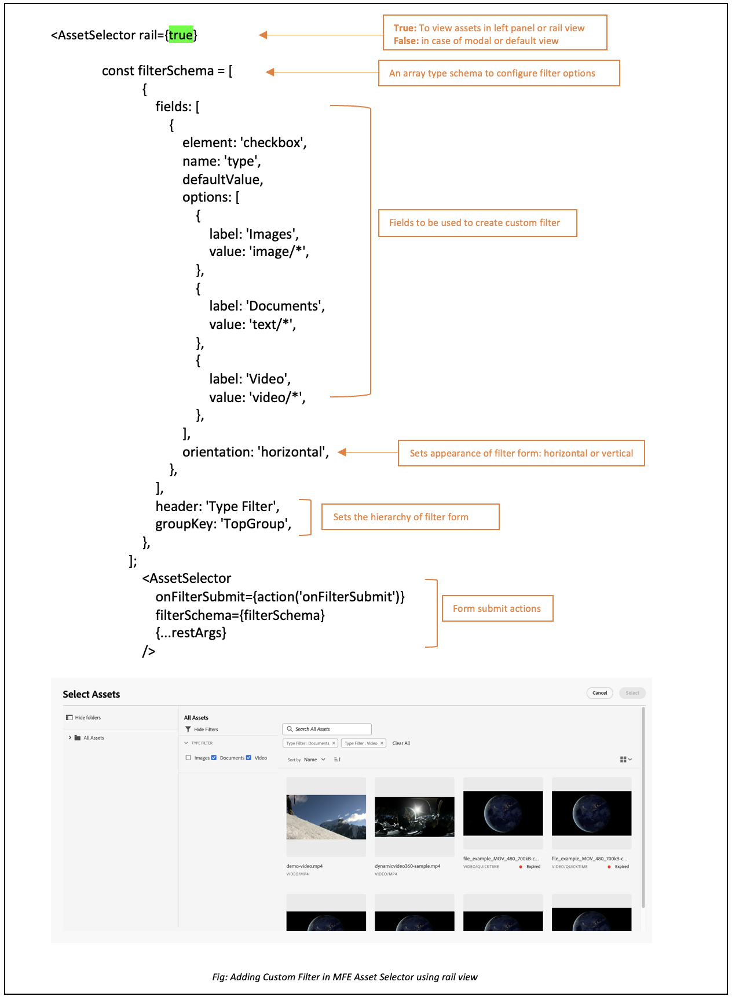

# Examples to use Asset Selector properties {#usage-examples}

| [Search Best Practices](/help/assets/search-best-practices.md) |[Metadata Best Practices](/help/assets/metadata-best-practices.md)|[Content Hub](/help/assets/product-overview.md)|[Dynamic Media with OpenAPI capabilities](/help/assets/dynamic-media-open-apis-overview.md)|[AEM Assets developer documentation](https://developer.adobe.com/experience-cloud/experience-manager-apis/)|
| ------------- | --------------------------- |---------|----|-----|

You can define the Asset Selector [properties](/help/assets/asset-selector-properties.md) in the **index.html** file to customize the Asset Selector display within your application.

## Example 1: Asset Selector in rail view

   

If the value of the AssetSelector `rail` is set to `false` or is not mentioned in the properties, Asset Selector displays in the Modal view by default. The `acvConfig` property allows for some in-depth configurations, like the Drag and Drop. Visit [enable or disable drag and drop](asset-selector-customization.md#enable-disable-drag-and-drop) to understand the usage of `acvConfig` property.

<!--
### Example 2: Use selectedAssets property in addition to the path property

Use the `path` property to define the folder name that displays automatically when the Asset Selector is rendered. In addition, use the `selectedAssets` property to define the IDs for the assets that you need to select within the folder. Moreover, when you want to display assets that are pre-defined within the folder, you can use selectedAssets property.

   
-->

## Example 2: Metadata popover

Use various properties to define metadata of an asset that you want to view using an info icon. The info popover provides the collection of information about asset or the folder including title, dimensions, date of modification, location, and description of an asset. In the example below, various properties are used to display metadata of an asset, for example, `repo:path` property specifies the location of an asset. <!--`repo` represents the repository from where the asset is showing, whereas, `path` represents the route from where the asset or folder is rendered.-->
    
   

## Example 3: Custom filter property in rail view

In addition to the faceted search, Assets Selector lets you customize various attributes to refine your search from [!DNL Adobe Experience Manager] as a [!DNL Cloud Service] application. Add the following code to add customized search filters in your application. In the example below, the `Type Filter` search that filters the asset type among Images, Documents, or Videos or the filter type that you have added for the search.

<!--

## Customization after integrating Asset Selector 

### Custom metadata

Assets display panel shows the out of the box metadata that can be displayed in the info of the asset. In addition to this, [!DNL Adobe Experience Manager] as a [!DNL Cloud Service] application allows configuration of the asset selector by adding custom metadata that is shown in info panel of the asset.
-->

>[!MORELIKETHIS]
>
>* [Asset Selector customizations](/help/assets/asset-selector-customization.md)
>* [Asset Selector upload](/help/assets/asset-selector-upload.md)
>* [Asset Selector properties](/help/assets/asset-selector-properties.md)
>* [Integrate Asset Selector with Dynamic Media with OpenAPI capabilities](/help/assets/integrate-asset-selector-dynamic-media-open-api.md)
