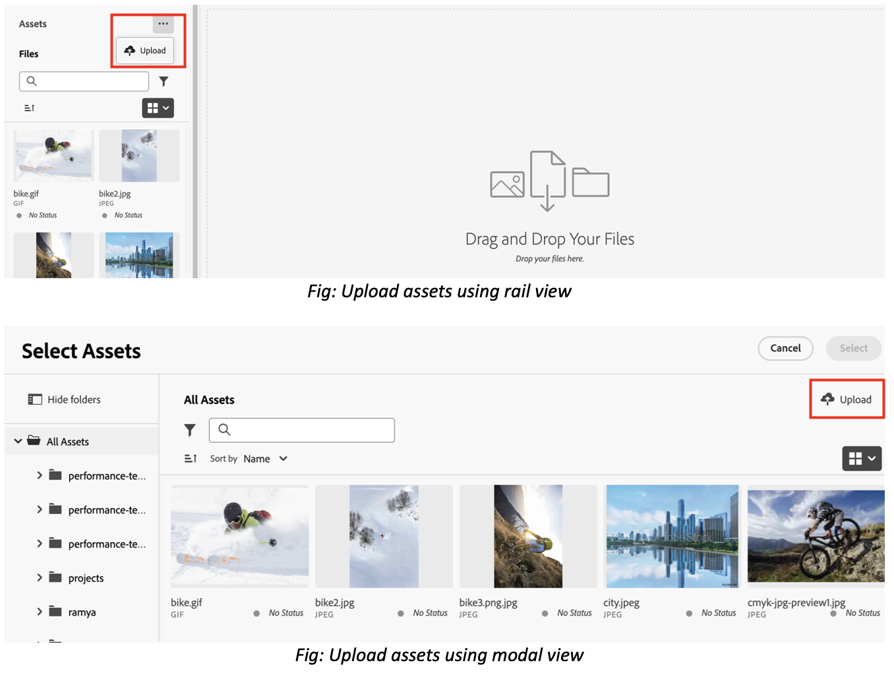
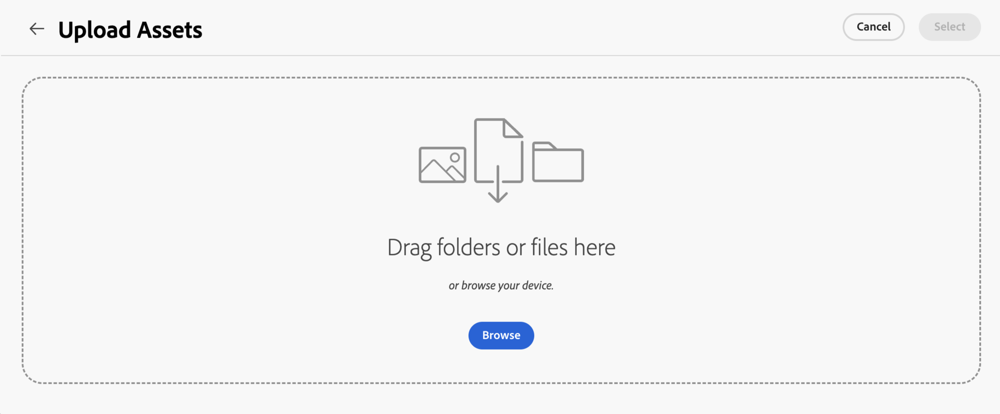
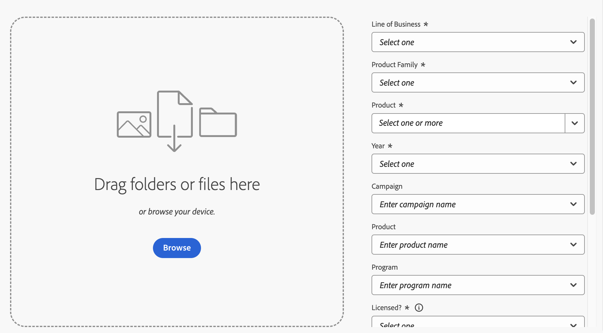
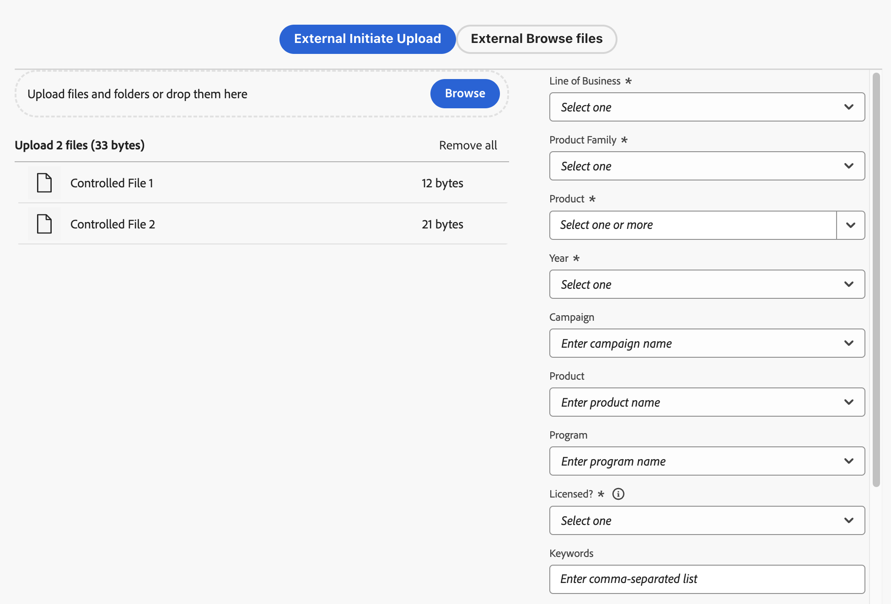

# Upload files and folders to Asset Selector {#upload-files-folders}

<table>
    <tr>
        <td>
            <i>New</i> <a href="/help/assets/dynamic-media/dm-prime-ultimate.md"><b>Dynamic Media Prime and Ultimate</b></a>
        </td>
        <td>
            <i>New</i> <a href="/help/assets/assets-ultimate-overview.md"><b>AEM Assets Ultimate</b></a>
        </td>
        <td>
            <i>New</i> <a href="/help/assets/integrate-aem-assets-edge-delivery-services.md"><b>AEM Assets integration with Edge Delivery Services</b></a>
        </td>
        <td>
            <i>New</i> <a href="/help/assets/aem-assets-view-ui-extensibility.md"><b>UI Extensibility</b></a>
        </td>
          <td>
            <i>New</i> <a href="/help/assets/dynamic-media/enable-dynamic-media-prime-and-ultimate.md"><b>Enable Dynamic Media Prime and Ultimate</b></a>
        </td>
    </tr>
    <tr>
        <td>
            <a href="/help/assets/search-best-practices.md"><b>Search Best Practices</b></a>
        </td>
        <td>
            <a href="/help/assets/metadata-best-practices.md"><b>Metadata Best Practices</b></a>
        </td>
        <td>
            <a href="/help/assets/product-overview.md"><b>Content Hub</b></a>
        </td>
        <td>
            <a href="/help/assets/dynamic-media-open-apis-overview.md"><b>Dynamic Media with OpenAPI capabilities</b></a>
        </td>
        <td>
            <a href="https://developer.adobe.com/experience-cloud/experience-manager-apis/"><b>AEM Assets developer documentation</b></a>
        </td>
    </tr>
</table>

You can upload files or folders to Asset Selector from your local file system. To upload files using the local file system, you generally need to use an upload feature provided by an Asset Selector micro front-end application.

## Upload assets from local file system {#basic-upload}

To add assets to Asset Selector, perform the following steps:

1. If you are using rail view, then go to ellipsis and then click  **[!UICONTROL Upload]**. On the other hand, click  **[!UICONTROL Upload]** on the top-right in case of modal view. The [!UICONTROL Upload Assets] screen appears.

    

    Additionally, in the **[!UICONTROL Drag files or folders here]** section, you can either drag the assets from the local file system or click **[!UICONTROL Browse]** to manually select files or folders available on the local file system. This list of files that are part of your upload are available as a list. 

    

    You can also preview selected images using the thumbnails and click the X icon to remove any particular image from the list. The X icon displays only when you hover your mouse over the image name or size. You can also click **[!UICONTROL Remove all]** to delete all items from your upload list.

1. To finish the upload process, click **[!UICONTROL Upload]**. Your uploaded assets appear. See [basic upload](/help/assets/asset-selector-customization.md#basic-upload) for the configurable code.

## Upload assets with metadata {#upload-assets-with-metadata}

You can add metadata to the assets while uploading them immediately into your application. Metadata includes various fields such as business subject line, product details, campaign, and so on. To do this, `metadataSchema` property is used. Go to [asset selector properties](/help/assets/asset-selector-properties.md) to know more about `metadataSchema` property. 

See [upload with metadata](/help/assets/asset-selector-customization.md#upload-with-metadata) for the code snippet required for the configuration.

       
1. Define the name for your upload using the **[!UICONTROL Campaign name]** field. You can use an existing name or create a new one. The Asset Selector provides you with more options as you type the name.

   As a best practice, Adobe recommends specifying values in the rest of the fields as well as it creates an enhanced search experience for your uploaded assets.

1. Similarly, define values for the **[!UICONTROL Keywords]**, **[!UICONTROL Channels]**, **[!UICONTROL Timeframe]**, and **[!UICONTROL Region]** fields. Tagging and grouping assets by keywords, channels, and location enables everyone who uses your approved company content to find these assets and keep it organized.

1. Click **[!UICONTROL Upload]** to upload assets to the Asset Selector. [!UICONTROL Review details] confirmation box appears. Click [!UICONTROL Continue].

1. Assets start uploading. Click [!UICONTROL New Upload] to restart the upload procedure. Click [!UICONTROL Done] to complete uploading.    

## Customized upload {#customize-upload}

Asset Selector allows you to add a customized upload form. There are several customizations available. For example the [hideUploadButton](/help/assets/asset-selector-properties.md) property allows you to hide the upload button that is shown by default in the application. Instead, you can customize it to render outside the MFE application as per the requirement. See [customized upload](/help/assets/asset-selector-customization.md#customized-upload) for the configuration.

>[!MORELIKETHIS]
>
>* [Asset Selector examples](/help/assets/asset-selector-examples.md)
>* [Integrate Asset Selector with various applications](/help/assets/integrate-asset-selector.md)
>* [Asset Selector properties](/help/assets/asset-selector-properties.md)
