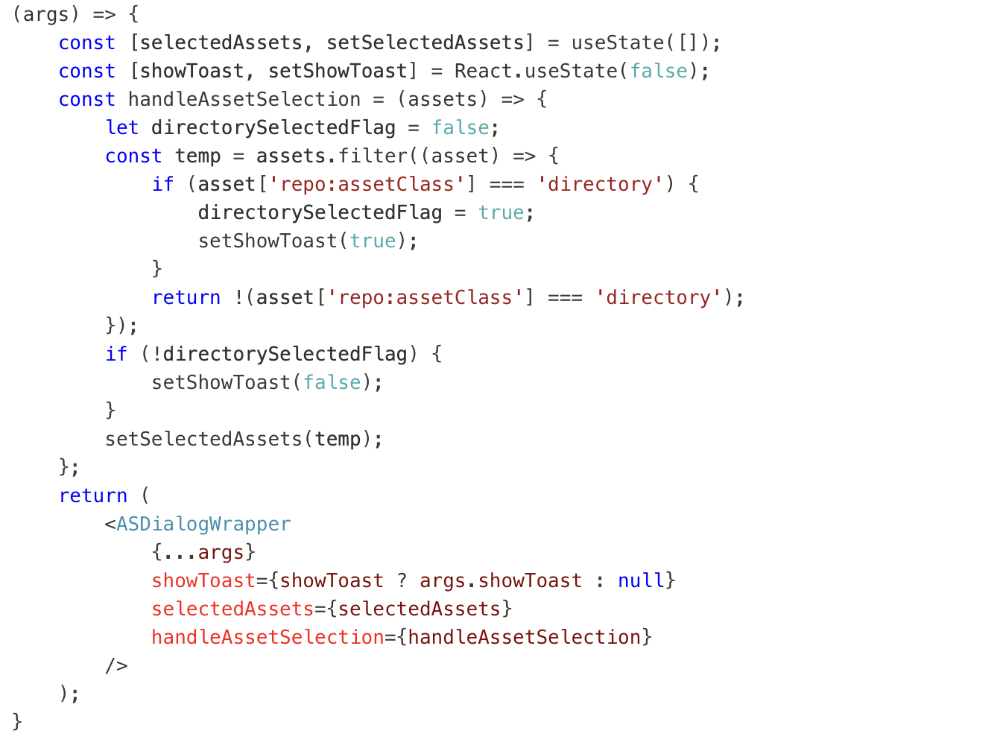
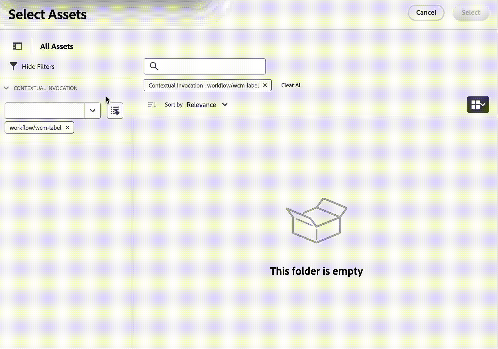
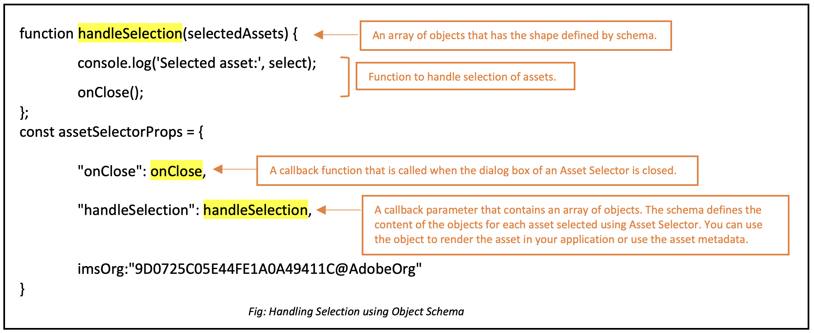

# Micro-Frontend Asset Selector {#Overview}

<table>
    <tr>
        <td>
            <sup style= "background-color:#008000; color:#FFFFFF; font-weight:bold"><i>New</i></sup> <a href="/help/assets/dynamic-media/dm-prime-ultimate.md"><b>Dynamic Media Prime and Ultimate</b></a>
        </td>
        <td>
            <sup style= "background-color:#008000; color:#FFFFFF; font-weight:bold"><i>New</i></sup> <a href="/help/assets/assets-ultimate-overview.md"><b>AEM Assets Ultimate</b></a>
        </td>
        <td>
            <sup style= "background-color:#008000; color:#FFFFFF; font-weight:bold"><i>New</i></sup> <a href="/help/assets/integrate-aem-assets-edge-delivery-services.md"><b>AEM Assets integration with Edge Delivery Services</b></a>
        </td>
        <td>
            <sup style= "background-color:#008000; color:#FFFFFF; font-weight:bold"><i>New</i></sup> <a href="/help/assets/aem-assets-view-ui-extensibility.md"><b>UI Extensibility</b></a>
        </td>
          <td>
            <sup style= "background-color:#008000; color:#FFFFFF; font-weight:bold"><i>New</i></sup> <a href="/help/assets/dynamic-media/enable-dynamic-media-prime-and-ultimate.md"><b>Enable Dynamic Media Prime and Ultimate</b></a>
        </td>
    </tr>
    <tr>
        <td>
            <a href="/help/assets/search-best-practices.md"><b>Search Best Practices</b></a>
        </td>
        <td>
            <a href="/help/assets/metadata-best-practices.md"><b>Metadata Best Practices</b></a>
        </td>
        <td>
            <a href="/help/assets/product-overview.md"><b>Content Hub</b></a>
        </td>
        <td>
            <a href="/help/assets/dynamic-media-open-apis-overview.md"><b>Dynamic Media with OpenAPI capabilities</b></a>
        </td>
        <td>
            <a href="https://developer.adobe.com/experience-cloud/experience-manager-apis/"><b>AEM Assets developer documentation</b></a>
        </td>
    </tr>
</table>

Micro-Frontend Asset Selector provides a user interface that easily integrates with the [!DNL Experience Manager Assets] repository so that you can browse or search digital assets available in the repository and use them in your application authoring experience.

The Micro-Frontend user interface is made available in your application experience using the Asset Selector package. Any updates to the package are automatically imported and the latest deployed Asset Selector loads automatically within your application.


Asset Selector provides many benefits, such as:

* Ease of integration with any of the [Adobe](#asset-selector-ims) or [non-Adobe](#asset-selector-non-ims) applications using Vanilla JavaScript library.
* Easy to maintain as updates to the Assets Selector package are automatically deployed to the Asset Selector available for your application. There are no updates required within your application to load the latest modifications.
* Ease of customization as there are properties available that control the Asset Selector display within your application.
* Full-text search, out-of-the-box, and customized filters to quickly navigate to assets for use within the authoring experience.
* Ability to switch repositories within an IMS organization for asset selection.
* Ability to sort assets by name, dimensions, and size and view them in List, Grid, Gallery, or  Waterfall view.

<!--Perform the following tasks to integrate and use Asset Selector with your [!DNL Experience Manager Assets] repository:

1. [Install Asset Selector](#installation)
2. [Integrate Asset Selector using Vanilla JS](#integration-using-vanilla-js)
3. [Use Asset Selector](#using-asset-selector)
-->

<!--
## Setting up Asset Selector {#asset-selector-setup}


-->

## Prerequisites{#prereqs}

You must ensure the following communication methods:

* The application is running on HTTPS.
* The URL of the application is in the IMS client's allowed list of redirect URLs.
* The IMS login flow is configured and rendered using a popup on the web browser. Therefore, popups should be enabled or allowed on the target browser.

Use the above prerequisites if you require IMS authentication workflow of Asset Selector. Alternatively, if you are already authenticated with the IMS workflow, you can add the IMS information instead. 

>[!IMPORTANT]
>
> This repository is intended to serve as a supplemental documentation describing the available APIs and usage examples for integrating Asset Selector. Before attempting to install or use the Asset Selector, ensure that your organization has been provisioned the access to Asset Selector as part of the Experience Manager Assets as a Cloud Service profile. If you have not been provisioned, you cannot integrate or use these components. To request provisioning, your program admin should raise a support ticket marked as P2 from Admin Console and include the following information:
>
>* Domain names where the integrating application is hosted.
>* After provisioning, your organization will be provided with `imsClientId`, `imsScope`, and a `redirectUrl` corresponding to the environments requested that are essential for the configuration of Asset Selector. Without those valid properties, you cannot run the installation steps.

## Installation {#installation}

Asset Selector is available via both ESM CDN (For example, [esm.sh](https://esm.sh/)/[skypack](https://www.skypack.dev/)) and [UMD](https://github.com/umdjs/umd) version.

In browsers using **UMD version** (recommended):

```
<script src="https://experience.adobe.com/solutions/CQ-assets-selectors/static-assets/resources/assets-selectors.js"></script>

<script>
  const { renderAssetSelector } = PureJSSelectors;
</script>

```

In browsers with `import maps` support using **ESM CDN version**:

```
<script type="module">
  import { AssetSelector } from 'https://experience.adobe.com/solutions/CQ-assets-selectors/static-assets/resources/@assets/selectors/index.js'
</script>

```

In Deno/Webpack Module Federation using **ESM CDN version**:

```
import { AssetSelector } from 'https://experience.adobe.com/solutions/CQ-assets-selectors/static-assets/resources/@assets/selectors/index.js'

```

## Integrate Asset Selector using Vanilla JS {#integration-using-vanilla-js}

You can integrate any [!DNL Adobe] or non-Adobe application with [!DNL Experience Manager Assets] repository and select assets from within the application. See [Asset Selector Integration with various applications](#asset-selector-integration-with-apps).

The integration is done by importing the Asset Selector package and connecting to the Assets as a Cloud Service using the Vanilla JavaScript library. Edit an `index.html` or any appropriate file within your application to:

* Define the authentication details
* Access the Assets as a Cloud Service repository
* Configure the Asset Selector display properties

You can perform authentication without defining some of the IMS properties, if:

* You are integrating an [!DNL Adobe] application on [Unified Shell](https://experienceleague.adobe.com/docs/experience-manager-cloud-service/content/overview/aem-cloud-service-on-unified-shell.html?lang=en).
* You already have an IMS token generated for authentication.

## Integrate Asset Selector with various applications {#asset-selector-integration-with-apps}

You can integrate Asset Selector with various applications such as:

* [Integrate Asset Selector with an [!DNL Adobe] application](#adobe-app-integration-vanilla)
* [Integrate Asset Selector with a non-Adobe application](#adobe-non-app-integration)
* [Integration for Dynamic Media with OpenAPI capabilities](#adobe-app-integration-polaris)

>[!BEGINTABS]

<!--Integration with an Adobe application content starts here-->

>[!TAB Integration with an Adobe application]

### Prerequisites{#prereqs-adobe-app}

Use the following prerequisites if you are integrating Asset Selector with an [!DNL Adobe] application:

* [Communication methods](#prereqs)
* imsOrg
* imsToken
* apikey

### Integrate Asset Selector with an [!DNL Adobe] application {#adobe-app-integration-vanilla}

The following example demonstrates the usage of Asset Selector when running an [!DNL Adobe] application under Unified Shell or when you already have `imsToken` generated for authentication.

Include the Asset Selector package in your code using the `script` tag, as shown in _lines 6&ndash;15_ of the example below. Once the script is loaded, the `PureJSSelectors` global variable is available for use. Define the Asset Selector [properties](#asset-selector-properties) as shown in _lines 16&ndash;23_. The `imsOrg` and `imsToken` properties are both required for authentication in Adobe application. The `handleSelection` property is used to handle the selected assets. To render the Asset Selector, call the `renderAssetSelector` function as mentioned in _line 17_. The Asset Selector is displayed in the `<div>` container element, as shown in _lines 21 and 22_.

By following these steps, you can use Asset Selector with your [!DNL Adobe] application.

```html {line-numbers="true"}
<!DOCTYPE html>
<html>
<head>
    <title>Asset Selector</title>
    <script src="https://experience.adobe.com/solutions/CQ-assets-selectors/assets/resources/assets-selectors.js"></script>
    <script>
        // get the container element in which we want to render the AssetSelector component
        const container = document.getElementById('asset-selector-container');
        // imsOrg and imsToken are required for authentication in Adobe application
        const assetSelectorProps = {
            imsOrg: 'example-ims@AdobeOrg',
            imsToken: "example-imsToken",
            apiKey: "example-apiKey-associated-with-imsOrg",
            handleSelection: (assets: SelectedAssetType[]) => {},
        };
        // Call the `renderAssetSelector` available in PureJSSelectors globals to render AssetSelector
        PureJSSelectors.renderAssetSelector(container, assetSelectorProps);
    </script>
</head>

<body>
    <div id="asset-selector-container" style="height: calc(100vh - 80px); width: calc(100vw - 60px); margin: -20px;">
    </div>
</body>

</html>
```

<!--For detailed example, visit [Asset Selector Code Example](https://github.com/adobe/aem-assets-selectors-mfe-examples).-->

+++**ImsAuthProps**
The `ImsAuthProps` properties define the authentication information and flow that the Asset Selector uses to obtain an `imsToken`. By setting these properties, you can control how the authentication flow should behave and register listeners for various authentication events.

| Property Name | Description|
|---|---|
| `imsClientId`| A string value representing the IMS client ID used for authentication purposes. This value is provided by Adobe and is specific to your Adobe AEM CS organization.|
| `imsScope`| Describes the scopes used in authentication. The scopes determine the level of access that the application has to your organization resources. Multiple scopes can be separated by commas.|
| `redirectUrl` | Represents the URL where the user is redirected after authentication. This value is typically set to the current URL of the application. If a `redirectUrl` is not supplied, `ImsAuthService` uses the redirectUrl used to register the `imsClientId`|
| `modalMode`| A boolean indicating whether the authentication flow should be displayed in a modal (pop-up) or not. If set to `true`, the authentication flow is displayed in a pop-up. If set to `false`, the authentication flow is displayed in a full page reload. _Note:_ for better UX, you can dynamically control this value if the user has browser pop-up disabled. |
| `onImsServiceInitialized`| A callback function that is called when the Adobe IMS authentication service is initialized. This function takes one parameter, `service`, which is an object representing the Adobe IMS service. See [`ImsAuthService`](#imsauthservice-ims-auth-service) for more details.|
| `onAccessTokenReceived`| A callback function that is called when an `imsToken` is received from the Adobe IMS authentication service. This function takes one parameter, `imsToken`, which is a string representing the access token. |
| `onAccessTokenExpired`| A callback function that is called when an access token has expired. This function is typically used to trigger a new authentication flow to obtain a new access token. |
| `onErrorReceived`| A callback function that is called when an error occurs during authentication. This function takes two parameters: the error type and error message. The error type is a string representing the type of error and the error message is a string representing the error message. |

+++

+++**ImsAuthService**
`ImsAuthService` class handles the authentication flow for the Asset Selector. It is responsible for obtaining an `imsToken` from the Adobe IMS authentication service. The `imsToken` is used to authenticate the user and authorize access to the [!DNL Adobe Experience Manager] as a [!DNL Cloud Service] Assets repository. ImsAuthService uses the `ImsAuthProps` properties to control the authentication flow and register listeners for various authentication events. You can use the convenient [`registerAssetsSelectorsAuthService`](#purejsselectorsregisterassetsselectorsauthservice) function to register the _ImsAuthService_ instance with the Asset Selector. The following functions are available on the `ImsAuthService` class. However, if you are using the _registerAssetsSelectorsAuthService_ function, you do not need to call these functions directly.

| Function Name | Description |
|---|---|
| `isSignedInUser` | Determines whether the user is currently signed in to the service and returns a boolean value accordingly.|
| `getImsToken`    | Retrieves the authentication `imsToken` for the currently signed-in user, which can be used to authenticate requests to other services such as generating asset _rendition.|
| `signIn`| Initiates the sign-in process for the user. This function uses the `ImsAuthProps` to show authentication in either a pop-up or a full page reload |
| `signOut`| Signs the user out of the service, invalidating their authentication token and requiring them to sign in again to access protected resources. Invoking this function will reload the current page.|
| `refreshToken`| Refreshes the authentication token for the currently signed-in user, preventing it from expiring and ensuring uninterrupted access to protected resources. Returns a new authentication token that can be used for subsequent requests. |

+++

+++**Validation with provided IMS token**

```
<script>
    const apiToken="<valid IMS token>";
    function handleSelection(selection) {
    console.log("Selected asset: ", selection);
    };
    function renderAssetSelectorInline() {
    console.log("initializing Asset Selector");
    const props = {
    "repositoryId": "delivery-p64502-e544757.adobeaemcloud.com",
    "apiKey": "ngdm_test_client",
    "imsOrg": "<IMS org>",
    "imsToken": apiToken,
    handleSelection,
    hideTreeNav: true
    }
    const container = document.getElementById('asset-selector-container');
    PureJSSelectors.renderAssetSelector(container, props);
    }
    $(document).ready(function() {
    renderAssetSelectorInline();
    });
</script>
```

+++

+++**Register callbacks to IMS service**

```
// object `imsProps` to be defined as below 
let imsProps = {
    imsClientId: <IMS Client Id>,
        imsScope: "openid",
        redirectUrl: window.location.href,
        modalMode: true,
        adobeImsOptions: {
            modalSettings: {
            allowOrigin: window.location.origin,
},
        useLocalStorage: true,
},
onImsServiceInitialized: (service) => {
            console.log("onImsServiceInitialized", service);
},
onAccessTokenReceived: (token) => {
            console.log("onAccessTokenReceived", token);
},
onAccessTokenExpired: () => {
            console.log("onAccessTokenError");
// re-trigger sign-in flow
},
onErrorReceived: (type, msg) => {
            console.log("onErrorReceived", type, msg);
},
}
```

+++

<!--Integration with non-Adobe application content starts here-->

>[!TAB Integration with a non-Adobe application]

<!--### Integrate Asset Selector with a [!DNL non-Adobe] application {#adobe-non-app-integration}-->

### Prerequisites {#prereqs-non-adobe-app} 

Use the following prerequisites if you are integrating Asset Selector with a non-Adobe application:

* [Communication methods](#prereqs)
* imsClientId
* imsScope
* redirectUrl
* imsOrg
* apikey

Asset Selector supports authentication to the [!DNL Experience Manager Assets] repository using Identity Management System (IMS) properties such as `imsScope` or `imsClientID` when you are integrating it with a non-Adobe application.

+++**Configure Asset Selector for a non-Adobe application**
To configure Asset Selector for a non-Adobe application, you must first log a support ticket for provisioning followed by the integration steps.

**Logging a support ticket**
Steps to log a support ticket via the Admin Console:

1. Add **Asset Selector with AEM Assets** in the title of the ticket.

1. In the description, provide the following details:

    * [!DNL Experience Manager Assets] as a [!DNL Cloud Service] URL (Program ID and Environment ID).
    * Domain names where the non-Adobe web application is hosted.
+++

+++**Integration steps**
Use this example `index.html` file for authentication while integrating Asset Selector with a non-Adobe application.

Access the Asset Selector package using the `Script` Tag, as shown in *line 9* to *line 11* of the example `index.html` file.

*Line 14* to *line 38* of the example describes the IMS flow properties, such as `imsClientId`, `imsScope`, and `redirectURL`. The function requires that you define at least one of the `imsClientId` and `imsScope` properties. If you do not define a value for `redirectURL`, the registered redirect URL for the client ID is used.

As you do not have an `imsToken` generated, use the `registerAssetsSelectorsAuthService` and `renderAssetSelectorWithAuthFlow` functions, as shown in line 40 to line 50 of the example `index.html` file. Use the `registerAssetsSelectorsAuthService` function before `renderAssetSelectorWithAuthFlow` to register the `imsToken` with the Asset Selector. [!DNL Adobe] recommends calling `registerAssetsSelectorsAuthService` when you instantiate the component.

Define the authentication and other Assets as a Cloud Service access-related properties in the `const props` section, as shown in *line 54* to *line 60* of the example `index.html` file.

The `PureJSSelectors` global variable, mentioned in *line 65*, is used to render the Asset Selector in the web browser.

Asset Selector is rendered on the `<div>` container element, as mentioned in *line 74* to *line 81*. The example uses a dialog to display the Asset Selector.

```html {line-numbers="true"}
<!DOCTYPE html>
<html>

<head>
    <meta http-equiv="X-UA-Compatible" content="IE=edge">
    <meta charset="utf-8">
    <title>Asset Selectors</title>
    <link rel="stylesheet" href="index.css">
    <script id="asset-selector"
        src="https://experience.adobe.com/solutions/CQ-assets-selectors/assets/resources/asset-selectors.js"></script>
    <script>

        const imsProps = {
            imsClientId: "<obtained from IMS team>",
            imsScope: "openid, <other scopes>",
            redirectUrl: window.location.href,
            modalMode: true, // false to open in a full page reload flow
            onImsServiceInitialized: (service) => {
                // invoked when the ims service is initialized and is ready
                console.log("onImsServiceInitialized", service);
            },
            onAccessTokenReceived: (token) => {
                console.log("onAccessTokenReceived", token);
            },
            onAccessTokenExpired: () => {
                console.log("onAccessTokenError");
                // re-trigger sign-in flow
            },
            onErrorReceived: (type, msg) => {
                console.log("onErrorReceived", type, msg);
            },
        }

        function load() {
            const registeredTokenService = PureJSSelectors.registerAssetsSelectorsAuthService(imsProps);
            imsInstance = registeredTokenService;
        };

        // initialize the IMS flow before attempting to render the asset selector
        load();
        

        //function that will render the asset selector
            const otherProps = {
            // any other props supported by asset selector
            }
            const assetSelectorProps = {
                "imsOrg": "imsorg",
                ...otherProps
            }
             // container element on which you want to render the AssetSelector/DestinationSelector component
            const container = document.getElementById('asset-selector');

            /// Use the PureJSSelectors in globals to render the AssetSelector/DestinationSelector component
            PureJSSelectors.renderAssetSelectorWithAuthFlow(container, assetSelectorProps, () => {
                const assetSelectorDialog = document.getElementById('asset-selector-dialog');
                assetSelectorDialog.showModal();
            });
        }
    </script>

</head>
<body class="asset-selectors">
    <div>
        <button onclick="renderAssetSelectorWithAuthFlowFlow()">Asset Selector - Select Assets with Ims Flow</button>
    </div>
        <dialog id="asset-selector-dialog">
            <div id="asset-selector" style="height: calc(100vh - 80px); width: calc(100vw - 60px); margin: -20px;">
            </div>
        </dialog>
    </div>
</body>

</html>

```

+++

+++**Unable to access delivery repository**

>[!TIP]
>
>If you have integrated Asset Selector using Sign up Sign In workflow but still unable to access the delivery repository, ensure that browser cookies are cleaned up. Otherwise, you end up getting `invalid_credentials All session cookies are empty` error in the console.

+++

<!--Integration with Polaris application content starts here-->

>[!TAB Integration for Dynamic Media with OpenAPI capabilities]

### Prerequisites {#prereqs-polaris}

Use the following prerequisites if you are integrating Asset Selector with Dynamic Media with OpenAPI capabilities:

* [Communication methods](#prereqs)
* To access Dynamic Media with OpenAPI capabilities, you must have licenses for:
    * Assets repository (for example, Experience Manager Assets as a Cloud Service).
    * AEM Dynamic Media.
* Only [approved assets](#approved-assets.md) are available for use ensuring brand consistency.

### Integration for Dynamic Media with OpenAPI capabilities{#adobe-app-integration-polaris}

Integration of Asset Selector with Dynamic Media OpenAPI process involves various steps that includes creating a customized dynamic media URL or ready to pick dynamic media URL, etc.

+++**Integrate Asset Selector for Dynamic Media with OpenAPI capabilities**

The `rootPath` and `path` properties should not be a part of the Dynamic Media with OpenAPI capabilities. Instead, you can configure the `aemTierType` property. Following is the syntax of configuration:

```
aemTierType:[1: "delivery"]
```

This configuration allows you to view all the approved assets without folders or as a flat structure. For more information, navigate to `aemTierType` property under [Asset Selector properties](#asset-selector-properties)

+++

+++**Create a Dynamic Delivery URL from approved assets**
Once you set up Asset Selector, a schema of objects is used to create a Dynamic Delivery URL from the selected assets.
For example, a schema of one object from an array of objects that is received upon the selection of an asset:

```
{
"dc:format": "image/jpeg",
"repo:assetId": "urn:aaid:aem:xxxxxxxx-xxxx-xxxx-xxxx-xxxxxxxxxxxx",
"repo:name": "image-7.jpg",
"repo:repositoryId": "delivery-pxxxx-exxxxxx.adobe.com",
...
}
```

All the selected assets are carried by `handleSelection` function that acts as a JSON object. For example, `JsonObj`. The dynamic delivery URL is created by combining the below carriers:

| Object | JSON |
|---|---|
|Host | `assetJsonObj["repo:repositoryId"]`|
|API root | `/adobe/dynamicmedia/deliver` |
|asset-id | `assetJsonObj["repo:assetId"]`|
|seo-name |`assetJsonObj["repo:name"].split(".").slice(0,-1).join(".")`|
|format|`.jpg`|

**Approved assets delivery API specification**

URL format:
`https://<delivery-api-host>/adobe/dynamicmedia/deliver/<asset-id>/<seo-name>.<format>?<image-modification-query-parameters>`

Where,

* Host is `https://delivery-pxxxxx-exxxxxx.adobe.com`
* API root is `"/adobe/dynamicmedia/deliver"`
* `<asset-id>` is Asset identifier
* `<seo-name>` is name of an asset
* `<format>` is the output format
* `<image modification query parameters>` as support by the approved assets' delivery API specification

**Approved assets delivery API**

The dynamic delivery URL possesses the following syntax:
`https://<delivery-api-host>/adobe/assets/deliver/<asset-id>/<seo-name>`, where,

* Host is `https://delivery-pxxxxx-exxxxxx.adobe.com`
* API root for Original Rendition Delivery is `"/adobe/assets/deliver"`
* `<asset-id>` is asset identifier
* `<seo-name>`is name of the asset that may or may not have an extension

+++

+++**Ready to pick dynamic delivery URL**
All the selected assets are carried by `handleSelection` function that acts as a JSON object. For example, `JsonObj`. The dynamic delivery URL is created by combining the below carriers:

| Object | JSON |
|---|---|
|Host | `assetJsonObj["repo:repositoryId"]`|
|API root | `/adobe/assets/deliver` |
|asset-id | `assetJsonObj["repo:assetId"]`|
|seo-name |`assetJsonObj["repo:name"]`|

Below are the two ways to traverse the JSON object:


* **Thumbnail:** Thumbnails can be images and assets are PDF, video, images, and so on. Although, you can use the height and width attributes of an asset's thumbnail as the dynamic delivery rendition.
The following set of renditions can be used for the PDF type assets:
Once a pdf is selected in sidekick, the selection context offers the below information. Below is the way to traverse the JSON object:

    <!---->

    You can refer to `selection[0].....selection[4]` for the array of rendition link from the above screenshot. For example, the key properties of one of the thumbnail renditions include: 
    
    ```
    { 
        "height": 319, 
        "width": 319, 
        "href": "https://delivery-pxxxxx-exxxxx-cmstg.adobeaemcloud.com/adobe/assets/urn:aaid:aem:8560f3a1-d9cf-429d-a8b8-d81084a42d41/as/algorithm design.jpg?accept-experimental=1&width=319&height=319&preferwebp=true", 
        "type": "image/webp" 
    } 
    ```

In the above screenshot, the delivery URL of the PDF's original rendition needs to be incorporated in the target experience if PDF is required and not its thumbnail. For example, `https://delivery-pxxxxx-exxxxx-cmstg.adobeaemcloud.com/adobe/assets/urn:aaid:aem:8560f3a1-d9cf-429d-a8b8-d81084a42d41/original/as/algorithm design.pdf?accept-experimental=1`

* **Video:** You can use video player URL for the video type assets which uses an embedded iFrame. You can use the following array renditions in the target experience:
    <!---->
   
    ```
    { 
        "height": 319, 
        "width": 319, 
        "href": "https://delivery-pxxxxx-exxxxx-cmstg.adobeaemcloud.com/adobe/assets/urn:aaid:aem:2fdef732-a452-45a8-b58b-09df1a5173cd/as/asDragDrop.2.jpg?accept-experimental=1&width=319&height=319&preferwebp=true", 
        "type": "image/webp" 
    } 
    ```

    You can refer to `selection[0].....selection[4]` for the array of rendition link from the above screenshot. For example, the key properties of one of the thumbnail renditions include:

    The code snippet in the above screenshot is an example of a video asset. It includes renditions links array. The `selection[5]` in the excerpt is the example of image thumbnail which can be used as the placeholder of video thumbnail in the target experience. The `selection[5]` in the renditions' array is for the video player. This serves an HTML, and can be set as `src` of the iframe. It supports adaptive bitrate streaming which is web-optimized delivery of the video. 
    
    In the above example, the video player URL is `https://delivery-pxxxxx-exxxxx-cmstg.adobeaemcloud.com/adobe/assets/urn:aaid:aem:2fdef732-a452-45a8-b58b-09df1a5173cd/play?accept-experimental=1` 

+++**Asset Selector user interface for Dynamic Media with OpenAPI capabilities**

After integration with the Adobe's Micro-Frontend Asset Selector, you can see the assets only structure of all the approved assets available in Experience Manager assets repository. 


* **A**: [Hide/Show panel](#hide-show-panel)
* **B**: [Assets](#repository)
* **C**: [Sorting](#sorting)
* **D**: [Filters](#filters)
* **E**: [Search bar](#search-bar)
* **F**: [Sorting in ascending or descending order](#sorting)
* **G**: Cancel Selection
* **H**: Select single or multiple assets

+++

+++**Configure custom filters**
Asset Selector for Dynamic Media with OpenAPI capabilities allows you to configure custom properties and the filters based on them. The `filterSchema` property is used to configure such properties. The customization can be exposed as `metadata.<metadata bucket>.<property name>.` against which the filters can be configured, where,

* `metadata` is the information of an asset
* `embedded` is the static parameter used for configuration, and
* `<propertyname>` is the filter name that you are configuring

For the configuration, properties that are defined at `jcr:content/metadata/` level are exposed as `metadata.<metadata bucket>.<property name>.` for the filters that you want to configure.

For example, in Asset Selector for Dynamic Media with OpenAPI capabilities, a property on `asset jcr:content/metadata/client_name:market` is converted into `metadata.embedded.client_name:market` for filter configuration.

To get the name, a one-time activity must be done. Make a search API call for the asset, and get the property name (the bucket, essentially).

+++

>[!ENDTABS]

## Asset Selector properties {#asset-selector-properties}

You can use the Asset Selector properties to customize the way the Asset Selector is rendered. The following table lists the properties that you can use to customize and use the Asset Selector.

| Property | Type | Required | Default |Description |
|---|---|---|---|---|
| *rail*| Boolean | No | False | If marked `true`, Asset Selector is rendered in a left rail view. If it is marked `false`, the Asset Selector is rendered in modal view. |
| *imsOrg*| String | Yes | | Adobe Identity Management System (IMS) ID that is assigned while provisioning [!DNL Adobe Experience Manager] as a [!DNL Cloud Service] for your organization. The `imsOrg` key is required to authenticate whether the organization you are accessing is under Adobe IMS or not. |
| *imsToken* | String | No | | IMS bearer token used for authentication. `imsToken` is required if you are using an [!DNL Adobe] application for the integration. |
| *apiKey* | String | No | | API key used for accessing the AEM Discovery service. `apiKey` is required if you are using an [!DNL Adobe] application integration.|
| *filterSchema* | Array | No | | Model that is used to configure filter properties. This is useful when you want to limit certain filter options in Asset Selector.|
| *filterFormProps*| Object | No | | Specify the filter properties that you need to use to refine your search. For! example, MIME type JPG, PNG, GIF. |
| *selectedAssets* | Array `<Object>` | No       |                 | Specify selected Assets when the Asset Selector is rendered. An array of objects is required that contains an id property of the assets. For example, `[{id: 'urn:234}, {id: 'urn:555'}]` An asset must be available in the current directory. If you need to use a different directory, provide a value for the `path` property as well. |
| *acvConfig* | Object | No | | Asset Collection View property that contains object containing custom configuration to override defaults. Also, this property is used with `rail` property to enable rail view of assets viewer.|
| *i18nSymbols*            | `Object<{ id?: string, defaultMessage?: string, description?: string}>` | No       |                 | If the OOTB translations are insufficient for your application's needs, you can expose an interface through which you can pass your own custom-localized values through the `i18nSymbols` prop. Passing a value through this interface overrides the default translations provided and instead use your own. To perform the override, you must pass a valid [Message Descriptor](https://formatjs.io/docs/react-intl/api/#message-descriptor) object to the key of `i18nSymbols` that you want to override. |
| *intl* | Object | No  | | Asset Selector provides default OOTB translations. You can select the translation language by providing a valid locale string through the `intl.locale` prop. For example: `intl={{ locale: "es-es" }}` </br></br> The locale strings supported follow the [ISO 639 - Codes](https://www.iso.org/iso-639-language-codes.html) for the representation of names of languages standards. </br></br> List of supported locales: English - 'en-us' (default) Spanish - 'es-es' German - 'de-de' French - 'fr-fr' Italian - 'it-it' Japanese - 'ja-jp' Korean - 'ko-kr' Portuguese - 'pt-br' Chinese (Traditional) - 'zh-cn' Chinese (Taiwan) - 'zh-tw' |
| *repositoryId* | String | No | ''| Repository from where the Asset Selector loads the content. |
| *additionalAemSolutions* | `Array<string>` | No | [ ] | It lets you add a list of additional AEM repositories. If no information is provided in this property, then only media library or AEM Assets repositories are considered.|
| *hideTreeNav*| Boolean | No |  | Specifies whether to show or hide assets tree navigation sidebar. It is used in modal view only and hence there is no effect of this property in rail view. |
| *onDrop* | Function | No | | The property allows the drop functionality of an asset. |
| *dropOptions* | `{allowList?: Object}` | No | | Configures drop options using 'allowList'.  |
| *colorScheme* | String | No | | Configure theme (`light` or `dark`) for the Asset Selector. |
| *handleSelection* | Function | No | | Invoked with array of Asset items when assets are selected and the `Select` button on the modal is clicked. This function is only invoked in modal view. For rail view, use the `handleAssetSelection` or `onDrop` functions. Example: <pre>handleSelection=(assets: Asset[])=> {...}</pre> See [Selected Asset Type](#selected-asset-type) for details.|
| *handleAssetSelection*| Function | No | | Invoked with array of items as the assets are being selected or unselected. This is useful when you want to listen for assets as user selects them. Example: <pre>handleSelection=(assets: Asset[])=> {...}</pre> See [Selected Asset Type](#selected-asset-type) for details. |
| *onClose* | Function | No | | Invoked when `Close` button in modal view is pressed. This is only called in `modal` view and disregarded in `rail` view. |
| *onFilterSubmit* | Function | No | | Invoked with filter items as user changes different filter criteria. |
| *selectionType* | String | No | Single | Configuration for `single` or `multiple` selection of assets at a time. |
| *dragOptions.allowList* | boolean | No | | The property is used to allow or deny the dragging of assets that are not selectable. |
| *aemTierType* | String | No |  | It allows you to select whether you want to show assets from delivery tier, author tier, or both. <br><br> Syntax: `aemTierType:[0]: "author" 1: "delivery"` <br><br> For example, if both `["author","delivery"]` are used, then the repository switcher displays options for both author and delivery. |
| *handleNavigateToAsset* | Function | No | | It is a Callback function to handle selection of an asset. |
| *noWrap* | Boolean | No | | The *noWrap* property helps rendering Asset Selector in the side rail panel. If this property is not mentioned, it renders the *Dialog view* by default. | 
| *dialogSize* | small, medium, large, fullscreen, or fullscreen takeover | String | Optional | You can control the layout by specifying its size using the given options. |
| *colorScheme* | Light or dark | No | | This property is used to set the theme of an Asset Selector application. You can choose between light or dark theme. |
| *filterRepoList* | Function | No |  | You can use `filterRepoList` callback function that calls Experience Manager repository and returns a filtered list of repositories. |
| *expiryOptions* | Function | | | You can use between the following two properties: **getExpiryStatus** which provides status of an expired asset. The function returns `EXPIRED`, `EXPIRING_SOON` or `NOT_EXPIRED` based on the expiry date of an asset that you provide. See [customize expired assets](#customize-expired-assets). Additionally, you can use **allowSelectionAndDrag** in which the value of the function can either be `true` or `false`. When the value is set to `false`, the expired asset cannot be selected or dragged on the canvas. | 
| *showToast* | | No | | It allows Asset Selector to show a customized toast message for the expired asset. |

<!--
| *rootPath* | String | No | /content/dam/ | Folder path from which Asset Selector displays your assets. `rootPath` can also be used in the form of encapsulation. For example, given the following path, `/content/dam/marketing/subfolder/`, Asset Selector does not allow you to traverse through any parent folder, but only displays the children folders. |
| *path* | String | No | | Path that is used to navigate to a specific directory of assets when the Asset Selector is rendered. |
| *expirationDate* | Function | No | | This function is used to set the usability period of an asset. |
| *disableDefaultBehaviour* | Boolean | No | False | It is a function that is used to enable or disable the selection of an expired asset. You can customize the default behavior of an asset that is set to expire. See [customize expired assets](#customize-expired-assets). |
-->

## Examples to use Asset Selector properties {#usage-examples}

You can define the Asset Selector [properties](#asset-selector-properties) in the `index.html` file to customize the Asset Selector display within your application.

### Example 1: Asset Selector in rail view

   

If the value of the AssetSelector `rail` is set to `false` or is not mentioned in the properties, Asset Selector displays in the Modal view by default. The `acvConfig` property allows for some in-depth configurations, like the Drag and Drop. Visit [enable or disable drag and drop](#enable-disable-drag-and-drop) to understand the usage of `acvConfig` property.

<!--
### Example 2: Use selectedAssets property in addition to the path property

Use the `path` property to define the folder name that displays automatically when the Asset Selector is rendered. In addition, use the `selectedAssets` property to define the IDs for the assets that you need to select within the folder. Moreover, when you want to display assets that are pre-defined within the folder, you can use selectedAssets property.

   
-->

### Example 2: Metadata popover

Use various properties to define metadata of an asset that you want to view using an info icon. The info popover provides the collection of information about asset or the folder including title, dimensions, date of modification, location, and description of an asset. In the example below, various properties are used to display metadata of an asset, for example, `repo:path` property specifies the location of an asset. <!--`repo` represents the repository from where the asset is showing, whereas, `path` represents the route from where the asset or folder is rendered.-->
    
   

### Example 3: Custom filter property in rail view

In addition to the faceted search, Assets Selector lets you customize various attributes to refine your search from [!DNL Adobe Experience Manager] as a [!DNL Cloud Service] application. Add the following code to add customized search filters in your application. In the example below, the `Type Filter` search that filters the asset type among Images, Documents, or Videos or the filter type that you have added for the search.


<!--

## Customization after integrating Asset Selector 

### Custom metadata

Assets display panel shows the out of the box metadata that can be displayed in the info of the asset. In addition to this, [!DNL Adobe Experience Manager] as a [!DNL Cloud Service] application allows configuration of the asset selector by adding custom metadata that is shown in info panel of the asset.
-->

## Functional setup code snippets{#code-snippets}

Define the prerequisites in the `index.html` file or a similar file within your application implementation to define the authentication details to access the [!DNL Experience Manager Assets] repository. Once done, you can add code snippets as per your requirement.

### Customize filter panel {#customize-filter-panel}

You can add the following code snippet in `assetSelectorProps` object to customize the filter panel:

```
filterSchema: [
    {
    header: 'File Type',
    groupKey: 'TopGroup',
    fields: [
    {
    element: 'checkbox',
    name: 'type',
    options: [
    {
    label: 'Images',
    value: '<comma separated mimetypes, without space, that denote all images, for e.g., image/>',
    },
    {
    label: 'Videos',
    value: '<comma separated mimetypes, without space, that denote all videos for e.g., video/,model/vnd.mts,application/mxf>'
    }
    ]
    }
    ]
    },
    {
    fields: [
    {
    element: 'checkbox',
    name: 'type',
    options: [
    { label: 'JPG', value: 'image/jpeg' },
    { label: 'PNG', value: 'image/png' },
    { label: 'TIFF', value: 'image/tiff' },
    { label: 'GIF', value: 'image/gif' },
    { label: 'MP4', value: 'video/mp4' }
    ],
    columns: 3,
    },
    ],
    header: 'Mime Types',
    groupKey: 'MimeTypeGroup',
    }},
    {
    fields: [
    {
    element: 'checkbox',
    name: 'property=metadata.application.xcm:keywords.value',
    options: [
    { label: 'Fruits', value: 'fruits' },
    { label: 'Vegetables', value: 'vegetables'}
    ],
    columns: 3,
    },
    ],
    header: 'Food Category',
    groupKey: 'FoodCategoryGroup',
    }
],
```

### Customize information in modal view {#customize-info-in-modal-view}

You can customize the details view of an asset when you click the  icon. Execute the code below:

```
// Create an object infoPopoverMap and set the property `infoPopoverMap` with it in assetSelectorProps
const infoPopoverMap = (map) => {
// for example, to skip `path` from the info popover view
let defaultPopoverData = PureJSSelectors.getDefaultInfoPopoverData(map);
return defaultPopoverData.filter((i) => i.label !== 'Path'
};
assetSelectorProps.infoPopoverMap = infoPopoverMap;
```

### Enable or disable drag and drop mode {#enable-disable-drag-and-drop}

Add the following properties to `assetSelectorProp` to enable drag and drop mode. To disable drag and drop, replace the `true` parameter with `false`.

```
rail: true,
acvConfig: {
dragOptions: {
allowList: {
'*': true,
},
},
selectionType: 'multiple'
}

// the drop handler to be implemented
function drop(e) {
e.preventDefault();
// following helps you get the selected assets – an array of objects.
const data = JSON.parse(e.dataTransfer.getData('collectionviewdata'));
}
```

### Selection of Assets {#selection-of-assets}

Selected Asset Type is an array of objects that contains the asset information when using the `handleSelection`, `handleAssetSelection`, and `onDrop` functions.

Execute the following steps to configure the selection of single or multiple assets:

```
acvConfig: {
selectionType: 'multiple' // 'single' for single selection
}
// the `handleSelection` callback, always gets you the array of selected assets
```

**Schema Syntax**

```
interface SelectedAsset {
    'repo:id': string;
    'repo:name': string;
    'repo:path': string;
    'repo:size': number;
    'repo:createdBy': string;
    'repo:createDate': string;
    'repo:modifiedBy': string; 
    'repo:modifyDate': string; 
    'dc:format': string; 
    'tiff:imageWidth': number;
    'tiff:imageLength': number;
    'repo:state': string;
    computedMetadata: Record<string, any>;
    _links: {
        'https://ns.adobe.com/adobecloud/rel/rendition': Array<{
            href: string;
            type: string;
            'repo:size': number;
            width: number;
            height: number;
            [others: string]: any;
        }>;
    };
}
```

The following table describes some of the important properties of the Selected Asset object.

| Property | Type | Description |
|---|---|---|
| *repo:repositoryId* | string | Unique identifier for the repository where the asset is stored. |
| *repo:id*| string | Unique identifier for the asset. |
| *repo:assetClass* | string | The classification of the asset (For example, image, or video, document). |
| *repo:name*| string | The name of the asset, including the file extension. |
| *repo:size*| number| The size of the asset in bytes.|
| *repo:path*| string | The location of the asset within the repository. |
| *repo:ancestors*| `Array<string>`| An array of ancestor items for the asset in the repository. |
| *repo:state*| string | Current state of the asset in the repository (For example, active, deleted, and so on). |
| *repo:createdBy*| string | The user or system that created the asset. |
| *repo:createDate* | string | The date and time when the asset was created. |
| *repo:modifiedBy* | string | The user or system that last modified the asset. |
| *repo:modifyDate* | string| The date and time when the asset was last modified. |
| *dc:format*| string | The format of the asset, such as the file type (For example, JPEG, PNG, and so on).|
| *tiff:imageWidth* | number| The width of an asset.|
| *tiff:imageLength* | number | The height of an asset. |
| *computedMetadata* | `Record<string, any>` | An object which represents a bucket for all the asset's metadata of all kinds (repository, application, or embedded metadata). |
| *_links* | `Record<string, any>` | Hypermedia links for the associated asset. Includes links for resources such as metadata and renditions. |
| *_links.<https://ns.adobe.com/adobecloud/rel/rendition>* | `Array<Object>`| Array of objects containing information about renditions of the asset. |
| *_links.<https://ns.adobe.com/adobecloud/rel/rendition[].href>* | string | The URI to the rendition.|
| *_links.<https://ns.adobe.com/adobecloud/rel/rendition[].type>* | string | The MIME type of the rendition.|
| *_links.<https://ns.adobe.com/adobecloud/rel/rendition[].repo:size>'* | number | The size of the rendition in bytes.|
| *_links.<https://ns.adobe.com/adobecloud/rel/rendition[].width>* | number | The rendition's width. |
| *_links.<https://ns.adobe.com/adobecloud/rel/rendition[].height>* | number | The rendition's height. |

<!--For a complete list of properties and detailed example, visit [Asset Selector Code Example](https://github.com/adobe/aem-assets-selectors-mfe-examples).-->

### Customize expired assets {#customize-expired-assets}

Asset Selector allows you to control the usage of an expired asset. You can customize the expired asset with an **Expiring soon** badge that can help you know in advance about the assets that are going to expire within 30 days from the current date. Moreover, this can be customized as per the requirement. You can also allow the selection of an expired asset on the canvas or vice versa. The customization of an expired asset can be done using some code snippets in various ways:

<!--{
    getExpiryStatus: function, // to control Expired/Expiring soon badges of the asset
    allowSelectionAndDrag: boolean, // set true to allow the selection of expired assets on canvas, set false, otherwise.
}-->

```
expiryOptions: {
    getExpiryStatus: getExpiryStatus;
}
```

#### Selection of an expired asset {#selection-of-expired-asset}

You can customize the usage of an expired asset to make it either selectable or unselectable. You can customize whether you want to allow the drag and drop of an expired asset on the Asset Selector canvas or not. To do this, use the following parameters to make an asset unselectable on the canvas:

```
expiryOptions:{
    allowSelectionAndDrop: false;
}
```
<!--
Additionally, To do this, navigate to **[!UICONTROL Disable default expiry behavior]** under the [!UICONTROL Controls] tab and set the boolean value to `true` or `false` as per the requirement. If `true` is selected, you can see the select box over the expired asset, otherwise it remains unselected. You can hover to the info icon of an asset to know the details of an expired asset. 

-->

#### Setting duration of an expired asset {#set-duration-of-expired-asset}

The following code snippet helps you set **Expiring Soon** badge for the assets that are expiring within next five days: <!--The `expirationDate` property is used to set the expiration duration of an asset. Refer to the code snippet below:-->

```
/**
  const getExpiryStatus = async (asset) => {
  if (!asset.expirationDate) {
    return null;
  }
  const currentDate = new Date();
  const millisecondsInDay = 1000 * 60 * 60 * 24;
  const fiveDaysFromNow = new Date(value: currentDate.getTime() + 5 * millisecondsInDay);
  const expirationDate = new Date(asset.expirationDate);
  if (expirationDate.getTime() < currentDate.getTime()) {
    return 'EXPIRED';
  } else if (expirationDate.getTime() < fiveDaysFromNow.getTime()) {
    return 'EXPIRING_SOON';
  } else {
    return 'NOT_EXPIRED';
  }
};
```

<!--In the above code snippet, the `getExpiryStatus` function is used to show the **Expiring soon** badge that have expiration date stored in `customExpirationDate`. Additionally, it sets the expiration date of an asset to five days from the current date. The `millisecondsInDay` helps you set expiry of an asset by specifying the time range in milliseconds. You can replace milliseconds with hours directly or customize function as per the requirement. Whereas, the `getTime()` function returns the number of milliseconds for the mentioned date. See [properties](#asset-selector-properties) to know about `expirationDate` property.--> 

Refer to the following example to understand how the property works to fetch the current date and time: 

```
const currentData = new Date();
currentData.getTime(),
```

returns `1718779013959` which is as per the date format 2024-06-19T06:36:53.959Z. 

#### Customize toast message of an expired asset {#customize-toast-message}

The `showToast` property is used to customize the toast message that you want to show on an expired asset.

Syntax:

```
{
    type: 'ERROR', 'NEUTRAL', 'INFO', 'SUCCESS',
    message: '<message to be shown>',
    timeout: optional,
}
```

The default timeout is 500 milliseconds. Whereas, you can modify it as per the requirement. Additionally, passing the value `timeout: 0` keeps the toast open until you click on the cross button.

Below is an example to show a toast message when it is required to disallow selection for a folder and show a corresponding message:

```
const showToast = {
    type: 'ERROR',
    message: 'Folder cannot be selected',
    timeout: 5000,
}
```

Use the following code snippet to show toast message for the usage of an expired asset:



### Contextual invocation filter{#contextual-invocation-filter}

Asset Selector allows you to add a tag picker filter. It supports a tag group which combines all the relevant tags to a particular tagging group. Additionally, it allows you to select additional tags corresponding to the asset that you are looking for. Moreover, you can also set the default tag groups under the contextual invocation filter that are mostly used by you so that they are accessible to you on the go.

>![NOTE]
>
> * You need to add contextual invocation code snippet to enable tagging filter in the search.
> * It is mandatory to use name property corresponding to the tag group type `(property=xcm:keywords.id=)`. 

Syntax:

```
const filterSchema=useMemo(() => {
    return: [
        {
            element: 'taggroup',
            name: 'property=xcm:keywords.id='
        },
    ];
}, []);
```

To add tag groups in the filters panel, it is mandatory to add at least one tag group as default. Additionally, use the below code snippet to add the default tags that are pre-selected from the tag group.

```
export const WithAssetTags = (props) = {
const [selectedTags, setSelectedTags] = useState (
new Set(['orientation', 'color', 'facebook', 'experience-fragments:', 'dam', 'monochrome'])
const handleSelectTags = (selected) => {
setSelectedTags (new Set (selected)) ;
};
const filterSchema = useMemo ((); => {
    return {
        schema: [
            ｛
                fields: [
                    {
                    element: 'checkbox', 
                    name: 'property=xcm:keywords=', 
                    defaultValue: Array. from(selectedTags), 
                    options: assetTags, 
                    orientation: 'vertical',
                    },
                ],
    header: 'Asset Tags', 
    groupkey: 'AssetTagsGroup',
        ],
    },
｝；
}, [selectedTags]);
```



## Handling selection of Assets using Object Schema {#handling-selection}

The `handleSelection` property is used to handle single or multiple selections of Assets in Assets Selector. The example below states the syntax of usage of `handleSelection`. 



## Disabling selection of Assets {#disable-selection}

Disable selection is used to hide or disable the assets or folders from being selectable. It hides the select checkbox from the card or asset which refrains it from getting selected. To use this feature, you can declare the position of an asset or folder that you want to disable in an array. For example, if you want to disable the selection of a folder appearing at first position, you can add the following code:
    `disableSelection: [0]:folder`

You can provide the array with a list of mime types (such as image, folder, file, or other mime types for example, image/jpeg) that you want to disable. The mime types that you declare are mapped into `data-card-type` and `data-card-mimetype` attributes of an asset. 

Additionally, Assets with disabled selection are draggable. To disable drag and drop of a particular asset type, you can use `dragOptions.allowList` property. 

The syntax of disable selection is as follows:

```
(args)=> {
    return(
        <ASDialogWrapper
            {...args}
            disableSelection={args.disableSelection}
            handleAssetSelection={action('handleAssetSelection')}
            handleSelection={action('handleSelection')}
            selectionType={args.selectionType}
        />
    );
}
```

>[!NOTE]
>
> In case of an asset, the select checkbox is hidden, whereas, in case of a folder, the folder is unselectable but the navigation of the mentioned folder still appears.

## Using Asset Selector {#using-asset-selector}

Once the Asset Selector is set up and you are authenticated to use Asset Selector with your [!DNL Adobe Experience Manager] as a [!DNL Cloud Service] application, you can select assets or perform various other operations to search for your assets within the repository.

   

* **A**: [Hide/Show panel](#hide-show-panel)
* **B**: [Repository switcher](#repository-switcher)
* **C**: [Assets](#repository)
* **D**: [Filters](#filters)
* **E**: [Search bar](#search-bar)
* **F**: [Sorting](#sorting)
* **G**: [Sorting in ascending or descending order](#sorting)
* **H**: [View](#types-of-view)

### Hide/Show panel {#hide-show-panel}

To hide folders in the left navigation, click **[!UICONTROL Hide folders]** icon. To undo the changes, click the **[!UICONTROL Hide folders]** icon again.

### Repository switcher {#repository-switcher}

Asset Selector also lets you switch repositories for asset selection. You can select the repository of your choice from the drop-down available in the left panel. The repository options available in the drop-down list are based on the `repositoryId` property defined in the `index.html` file. It is based on the environment from the selected IMS org that is accessed by the logged in user. Consumers can pass a preferred `repositoryID` and in that case the Asset Selector stops rendering the repo switcher and render assets from the given repository only.

### Assets repository

It is a collection of assets folders that you can use to perform operations. 

### Out-of-the-box filters {#filters}

Asset Selector also provides out-of-the-box filter options to refine your search results. The following filters are available:

* **[!UICONTROL Status]:** includes the current state of asset among `all`, `approved`, `rejected`, or `no status`.
* **[!UICONTROL File type]:** includes `folder`, `file`, `images`, `documents`, or `video`.
* **[!UICONTROL Expiration status]:** mentions the assets based upon its expiration duration. You can either check the `[!UICONTROL Expired]` checkbox to filter assets that are expired; or set `[!UICONTROL Expiration Duration]` of an asset to display assets based on their expiry duration. When an asset is expired already or is near to expire, a badge appears depicting the same. Moreover, you can control whether you want to allow usage (or drag and drop) of an expired asset. See more about [customize expired assets](#customize-expired-assets). By default, the **Expiring Soon** badge is displayed for assets that are expiring in next 30 days. However, you can configure the expiration using `expirationDate` property.

    >[!TIP]
    >
    > If you want to view or filter assets based on their future expiry date, mention the future date range in the `[!UICONTROL Expiration Duration]` field. It displays the assets with **expiring soon** badge on them.

* **[!UICONTROL MIME type]:** includes `JPG`, `GIF`, `PPTX`, `PNG`, `MP4`, `DOCX`, `TIFF`, `PDF`, `XLSX`.
* **[!UICONTROL Image Size]:** includes minimum/maximum width, minimum/maximum height of image.

    

### Custom search

Apart from the full-text search, Asset Selector lets you search assets within files using customized search. You can use custom search filters in both Modal view and Rail view modes.


You can also create default search filter to save the fields that you frequently search for and use them later. To create custom search for your assets, you can use `filterSchema` property.

### Search bar {#search-bar}

Asset Selector lets you perform full text search of assets within the selected repository. For example, if you type the keyword `wave` in the search bar, all the assets with the `wave` keyword mentioned in any of the metadata properties are displayed.

### Sorting {#sorting}

You can sort assets in Asset Selector by name, dimensions, or size of an asset. You can also sort the assets in ascending or descending order.

### Types of view {#types-of-view}

Asset Selector lets you view the asset in four different views:

* ** [!UICONTROL List View]** The list view displays scrollable files and folders in a single column.
* ** [!UICONTROL Grid View]** The grid view displays scrollable files and folders in a grid of rows and columns.
* ** [!UICONTROL Gallery View]** The gallery view displays files or folders in a center-locked horizontal list.
* ** [!UICONTROL Waterfall View]** The waterfall view displays files or folders in the form of a Bridge.

<!--
### Modes to view Asset Selector

Asset Selector supports two types of out of the box views:

**  Modal view or Inline view:** The modal view or inline view is the default view of Asset Selector that represents Assets folders in the front area. The modal view allows users to view assets in a full screen to ease the selection of multiple assets for import. Use `<AssetSelector rail={false}>` to enable modal view.

    

**  Rail view:** The rail view represents Assets folders in a left panel. The drag and drop of assets can be performed in this view. Use `<AssetSelector rail={true}>` to enable rail view.

    
-->
<!--

### Application Integration

Asset Selector is flexible and can be integrated within your existing [!DNL Adobe Experience Manager] as a [!DNL Cloud Service] application. It is accessible and localized to add, search, and select assets in your application. With Asset Selector you can:
*   **Configure** You can configure the files/folders that you want to show at the upfront. The assets that are chosen to view can be of any supported formats, for example, JPEG. It lets you control the display of various text or symbols as per your choice.
*   **Perfect fit** Asset selector easily fits in your existing [!DNL Adobe Experience Manager] as a [!DNL Cloud Service] application and choose the way you want to view. The mode of view can be inline, rail, or modal view.
*   **Accessible** With Asset Selector, you can reach the desired asset in an easy manner.
*   **Localize** Assets can be availed for the various locales available as per Adobe's localization standards.
-->
<!--

### Support for multiple instances

The micro front-end design supports the display of multiple instances of Asset Selector on a single screen.


-->

<!--

### Controlled selection with multi-select

You can make default multi-selection of assets by specifying the assets to the component using `selectedAssets` property. You should specify an array of asset IDs. For example, `[{id: 'urn:234}, {id: 'urn:555'}].`
-->
<!--

### Action buttons

When you customize your application with Asset Selector based on ReactJS, you are provided with the following action buttons to perform various actions:
*   **Open in media library** Lets you open the asset in media library.
*   **Upload** Lets you upload an asset directly.
*   **Download** Downloads the asset in [!DNL Adobe Experience Manager] as a [!DNL Cloud Service].
-->
<!--

### Status of an asset

Asset Selector lets you know the status of your uploaded assets. The status can be `Approved`, `Rejected`, or `Expired` of the asset. 
-->
<!--

### Localization

The integration of Asset Selector with [!DNL Adobe Experience Manager] as a [!DNL Cloud Service] allows localized content appear in your application.
-->


<!--Best Practice-->
<!--
+++**Control default selection of the filter**
You can make the selection of filter default by implementing the following code snippet:

```
"defaultValue": [
    "image/*",
    "application/*"
],

{
    "label": "Documents",
    "value": "application/*"
}
```

+++
-->
