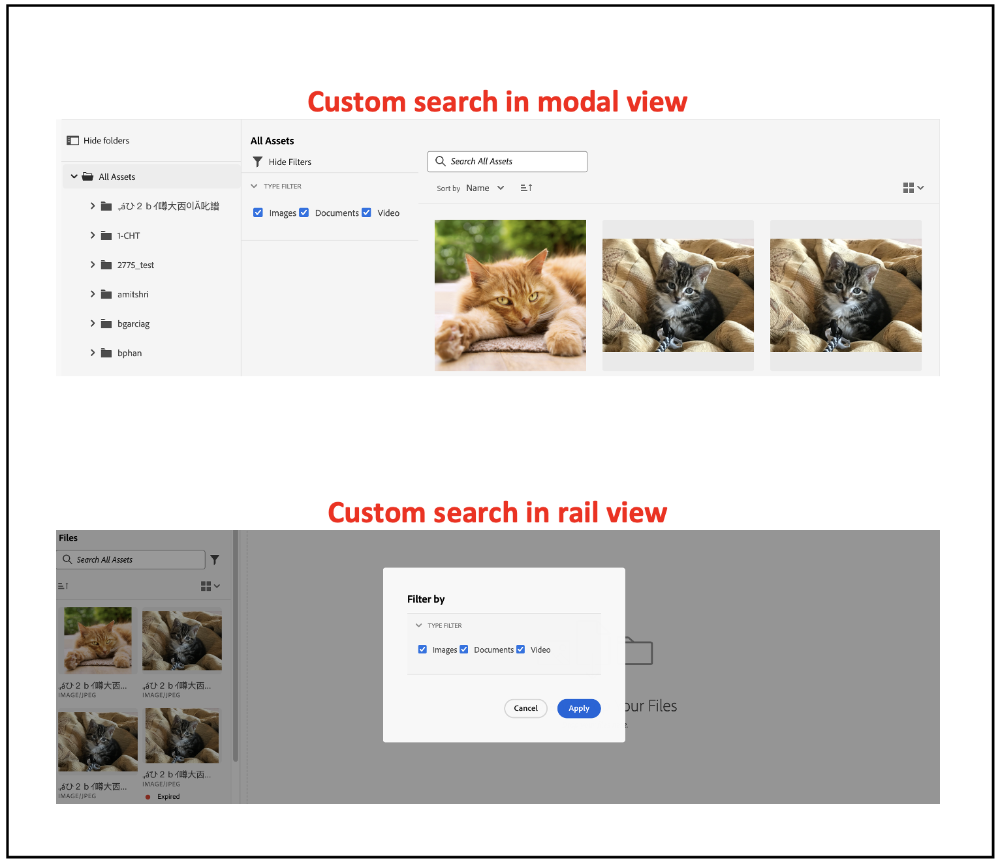

| Version | Article link |
| -------- | ---------------------------- |
| AEM as a Cloud Service     | This article         |
| AEM 6.5  |    [Click here](https://experienceleague.adobe.com/docs/experience-manager-65/assets/managing/asset-selector.html?lang=en)                  |

# Micro-Frontend Asset Selector {#Overview}

Micro-Frontend Asset Selector provides a user interface that easily integrates with the [!DNL Experience Manager Assets as a Cloud Service] repository so that you can browse or search digital assets available in the repository and use them in your application authoring experience.

The Micro-Frontend user interface is made available in your application experience using the Asset Selector package. Any updates to the package are automatically imported and the latest deployed Asset Selector loads automatically within your application.


Asset Selector provides many benefits, such as:

* Ease of integration with any of the Adobe or non-Adobe applications using Vanilla JavaScript library.
* Easy to maintain as updates to the Assets Selector package are automatically deployed to the Asset Selector available for your application. There are no updates required within your application to load the latest modifications.
* Ease of customization as there are properties available that control the Asset Selector display within your application.

* Full-text search, out-of-the-box, and customized filters to quickly navigate to assets for use within the authoring experience.

* Ability to switch repositories within an IMS organization for asset selection.

* Ability to sort assets by name, dimensions, and size and view them in List, Grid, Gallery, or  Waterfall view.

The scope of this article is to demonstrate how to use Asset Selector with an [!DNL Adobe] application under Unified Shell or when you already have an imsToken generated for authentication. These workflows are referred to as non-SUSI flow in this article. 

Perform the following tasks to integrate and use Asset Selector with your [!DNL Experience Manager Assets as a Cloud Service] repository:

* [Integrate Asset Selector using Vanilla JS](#integration-with-vanilla-js)
* [Define Asset Selector display properties](#asset-selector-properties)
* [Use Asset Selector](#using-asset-selector)

## Integrate Asset Selector using Vanilla JS {#integration-with-vanilla-js}

You can integrate any [!DNL Adobe] or non-Adobe application with [!DNL Experience Manager Assets] as a [!DNL Cloud Service] repository and select assets from within the application. 

The integration is done by importing the Asset Selector package and connecting to the Assets as a Cloud Service using the Vanilla JavaScript library. You need to edit an `index.html` or any appropriate file within your application to -

* Define the authentication details
* Access the Assets as a Cloud Service repository
* Configure the Asset Selector display properties

<!--
Asset Selector supports authentication to the [!DNL Experience Manager Assets] as a [!DNL Cloud Service] repository using Identity Management System (IMS) properties such as `imsScope` or `imsClientID`. Authentication using these IMS properties is referred to as SUSI (Sign Up Sign In) flow in this article.

You can perform authentication without defining some of the IMS properties, such as `imsScope` or `imsClientID`, if:

*   You are integrating an [!DNL Adobe] application on [Unified Shell](https://experienceleague.adobe.com/docs/experience-manager-cloud-service/content/overview/aem-cloud-service-on-unified-shell.html?lang=en).
*   You already have an IMS token generated for authentication.

Accessing [!DNL Experience Manager Assets] as a [!DNL Cloud Service] repository without defining `imsScope` or `imsClientID` IMS properties is referred to as a non-SUSI flow in this article.
-->

You can perform authentication without defining some of the IMS properties, if:

* You are integrating an [!DNL Adobe] application on [Unified Shell](https://experienceleague.adobe.com/docs/experience-manager-cloud-service/content/overview/aem-cloud-service-on-unified-shell.html?lang=en).
* You already have an IMS token generated for authentication.

## Prerequisites {#prerequisites}

<!--
If your application requires user based authentication, out-of-the-box Asset Selector also supports a flow for authentication to the [!DNL Experience Manager Assets] as a [!DNL Cloud Service] repository using Identity Management System (IMS.)

You can use properties such as `imsScope` or `imsClientID` to retrieve `imsToken` automatically. You can use SUSI (Sign Up Sign In) flow and IMS properties. Also, you can obtain your own imsToken and pass it to Asset Selector by integrating within [!DNL Adobe] application on Unified Shell or if you already have an imsToken obtained via other methods (for example, using technical account). Accessing [!DNL Experience Manager Assets] as a [!DNL Cloud Service] repository without defining IMS properties (For example, `imsScope` and `imsClientID`) is referred to as a non-SUSI flow.
-->

Define the prerequisites in the `index.html` file or a similar file within your application implementation to define the authentication details to access the [!DNL Experience Manager Assets] as a [!DNL Cloud Service] repository. The prerequisites include:

* imsOrg
* imsToken
* apikey
<!--
The prerequisites vary if you are authenticating using a SUSI flow or a non-SUSI flow.

**Non-SUSI flow**

*   imsOrg
*   imsToken
*   apikey

For more information on these properties, see [Asset Selector Properties](#asset-selector-properties).

**SUSI flow**

*   imsClientId
*   imsScope
*   redirectUrl
*   imsOrg
*   apikey

For more information on these properties, see [Example for the SUSI flow](#susi-vanilla) and [Asset Selector Properties](#asset-selector-properties).
-->

## Installation {#installation}

Assets Selectors is available via both ESM CDN (For example, [esm.sh](https://esm.sh/)/[skypack](https://www.skypack.dev/)) and [UMD](https://github.com/umdjs/umd) version.

In browsers using **UMD version** (recommended):

```
<script src="https://experience.adobe.com/solutions/CQ-assets-selectors/static-assets/resources/assets-selectors.js"></script>

<script>
  const { renderAssetSelector } = PureJSSelectors;
</script>

```

In browsers with `import maps` support using **ESM CDN version**:

```
<script type="module">
  import { AssetSelector } from 'https://experience.adobe.com/solutions/CQ-assets-selectors/static-assets/resources/@assets/selectors/index.js'
</script>

```

In Deno/Webpack Module Federation using **ESM CDN version**:

```
import { AssetSelector } from 'https://experience.adobe.com/solutions/CQ-assets-selectors/static-assets/resources/@assets/selectors/index.js'

```

### Selected Asset Type {#selected-asset-type}

Selected Asset Type is an array of objects that contains the asset information when using the `handleSelection`, `handleAssetSelection`, and `onDrop` functions. 

**Schema Syntax**

```
interface SelectedAsset {
    'repo:id': string;
    'repo:name': string;
    'repo:path': string;
    'repo:size': number;
    'repo:createdBy': string;
    'repo:createDate': string;
    'repo:modifiedBy': string; 
    'repo:modifyDate': string; 
    'dc:format': string; 
    'tiff:imageWidth': number;
    'tiff:imageLength': number;
    'repo:state': string;
    computedMetadata: Record<string, any>;
    _links: {
        'http://ns.adobe.com/adobecloud/rel/rendition': Array<{
            href: string;
            type: string;
            'repo:size': number;
            width: number;
            height: number;
            [others: string]: any;
        }>;
    };
}
```

The following table describes some of the important properties of the Selected Asset object.

| Property | Type | Explanation |
|---|---|---|
| *repo:repositoryId* | string | Unique identifier for the repository where the asset is stored. |
| *repo:id*| string | Unique identifier for the asset. |
| *repo:assetClass* | string | The classification of the asset (For example, image, or video, document). |
| *repo:name*| string | The name of the asset, including the file extension. |
| *repo:size*| number| The size of the asset in bytes.|
| *repo:path*| string | The location of the asset within the repository. |
| *repo:ancestors*| `Array<string>`| An array of ancestor items for the asset in the repository. |
| *repo:state*| string | Current state of the asset in the repository (For example, active, deleted, and so on). |
| *repo:createdBy*| string | The user or system that created the asset. |
| *repo:createDate* | string | The date and time when the asset was created. |
| *repo:modifiedBy* | string | The user or system that last modified the asset. |
| *repo:modifyDate* | string| The date and time when the asset was last modified. |
| *dc:format*| string | The format of the asset, such as the file type (For example, JPEG, PNG, and so on).|
| *tiff:imageWidth* | number| The width of an asset.|
| *tiff:imageLength* | number | The height of an asset. |
| *computedMetadata* | `Record<string, any>` | An object which represents a bucket for all the asset's metadata of all kinds (repository, application, or embedded metadata). |
| *_links* | `Record<string, any>` | Hypermedia links for the associated asset. Includes links for resources such as metadata and renditions. |
| *_links.http://ns.adobe.com/adobecloud/rel/rendition* | `Array<Object>`| Array of objects containing information about renditions of the asset. |
| *_links.http://ns.adobe.com/adobecloud/rel/rendition[].href* | string | The URI to the rendition.|
| *_links.http://ns.adobe.com/adobecloud/rel/rendition[].type* | string | The MIME type of the rendition.|
| *_links.http://ns.adobe.com/adobecloud/rel/rendition[].'repo:size'* | number | The size of the rendition in bytes.|
| *_links.http://ns.adobe.com/adobecloud/rel/rendition[].width* | number | The rendition's width. |
| *_links.http://ns.adobe.com/adobecloud/rel/rendition[].height* | number | The rendition's height. |

For a complete list of properties and detailed example, visit [Asset Selector Code Example](https://github.com/adobe/aem-assets-selectors-mfe-examples).

<!--
### ImsAuthProps {#ims-auth-props}

The `ImsAuthProps` properties define the authentication information and flow that the Asset Selector uses to obtain an `imsToken`. By setting these properties, you can control how the authentication flow should behave and register listeners for various authentication events.

| Property Name | Description|
|---|---|
| `imsClientId`| A string value representing the IMS client ID used for authentication purposes. This value is provided by Adobe and is specific to your Adobe AEM CS organization.|
| `imsScope`| Describes the scopes used in authentication. The scopes determine the level of access that the application has to your organization resources. Multiple scopes can be separated by commas.|
| `redirectUrl` | Represents the URL where the user is redirected after authentication. This value is typically set to the current URL of the application. If a `redirectUrl` is not supplied, `ImsAuthService` will use the redirectUrl used to register the `imsClientId`|
| `modalMode`| A boolean indicating whether the authentication flow should be displayed in a modal (pop-up) or not. If set to `true`, the authentication flow is displayed in a pop-up. If set to `false`, the authentication flow is displayed in a full page reload. _Note:_ for better UX, you can dynamically control this value if the user has browser pop-up disabled. |
| `onImsServiceInitialized`| A callback function that is called when the Adobe IMS authentication service is initialized. This function takes one parameter, `service`, which is an object representing the Adobe IMS service. See [`ImsAuthService`](#imsauthservice-ims-auth-service) for more details.|
| `onAccessTokenReceived`| A callback function that is called when an `imsToken` is received from the Adobe IMS authentication service. This function takes one parameter, `imsToken`, which is a string representing the access token. |
| `onAccessTokenExpired`| A callback function that is called when an access token has expired. This function is typically used to trigger a new authentication flow to obtain a new access token. |
| `onErrorReceived`| A callback function that is called when an error occurs during authentication. This function takes two parameters: the error type and error message. The error type is a string representing the type of error and the error message is a string representing the error message. |

### ImsAuthService {#ims-auth-service}

`ImsAuthService` class handles the authentication flow for the Asset Selector. It is responsible for obtaining an `imsToken` from the Adobe IMS authentication service. The `imsToken` is used to authenticate the user and authorize access to the Adobe Experience Manager (AEM) CS Assets repository. ImsAuthService uses the `ImsAuthProps` properties to control the authentication flow and register listeners for various authentication events. You can use the convenient [`registerAssetsSelectorsAuthService`](#purejsselectorsregisterassetsselectorsauthservice) function to register the _ImsAuthService_ instance with the Asset Selector. The following functions are available on the `ImsAuthService` class. However, if you are using the _registerAssetsSelectorsAuthService_ function, you do not need to call these functions directly.

| Function Name | Description |
|---|---|
| `isSignedInUser` | Determines whether the user is currently signed in to the service and returns a boolean value accordingly.|
| `getImsToken`    | Retrieves the authentication `imsToken` for the currently signed-in user, which can be used to authenticate requests to other services such as generating asset _rendition.|
| `signIn`| Initiates the sign-in process for the user. This function uses the `ImsAuthProps` to show authentication in either a pop-up or a full page reload |
| `signOut`| Signs the user out of the service, invalidating their authentication token and requiring them to sign in again to access protected resources. Invoking this function will reload the current page.|
| `refreshToken`| Refreshes the authentication token for the currently signed-in user, preventing it from expiring and ensuring uninterrupted access to protected resources. Returns a new authentication token that can be used for subsequent requests. |
-->

### Example for the non-SUSI flow {#non-susi-vanilla}

This example demonstrates how to use Asset Selector with a non-SUSI flow when running an [!DNL Adobe] application under Unified Shell or when you already have `imsToken` generated for authentication.

Include the Asset Selector package in your code using the `script` tag, as shown in _lines 6&ndash;15_ of the example below. Once the script is loaded, the `PureJSSelectors` global variable is available for use. Define the Asset Selector [properties](#asset-selector-properties) as shown in _lines 16&ndash;23_. The `imsOrg` and `imsToken` properties are both required for authentication in non-SUSI flow. The `handleSelection` property is used to handle the selected assets. To render the Asset Selector, call the `renderAssetSelector` function as mentioned in _line 17_. The Asset Selector is displayed in the `<div>` container element, as shown in _lines 21 and 22_.

By following these steps, you can use Asset Selector with a non-SUSI flow in your [!DNL Adobe] application.

```html {line-numbers="true"}
<!DOCTYPE html>
<html>
<head>
    <title>Asset Selector</title>
    <script src="https://experience.adobe.com/solutions/CQ-assets-selectors/assets/resources/assets-selectors.js"></script>
    <script>
        // get the container element in which we want to render the AssetSelector component
        const container = document.getElementById('asset-selector-container');
        // imsOrg and imsToken are required for authentication in non-SUSI flow
        const assetSelectorProps = {
            imsOrg: 'example-ims@AdobeOrg',
            imsToken: "example-imsToken",
            apiKey: "example-apiKey-associated-with-imsOrg",
            handleSelection: (assets: SelectedAssetType[]) => {},
        };
        // Call the `renderAssetSelector` available in PureJSSelectors globals to render AssetSelector
        PureJSSelectors.renderAssetSelector(container, assetSelectorProps);
    </script>
</head>

<body>
    <div id="asset-selector-container" style="height: calc(100vh - 80px); width: calc(100vw - 60px); margin: -20px;">
    </div>
</body>

</html>
```

For detailed example, visit [Asset Selector Code Example](https://github.com/adobe/aem-assets-selectors-mfe-examples).

<!--
### Example for the SUSI flow {#susi-vanilla}

Use this example `index.html` file for authentication if you are integrating your application using SUSI flow.

Access the Asset Selector package using the `Script` Tag, as shown in *line 9* to *line 11* of the example `index.html` file.

*Line 14* to *line 38* of the example describes the IMS flow properties, such as `imsClientId`, `imsScope`, and `redirectURL`. The function requires that you define at least one of the `imsClientId` and `imsScope` properties. If you do not define a value for `redirectURL`, the registered redirect URL for the client ID is used.

As you do not have an `imsToken` generated, use the `registerAssetsSelectorsAuthService` and `renderAssetSelectorWithAuthFlow` functions, as shown in line 40 to line 50 of the example `index.html` file. Use the `registerAssetsSelectorsAuthService` function before `renderAssetSelectorWithAuthFlow` to register the `imsToken` with the Asset Selector. [!DNL Adobe] recommends to call `registerAssetsSelectorsAuthService` when you instantiate the component.

Define the authentication and other Assets as a Cloud Service access-related properties in the `const props` section, as shown in *line 54* to *line 60* of the example `index.html` file.

The `PureJSSelectors` global variable, mentioned in *line 65*, is used to render the Asset Selector in the web browser.

Asset Selector is rendered on the `<div>` container element, as mentioned in *line 74* to *line 81*. The example uses a dialog to display the Asset Selector.

```html {line-numbers="true"}
<!DOCTYPE html>
<html>

<head>
    <meta http-equiv="X-UA-Compatible" content="IE=edge">
    <meta charset="utf-8">
    <title>Asset Selectors</title>
    <link rel="stylesheet" href="index.css">
    <script id="asset-selector"
        src="https://experience.adobe.com/solutions/CQ-assets-selectors/assets/resources/asset-selectors.js"></script>
    <script>

        const imsProps = {
            imsClientId: "<obtained from IMS team>",
            imsScope: "openid, <other scopes>",
            redirectUrl: window.location.href,
            modalMode: true, // false to open in a full page reload flow
            onImsServiceInitialized: (service) => {
                // invoked when the ims service is initialized and is ready
                console.log("onImsServiceInitialized", service);
            },
            onAccessTokenReceived: (token) => {
                console.log("onAccessTokenReceived", token);
            },
            onAccessTokenExpired: () => {
                console.log("onAccessTokenError");
                // re-trigger sign-in flow
            },
            onErrorReceived: (type, msg) => {
                console.log("onErrorReceived", type, msg);
            },
        }

        function load() {
            const registeredTokenService = PureJSSelectors.registerAssetsSelectorsAuthService(imsProps);
            imsInstance = registeredTokenService;
        };

        // initialize the IMS flow before attempting to render the asset selector
        load();
        

        //function that will render the asset selector
            const otherProps = {
            // any other props supported by asset selector
            }
            const assetSelectorProps = {
                "imsOrg": "imsorg",
                ...otherProps
            }
             // container element on which you want to render the AssetSelector/DestinationSelector component
            const container = document.getElementById('asset-selector');

            /// Use the PureJSSelectors in globals to render the AssetSelector/DestinationSelector component
            PureJSSelectors.renderAssetSelectorWithAuthFlow(container, assetSelectorProps, () => {
                const assetSelectorDialog = document.getElementById('asset-selector-dialog');
                assetSelectorDialog.showModal();
            });
        }
    </script>

</head>
<body class="asset-selectors">
    <div>
        <button onclick="renderAssetSelectorWithAuthFlowFlow()">Asset Selector - Select Assets with Ims Flow</button>
    </div>
        <dialog id="asset-selector-dialog">
            <div id="asset-selector" style="height: calc(100vh - 80px); width: calc(100vw - 60px); margin: -20px;">
            </div>
        </dialog>
    </div>
</body>

</html>

```
-->

## Use Asset Selector properties {#asset-selector-properties}

You can use the Asset Selector properties to customize the way the Asset Selector is rendered. The following table lists the properties that you can use to customize and use the Asset Selector.

| Property | Type | Required | Default |Description |
|---|---|---|---|---|
| *rail*| boolean | No | false | If marked `true`, Asset Selector is rendered in a left rail view. If it is marked `false`, the Asset Selector is rendered in modal view. |
| *imsOrg*| string | Yes | | Adobe Identity Management System (IMS) ID that is assigned while provisioning [!DNL Adobe Experience Manager] as a [!DNL Cloud Service] for your organization. The `imsOrg` key is required to authenticate whether the organization you are accessing is under Adobe IMS or not. |
| *imsToken* | string | No | | IMS bearer token used for authentication. `imsToken` is required if you are using the non-SUSI flow. |
| *apiKey* | string | No | | API key used for accessing the AEM Discovery service. `apiKey` is required if you are using the non-SUSI flow.|
| *rootPath* | string | No | /content/dam/ | Folder path from which Asset Selector displays your assets. `rootPath` can also be used in the form of encapsulation. For example, given the following path, `/content/dam/marketing/subfolder/`, Asset Selector does not allow you to traverse through any parent folder, but only displays the children folders. |
| *path* | string | No | | Path that is used to navigate to a specific directory of assets when the Asset Selector is rendered. |
| *filterSchema* | array | No | | Model that is used to configure filter properties. This is useful when you want to limit certain filter options in Asset Selector.|
| *filterFormProps*| Object | No | | Specify the filter properties that you need to use to refine your search. For example, MIME type JPG, PNG, GIF. |
| *selectedAssets* | Array `<Object>` | No       |                 | Specify selected Assets when the Asset Selector is rendered. An array of objects is required that contains an id property of the assets. For example, `[{id: 'urn:234}, {id: 'urn:555'}]` An asset must be available in the current directory. If you need to use a different directory, provide a value for the `path` property as well. |
| *acvConfig* | Object | No | | Asset Collection View property that contains object containing custom configuration to override defaults. |
| *i18nSymbols*            | `Object<{ id?: string, defaultMessage?: string, description?: string}>` | No       |                 | If the OOTB translations are insufficient for your application's needs, you can expose an interface through which you can pass your own custom localized values through the `i18nSymbols` prop. Passing a value through this interface overrides the default translations provided and instead use your own.  To perform the override, you must pass a valid [Message Descriptor](https://formatjs.io/docs/react-intl/api/#message-descriptor) object to the key of `i18nSymbols` that you want to override. |
| *intl* | Object | No  | | Asset Selector provides default, OOTB translations. You can select the translation language by providing a valid locale string through the `intl.locale` prop. For example: `intl={{ locale: "es-es" }}` </br></br> The locale strings supported follow the [ISO 639 - Codes](https://www.iso.org/iso-639-language-codes.html) for the representation of names of languages standards. </br></br> List of supported locales: English - 'en-us' (default) Spanish - 'es-es' German - 'de-de' French - 'fr-fr' Italian - 'it-it' Japanese - 'ja-jp' Korean - 'ko-kr' Portuguese - 'pt-br' Chinese (Traditional) - 'zh-cn' Chinese (Taiwan) - 'zh-tw' |
| *repositoryId* | string | No | ''| Repository from where the Asset Selector loads the content. |
| *additionalAemSolutions* | `Array<string>` | No | [ ] | It lets you add a list of additional AEM repositories. If no information is provided in this property, then only media library or AEM Assets repositories are considered.|
| *hideTreeNav*| boolean | No |  | Specifies whether to show or hide assets tree navigation sidebar. It is used in modal view only and hence there is no effect of this property in rail view. |
| *onDrop* | Function | No | | The property allows the drop functionality of an asset. |
| *dropOptions* | `{allowList?: Object}` | No | | Configures drop options using 'allowList'.  |
| *colorScheme* | string | No | | Configure theme (`light` or `dark`) for the Asset Selector. |
| *handleSelection* | Function | No | | Invoked with array of Asset items when assets are selected and the `Select` button on the modal is clicked. This function is only invoked in modal view. For rail view, use the `handleAssetSelection` or `onDrop` functions. Example: <pre>handleSelection=(assets: Asset[])=> {...}</pre> See [Selected Asset Type](#selected-asset-type) for details.|
| *handleAssetSelection*| Function | No | | Invoked with array of items as the assets are being selected or unselected. This is useful when you want to listen for assets as user selects them. Example: <pre>handleSelection=(assets: Asset[])=> {...}</pre> See [Selected Asset Type](#selected-asset-type) for details. |
| *onClose* | Function | No | | Invoked when `Close` button in modal view is pressed. This is only called in `modal` view and disregarded in `rail` view. |
| *onFilterSubmit* | Function | No | | Invoked with filter items as user changes different filter criteria. |
| *selectionType* | string | No | single | Configuration for `single` or `multiple` selection of assets at a time. |

## Examples to use Asset Selector properties {#usage-examples}

You can define the Asset Selector [properties](#asset-selector-properties) in the `index.html` file to customize the Asset Selector display within your application.

### Example 1: Asset Selector in rail view

   

If the value of the AssetSelector `rail` is set to `false` or is not mentioned in the properties, Asset Selector displays in the Modal view by default.

<!--
### Example 2: Use selectedAssets property in addition to the path property

Use the `path` property to define the folder name that displays automatically when the Asset Selector is rendered. In addition, use the `selectedAssets` property to define the IDs for the assets that you need to select within the folder. Moreover, when you want to display assets that are pre-defined within the folder, you can use selectedAssets property.

   
-->

### Example 2: Metadata popover

Use various properties to define metadata of an asset that you want to view using an info icon. The info popover provides the collection of information about asset or the folder including title, dimensions, date of modification, location, and description of an asset. In the example below, various properties are used to display metadata of an asset, for example, `repo:path` property specifies the location of an asset. <!--`repo` represents the repository from where the asset is showing, whereas, `path` represents the route from where the asset or folder is rendered.-->
    
   


### Example 3: Custom filter property in rail view

In addition to the faceted search, Assets Selector lets you customize various attributes to refine your search from [!DNL Adobe Experience Manager] as a [!DNL Cloud Service] application. You need to add the following code to add customized search filters in your application. In the example below, the `Type Filter` search that filters the asset type among Images, Documents, or Videos or the filter type that you have added for the search.


<!--

## Customization after integrating Asset Selector 

### Custom metadata

Assets display panel shows the out of the box metadata that can be displayed in the info of the asset. In addition to this, [!DNL Adobe Experience Manager] as a [!DNL Cloud Service] application allows configuration of the asset selector by adding custom metadata that is shown in info panel of the asset.
-->

<!-- Property details to be added here. Referred the ticket https://jira.corp.adobe.com/browse/ASSETS-19023-->

<!--
## Asset Selector Object Schema {#object-schema}

Schema describes the object properties associated with an asset selected using Asset Selector. It uses the combination of data types and their values to validate the object describing the selected Asset using an Asset Selector.

**Schema Syntax**
````
interface SelectedAsset {
    'repo:id': string;
    'repo:name': string;
    'repo:path': string;
    'repo:size': number;
    'repo:createdBy': string;
    'repo:createDate': string;
    'repo:modifiedBy': string; 
    'repo:modifyDate': string; 
    'dc:format': string; 
    'tiff:imageWidth': number;
    'tiff:imageLength': number;
    'repo:state': string;
    computedMetadata: Record<string, any>;
    _links: {
        'http://ns.adobe.com/adobecloud/rel/rendition': Array<{
            href: string;
            type: string;
            'repo:size': number;
            width: number;
            height: number;
            [others: string]: any;
        }>;
    };
}
````

**Query Parameters**

| Parameter | Type | Description |
|---|---|---|
| repo:id | string | ID of an Asset |
| repo:name | string | The name of an Asset |
| repo:path | string | The path of an Asset |
| repo:size | number | Size of an Asset (in bytes) |
| repo:createdBy | string | ID of a user who created an Asset |
| repo: createdDate | string | The timestamp when an asset was created |
| repo:modifiedBy | string | ID of a user who modified the asset recently |
| repo:modifyDate | string | The timestamp when the asset was last modified |
| dc:format | string | MIME type of an Asset |
| tiff:imageWidth | number | The width of an image type of Asset |
| tiff:imageLength | number | The height of an image type of Asset |
| repo:state | string | The `Approved`, `Rejected`, or `Expired`state of an Asset |
| computedMetadata | string | It is an object that represents a bucket for all the Asset's metadata of all kinds (repository, application or embedded metadata) |
| _links | string | It represents the collection of links used in the Asset Selector. The links are represented in the form of an array. The parameters of an array include: `href`, `type`, `repo:size`, `width`, `height`, and so on  |

For the detailed example of Object Schema, click 
-->

## Handling selection of Assets using Object Schema {#handling-selection}

The `handleSelection` property is used to handle single or multiple selections of Assets in Assets Selector. The example below states the syntax of usage of `handleSelection`. 


## Using Asset Selector {#using-asset-selector}

Once the Asset Selector is set up and you are authenticated to use Asset Selector with your [!DNL Adobe Experience Manager] as a [!DNL Cloud Service] application, you can select assets or perform various other operations to search for your assets within the repository.

   

* **A**: [Hide/Show panel](#hide-show-panel)
* **B**: [Repository switcher](#repository-switcher)
* **C**: [Assets](#repository)
* **D**: [Filters](#filters)
* **E**: [Search bar](#search-bar)
* **F**: [Sorting](#sorting)
* **G**: [Sorting in ascending or descending order](#sorting)
* **H**: [View](#types-of-view)

### Hide/Show panel {#hide-show-panel}

To hide folders in the left navigation, click **[!UICONTROL Hide folders]** icon. To undo the changes, click the **[!UICONTROL Hide folders]** icon again.

### Repository switcher {#repository-switcher}

Asset Selector also lets you switch repositories for asset selection. You can select the repository of your choice from the drop-down available in the left panel. The repository options available in the drop-down list are based on the `repositoryId` property defined in the `index.html` file. It is based on the environments from the selected IMS org that is accessed by the logged in user. Consumers can pass a preferred `repositoryID` and in that case the Asset Selector stops rendering the repo switcher and render assets from the given repository only.
<!--
It is based on the `imsOrg` that is provided in the application. If you want to see the list of repositories, then `repositoryId` is required to view those specific repositories in your application.
-->

### Assets repository

It is a collection of assets folders that you can use to perform operations. 

### Out-of-the-box filters {#filters}

Asset Selector also provides out-of-the-box filter options to refine your search results. The following filters are available:

* `File type`: includes folder, file, images, documents, or video
* `MIME type`: includes JPG, GIF, PPTX, PNG, MP4, DOCX, TIFF, PDF, XLSX
* `Image Size`: includes minimum/maximum width, minimum/maximum height of image

    

### Custom search

Apart from the full-text search, Asset Selector lets you search assets within files using customized search. You can use custom search filters in both Modal view and Rail view modes.



You can also create default search filter to save the fields that you frequently search for and use them later. To create custom search for your assets, you can use `filterSchema` property.

### Search bar {#search-bar}

Asset Selector lets you perform full text search of assets within the selected repository. For example, if you type the keyword `wave` in the search bar, all the assets with the `wave` keyword mentioned in any of the metadata properties are displayed.

### Sorting {#sorting}

You can sort assets in Asset Selector by name, dimensions, or size of an asset. You can also sort the assets in ascending or descending order.

### Types of view {#types-of-view}

Asset Selector lets you view the asset in four different views:

* ** [!UICONTROL List View]**: The list view displays scrollable files and folders in a single column.
* ** [!UICONTROL Grid View]**: The grid view displays scrollable files and folders in a grid of rows and columns.
* ** [!UICONTROL Gallery View]**: The gallery view displays files or folders in a center-locked horizontal list.
* ** [!UICONTROL Waterfall View]**: The waterfall view displays files or folders in the form of a Bridge.

<!--
### Modes to view Asset Selector

Asset Selector supports two types of out of the box views:

**  Modal view or Inline view:** The modal view or inline view is the default view of Asset Selector that represents Assets folders in the front area. The modal view allows users to view assets in a full screen to ease the selection of multiple assets for import. Use `<AssetSelector rail={false}>` to enable modal view.

    

**  Rail view:** The rail view represents Assets folders in a left panel. The drag and drop of assets can be performed in this view. Use `<AssetSelector rail={true}>` to enable rail view.

    
-->
<!--

### Application Integration

Asset Selector is flexible and can be integrated within your existing [!DNL Adobe Experience Manager] as a [!DNL Cloud Service] application. It is accessible and localized to add, search, and select assets in your application. With Asset Selector you can:
*   **Configure** You can configure the files/folders that you want to show at the upfront. The assets that are chosen to view can be of any supported formats, for example, JPEG. It lets you control the display of various text or symbols as per your choice.
*   **Perfect fit** Asset selector easily fits in your existing [!DNL Adobe Experience Manager] as a [!DNL Cloud Service] application and choose the way you want to view. The mode of view can be inline, rail, or modal view.
*   **Accessible** With Asset Selector, you can reach the desired asset in an easy manner.
*   **Localize** Assets can be availed for the various locales available as per Adobe's localization standards.
-->
<!--

### Support for multiple instances

The micro front-end design supports the display of multiple instances of Asset Selector on a single screen.


-->

<!--

### Controlled selection with multi-select

You can make default multi-selection of assets by specifying the assets to the component using `selectedAssets` property. You should specify an array of asset IDs. For example, `[{id: 'urn:234}, {id: 'urn:555'}].`
-->
<!--

### Action buttons

When you customize your application with Asset Selector based on ReactJS, you are provided with the following action buttons to perform various actions:
*   **Open in media library** Lets you open the asset in media library.
*   **Upload** Lets you upload an asset directly.
*   **Download** Downloads the asset in [!DNL Adobe Experience Manager] as a [!DNL Cloud Service].
-->
<!--

### Status of an asset

Asset Selector lets you know the status of your uploaded assets. The status can be `Approved`, `Rejected`, or `Expired` of the asset. 
-->
<!--

### Localization

The integration of Asset Selector with [!DNL Adobe Experience Manager] as a [!DNL Cloud Service] allows localized content appear in your application.
-->
