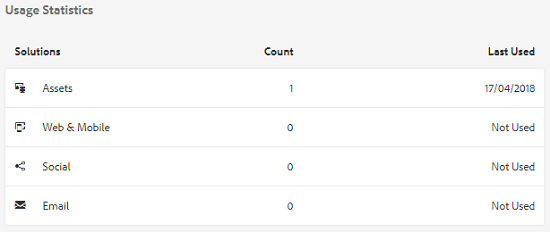
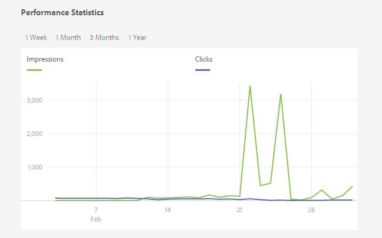
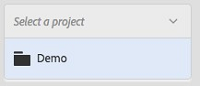
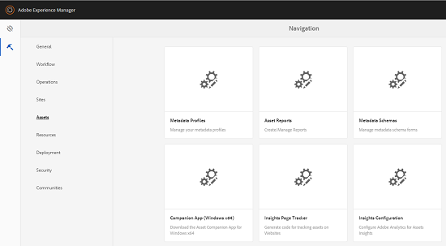

# Assets Insights {#asset-insights}

| Version                | Article link                                                                                                            |
| ---------------------- | ----------------------------------------------------------------------------------------------------------------------- |
| AEM 6.5                | [Click here](https://experienceleague.adobe.com/docs/experience-manager-65/assets/managing/asset-insights.html?lang=en) |
| AEM as a Cloud Service | This article                                                                                                            |

Assets Insights functionality lets you track user ratings and usage statistics of images that are used in third-party websites, marketing campaigns, and Adobe's creative solutions. It helps provide insights about performance and popularity of the images.

Assets Insights captures user activity details, such as the number of times an image is rated, clicked, and impressions (number of times an image is loaded on the website). It assigns scores to images based on these statistics. You can use the scores and performance statistics to select popular images for inclusion in catalogs, marketing campaigns, and so on. You can even formulate archival and license renewal policies based on these statistics.

To let Assets Insights display usage statistics for assets, configure the integration with [!DNL Adobe Analytics]. For details, see [Configure Assets Insights](#configure-asset-insights). You must have an [!DNL Adobe Analytics] license to use this feature.

>[!IMPORTANT]
>
>Adobe Analytics 1.4 API and its legacy authentication method are being retired. Assets Insights now uses the Adobe Analytics 2.0 API with OAuth Server-to-Server authentication through Adobe IMS. After your AEM as a Cloud Service environment receives the update that provides the new integration, you must configure Assets Insights to continue retrieving current insights data.

>[!NOTE]
>
>Insights are supported and provided only for images.

## View statistics for an image {#viewing-statistics-for-an-image}

You can view the Assets Insights scores from the metadata page.

1. From the Assets user interface, select the image and then click **[!UICONTROL Properties]** from the toolbar.

2. From the Properties page, click **[!UICONTROL Insights]**.

3. Review the usage details for the asset in the **[!UICONTROL Insights]** tab. The **[!UICONTROL Score]** section describes the total asset usage and performance scores of an asset.

   Usage score describes the number of times an asset is used in various solutions.

   The **[!UICONTROL Impressions]** score is the number of times the asset is loaded on the website. The number displayed under **[!UICONTROL Clicks]** is the number of times the asset is clicked.

4. Review the **[!UICONTROL Usage Statistics]** section to know which entities the asset was part of and which creative solutions recently used it. The higher the usage, the greater the chances that the asset is popular among users. Usage data is displayed under the following heads:

   * **[!UICONTROL Asset]**: The number of times the asset was part of a collection or compound asset.

   * **[!UICONTROL Web & Mobile]**: The number of times the asset was part of websites and apps.

   * **[!UICONTROL Social]**: The number of times the asset was used in other solutions such as a [!DNL Adobe Campaign].

   * **[!UICONTROL Email]**: The number of times the asset was used in email campaigns.

   

   >[!NOTE]
   >
   >Because the Assets Insights feature typically fetches the Solutions data from [!DNL Adobe Analytics] in a periodic manner, the Solutions section may not display the most recent data. The time period for which the data is displayed depends the schedule of the fetch operation that Assets Insights runs to retrieve Analytics data.

5. To view performance statistics for the asset graphically over a period of time, select period in the **[!UICONTROL Performance Statistics]** section. Details, including clicks and impressions are displayed as trend lines of a graph.

   

   >[!NOTE]
   >
   >Unlike the data in the Solutions section, the Performance Statistics section displays the most recent data.

6. To obtain the embed code for the asset that you include in websites to get performance data, click **[!UICONTROL Get Embed Code]** below the asset thumbnail.

   

## View aggregate statistics for images {#viewing-aggregate-statistics-for-images}

You can view scores of all assets within a folder simultaneously using **[!UICONTROL Insights View]**.

1. In the Assets user interface, navigate to the folder containing the assets for which you want to view insights.

2. Click the **[!UICONTROL Layout]** option from the toolbar, and then choose **[!UICONTROL Insights View]**.

3. The page displays usage scores for the assets. Compare the ratings of the various assets and draw insights.

## Configure Assets Insights {#configure-asset-insights}

[!DNL Experience Manager Assets] fetches usage data around digital assets used by third-party websites from [!DNL Adobe Analytics]. To enable Assets Insights to retrieve this data and generate insights, configure the integration with [!DNL Adobe Analytics] using an Adobe IMS Configuration and an OAuth Server-to-Server credential.

### Prerequisites {#prerequisites}

Before configuring Assets Insights, ensure that the following requirements are met:

* Your AEM as a Cloud Service environment has received the update that provides the **[!UICONTROL Asset Insights]** Cloud Solution.
* **AEM Assets Reporting** is enabled for the [!DNL Adobe Analytics] report suite used for Assets Insights.
* You have an active [!DNL Adobe Analytics] entitlement.
* You have access to Adobe Developer Console and can create an OAuth Server-to-Server credential.

>[!NOTE]
>
>Insights are only supported and provided for images.

### Create an OAuth Server-to-Server credential {#create-oauth-credential}

1. Create an OAuth Server-to-Server credential in Adobe Developer Console.

   * Open an existing project for the IMS Org used with [!DNL Adobe Analytics], or create a new project.

   * Add the **Adobe Analytics API** to the project.

   * Select **OAuth Server-to-Server** as the credential type. Do not create a new Service Account (JWT) credential for this integration.

   * Open the credential details and securely save the **Client ID**, **Client Secret**, and **Scopes** values.

   * Confirm that the IMS Org has an active [!DNL Adobe Analytics] entitlement and that the credential has access to the required report suite.

### Create the Adobe IMS Configuration {#create-ims-configuration}

1. In [!DNL Experience Manager], click **[!UICONTROL Tools]** > **[!UICONTROL Cloud Services]** > **[!UICONTROL Adobe IMS Configurations]** > **[!UICONTROL Create]**.

2. For **[!UICONTROL Cloud Solution]**, select **[!UICONTROL Asset Insights]**.

   >[!NOTE]
   >
   >If **[!UICONTROL Asset Insights]** is not available as a Cloud Solution, your AEM as a Cloud Service environment may not yet have received the update that introduces the new integration. Confirm that the required update is available in your environment. Do not create a new legacy configuration.

3. Enter the values from the OAuth Server-to-Server credential that you created in Adobe Developer Console:

   | Field                          | Value                                      |
   | ------------------------------ | ------------------------------------------ |
   | **[!UICONTROL Auth Server]**   | `https://ims-na1.adobelogin.com`           |
   | **[!UICONTROL Client ID]**     | Client ID from Adobe Developer Console     |
   | **[!UICONTROL Client Secret]** | Client Secret from Adobe Developer Console |
   | **[!UICONTROL Scopes]**        | Scopes copied from the credential details  |

4. Click **[!UICONTROL Save]**, then use **[!UICONTROL Check Health]** to confirm that the configuration authenticates successfully through Adobe IMS.

### Configure Assets Insights {#configure-assets-insights}

1. In [!DNL Experience Manager], click **[!UICONTROL Tools]** > **[!UICONTROL Assets]** > **[!UICONTROL Insights Configuration]**.

2. For **[!UICONTROL IMS Configuration]**, select the Adobe IMS Configuration that you created in the previous step.

3. In **[!UICONTROL Analytics Company]**, enter the [!DNL Adobe Analytics] **Global Company ID**.

   >[!NOTE]
   >
   >The Global Company ID is different from the company display name used in the legacy Assets Insights configuration. Do not enter the company display name in this field. Using the display name instead of the Global Company ID can result in an empty report suite list.

4. Select the **[!UICONTROL Report Suite]** used for Assets Insights.

5. If required, enter the **[!UICONTROL Tracking Server]** and **[!UICONTROL Secure Tracking Server]** values. If your tag management solution already sends Adobe Analytics beacons, you can leave these fields blank.

6. Click **[!UICONTROL Done]** to save the configuration.

For more information, see [Adobe Analytics Web Services](https://experienceleague.adobe.com/docs/analytics/admin/company-settings/web-services-admin.html#api-access-information).

### Enable AEM Assets Reporting {#enable-aem-assets-reporting}

The [!DNL Adobe Analytics] report suite used for Assets Insights must have **AEM Assets Reporting** enabled.

1. In [!DNL Adobe Analytics], go to **[!UICONTROL Admin]** > **[!UICONTROL Report Suites]**.

2. Select the report suite used for Assets Insights.

3. Select **[!UICONTROL Edit Settings]** > **[!UICONTROL AEM]** > **[!UICONTROL AEM Assets Reporting]**.

4. Confirm that AEM Assets Reporting is enabled.

This setting provisions the Analytics dimensions and events used for asset impressions, clicks, and asset identifiers.

### Page Tracker {#page-tracker}

After you configure Assets Insights, the Page Tracker code is available for download. To enable Assets Insights to track [!DNL Experience Manager] assets used on third-party websites, include the Page Tracker code in the website code.

The Page Tracker and asset tracking implementation are separate from the Adobe IMS authentication configuration described in [Configure Assets Insights](#configure-asset-insights). If your website is already instrumented for Assets Insights and successfully sends asset impressions and clicks to [!DNL Adobe Analytics], you do not need to change the existing tracking implementation as part of this configuration update.

1. In [!DNL Experience Manager], click **[!UICONTROL Tools]** > **[!UICONTROL Assets]**.

   

2. From the **[!UICONTROL Navigation]** page, click the **[!UICONTROL Insights Page Tracker]** card.

3. Click **[!UICONTROL Download]** to download the page tracker code.

### Verify data is flowing {#verify-data-flow}

After configuring Assets Insights:

1. Verify that the Adobe IMS Configuration **[!UICONTROL Check Health]** action succeeds.

2. Confirm that the expected report suite is selected in **[!UICONTROL Insights Configuration]**.

3. Verify that your existing website instrumentation continues to send asset impressions and clicks to [!DNL Adobe Analytics].

4. Allow the next scheduled synchronization to complete. Assets Insights synchronizes data daily and can take up to 24 hours to reflect newly available data.

5. After reconfiguration, the next synchronization retrieves available insights data, including data collected during the period when AEM could not retrieve data through the retired API.

6. Open an image asset in [!DNL Experience Manager] and review its **[!UICONTROL Insights]** tab.

If your existing website instrumentation already sends asset impressions and clicks correctly, you do not need to replace it as part of this configuration change.

>[!NOTE]
>
>Existing asset data is not deleted as a result of the Adobe Analytics 1.4 API retirement. Adobe Analytics continues to store the collected asset activity.

## Impact of the Adobe Analytics API retirement {#api-retirement-impact}

|                                                    |                                                                                                 |                                                                               |
| -------------------------------------------------- | ----------------------------------------------------------------------------------------------- | ----------------------------------------------------------------------------- |
| Asset impressions and clicks collected on websites | Continue to be captured as usual, assuming the existing page instrumentation remains functional | No change to the collection implementation is required for this retirement    |
| Adobe Analytics data                               | Continues to receive and store the insights data                                                | No action required for this specific issue                                    |
| Assets Insights in AEM Admin View                  | Does not display fresh insights data after the legacy API is retired                            | Reconfigure Assets Insights after the new AEM release is available            |
| Existing data already stored in AEM                | Remains available                                                                               | No data migration or deletion is required                                     |
| Data collected during the temporary gap            | Remains available in Adobe Analytics and can be retrieved after reconfiguration                 | Complete the new configuration and allow the next AEM synchronization         |
| Assets View Insights                               | Not affected by this Admin View integration issue                                               | No action required                                                            |
| Adobe Analytics reports                            | Not affected by this AEM retrieval issue                                                        | Use Adobe Analytics reporting during the temporary AEM display gap, if needed |

## Troubleshooting {#troubleshooting}

### The Asset Insights Cloud Solution is not available

If **[!UICONTROL Asset Insights]** is not available when you create an Adobe IMS Configuration, your AEM as a Cloud Service environment may not yet include the update that introduces the new integration.

Confirm that the required AEM update is available in your environment. Do not create another legacy configuration. If the option remains unavailable after the required update is available, contact Adobe Support.

### Check Health fails

Verify the following:

* The Client ID and Client Secret match the OAuth Server-to-Server credential in Adobe Developer Console.

* The credential uses OAuth Server-to-Server authentication.

* The scopes were copied exactly from the credential details.

* The Adobe Analytics API was added to the Developer Console project.

* The IMS Org has an active Adobe Analytics entitlement.

### The report suite list is empty

Verify the following:

* The **[!UICONTROL Analytics Company]** value is the Global Company ID, not the company display name.

* The OAuth credential has access to the target report suite.

* The IMS Org in Adobe Developer Console is associated with the Analytics company.

* AEM Assets Reporting is enabled for the report suite.

### AEM is not showing current data

After completing the configuration:

* Allow up to 24 hours for the scheduled synchronization.

* Confirm that new asset impressions or clicks are visible in Adobe Analytics.

* Confirm that the asset identifier is being sent by the existing tracking implementation.

* Confirm that the selected report suite is the one receiving the asset activity.

## Frequently asked questions {#frequently-asked-questions}

### Will asset impressions and clicks stop being collected?

No. The retirement affects the legacy AEM-to-Adobe Analytics retrieval path. Existing website instrumentation continues to send asset activity to [!DNL Adobe Analytics].

### Will data be lost?

No. Existing data is not deleted. Data collected during the temporary gap remains available in [!DNL Adobe Analytics] and can be retrieved by AEM after the new configuration is completed and synchronization resumes.

### Does Assets Insights automatically switch to the new configuration?

No. After the required AEM update is available, you must manually create the Adobe IMS Configuration and update the Assets Insights configuration to use it.

### Are Assets View Insights affected?

No. This change applies to Assets Insights in AEM Admin View. Assets View Insights is not affected by this integration change.

### Are Adobe Analytics reports affected?

No. [!DNL Adobe Analytics] continues to receive and store the collected data. The change affects the retrieval and display of refreshed insights data in AEM Admin View.

**See also**

* [Translate Assets](/help/assets/translate-assets.md)
* [Assets HTTP API](/help/assets/mac-api-assets.md)
* [Assets supported file formats](/help/assets/file-format-support.md)
* [Search assets](/help/assets/search-assets.md)
* [Connected assets](/help/assets/use-assets-across-connected-assets-instances.md)
* [Asset reports](/help/assets/asset-reports.md)
* [Metadata schemas](/help/assets/metadata-schemas.md)
* [Download assets](/help/assets/download-assets-from-aem.md)
* [Manage metadata](/help/assets/manage-metadata.md)
* [Manage Dynamic Media templates](/help/assets/dynamic-media/manage-dynamic-media-templates.md)
* [Manage reports in Assets view](/help/assets/manage-reports-assets-view.md)
* [Search facets](/help/assets/search-facets.md)
* [Manage collections](/help/assets/manage-collections.md)
* [Bulk metadata import](/help/assets/metadata-import-export.md)
* [Publish Assets to AEM and Dynamic Media](/help/assets/publish-assets-to-aem-and-dm.md)