# [!DNL Assets] as a Cloud Service Prime  {#assets-prime}

<table>
    <tr>
        <td>
            <i>New</i> <a href="/help/assets/dynamic-media/dm-prime-ultimate.md"><b>Dynamic Media Prime and Ultimate</b></a>
        </td>
        <td>
            <i>New</i> <a href="/help/assets/assets-ultimate-overview.md"><b>AEM Assets Ultimate</b></a>
        </td>
        <td>
            <i>New</i> <a href="/help/assets/integrate-aem-assets-edge-delivery-services.md"><b>AEM Assets integration with Edge Delivery Services</b></a>
        </td>
        <td>
            <i>New</i> <a href="/help/assets/aem-assets-view-ui-extensibility.md"><b>UI Extensibility</b></a>
        </td>
          <td>
            <i>New</i> <a href="/help/assets/dynamic-media/enable-dynamic-media-prime-and-ultimate.md"><b>Enable Dynamic Media Prime and Ultimate</b></a>
        </td>
    </tr>
    <tr>
        <td>
            <a href="/help/assets/search-best-practices.md"><b>Search Best Practices</b></a>
        </td>
        <td>
            <a href="/help/assets/metadata-best-practices.md"><b>Metadata Best Practices</b></a>
        </td>
        <td>
            <a href="/help/assets/product-overview.md"><b>Content Hub</b></a>
        </td>
        <td>
            <a href="/help/assets/dynamic-media-open-apis-overview.md"><b>Dynamic Media with OpenAPI capabilities</b></a>
        </td>
        <td>
            <a href="https://developer.adobe.com/experience-cloud/experience-manager-apis/"><b>AEM Assets developer documentation</b></a>
        </td>
    </tr>
</table>

Assets as a Cloud Service Prime includes a lightweight DAM that enables you to perform various key capabilities, such as:

* **Asset management and library services**​: Tools that enable users to ingest, store, catalog, control, manage, and govern a brand's digital assets in a centralized repository 

* **Search, Discovery, and Collaboration**: Tools that enable users to browse, discover, share, and collaborate on assets they need to create rich customer experiences.

* **Security & Rights Management**: Tools to manage access, permissions, rights, and security to ensure compliance, consistency, and brand integrity.

* **Creative Cloud Connections**: Tools that enable marketing & creative teams to collaborate with simplified access, comment, review, and annotations to update or finalize digital assets.

* **Experience Cloud Connections**: Tools to support native access to digital assets from other Experience Cloud applications and services.

* **Distribution Portal Experience with no extensibility options (Content Hub)**: Tools to expand access to a brand's approved digital assets to extended stakeholders to ensure usage and brand consistency.

* **Integrations**: integrations with other Adobe and non-Adobe applications.

* **Dynamic Media (add-on)**: Tools to transform and deliver images, videos, and other emerging content for rich, interactive, multimedia experiences for any device at scale.

   >[!NOTE]
   >
   >Dynamic Media with OpenAPI capabilities, which provides you access to basic image modifiers like rotate, crop (manual only - no smart crop), flip, size, preferwebp, height, width, quality, format and adaptive video streaming, is also available with Assets Prime. Reach out to Adobe account team to learn more.

1. [Create a new program](/help/journey-onboarding/create-program.md).

However, as your DAM needs grow and you need more capabilities, such as, UI extensibility, API-driven automation, and custom code deployment, you must consider upgrading to [Assets Ultimate](/help/assets/assets-ultimate-overview.md).

This article provides an end-to-end workflow to enable Assets as a Cloud Service Prime.

## Enable Assets as a Cloud Service Prime{#enable-assets-prime}

Enable Assets Prime  while creating a new program using Cloud Manager. Execute the following steps:

1. As a system administrator, log on to Cloud Manager. Ensure that you select the right organization while logging in.

   >[!NOTE]
   >
   >Ensure that you are added to the appropriate Cloud Manager product profile to add a new program. For more information, see [Role Based Permissions in Cloud Manager](/help/onboarding/cloud-manager-introduction.md#role-based-permissions).

1. [Create a new program](/help/journey-onboarding/create-program.md).

   While creating the new program, in **[!UICONTROL Solutions & Add-ons]** tab, select **[!UICONTROL Assets Prime]**. You can also expand **[!UICONTROL Assets Prime]** and select **[!UICONTROL Content Hub]** to enable [Content Hub](/help/assets/product-overview.md) for asset distribution.

   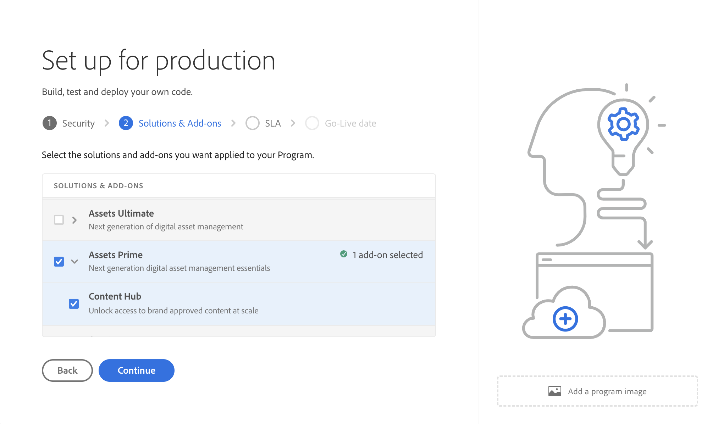

1. Click **[!UICONTROL Create]** to create the program. 

1. Click the program card and click **[!UICONTROL Add Environment]**.

1. Specify the environment name, define a region and click **[!UICONTROL Save]** to create the environment.

   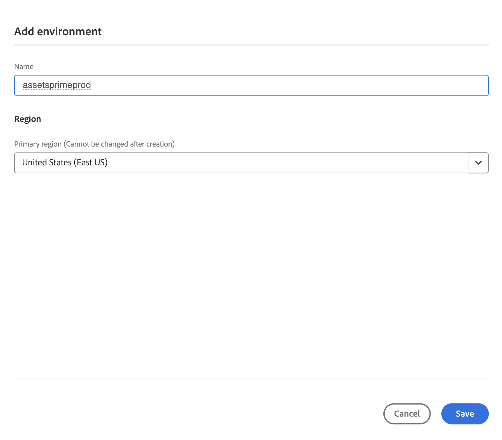

>[!NOTE]
>
>Assets Prime only allows you to create a production environment. The option to Add environment is no longer available once the production environment is created successfully.

Assets Prime is now enabled for Experience Manager Assets as a Cloud Service.

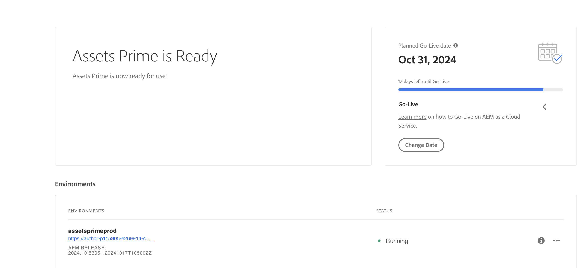

System administrator is automatically entitled as AEM administrator and receives an email to navigate to Admin Console to manage product profiles.

Your AEM as a Cloud Service instance on Admin Console comprises the following product profiles:

* AEM Administrators

* AEM Users

* [AEM Assets Collaborator Users](#onboard-collaborator-users)

* [AEM Assets Power Users](#onboard-power-users)

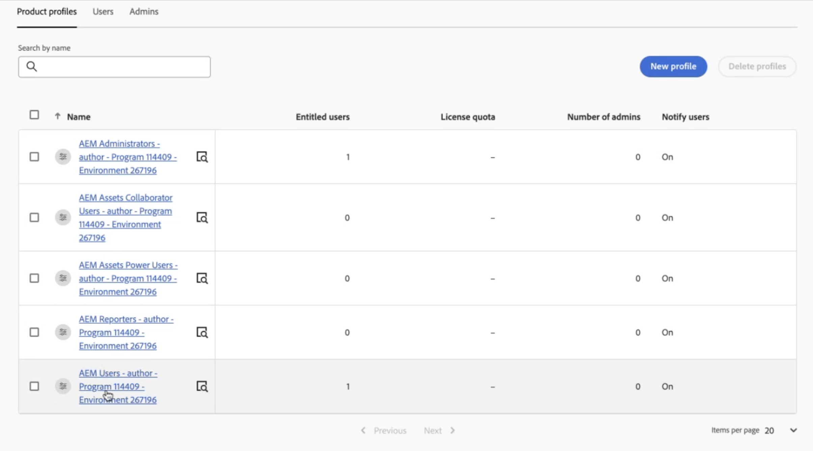

You can start adding users or user groups to AEM Assets Collaborator Users and AEM Assets Power Users product profiles. For more information, see [Onboard AEM Assets Collaborator users](#onboard-collaborator-users) and [Onboard AEM Assets Power users](#onboard-power-users).

If you have enabled Content Hub for Assets as a Cloud Service, there is a new instance created within AEM Assets as a Cloud Service on Admin Console with `delivery` as the suffix:

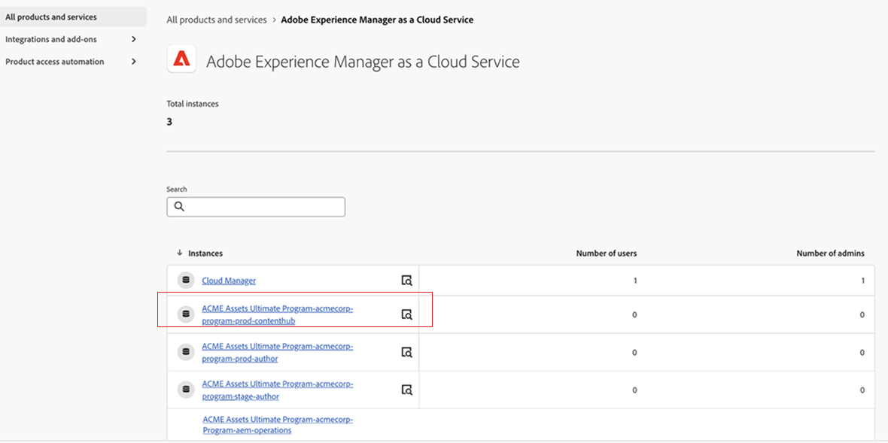

>[!NOTE]
>
>If you have provisioned Content Hub before August 14, 2024, the new instance is created with `contenthub` as the suffix.

Note that there is no `author` or `publish` in the instance name for Content Hub.

Click the instance name to view the `AEM Assets Limited Users` Content Hub product profile.

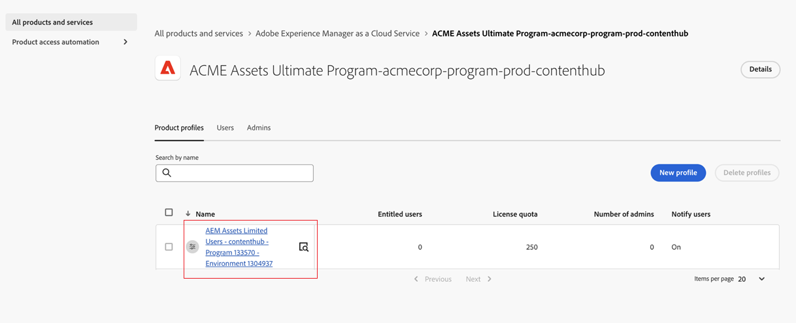

You can start adding users or user groups to this product profile to provide them access to Content Hub.

>[!NOTE]
>
>If you have provisioned Content Hub before August 14, 2024, the Content Hub product profile has `contenthub` mentioned after `Limited Users` instead of `delivery`.

## Onboard AEM Assets Collaborator users {#onboard-collaborator-users}

AEM Assets Collaborator users can work with assets from Experience manager via integrations of Assets available to your organization in other Adobe products and non-Adobe applications, create and edit assets using built-in Adobe Express and Firefly leveraging professionally designed templates, brand kits, Adobe Stock assets, and so on, and access and leverage approved assets from your organization using AEM Assets Content Hub portal.

To onboard Collaborator users:

1. Access Experience Manager Assets product profiles by clicking the AEM as a Cloud Service product name in the list of products on Admin Console.

1. Click the production author instance for AEM as a Cloud Service:
   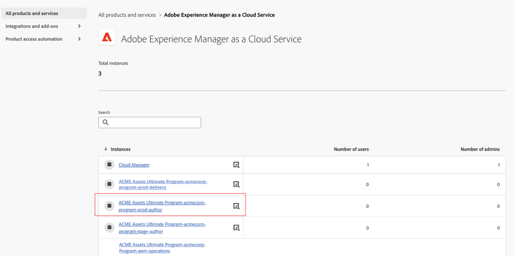

1. Click the Collaborators users product profile and click **[!UICONTROL Add users]** to add the user to the product profile.
   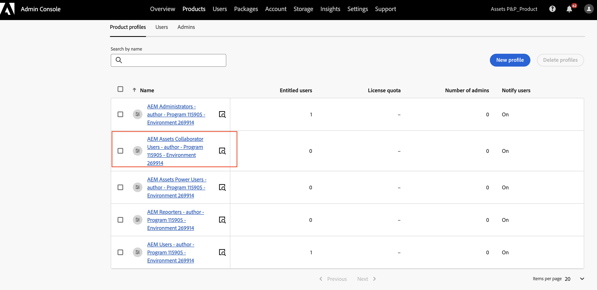

1. Click **[!UICONTROL Save]** to save the changes.

You can also access and view the services assigned to Collaborator users, as depicted in the following image:

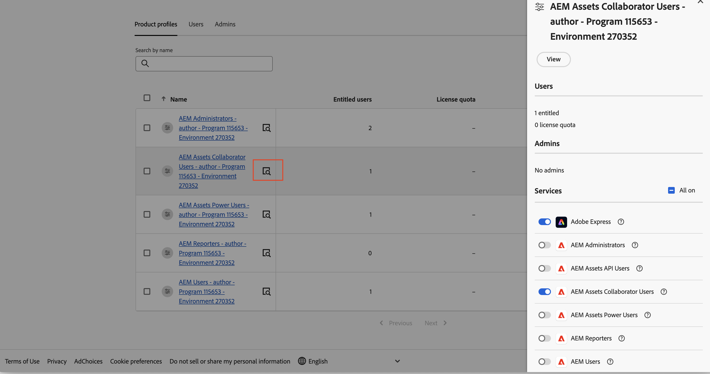

`Adobe Express` and `AEM Assets Collaborator Users` services are enabled by default. You can turn the toggle off and on, as per your requirements, however, Adobe recommends to use the default services enabled for the product profiles.

## Onboard AEM Assets Power users {#onboard-power-users}

AEM Assets Power users can access all AEM Assets capabilities including managing assets, permissions, metadata and the overall governance and automation around digital assets, work with assets from Experience manager via integrations of Assets available to your organization in other Adobe and non-Adobe applications, create and edit assets using built-in Adobe Express and Firefly leveraging professionally designed templates, brand kits, Adobe Stock assets, and so on, and access and leverage approved assets from your organization using AEM Assets Content Hub portal.

To onboard Power users:

1. Access Experience Manager Assets product profiles by clicking the AEM as a Cloud Service product name in the list of products on Admin Console.

1. Click the production author instance for AEM as a Cloud Service:
   

1. Click the Power users product profile and click **[!UICONTROL Add users]** to add the user to the product profile.
   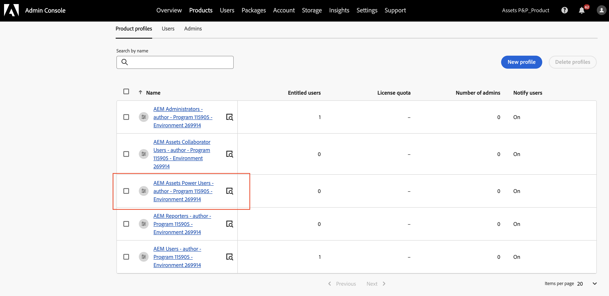

1. Click **[!UICONTROL Save]** to save the changes.

You can also access and view the services assigned to Power users, as depicted in the following image:

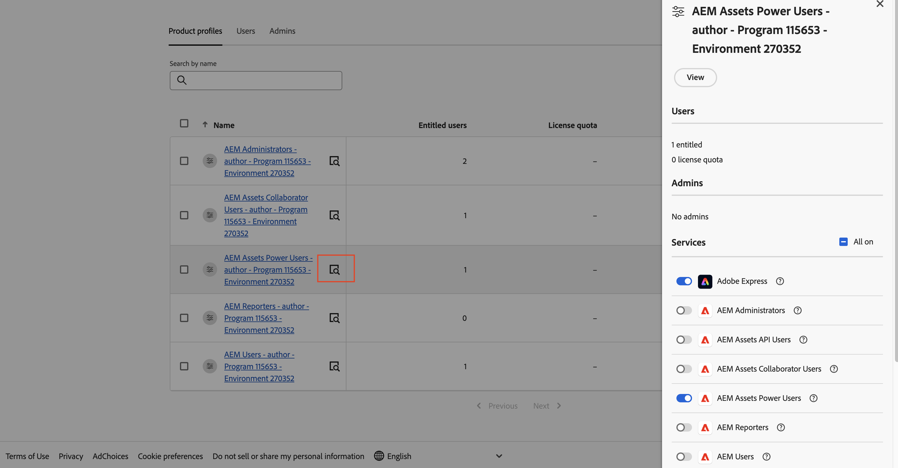

`Adobe Express` and `AEM Assets Power Users` services are enabled by default. You can turn the toggle off and on, as per your requirements, however, Adobe recommends to use the default services enabled for the product profiles.
