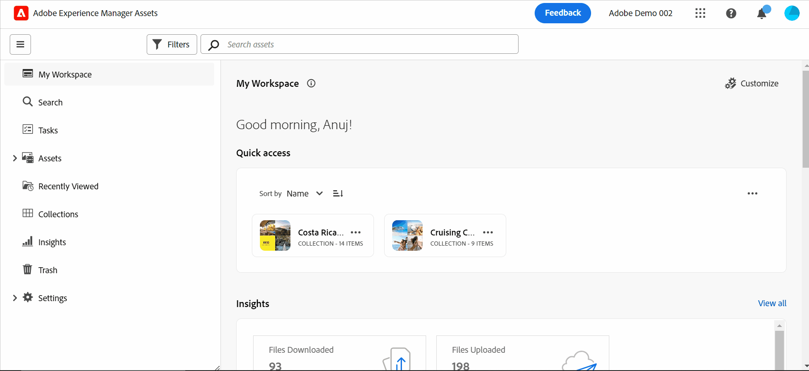
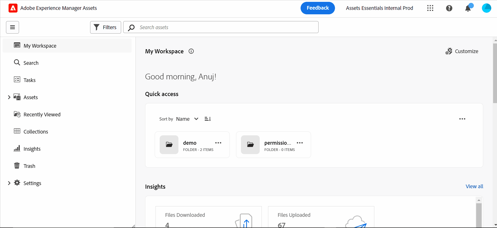
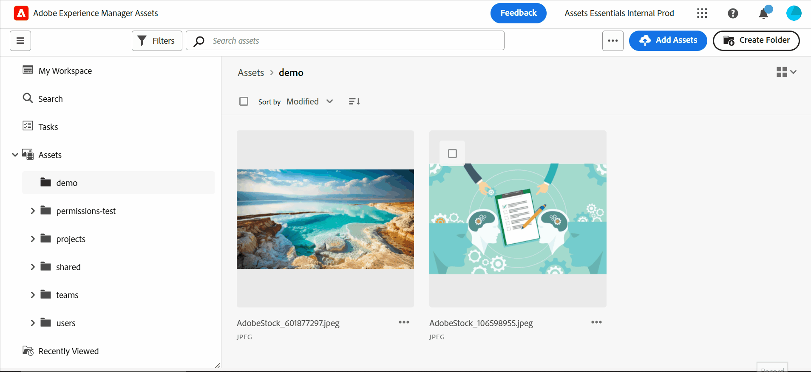
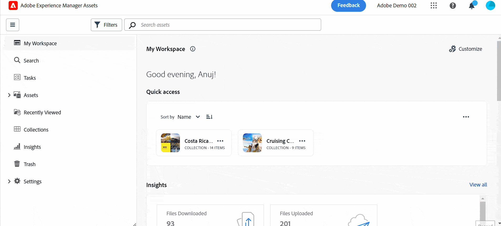
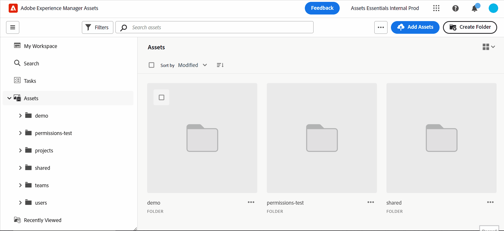

# Introducing the Assets view {#assets-view}

| [Search Best Practices](/help/assets/search-best-practices.md) |[Metadata Best Practices](/help/assets/metadata-best-practices.md)|[Content Hub](/help/assets/product-overview.md)|[Dynamic Media with OpenAPI capabilities](/help/assets/dynamic-media-open-apis-overview.md)|[AEM Assets developer documentation](https://developer.adobe.com/experience-cloud/experience-manager-apis/)|
| ------------- | --------------------------- |---------|----|-----|

In today's fast-paced digital-first landscape, where real-time content creation and delivery are essential, a Digital Asset Management (DAM) experience designed for downstream marketing velocity is paramount. Adobe, using its expertise in empowering marketing and creative professionals, introduces a game-changing new user experience. This workflow-first approach revolutionizes how businesses handle their dynamic digital assets, empowering marketers to maximize efficiency in finding, collaborating, personalizing, and delivering assets. These streamlined workflows accelerate content velocity and propel your marketing efforts to new heights.

To know more about the available persona-based experiences for Assets as a Cloud Service, see [Introducing Assets as a Cloud Service](/help/assets/overview.md#persona-based-experiences).

## How to access Assets view? {#access-assets-view}

You can access the Assets view in the following ways:

<!--

* **Toggle in Admin view**

    * Log into [!DNL Experience Manager] using Cloud Manager.
    * Navigate to **[!UICONTROL Assets]** > **[!UICONTROL Files]**.
    * Click the profile icon on the top right corner.
    * Click **[!UICONTROL Switch View]** from the **[!UICONTROL Profile Settings]** section.
    Repeat these steps to switch back to the Admin view.

* **Product Switcher**
    * Log into [!DNL Experience Manager] and click .
    * Select **[!UICONTROL Experience Manager Assets]** to access the Assets view.
    * Select **[!UICONTROL Experience Manager]** to access the Admin view.

* **Quick Links** 
    * Log into experience.adobe.com.
    * Click **[!UICONTROL Experience Manager Assets]** to access the Assets view.
    * Click **[!UICONTROL Experience Manager Assets]** to access the Assets view.

    -->

## Why Assets view?

The Assets view provides the following key benefits that are not available in the Admin view:

* [My Workspace dashboard to provide streamlined experiences](#my-workspace-for-streamlined-experience)
* [Search-first approach to enhance efficiency](#search-first)
* [Insights to take data-driven decisions](#insights-data)
* [Adobe Photoshop Express integration to accelerate collaboration](#accelerate-collaboration)
* [Folder uploads to setup hierarchical structure for your organization](#folder-uploads)
* [Subscribe to repository content for efficient asset management](#subscribe-content)
* [Soft delete assets to provide better control to administrators](#soft-delete-assets)

### My Workspace dashboard to provide streamlined experiences {#my-workspace-for-streamlined-experience}

Say hello to a Digital Asset Management solution that understands the diverse needs of different organizational roles. The sleek Assets view view prioritizes ease of use and speed, catering to marketers' preference for visual appeal and clutter-free workspaces. With a customizable user-specific My Workspace dashboard, marketers can quickly find, preview, edit, manage, and deliver assets with remarkable efficiency. Bid farewell to endless hours spent searching for specific assets and welcome a streamlined experience that puts everything you need at your fingertips.

### Insights to take data-driven decisions {#insights-data}

To keep pace with content velocity, actionable insights are essential. The Assets view offers advanced insights within the My Workspace, providing valuable data on asset performance, audience usage, and engagements. Marketers can make data-driven decisions, optimize content strategies, and refine their downstream delivery to achieve optimal results. With access to meaningful insights, businesses can stay ahead of the competition and drive exceptional outcomes.

### Adobe Photoshop Express integration to accelerate collaboration {#accelerate-collaboration}

The new experience provides a robust set of collaboration features, including real-time editing with built-in Adobe Photoshop capabilities, version controls, and annotation tools. This enables seamless collaboration across design, creative, branding, and marketing teams, allowing them to overcome bottlenecks and expedite the marketing operations process. Marketers now have powerful tools at their disposal to accelerate project delivery and increase their overall productivity.

Watch this video to understand the power of Assets view integration with Adobe Photoshop Express: 

>[!VIDEO](https://video.tv.adobe.com/v/3420922)

Upcoming releases for Assets as a Cloud Service would also include [Adobe Firefly integration via Adobe Express](https://firefly.adobe.com/?gclid=EAIaIQobChMIlZeKuNfj_wIVeyCtBh3e5g2cEAAYASAAEgL56_D_BwE&sdid=JM4FW6VL&mv=search&mv2=paidsearch&ef_id=EAIaIQobChMIlZeKuNfj_wIVeyCtBh3e5g2cEAAYASAAEgL56_D_BwE:G:s&s_kwcid=AL!3085!3!652077237594!e!!g!!adobe%20firefly!19870733758!148140507838).

### Folder uploads to setup hierarchical structure for your organization {#folder-uploads}

Quickly setup a folder structure for your organization using the Assets view by uploading folders that exists on your local file system. You do not need to create folders under the root folder and then upload assets to those folders manually to maintain the logical hierarchical structure. All folders and assets under the root folder are automatically uploaded to Experience Manager Assets.

### Search-first approach to enhance efficiency {#search-first}

Unlock the potential of your organization's digital asset library with the power of search with cutting-edge functionality. You can bid farewell to the hassle of manually navigating through countless files and folders. Any user can instantly locate the perfect image, video, or document you need to create stunning marketing campaigns, captivating presentations, and engaging content. Our search first engine lets you effortlessly navigate through asset types, metadata, smart tags, and even the content itself without knowing the exact keyword. Embrace the future of the DAM with our Search-First and unleash the full potential of your digital asset library.

### Subscribe to repository content for efficient asset management {#subscribe-content}

The Assets view provides the ability to monitor the operations performed on the assets, folders, or collections available in the repository. You need to select and subscribe to the content for which the notifications are sent to you. You can also configure the event types, such as deletion of your subscribed content, modifications on subscribed content, and so on. The notifications are then sent to you only for those event types.

### Soft delete assets to provide better control to administrators {#soft-delete-assets}

The Trash folder available in the Assets view lists the assets deleted from the root Assets folder. You can select an asset from the Trash folder to either restore it to the original location or permanently delete it. You can also specify a keyword or apply standard or custom filters to search appropriate assets within the Trash folder.

In addition to these features, Assets view also enables you to perform following features that are not available in Admin view:

* Upload a new version of an asset, with a different name, from your local file system to the Asset repository. The uploaded asset is available as a new version with the same name as that of the original asset.

* Rename assets and folders available within the repository.

The Assets view is tailored to streamline workflows, foster collaboration, and accelerate asset delivery. By embracing content velocity, marketers can unlock the full potential of their digital assets and unleash creativity like never before.

Use these links to quickly get started with Assets view:

* [My Workspace](/help/assets/my-workspace-assets-view.md)
* [Get Started using Assets view](/help/assets/get-started-assets-view.md)
