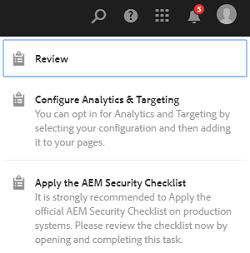
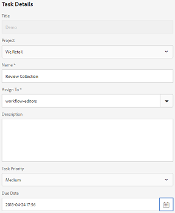

# Review assets in folders and collections {#review-folder-assets-and-collections}

<table>
    <tr>
        <td>
            <i>New</i> <a href="/help/assets/dynamic-media/dm-prime-ultimate.md"><b>Dynamic Media Prime and Ultimate</b></a>
        </td>
        <td>
            <i>New</i> <a href="/help/assets/assets-ultimate-overview.md"><b>AEM Assets Ultimate</b></a>
        </td>
        <td>
            <i>New</i> <a href="/help/assets/integrate-aem-assets-edge-delivery-services.md"><b>AEM Assets integration with Edge Delivery Services</b></a>
        </td>
        <td>
            <i>New</i> <a href="/help/assets/aem-assets-view-ui-extensibility.md"><b>UI Extensibility</b></a>
        </td>
          <td>
            <i>New</i> <a href="/help/assets/dynamic-media/enable-dynamic-media-prime-and-ultimate.md"><b>Enable Dynamic Media Prime and Ultimate</b></a>
        </td>
    </tr>
    <tr>
        <td>
            <a href="/help/assets/search-best-practices.md"><b>Search Best Practices</b></a>
        </td>
        <td>
            <a href="/help/assets/metadata-best-practices.md"><b>Metadata Best Practices</b></a>
        </td>
        <td>
            <a href="/help/assets/product-overview.md"><b>Content Hub</b></a>
        </td>
        <td>
            <a href="/help/assets/dynamic-media-open-apis-overview.md"><b>Dynamic Media with OpenAPI capabilities</b></a>
        </td>
        <td>
            <a href="https://developer.adobe.com/experience-cloud/experience-manager-apis/"><b>AEM Assets developer documentation</b></a>
        </td>
    </tr>
</table>

| Version | Article link |
| -------- | ---------------------------- |
| AEM 6.5  |    [Click here](https://experienceleague.adobe.com/docs/experience-manager-65/assets/using/bulk-approval.html?lang=en)                  |
| AEM as a Cloud Service     | This article         |

Using Adobe Experience Manager Assets, you can set ad-hoc review workflows for assets that are in a folder or in a collection. You can share it with reviewers or creative partners to seek their feedback. You can either associate a review workflow with a project or create an independent review task.

After you share the assets, reviewers can approve or reject them. Notifications are sent at various stages of the workflow to notify intended recipients regarding the completion of various tasks. For example, when you share a folder or collection, the reviewer receives a notification that a folder/collection has been shared for review.

After the reviewer completes the review (approves or rejects assets), you receive a review completion notification.

## Creating a review task for folders {#creating-a-review-task-for-folders}

1. From the Assets user interface, select the folder for which you want to create a review task.
1. From the toolbar, select the **[!UICONTROL Create Review Task]** icon to open the **[!UICONTROL Review Task]** page. If you cannot see the icon in the toolbar, select **[!UICONTROL More]** and then select the icon.

   

1. (Optional) From the **[!UICONTROL Project]** list, select the project to which you want to associate the review task. By default, the **[!UICONTROL None]** option is selected. If you do not want to associate any project with the review task, retain this selection.

   >[!NOTE]
   >
   >Only the projects for which you have Editor-level permissions (or higher) are visible in the **[!UICONTROL Projects]** list.

1. Enter a name for the review task, and select an approver from the **[!UICONTROL Assign To]** list.

   >[!NOTE]
   >
   >The members/groups of the selected project are available as approvers in the **[!UICONTROL Assign To]** list.

1. Enter a description, the task priority, and the due date for the review task.

   

1. In the Advanced tab, enter a label to be used to create the URI.

   

1. Select **[!UICONTROL Submit]**, and then select **[!UICONTROL Done]** to close the confirmation message. A notification for the new task is sent to the approver.
1. Log in to [!DNL Experience Manager Assets] as an Approver and navigate to the Assets UI. To approve assets, select the **[!UICONTROL Notifications]** icon and then select the review task from the list.

   

1. In the **[!UICONTROL Review Task]** page, examine the details of the review task, and then select **[!UICONTROL Review]**.
1. In the **[!UICONTROL Review Task]** page, select assets, and select the **[!UICONTROL Approve/Reject]** icon to approve or reject, as appropriate.

   

1. Select the **[!UICONTROL Complete]** icon from the toolbar. In the dialog, enter a comment and select  **[!UICONTROL Complete]** to confirm.
1. Navigate to the Assets UI, and open the folder. The approval status icons for the assets appear in both the Card and List views.

   **Card view**

   

   **List view**

   

## Creating a review task for collections {#creating-a-review-task-for-collections}

1. From the Collections page, select the collection for which you want to create a review task.
1. From the toolbar, select the **[!UICONTROL Create Review Task]** icon to open the **[!UICONTROL Review Task]** page. If you cannot see the icon in the toolbar, select **[!UICONTROL More]** and then select the icon.

   

1. (Optional) From the **[!UICONTROL Project]** list, select the project to which you want to associate the review task. By default, the **[!UICONTROL None]** option is selected. If you do not want to associate any project with the review task, retain this selection.

   >[!NOTE]
   >
   >Only the projects for which you have Editor-level permissions (or higher) are visible in the **[!UICONTROL Projects]** list.

1. Enter a name for the review task, and select an approver from the **[!UICONTROL Assign To]** list.

   >[!NOTE]
   >
   >The members/groups of the selected project are available as approvers in the **[!UICONTROL Assign To]** list.

1. Enter a description, the task priority, and the due date for the review task.

   

1. Select **[!UICONTROL Submit]**, and then select **[!UICONTROL Done]** to close the confirmation message. A notification for the new task is sent to the approver.
1. Log in to [!DNL Experience Manager Assets] as an Approver and navigate to the Assets console. To approve assets, select the **[!UICONTROL Notifications]** icon and then select the review task from the list.
1. In the **[!UICONTROL Review Task]** page, examine the details of the review task, and then select **[!UICONTROL Review]**.
1. All the assets in the collection are visible on the review page. Select the assets and select the **[!UICONTROL Approve/Reject]** icon to approve or reject assets, as appropriate.

   

1. Select the **[!UICONTROL Complete]** icon from the toolbar. In the dialog, enter a comment and select **[!UICONTROL Complete]** to confirm.
1. Navigate to the Collections console and open the collection. The approval status icons for the assets appear in both the Card and List views.

   **Card view**

   

   **List view**

   

**See also**

* [Translate Assets](translate-assets.md)
* [Assets HTTP API](mac-api-assets.md)
* [Assets supported file formats](file-format-support.md)
* [Search assets](search-assets.md)
* [Connected assets](use-assets-across-connected-assets-instances.md)
* [Asset reports](asset-reports.md)
* [Metadata schemas](metadata-schemas.md)
* [Download assets](download-assets-from-aem.md)
* [Manage metadata](manage-metadata.md)
* [Search facets](search-facets.md)
* [Manage collections](manage-collections.md)
* [Bulk metadata import](metadata-import-export.md)
* [Publish Assets to AEM and Dynamic Media](/help/assets/publish-assets-to-aem-and-dm.md)
