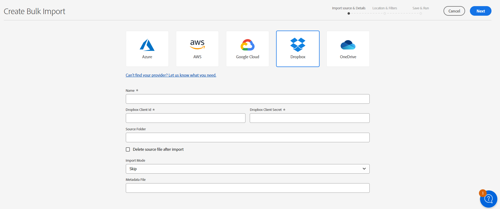
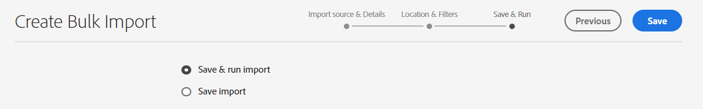
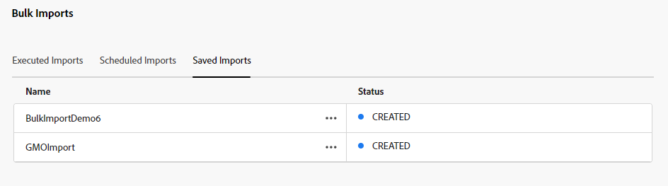
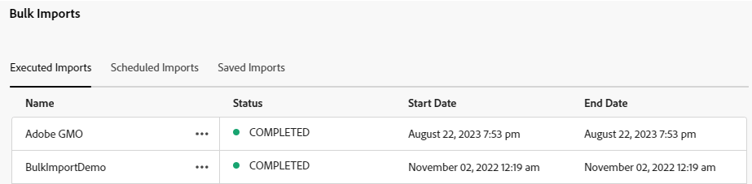
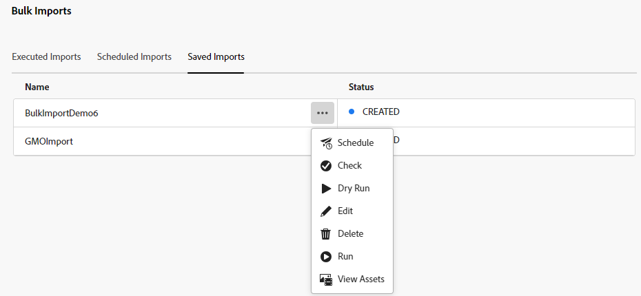

# Bulk import assets using Assets view  {#bulk-import-assets-view}

Bulk Import in AEM Assets view provides administrators with the ability to import large number of assets from a data source to AEM Assets. The administrators do not need to upload individual assets or folders to AEM Assets anymore.

>[!NOTE]
>
>The Assets view bulk importer uses the same backend as that of the Admin view bulk importer. However, it offers more data sources to import from and a more streamlined user experience.

You can import assets from the following data sources:

* Azure
* AWS
* Google Cloud
* Dropbox

## Prerequisites {#prerequisites}

| Data Source | Prerequisites |
|-----|------|
| Azure | <ul> <li>Azure Storage Account </li> <li> Azure Blob Container <li> Azure Access Key or SAS Token based on the authentication mode </li></ul> |
| AWS | <ul> <li>AWS Region </li> <li> AWS Bucket <li> AWS Access Key </li><li> AWS Access Secret </li></ul> |
| Google Cloud | <ul> <li>GCP Bucket </li> <li> GCP Service Account Email <li> GCP Service Account Private Key</li></ul> |
| Dropbox | <ul> <li>Dropbox Client ID </li> <li> Dropbox Client Secret</li></ul> |

In addition to these prerequisites based on the data source, you must be aware of the source folder name available in your data source that contains all assets that need to be imported to AEM Assets.

## Create bulk import configuration {#create-bulk-import-configuration}

Execute the following steps to create a bulk import configuration:

1. Navigate to **[!UICONTROL Settings]** > **[!UICONTROL Bulk Import]** and click **[!UICONTROL Create Import]**.
1. Select the data source. The available options include Azure, AWS, Google Cloud, and Dropbox.
1. Specify a name for the bulk import configuration in the **[!UICONTROL Name]** field.
1. Specify the data source specific credentials, as mentioned in [Prerequisites](#prerequisites).
1. Provide the name of the root folder that contains assets in the data source in the **[!UICONTROL Source Folder]** field.
1. (Optional) Select the **[!UICONTROL Delete source file after import]** option to delete the original files from the source data store after the files are imported into Experience Manager Assets.
1. Select the **[!UICONTROL Import Mode]**. Select **[!UICONTROL Skip]**, **[!UICONTROL Replace]**, or **[!UICONTROL Create Version]**. Skip mode is the default and in this mode, the ingestor skips to import an asset if it exists already.

1. (Optional) Specify the metadata file to import, provided in CSV format, in the Metadata File field and click **[!UICONTROL Next]** to navigate to **[!UICONTROL Location & Filters]**.
1. To define a location in DAM where assets are to be imported using the **[!UICONTROL Assets Target Folder]** field, specify a path. For example, `/content/dam/imported_assets`.
1. (Optional) In the **[!UICONTROL Choose Filters]** section, provide the minimum file size of assets in MB to include them in the ingestion process in the **[!UICONTROL Filter by Min Size]** field.
1. (Optional) Provide the maximum file size of assets in MB to include them in the ingestion process in the **[!UICONTROL Filter by Max Size]** field.
1. (Optional) Select the MIME types to include in the ingestion process using the **[!UICONTROL Include MIME Type]** field. You can select multiple MIME types within this field. If you do not define a value, all MIME types are included in the ingestion process.

1. (Optional) Select the MIME types to exclude in the ingestion process using the **[!UICONTROL Exclude MIME Type]** field. You can select multiple MIME types within this field. If you do not define a value, all MIME types are included in the ingestion process.

   

1. Click **[!UICONTROL Next]**. Select **[!UICONTROL Save & run import]** to save the configuration and run the bulk import. Select **[!UICONTROL Save import]** to save the configuration for now so that you can run it later.

   

1. Click **[!UICONTROL Save]** to execute the selected option.

### Handling filenames during bulk import {#filename-handling-bulkimport-assets-view}

When you import assets or folders in bulk, [!DNL Experience Manager Assets] imports the whole structure of what exists in the import source. [!DNL Experience Manager] follows the inbuilt rules for special characters in the asset and folder names, therefore these filenames need sanitization. For both folder name and asset name, the title defined by the user remains unchanged and is stored in `jcr:title`. 

During bulk import, [!DNL Experience Manager] look for the existing folders  to avoid reimporting the assets and folders, and also verifies the sanitization rules applied in the parent folder where the import takes place. If the sanitization rules are applied in the parent folder, the same rules are applied to the import source. For new import, the following sanitization rules are applied to manage the filenames of assets and folders.

For more information on disallowed names, handling asset names, and handling folder names during bulk import, see [Handling filenames during bulk import in Admin view](add-assets.md##filename-handling-bulkimport).

## View existing bulk import configurations {#view-import-configuration}

If you select to save the configuration after creating it, the configuration displays in the **[!UICONTROL Saved Imports]** tab.

If you select to save and run the import, the import configuration displays in the **[!UICONTROL Executed Imports]** tab.

If you schedule an import, it displays in the **[!UICONTROL Scheduled Imports]** tab. 

## Edit bulk import configuration {#edit-import-configuration}

To edit the configuration details, click ... corresponding to the configuration name and click **[!UICONTROL Edit]**. You cannot edit the title of the configuration and the import data source while performing the edit operation. You can edit the configuration using Executed, Scheduled, or Saved Imports tabs.

## Schedule one-time or recurring imports {#schedule-imports}

To schedule a one-time or a recurring bulk import, execute the following steps:

1. click ... corresponding to the configuration name available in the **[!UICONTROL Executed Imports]** or **[!UICONTROL Saved Imports]** tab and click **[!UICONTROL Schedule]**. You can also reschedule an existing scheduled import by navigating to **[!UICONTROL Scheduled Imports]** tab and clicking **[!UICONTROL Schedule]**.

1. Set a one-time ingestion or schedule an hourly, a daily, or a weekly schedule. Click **[!UICONTROL Submit]**.

   

## Perform an import health check {#import-health-check}

To validate the connection to the data source, click ... corresponding to the configuration name, and then click **[!UICONTROL Check]**. If the connection is successful, Experience Manager Assets displays the following message:

## Perform a dry run before executing an import {#dry-run-bulk-import}

Click ... corresponding to the configuration name and click **[!UICONTROL Dry Run]** to invoke a test run for the Bulk Import job. Experience Manager Assets displays the following details about the Bulk Import job:

## Run a bulk import {#run-bulk-import}

If you have saved the import while creating the configuration, you can navigate to Saved Imports tab, click ... corresponding to the configuration and click **[!UICONTROL Run]**.

Similarly, if you need to execute an already executed import, navigate to Executed Imports tab, click ... corresponding to the configuration name and click **[!UICONTROL Run]**.

## Stop or schedule an ongoing import {#schedule-stop-ongoing-report}

You can schedule or stop an ongoing bulk import using the bulk import status dialog that displays on the Bulk Import home page during an import.

You can also view the assets that have been imported in the target folder by clicking **[!UICONTROL View Assets]**.

## Delete a bulk import configuration {#delete-bulk-import-configuration}

Click ... corresponding to the configuration name existing in **[!UICONTROL Executed Imports]**, **[!UICONTROL Scheduled Imports]**, or **[!UICONTROL Saved Imports]** tabs and click **[!UICONTROL Delete]** to delete the Bulk Import configuration.

## Navigate to assets after performing bulk import {#view-assets-after-bulk-import}

To view the Assets target location where the assets are imported after running the Bulk Import job, click ... corresponding to the configuration name, and then click **[!UICONTROL View Assets]**.
