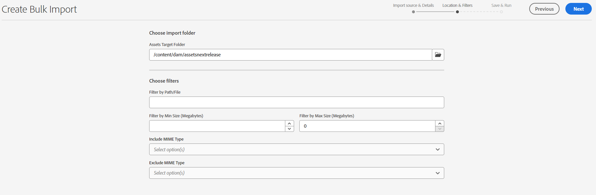
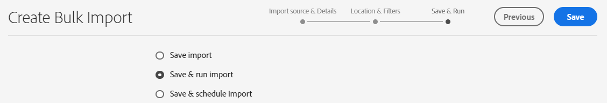
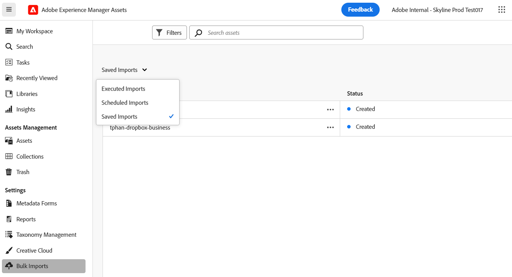
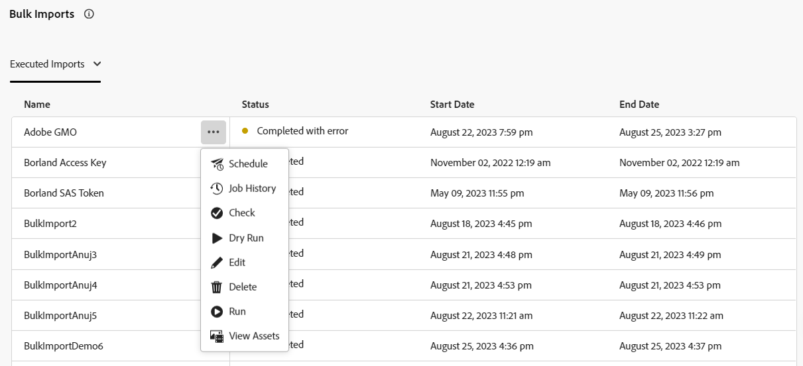
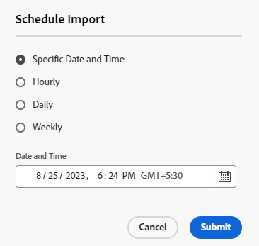
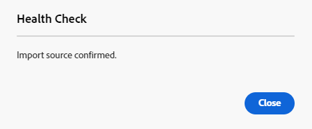
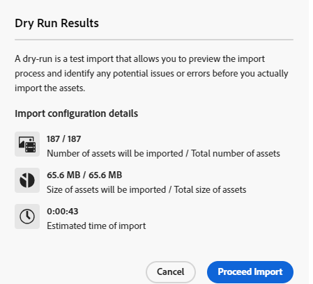
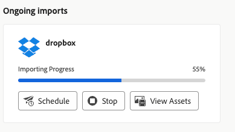

# Bulk import assets using Assets view  {#bulk-import-assets-view}

| [Search Best Practices](/help/assets/search-best-practices.md) |[Metadata Best Practices](/help/assets/metadata-best-practices.md)|[Content Hub](/help/assets/product-overview.md)|[Dynamic Media with OpenAPI capabilities](/help/assets/dynamic-media-open-apis-overview.md)|[AEM Assets developer documentation](https://developer.adobe.com/experience-cloud/experience-manager-apis/)|
| ------------- | --------------------------- |---------|----|-----|

Bulk Import in AEM Assets view provides administrators with the ability to import large number of assets from a data source to AEM Assets. The administrators do not need to upload individual assets or folders to AEM Assets anymore.

>[!NOTE]
>
>The Assets view bulk importer uses the same backend as that of the Admin view bulk importer. However, it offers more data sources to import from and a more streamlined user experience.

You can import assets from the following data sources:

* Azure
* AWS
* Google Cloud
* Dropbox
* OneDrive

## Prerequisites {#prerequisites}

| Data Source | Prerequisites |
|-----|------|
| Azure | <ul> <li>Azure Storage Account </li> <li> Azure Blob Container <li> Azure Access Key or SAS Token based on the authentication mode </li></ul> |
| AWS | <ul> <li>AWS Region </li> <li> AWS Bucket <li> AWS Access Key </li><li> AWS Access Secret </li></ul> |
| Google Cloud | <ul> <li>GCP Bucket </li> <li> GCP Service Account Email <li> GCP Service Account Private Key</li></ul> |
| Dropbox | <ul> <li>Dropbox Client ID (App key) </li> <li> Dropbox Client Secret (App secret)</li></ul> |
| OneDrive | <ul> <li>OneDrive Tenant ID  </li> <li> OneDrive Client ID</li><li> OneDrive Client Secret</li></ul> |

In addition to these prerequisites based on the data source, you must be aware of the source folder name available in your data source that contains all assets that need to be imported to AEM Assets.

## Configure the Dropbox developer application {#dropbox-developer-application}

Before importing assets from your Dropbox account to AEM Assets, create and configure the Dropbox developer application.

Execute the following steps:

1. Sign in to your [Dropbox account](https://www.dropbox.com/developers) and click **[!UICONTROL Create apps]**.  If you're using an Enterprise Dropbox account, you need to have access to the Content Admin role.

1. In the **[!UICONTROL Choose an API]** section, select the only available radio button.

1. In the **[!UICONTROL Choose the type of access you need]** section, select one of the following options:

   * Select **[!UICONTROL App folder]**, if you need access to single folder created within your application in your Dropbox account.

   * Select **[!UICONTROL Full Dropbox]**, if you need access to all files and folders within your Dropbox account.

1. Specify a name for your application and click **[!UICONTROL Create app]**.

1. In the **[!UICONTROL Settings]** tab of your application, add https://experience.adobe.com to the **[!UICONTROL Redirect URIs]** section.

1. Copy the values for the **[!UICONTROL App key]** and **[!UICONTROL App secret]** fields. The values are required while configuring the bulk import tool in AEM Assets.

1. On the **[!UICONTROL Permissions]** tab, add the following permissions within the **[!UICONTROL Individual scopes]** section.

   * account_info.read

   * files.metadata.read

   * files.content.read

   * files.content.write

1. Click **[!UICONTROL Submit]** to save the changes.

## Configure the OneDrive developer application {#onedrive-developer-application}

Before importing assets from your OneDrive account to AEM Assets, create and configure the OneDrive developer application.

### Create an application

1. Sign in to your [OneDrive account](https://portal.azure.com/#view/Microsoft_AAD_RegisteredApps/ApplicationsListBlade) and click **[!UICONTROL New registration]**.

1. Specify a name for the application, select **[!UICONTROL Accounts in this organizational directory only (Adobe only - Single tenant)]** from **[!UICONTROL Supported account types]**.

1. Execute the following steps to add redirect URIs:

   1. In the **[!UICONTROL Select a platform]** dropdown menu, select **[!UICONTROL Web]**.
   
   1. Add https://experience.adobe.com to the **[!UICONTROL Redirect URIs]** section.
   <!-- Add the first URI and click **[!UICONTROL Configure]** to add it. You can add more by clicking **[!UICONTROL Add URI]** option available in the **[!UICONTROL Web]** section on the **[!UICONTROL Authentication]** page. -->

1. Click **[!UICONTROL Register]**. The application is created successfully.

1. Copy the values for the **[!UICONTROL Application (client) ID]** and **[!UICONTROL Directory (tenant) ID]** fields. The values are required while configuring the bulk import tool in AEM Assets.

1. Click **[!UICONTROL Add a certificate or secret]** corresponding to **[!UICONTROL Client credentials]** option.

1. Click **[!UICONTROL New client secret]**, provide the client secret description, expiration and click **[!UICONTROL Add]**.

1. After creating the Client Secret, copy the **[!UICONTROL Value]** field (Do not copy the Secret ID field). It is required while configuring bulk import in AEM Assets.

### Add API permissions

Execute the following steps to add API permissions for the application:

   1. Click **[!UICONTROL API permissions]** in left pane and click **[!UICONTROL Add a permission]**.
   1. Click **[!UICONTROL Microsoft Graph]** > **[!UICONTROL Delegated permissions]**. The **[!UICONTROL Select Permission]** section displays the available permissions.
   1. Select `offline_access` permission from `OpenId permissions` and `Files.ReadWrite.All` permission from `Files`.
   1. Click **[!UICONTROL Add permissions]** to save the updates.

## Create bulk import configuration {#create-bulk-import-configuration}

Execute the following steps to create a bulk import configuration in the [!DNL Experience Manager Assets]:

1. Click **[!UICONTROL Bulk Import]** in left pane and click **[!UICONTROL Create Import]**.
1. Select the data source. The available options include **[!UICONTROL Azure]**, **[!UICONTROL AWS]**, **[!UICONTROL Google Cloud]**, **[!UICONTROL Dropbox]** and **[!UICONTROL OneDrive]**.
1. Specify a name for the bulk import configuration in the **[!UICONTROL Name]** field.
1. Specify the data source specific credentials, as mentioned in [Prerequisites](#prerequisites).
1. Provide name of the root folder that contains assets in the data source in the **[!UICONTROL Source Folder]** field.

   >[!NOTE]
   >
   >If you are using Dropbox as the data source, specify the source folder path based on the following rules:
   >* If you select **Full Dropbox** while creating the Dropbox application and the folder which contains the assets exists at `https://www.dropbox.com/home/bulkimport-assets`, then specify `bulkimport-assets` in the **[!UICONTROL Source Folder]** field.
   >* If you select **App folder** while creating the Dropbox application and the folder which contains the assets exists at `https://www.dropbox.com/home/Apps/BulkImportAppFolderScope/bulkimport-assets`, then specify `bulkimport-assets` in the **[!UICONTROL Source Folder]** field, where `BulkImportAppFolderScope` refers to the name of the application. `Apps` is automatically added after `home` in this case.

   >[!NOTE]
   >
   >If you are using OneDrive as the data source, specify the source folder path based on the following rules:
   >* Specify the Root folder name only, without the domain. If the full URL path of the folder is `https://my.sharepoint.com/my?id=/personal/user/Documents/Importfolder/`, specify `/Importfolder/` in the **[!UICONTROL Source Folder]** field. 
   >* If the folder name contains multiple words separated by spaces, specify the name with the spaces in the Bulk Import configuration.
   >* The source folder must be located at the root of the directory. Folder paths are not supported. 

1. (Optional) Select the **[!UICONTROL Delete source file after import]** option to delete the original files from the source data store after the files are imported into Experience Manager Assets.
1. Select the **[!UICONTROL Import Mode]**. Select **[!UICONTROL Skip]**, **[!UICONTROL Replace]**, or **[!UICONTROL Create Version]**. Skip mode is the default and in this mode, the ingestor skips to import an asset if it exists already.

1. (Optional) Specify the metadata file to import, provided in CSV format, in the **[!UICONTROL Metadata File]** field. The metadata source file must be in the source folder. Click **[!UICONTROL Next]** to navigate to **[!UICONTROL Location & Filters]**.

   >[!NOTE]
   >
   >Depending on your organization's security rules, you may require administrator consent for this application to connect to the Bulk Import tool. If this is required, the administrator needs to provide consent before the bulk import configuration can be saved.

1. To define a location in DAM where assets are to be imported using the **[!UICONTROL Assets Target Folder]** field, specify a path. For example, `/content/dam/imported_assets`.
1. (Optional) In the **[!UICONTROL Choose Filters]** section, provide the minimum file size of assets in MB to include them in the ingestion process in the **[!UICONTROL Filter by Min Size]** field.
1. (Optional) Provide the maximum file size of assets in MB to include them in the ingestion process in the **[!UICONTROL Filter by Max Size]** field.
1. (Optional) Select the MIME types to include in the ingestion process using the **[!UICONTROL Include MIME Type]** field. You can select multiple MIME types within this field. If you do not define a value, all MIME types are included in the ingestion process.

1. (Optional) Select the MIME types to exclude in the ingestion process using the **[!UICONTROL Exclude MIME Type]** field. You can select multiple MIME types within this field. If you do not define a value, all MIME types are included in the ingestion process.

   

1. Click **[!UICONTROL Next]**. Select one of the following options as per your preference:

   * **[!UICONTROL Save import]** to save the configuration for now so that you can run it later.
   * **[!UICONTROL Save & run import]** to save the configuration and run the bulk import.
   * **[!UICONTROL Save & schedule import]** to save the configuration and schedule the bulk import for a later time. You can choose the frequency of the bulk import, and set the date and time for the import. The bulk import will run on the set date and time in the choosen frquency. 

   

1. Click **[!UICONTROL Save]** to execute the selected option.

### Handling filenames during bulk import {#filename-handling-bulkimport-assets-view}

When you import assets or folders in bulk, [!DNL Experience Manager Assets] imports the whole structure of what exists in the import source. [!DNL Experience Manager] follows the inbuilt rules for special characters in the asset and folder names, therefore these filenames need sanitization. For both folder name and asset name, the title defined by the user remains unchanged and is stored in `jcr:title`. 

During bulk import, [!DNL Experience Manager] look for the existing folders  to avoid reimporting the assets and folders, and also verifies the sanitization rules applied in the parent folder where the import takes place. If the sanitization rules are applied in the parent folder, the same rules are applied to the import source. For new import, the following sanitization rules are applied to manage the filenames of assets and folders.

For more information on disallowed names, handling asset names, and handling folder names during bulk import, see [Handling filenames during bulk import in Admin view](add-assets.md##filename-handling-bulkimport).

## View existing bulk import configurations {#view-import-configuration}

To view the existing bulk imports, select the **[!UICONTROL Bulk Imports]** option in the left pane. The bulk imports page appears with the list of **[!UICONTROL Executed Imports]**.  
You can also view the **[!UICONTROL Saved Imports]** and **[!UICONTROL Scheduled Imports]** from the dropdown option.

## Edit bulk import configuration {#edit-import-configuration}

To edit the configuration details, click  corresponding to the configuration name and click **[!UICONTROL Edit]**. You cannot edit the title of the configuration and the import data source while performing the edit operation. You can edit the configuration using Executed, Scheduled, or Saved Imports tabs.

## Schedule one-time or recurring imports {#schedule-imports}

To schedule a one-time or a recurring bulk import, execute the following steps:

1. Click  corresponding to the configuration name available in the **[!UICONTROL Executed Imports]** or **[!UICONTROL Saved Imports]** tab and click **[!UICONTROL Schedule]**. You can also reschedule an existing scheduled import by navigating to **[!UICONTROL Scheduled Imports]** tab and clicking **[!UICONTROL Schedule]**.

1. Set a one-time ingestion or schedule an hourly, a daily, or a weekly schedule. Click **[!UICONTROL Submit]**.

   

## Perform an import health check {#import-health-check}

To validate the connection to the data source, click  corresponding to the configuration name, and then click **[!UICONTROL Check]**. If the connection is successful, Experience Manager Assets displays the following message:

## Perform a dry run before executing an import {#dry-run-bulk-import}

Click  corresponding to the configuration name and click **[!UICONTROL Dry Run]** to invoke a test run for the Bulk Import job. Experience Manager Assets displays the following details about the Bulk Import job:

## Run a bulk import {#run-bulk-import}

If you have saved the import while creating the configuration, you can navigate to Saved Imports tab, click  icon  corresponding to the configuration and click **[!UICONTROL Run]**.

Similarly, if you need to execute an already executed import, navigate to Executed Imports tab, click  corresponding to the configuration name and click **[!UICONTROL Run]**.

## Stop or schedule an ongoing import {#schedule-stop-ongoing-report}

You can schedule or stop an ongoing bulk import using the bulk import status dialog that displays on the Bulk Import home page during an import.

You can also view the assets that have been imported in the target folder by clicking **[!UICONTROL View Assets]**.

## Delete a bulk import configuration {#delete-bulk-import-configuration}

Click  corresponding to the configuration name existing in **[!UICONTROL Executed Imports]**, **[!UICONTROL Scheduled Imports]**, or **[!UICONTROL Saved Imports]** tabs and click **[!UICONTROL Delete]** to delete the Bulk Import configuration.

## Navigate to assets after performing bulk import {#view-assets-after-bulk-import}

To view the Assets target location where the assets are imported after running the Bulk Import job, click  corresponding to the configuration name, and then click **[!UICONTROL View Assets]**. 

## Video: Bulk import assets using Assets View

>[!VIDEO](https://video.tv.adobe.com/v/3428012)
