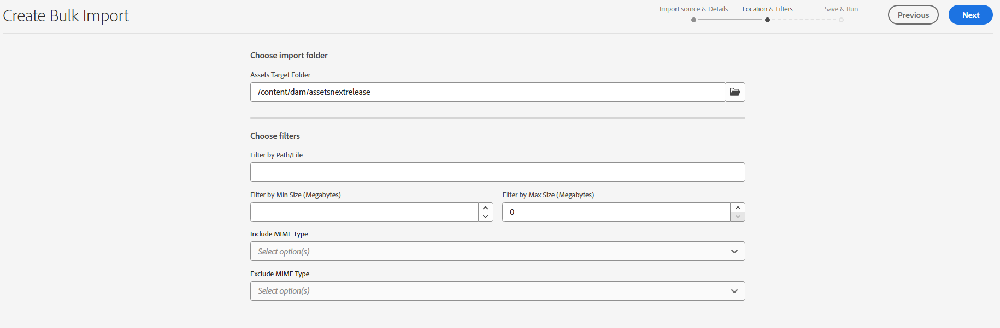
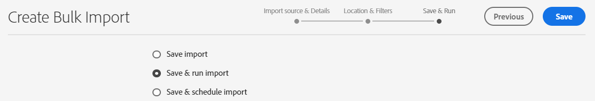
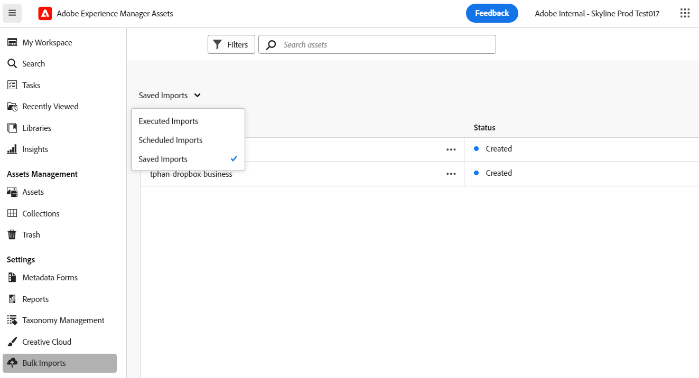
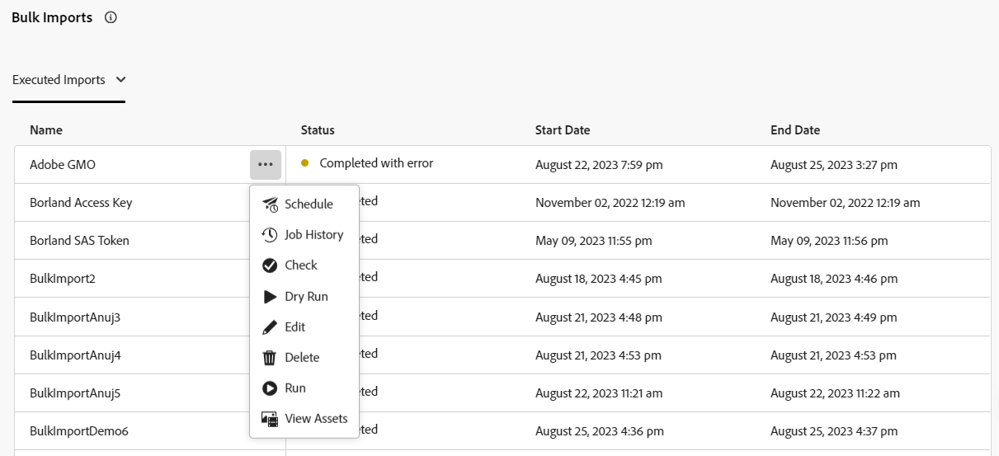
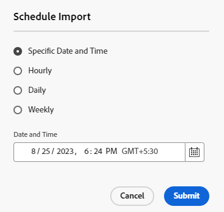
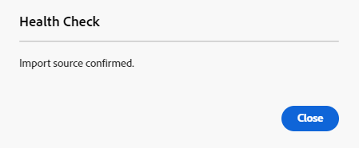
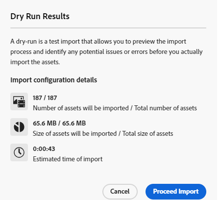
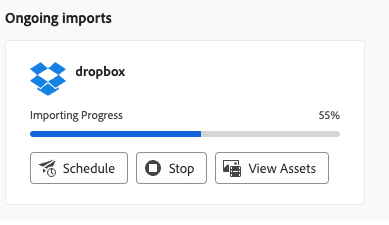

# Bulk import assets using Assets view  {#bulk-import-assets-view}

**Bulk Import** in **Adobe [!DNL Experience Manager] (AEM) Assets** view enables administrators to import large numbers of assets directly from an external data source into AEM Assets in a single, streamlined operation. This capability eliminates the need to upload individual assets or folders one at a time, making it particularly valuable for large-scale asset migrations, digital asset consolidation, and onboarding content from existing cloud storage repositories.

By connecting AEM Assets directly to a supported data source, administrators can migrate entire libraries of images, videos, documents, and other digital assets efficiently, reducing manual effort and accelerating time-to-value when populating an AEM Assets environment.

>[!NOTE]
>
>The Assets view bulk importer uses the same backend as the Admin view bulk importer. However, it supports more data sources and delivers a more streamlined user experience.

## Supported data sources for bulk import {#supported-data-sources}

Administrators can import assets from the following data sources, which span the major cloud storage and file-sharing platforms commonly used in enterprise environments:

* **Azure** — Microsoft's cloud storage platform for scalable asset storage.
* **AWS (Amazon Web Services)** — a widely used cloud storage and infrastructure provider.
* **Google Cloud** — Google's cloud storage and computing platform.
* **Dropbox** — a popular file-hosting and sharing service.
* **OneDrive** — Microsoft's cloud-based file storage and sharing service.

This breadth of supported sources means administrators can consolidate assets stored across multiple platforms into a single AEM Assets repository, streamlining governance and ensuring digital assets are centrally managed.

>[!VIDEO](https://video.tv.adobe.com/v/3426857/?learn=on){transcript=true}

## Prerequisites {#prerequisites}

Before importing content into Adobe [!DNL Experience Manager] (AEM) Assets, ensure the required credentials and configuration values are available for your chosen cloud data source. Each data source requires a specific set of authentication and connection parameters, as summarized below.

| Data Source | Prerequisites |
|-----|------|
| Azure | <ul><li>**Azure Storage Account**</li><li>**Azure Blob Container**</li><li>**Azure Access Key** or **Shared Access Signature (SAS) Token** (the credential required depends on the selected authentication mode)</li></ul> |
| AWS | <ul><li>**AWS Region**</li><li>**AWS Bucket**</li><li>**AWS Access Key**</li><li>**AWS Access Secret**</li></ul> |
| Google Cloud | <ul><li>**Google Cloud Platform (GCP) Bucket**</li><li>**GCP Service Account Email**</li><li>**GCP Service Account Private Key**</li></ul> |
| Dropbox | <ul><li>**Dropbox Client ID (App key)**</li><li>**Dropbox Client Secret (App secret)**</li></ul> |
| OneDrive | <ul><li>**OneDrive Tenant ID**</li><li>**OneDrive Client ID**</li><li>**OneDrive Client Secret**</li></ul> |

These credentials authenticate the connection between Adobe [!DNL Experience Manager] (AEM) Assets and the external storage provider, so gather them from your cloud provider's console before beginning the import.

In addition to the source-specific prerequisites listed above, you must identify the **source folder name** in your data source. This is the folder that contains all the assets you intend to import into AEM Assets. Knowing the exact source folder name is essential because AEM uses it to locate and retrieve the correct set of assets during the import process.

## Configure the Dropbox developer application {#dropbox-developer-application}

Before importing assets from your Dropbox account to Adobe [!DNL Experience Manager] (AEM) Assets, create and configure the Dropbox developer application. This application generates the credentials and grants the permission scopes that AEM Assets requires to authenticate with Dropbox and transfer files securely.

Complete the following steps to create and authorize the Dropbox developer application:

1. Sign in to your [Dropbox account](https://www.dropbox.com/developers) and click **[!UICONTROL Create apps]**.  If you are using an Enterprise Dropbox account, you need to have access to the Content Admin role, because app creation on Enterprise accounts is restricted to that administrative role.

1. In the **[!UICONTROL Choose an API]** section (Application Programming Interface), select the only available radio button.

1. In the **[!UICONTROL Choose the type of access you need]** section, select one of the following options based on the scope of assets you plan to import:

   * Select **[!UICONTROL App folder]** to grant access to a single dedicated folder created for your application within your Dropbox account. This limits the application to that folder only.

   * Select **[!UICONTROL Full Dropbox]** to grant access to all files and folders within your Dropbox account.

1. Specify a name for your application and click **[!UICONTROL Create app]**.

1. In the **[!UICONTROL Settings]** tab of your application, add https://experience.adobe.com to the **[!UICONTROL Redirect URIs]** section. This Redirect URI (Uniform Resource Identifier) ensures Dropbox returns the authorization response to Adobe Experience Cloud after sign-in, completing the secure connection between the two services.

1. Copy the values for the **[!UICONTROL App key]** and **[!UICONTROL App secret]** fields. The **App key** is the public identifier for your application, and the **App secret** is the confidential credential used to authenticate it. Both values are required while configuring the bulk import tool in AEM Assets, so store them securely.

1. On the **[!UICONTROL Permissions]** tab, add the following permissions within the **[!UICONTROL Individual scopes]** section. Each scope authorizes a specific action that the bulk import tool performs:

   * **account_info.read** — permits reading basic information about the Dropbox account.

   * **files.metadata.read** — permits reading file and folder metadata, such as names and paths.

   * **files.content.read** — permits reading the actual content of files, enabling assets to be imported.

   * **files.content.write** — permits writing content to files and folders within the account.

1. Click **[!UICONTROL Submit]** to save the changes. The application is now configured and ready to be connected to the bulk import tool in AEM Assets.

## Configure the OneDrive developer application {#onedrive-developer-application}

Importing assets from your Microsoft OneDrive account into Adobe [!DNL Experience Manager] (AEM) Assets requires a registered OneDrive developer application. You must create and configure this developer application before any import can take place, because the application establishes the authenticated connection that allows AEM to access files stored in OneDrive.

The OneDrive developer application serves as the trusted intermediary between AEM Assets and your OneDrive account. Registering the application provides AEM with the credentials it needs to authenticate through Microsoft's identity platform and retrieve assets securely on your behalf.

Key reasons the developer application is a prerequisite:

- **Authentication:** The registered application supplies the credentials AEM uses to sign in to Microsoft's identity platform, so AEM can act on your behalf without exposing your personal login.
- **Authorized API access:** The application grants AEM permission to read and import files through the OneDrive API, ensuring that only approved operations occur.
- **Secure asset transfer:** By routing the connection through a configured application, asset transfers between OneDrive and AEM Assets remain controlled and traceable.

Complete the creation and configuration of the OneDrive developer application first. Once the application is configured, AEM Assets can connect to OneDrive and begin importing your assets.

### Create an application for OneDrive bulk import

Registering an application in your OneDrive (Azure) portal establishes the trusted identity and credentials that authenticate the connection between your OneDrive storage and Adobe [!DNL Experience Manager] (AEM) Assets. Complete the following steps to create the application and gather the credentials required for the bulk import configuration:

1. Sign in to your [OneDrive account](https://portal.azure.com/#view/Microsoft_AAD_RegisteredApps/ApplicationsListBlade) and click **[!UICONTROL New registration]**.

1. Specify a name for the application, select **[!UICONTROL Accounts in this organizational directory only (Adobe only - Single tenant)]** from **[!UICONTROL Supported account types]**.

1. Execute the following steps to add redirect Uniform Resource Identifiers (URIs):

   1. In the **[!UICONTROL Select a platform]** dropdown menu, select **[!UICONTROL Web]**.

   1. Add https://experience.adobe.com to the **[!UICONTROL Redirect URIs]** section. This URI defines where the authentication response is returned after sign-in.

<!-- Add the first URI and click **[!UICONTROL Configure]** to add it. You can add more by clicking **[!UICONTROL Add URI]** option available in the **[!UICONTROL Web]** section on the **[!UICONTROL Authentication]** page. -->

1. Click **[!UICONTROL Register]**. The application is created successfully.

1. Copy the values for the **[!UICONTROL Application (client) ID]** and **[!UICONTROL Directory (tenant) ID]** fields. The values are required while configuring the bulk import tool in Adobe [!DNL Experience Manager] (AEM) Assets, because they uniquely identify your registered application and its directory during authentication.

1. Click **[!UICONTROL Add a certificate or secret]** corresponding to **[!UICONTROL Client credentials]** option.

1. Click **[!UICONTROL New client secret]**, provide the client secret description, expiration and click **[!UICONTROL Add]**. The client secret functions as the password that authorizes your application to access OneDrive data.

1. After creating the Client Secret, copy the **[!UICONTROL Value]** field. **Do not copy the Secret ID field**, because the bulk import configuration in AEM Assets authenticates using the secret **Value**, not the Secret ID. This **Value** is required while configuring bulk import in AEM Assets, and it is displayed only once — copy and store it immediately before leaving the page.

### Add API permissions

Configuring **API permissions** grants the registered application the specific access rights it needs to communicate with Microsoft Graph on behalf of a signed-in user. The Application Programming Interface (API) permissions defined here determine exactly what data and actions the application is authorized to request. Complete the following steps to add the required API permissions for the application:

   1. Click **[!UICONTROL API permissions]** in the left pane and click **[!UICONTROL Add a permission]**.
   1. Click **[!UICONTROL Microsoft Graph]** > **[!UICONTROL Delegated permissions]**. The **[!UICONTROL Select Permission]** section displays the available permissions. **Delegated permissions** allow the application to act on behalf of the signed-in user rather than as a standalone service.
   1. Select the `offline_access` permission from `OpenId permissions` and the `Files.ReadWrite.All` permission from `Files`. The `offline_access` permission enables the application to obtain a refresh token so it can maintain access without repeatedly prompting the user to sign in, while `Files.ReadWrite.All` grants full read and write access to files the signed-in user can reach. Both permissions are required for the application to authenticate persistently and manage file content.
   1. Click **[!UICONTROL Add permissions]** to save the updates. Saving finalizes the permission configuration and registers these access rights against the application, ensuring the application can successfully authenticate and access the specified files once granted.

## Create bulk import configuration {#create-bulk-import-configuration}

Execute the following steps to create a bulk import configuration in [!DNL Experience Manager Assets]. This configuration defines the data source, credentials, target location, and filtering rules that govern how assets are ingested from an external storage provider into [!DNL Experience Manager Assets]:

1. Click **[!UICONTROL Bulk Import]** in the left pane and click **[!UICONTROL Create Import]**.
1. Select the data source. The available options include **[!UICONTROL Azure]**, **[!UICONTROL AWS]**, **[!UICONTROL Google Cloud]**, **[!UICONTROL Dropbox]**, and **[!UICONTROL OneDrive]**.
1. Specify a name for the bulk import configuration in the **[!UICONTROL Name]** field.
1. Specify the data source specific credentials, as mentioned in [Prerequisites](#prerequisites).
1. Provide the name of the root folder that contains assets in the data source in the **[!UICONTROL Source Folder]** field.

   >[!NOTE]
   >
   >If you are using Dropbox as the data source, specify the source folder path based on the following rules:
   >* If you select **Full Dropbox** while creating the Dropbox application and the folder which contains the assets exists at `https://www.dropbox.com/home/bulkimport-assets`, then specify `bulkimport-assets` in the **[!UICONTROL Source Folder]** field.
   >* If you select **App folder** while creating the Dropbox application and the folder which contains the assets exists at `https://www.dropbox.com/home/Apps/BulkImportAppFolderScope/bulkimport-assets`, then specify `bulkimport-assets` in the **[!UICONTROL Source Folder]** field, where `BulkImportAppFolderScope` refers to the name of the application. `Apps` is automatically added after `home` in this case.

   >[!NOTE]
   >
   >If you are using OneDrive as the data source, specify the source folder path based on the following rules:
   >* Specify the Root folder name only, without the domain. If the full URL path of the folder is `https://my.sharepoint.com/my?id=/personal/user/Documents/Importfolder/`, specify `/Importfolder/` in the **[!UICONTROL Source Folder]** field.
   >* If the folder name contains multiple words separated by spaces, specify the name with the spaces in the Bulk Import configuration.
   >* The source folder must be located at the root of the directory. Folder paths are not supported.

1. (Optional) Select the **[!UICONTROL Delete source file after import]** option. When enabled, this option removes the original files from the source data store after those files are successfully imported into [!DNL Experience Manager Assets], which helps prevent duplicate storage and reduces retained data in the source location.

   

1. Select the **[!UICONTROL Import Mode]**, which determines how the ingestor handles assets that already exist in the target location. Choose one of the following:

   * **[!UICONTROL Skip]** — the default mode. In Skip mode, the ingestor skips importing an asset if it already exists, preserving the existing asset unchanged.
   * **[!UICONTROL Replace]** — overwrites an existing asset with the incoming asset from the data source.
   * **[!UICONTROL Create Version]** — imports the incoming asset as a new version of the existing asset, retaining prior versions in the version history.

1. (Optional) Specify the metadata file to import, provided in CSV format, in the **[!UICONTROL Metadata File]** field. The metadata source file must be located in the source folder. Click **[!UICONTROL Next]** to navigate to **[!UICONTROL Location & Filters]**.

   >[!NOTE]
   >
   >Depending on your organization's security rules, you may require administrator consent for this application to connect to the Bulk Import tool. If this is required, the administrator needs to provide consent before the bulk import configuration can be saved.

1. To define a location in the Digital Asset Management (DAM) repository where assets are to be imported using the **[!UICONTROL Assets Target Folder]** field, specify a path. For example, `/content/dam/imported_assets`.
1. (Optional) In the **[!UICONTROL Choose Filters]** section, provide the minimum file size of assets in MB in the **[!UICONTROL Filter by Min Size]** field. Assets smaller than this value are excluded, so only files meeting the minimum size are included in the ingestion process.
1. (Optional) Provide the maximum file size of assets in MB in the **[!UICONTROL Filter by Max Size]** field. Assets larger than this value are excluded from the ingestion process.

   

1. (Optional) Select the MIME types to include in the ingestion process using the **[!UICONTROL Include MIME Type]** field. You can select multiple MIME types within this field. If you do not define a value, all MIME types are included in the ingestion process.

1. (Optional) Select the MIME types to exclude from the ingestion process using the **[!UICONTROL Exclude MIME Type]** field. You can select multiple MIME types within this field. If you do not define a value, all MIME types are included in the ingestion process.

1. Click **[!UICONTROL Next]**. Select one of the following options as per your preference:

   * **[!UICONTROL Save import]** to save the configuration for now so that you can run it later.
   * **[!UICONTROL Save & run import]** to save the configuration and run the bulk import immediately.
   * **[!UICONTROL Save & schedule import]** to save the configuration and schedule the bulk import for a later time. You can choose the frequency of the bulk import and set the date and time for the import. The bulk import runs on the set date and time at the chosen frequency, allowing recurring imports without manual intervention.

   

1. Click **[!UICONTROL Save]** to apply and execute the selected option, committing your chosen configuration. Selecting **[!UICONTROL Save]** finalizes the action, applies the option you have chosen, and completes the workflow step. Once you click **[!UICONTROL Save]**, the system processes the selected option and retains your settings so that the change takes effect.

### Handling filenames during bulk import {#filename-handling-bulkimport-assets-view}

When you import assets or folders in bulk, [!DNL Experience Manager Assets] imports the entire structure that exists in the import source. [!DNL Experience Manager] follows its built-in rules for special characters in asset and folder names, therefore these filenames require sanitization to ensure they conform to repository naming constraints and render reliably across the platform. For both folder names and asset names, the **title** defined by the user remains unchanged and is stored in the **`jcr:title`** property. This means the sanitization affects the underlying node name while the human-readable display title is preserved as originally entered.

During bulk import, [!DNL Experience Manager] performs the following checks before applying sanitization rules for new imports:

1. **Checks for existing folders** — [!DNL Experience Manager] checks for existing folders to avoid reimporting assets and folders that are already present.
2. **Verifies parent folder sanitization** — [!DNL Experience Manager] verifies the sanitization rules applied in the parent folder where the import takes place.

As a result, when sanitization rules are already applied in the parent folder, [!DNL Experience Manager] applies the same rules to the import source, ensuring consistency across the imported hierarchy. For a new import, the sanitization rules are then applied to manage the filenames of assets and folders.

For more information on disallowed names, handling asset names, and handling folder names during bulk import, see [Handling filenames during bulk import in Admin view](add-assets.md##filename-handling-bulkimport).

## View existing bulk import configurations {#view-import-configuration}

The **[!UICONTROL Bulk Imports]** page provides a centralized view of all bulk import configurations, allowing administrators to monitor past activity, reuse saved definitions, and manage upcoming automated runs from a single location.

To view the existing bulk imports, follow these steps:

1. Select the **[!UICONTROL Bulk Imports]** option in the left pane.
2. The bulk imports page appears, displaying the list of **[!UICONTROL Executed Imports]** by default.
3. Use the dropdown option to switch between the available import views, including **[!UICONTROL Saved Imports]** and **[!UICONTROL Scheduled Imports]**.

### Import types available {#import-types-available}

The dropdown organizes bulk import configurations into three distinct categories:

- **[!UICONTROL Executed Imports]** — The default view, listing imports that have already run. This view is used to review the history and outcome of completed bulk import operations.
- **[!UICONTROL Saved Imports]** — Import configurations that have been defined and stored for reuse. Saved imports allow the same configuration to be run again without recreating it from scratch.
- **[!UICONTROL Scheduled Imports]** — Import configurations set to run automatically at a defined time. This view lets administrators confirm which imports are queued for future execution.

Reviewing these configurations helps ensure that completed imports finished as expected, that reusable definitions remain accurate, and that scheduled runs are correctly set up before they execute.

## Edit bulk import configuration {#edit-import-configuration}

Edit the configuration details of an existing bulk import through the following steps:

1. Locate the configuration you want to change and click  corresponding to the configuration name.
2. Click **[!UICONTROL Edit]** to open the configuration in edit mode.

   

3. Update the editable fields as needed, then save your changes.

**The configuration title and the import data source cannot be modified during an edit operation.** These two fields remain fixed once a configuration is created. This ensures that the import retains a stable identity and that previously mapped source data continues to align correctly, preserving the integrity of both executed and scheduled runs.

Edit a configuration from any of the following tabs: the **Executed**, **Scheduled**, or **Saved Imports** tabs. Each tab exposes the same edit controls, so an administrator can update a configuration from whichever view lists it — whether the import has already run, is scheduled to run, or has been saved for later use.

## Schedule one-time or recurring imports {#schedule-imports}

Scheduling imports lets you automate data ingestion so your datasets stay current without manual re-uploads. To schedule a one-time or a recurring bulk import, execute the following steps:

1. Click  corresponding to the configuration name available in the **[!UICONTROL Executed Imports]** or **[!UICONTROL Saved Imports]** tab and click **[!UICONTROL Schedule]**. You can also reschedule an existing scheduled import by navigating to the **[!UICONTROL Scheduled Imports]** tab and clicking **[!UICONTROL Schedule]**. This allows you to update the timing of an already configured import at any time.

   

1. Set a **one-time** ingestion, or schedule a recurring import on an **hourly**, a **daily**, or a **weekly** basis. Choose the frequency that matches how often your source data changes, then click **[!UICONTROL Submit]** to confirm the schedule. A one-time ingestion runs the import once, while recurring schedules automatically re-run the import at the selected interval, ensuring your data remains up to date without repeated manual effort.

## Perform an import health check {#import-health-check}

The **import health check** validates the connection between your import configuration and its data source before you run or schedule an import. Running this check confirms that Adobe [!DNL Experience Manager] (AEM) Assets can reach the configured source, authenticate successfully, and retrieve assets — preventing failed or partial imports caused by broken credentials, incorrect endpoints, or unreachable services.

To validate the connection to the data source, complete the following steps:

1. Locate the configuration you want to test.
2. Click the  **More** icon corresponding to the configuration name.
3. Click **[!UICONTROL Check]**.

   

AEM Assets then tests the connection and reports the result:

- **If the connection is successful**, [!DNL Experience Manager Assets] displays a confirmation message indicating that the connection to the data source has been established. A successful result confirms that the configuration is valid and ready to be used for importing assets.
- **If the connection fails**, [!DNL Experience Manager Assets] displays an error indicating that the connection could not be established. A failed result signals that you should review the configuration details — such as the source location, authentication credentials, and access permissions — before attempting the import again.

Performing this health check before each import run reduces the risk of import errors and ensures that your source configuration remains valid and reachable.

## Perform a dry run before executing an import {#dry-run-bulk-import}

A **dry run** is a non-destructive test execution that validates a **Bulk Import** job before any assets are actually imported. Running a dry run first is strongly recommended, because it lets you preview and verify the job configuration without committing changes to the repository. This prevents common issues such as unexpected conflicts, misconfigured source paths, or unintended overwrites from occurring during the live import.

To perform a dry run, click  corresponding to the configuration name and click **[!UICONTROL Dry Run]** to invoke a test run for the Bulk Import job. Because the dry run only simulates the operation, no assets are ingested and no existing content is modified.

[!DNL Experience Manager Assets] then displays a summary of the details it detected for the **Bulk Import** job, allowing you to confirm the scope before proceeding. This summary typically includes:

- **The assets identified for import**, reflecting what the job would ingest from the configured source location.
- **Validation results**, indicating whether the source, credentials, and target paths are correctly configured.
- **Potential conflicts**, such as assets that already exist at the destination and would be affected by the import.
- **The overall scope of the job**, giving you a preview of what the live import would process.

Reviewing these dry run results before executing the import ensures the job behaves as expected. As a result, you can correct any configuration problems early, reducing the risk of failed or partial imports when the Bulk Import job is run for real.

## Run a bulk import {#run-bulk-import}

A bulk import can be triggered from either of two locations, depending on whether the import configuration has been saved during setup or has already been executed at least once. Both paths use the  icon next to the configuration to initiate the run.

### Run a saved import {#run-saved-import}

If you saved the import while creating the configuration, run it from the **Saved Imports** tab:

1. Navigate to the **Saved Imports** tab.
2. Click the  icon corresponding to the saved configuration.
3. Click **[!UICONTROL Run]** to execute the import.

### Re-run a previously executed import {#rerun-executed-import}

To run an import that has already been executed, use the **Executed Imports** tab. This lets you re-process or refresh previously ingested data without recreating the configuration:

1. Navigate to the **Executed Imports** tab.
2. Click the  icon corresponding to the configuration name.
3. Click **[!UICONTROL Run]** to execute the import again.

## Stop or schedule an ongoing import {#schedule-stop-ongoing-report}

You can **schedule** or **stop** an ongoing bulk import directly from the **bulk import status dialog**, which displays on the **Bulk Import home page** while an import is in progress. This dialog gives you real-time control over the operation, so an active import can be paused, deferred to a scheduled time, or halted entirely without leaving the home page.

### Managing an active import {#managing-active-import}

Use the **bulk import status dialog** to control the current import:

- **Schedule an ongoing import** — Defer the import so that it runs at a designated time rather than continuing immediately. Scheduling is useful when you want large imports to run during off-peak periods to reduce system load.
- **Stop an ongoing import** — Halt the import that is currently running. Stopping the import prevents any further assets from being processed until the import is restarted.

Because these controls appear during the import itself, you can adjust or cancel the operation as soon as the status dialog indicates that action is needed.

### Verify imported assets {#verify-imported-assets}

You can also view the assets that have already been imported into the target folder by clicking **[!UICONTROL View Assets]**. This lets you confirm that the import is progressing as expected and validate the results directly in the target folder, ensuring the correct assets have been transferred before the import completes.

## Delete a bulk import configuration {#delete-bulk-import-configuration}

Delete any Bulk Import configuration directly from the interface using the **[!UICONTROL Delete]** action. A Bulk Import configuration can appear in one of three tabs depending on its state: the **[!UICONTROL Executed Imports]** tab (configurations that have already run), the **[!UICONTROL Scheduled Imports]** tab (configurations queued to run at a set time), or the **[!UICONTROL Saved Imports]** tab (configurations saved for later use). The delete action is available from whichever tab currently lists the configuration.

To delete a Bulk Import configuration:

1. Locate the configuration name in the **[!UICONTROL Executed Imports]**, **[!UICONTROL Scheduled Imports]**, or **[!UICONTROL Saved Imports]** tab.
2. Click  corresponding to that configuration name.
3. Click **[!UICONTROL Delete]** to remove the Bulk Import configuration.

This permanently removes the selected Bulk Import configuration from the list, ensuring it no longer runs, remains scheduled, or stays available for reuse.

## Navigate to assets after performing bulk import {#view-assets-after-bulk-import}

After a **Bulk Import job** completes, you can navigate directly to the **target location** where the imported assets are stored. Confirming this destination is an essential verification step: it lets you validate that the assets landed in the intended folder, review their metadata, and confirm that the import ran successfully before you begin working with the content.

To view the Assets target location where the assets are imported after running the Bulk Import job:

1. Locate the configuration name associated with the completed bulk import.
2. Click  corresponding to the configuration name.
3. Click **[!UICONTROL View Assets]**.

Selecting **[!UICONTROL View Assets]** opens the Assets target location, taking you directly to the folder that received the imported files. This gives you immediate access to the imported assets so you can verify the results, inspect individual items, and continue with downstream tasks such as tagging, review, or publishing.

## Limitations and authentication constraints {#limitations-authentication-constraints}

* **OneDrive Bulk Import supports delegated (user-based) OAuth (Open Authorization) only.** **App-only** and **service principal** authentication are not supported. Because delegated OAuth requires an interactive user sign-in to grant access on behalf of a signed-in user, it is not suited to fully automated, background processing. **For unattended imports, use Azure Blob Storage or Amazon S3 (Simple Storage Service) instead**, as these storage-based sources do not depend on interactive user authentication and therefore run without a person present to authorize each session.

**See also**

* [Translate Assets](/help/assets/translate-assets.md)
* [Assets HTTP API](/help/assets/mac-api-assets.md)
* [Assets supported file formats](/help/assets/file-format-support.md)
* [Search assets](/help/assets/search-assets.md)
* [Connected assets](/help/assets/use-assets-across-connected-assets-instances.md)
* [Asset reports](/help/assets/asset-reports.md)
* [Metadata schemas](/help/assets/metadata-schemas.md)
* [Download assets](/help/assets/download-assets-from-aem.md)
* [Manage metadata](/help/assets/manage-metadata.md)
* [Manage Dynamic Media templates](/help/assets/dynamic-media/manage-dynamic-media-templates.md)
* [Manage reports in Assets view](/help/assets/manage-reports-assets-view.md)
* [Search facets](/help/assets/search-facets.md)
* [Manage collections](/help/assets/manage-collections.md)
* [Bulk metadata import](/help/assets/metadata-import-export.md)
* [Publish Assets to AEM and Dynamic Media](/help/assets/publish-assets-to-aem-and-dm.md)
