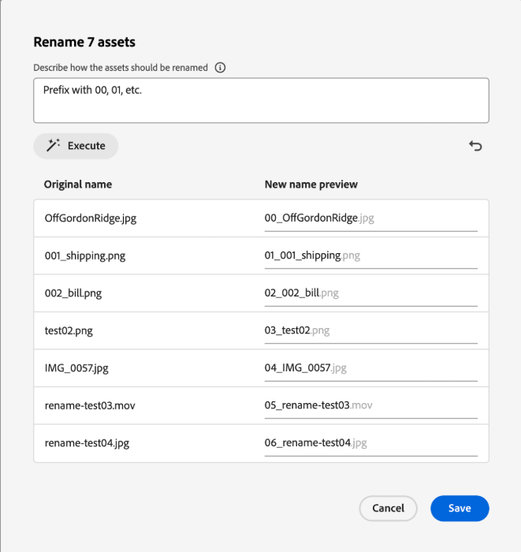

# Rename asset or folder in [!DNL Assets view] {#rename-single-asset-or-folder}

<table>
    <tr>
        <td>
            <i>New</i> <a href="/help/assets/dynamic-media/dm-prime-ultimate.md"><b>Dynamic Media Prime and Ultimate</b></a>
        </td>
        <td>
            <i>New</i> <a href="/help/assets/assets-ultimate-overview.md"><b>AEM Assets Ultimate</b></a>
        </td>
        <td>
            <i>New</i> <a href="/help/assets/integrate-aem-assets-edge-delivery-services.md"><b>AEM Assets integration with Edge Delivery Services</b></a>
        </td>
        <td>
            <i>New</i> <a href="/help/assets/aem-assets-view-ui-extensibility.md"><b>UI Extensibility</b></a>
        </td>
          <td>
            <i>New</i> <a href="/help/assets/dynamic-media/enable-dynamic-media-prime-and-ultimate.md"><b>Enable Dynamic Media Prime and Ultimate</b></a>
        </td>
    </tr>
    <tr>
        <td>
            <a href="/help/assets/search-best-practices.md"><b>Search Best Practices</b></a>
        </td>
        <td>
            <a href="/help/assets/metadata-best-practices.md"><b>Metadata Best Practices</b></a>
        </td>
        <td>
            <a href="/help/assets/product-overview.md"><b>Content Hub</b></a>
        </td>
        <td>
            <a href="/help/assets/dynamic-media-open-apis-overview.md"><b>Dynamic Media with OpenAPI capabilities</b></a>
        </td>
        <td>
            <a href="https://developer.adobe.com/experience-cloud/experience-manager-apis/"><b>AEM Assets developer documentation</b></a>
        </td>
    </tr>
</table>

Renaming can help in better organizing, categorizing, and identifying assets without altering its content or location. [!DNL Assets view] allows you to rename the selected asset or folder.

Execute the steps below to rename an asset or a folder:

1. Locate the asset or folder that you want to rename.

1. Use one of the folowing ways to rename an asset or a folder :

    * Select the asset or folder and click  **[!UICONTROL Rename]** from the top menu. 
    * Click more options `...` on the asset or folder and select **[!UICONTROL Rename]**. 
    * Click the title of an asset or a folder to rename it. Mention the new text in the **Rename Asset** textbox and click **Save**. This capability is available in Grid, Gallery, Waterfall and List views.

## AI-powered assets bulk rename {#rename-bulk-assets-using-ai}

[!DNL Assets view] allows you to rename multiple assets at once using AI. AI Bulk Rename functionality can only be applied to files, not folders. You can select multiple files at once and rename them all together.

Follow the steps below to rename the bulk of assets at once using AI generated prompts:

1. Select multiple assets and click **[!UICONTROL Bulk Rename]** from the top menu.

1. Add the prompt describing how you want to rename the selected assets. Refer to [some examples illustrating AI Bulk Rename](#examples-ai-bulk-rename).

1. Click **[!UICONTROL Execute]** to allow AI to rename assets as mentioned in the prompt.

1. [Optional] Click  to reverse or cancel the last action you performed. 

1. Check your changes in the [!UICONTROL New name preview] column and click **[!UICONTROL Save]**. 

    

## Some examples illustrating AI Bulk Rename {#examples-ai-bulk-rename}

The following are a few examples to use AI to rename assets in bulk based on an AI prompt:

* Prefix with 00, 01, and so on and suffix with today's date.
* Change all files to 'my-file' and append an incrementing number.
* Remove the prefix and suffix, just keep the middle part of the name.
* Prefix the files with 001, 002, etc. and translate into English.

>[!VIDEO](https://video.tv.adobe.com/v/3440975)

>[!NOTE]
>
> * You cannot convert emojis into text.
> * Use a unique name to avoid warning messages while renaming assets. Though you can try again with a new name.
> * You can also convert Unicode or non-alphanumeric characters into text.

## Next Steps {#next-steps}

* [Watch a video to manage metadata forms in Assets view](https://experienceleague.adobe.com/docs/experience-manager-learn/assets-essentials/configuring/metadata-forms.html)

* Provide product feedback using the [!UICONTROL Feedback] option available on the Assets view user interface

* Provide documentation feedback using [!UICONTROL Edit this page]  or [!UICONTROL Log an issue]  available on the right sidebar

* Contact [Customer Care](https://experienceleague.adobe.com/?support-solution=General#support)
