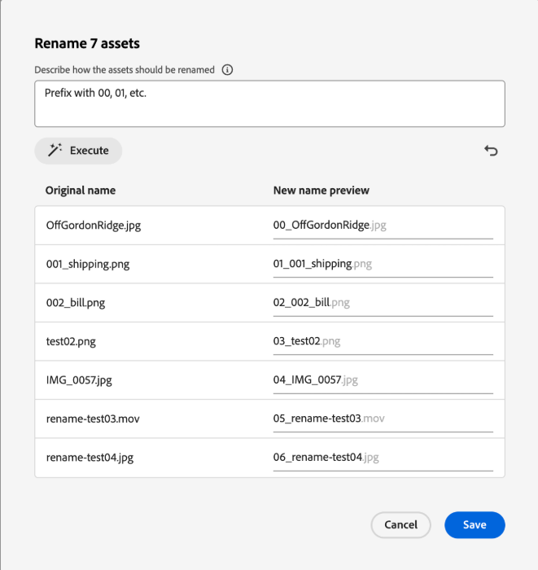

# Rename asset or folder in [!DNL Assets view] {#rename-single-asset-or-folder}

Renaming an asset or folder improves organization, categorization, and identification without altering the asset's content or its location within [!DNL Assets view]. The rename action changes only the display name, so the asset's stored data, references, and folder placement remain unchanged.

Execute the steps below to rename an asset or a folder:

1. Locate the asset or folder that you want to rename.

1. Use one of the following methods to rename an asset or a folder:

    * Select the asset or folder and click  **[!UICONTROL Rename]** from the top menu. In the **Rename Asset** textbox, enter the new name and click **Save**.
    * Click more options `...` on the asset or folder and select **[!UICONTROL Rename]**. Then enter the new name in the **Rename Asset** textbox and click **Save**.
    * Click the title of an asset or a folder to rename it directly. Mention the new text in the **Rename Asset** textbox and click **Save** to apply the change. This inline renaming capability is available in Grid, Gallery, Waterfall, and List views.

## AI-powered assets bulk rename {#rename-bulk-assets-using-ai}

The **Assets** view enables you to rename multiple assets simultaneously using AI. The **AI Bulk Rename** functionality applies **only to files, not folders**. Select multiple files at once and rename them together in a single operation, saving significant time compared to renaming each file individually.

### Steps to bulk rename assets using AI

An AI-generated prompt is a plain-language instruction that tells the AI how the selected files should be named. Follow these steps to rename a batch of assets at once using AI-generated prompts:

1. Select multiple assets and click **[!UICONTROL Bulk Rename]** from the top menu.

1. Add the prompt describing how you want to rename the selected assets. Refer to [some examples illustrating AI Bulk Rename](#examples-ai-bulk-rename).

1. Click **[!UICONTROL Execute]** so the AI renames the selected assets according to the instructions in your prompt. This applies the naming pattern consistently across every selected file.

    

1. [Optional] Click  to reverse or cancel the last renaming action, allowing you to correct results before saving. 

1. Review the proposed changes in the **[!UICONTROL New name preview]** column, which shows each file's new name before it is applied, then click **[!UICONTROL Save]** to confirm and finalize the renaming.

## Some examples illustrating AI Bulk Rename {#examples-ai-bulk-rename}

The following examples demonstrate how to use AI prompts to rename assets in bulk, transforming multiple asset names simultaneously through a single natural-language instruction. This prompt-driven approach lets you apply consistent naming conventions across large sets of assets without editing each name individually:

* **Sequential prefix with date suffix:** Prefix each file with 00, 01, and so on, and suffix with today's date (for example, `00-filename-2024`).
* **Rename with incrementing counter:** Change all files to `my-file` and append an incrementing number (for example, `my-file-1`, `my-file-2`).
* **Extract the core name:** Remove the prefix and suffix, keeping only the middle portion of the file name.
* **Sequential prefix with translation:** Prefix the files with 001, 002, and so on, and translate the names into English.

>[!VIDEO](https://video.tv.adobe.com/v/3440975)

>[!NOTE]
>
> * You cannot convert emojis into text.
> * Use a unique name to avoid warning messages while renaming assets, because duplicate names within the same location can conflict with existing assets. If a warning appears, you can try again with a new name.
> * You can also convert Unicode or non-alphanumeric characters into text.

## Next Steps {#next-steps}

After configuring metadata forms, continue with these steps to extend, refine, and support your [!DNL Assets view] workflow:

* [Watch a video to manage metadata forms in [!DNL Assets view]](https://experienceleague.adobe.com/docs/experience-manager-learn/assets-essentials/configuring/metadata-forms.html) for a guided, visual walkthrough of building and editing metadata forms

* Provide product feedback using the [!UICONTROL Feedback] option available on the [!DNL Assets view] user interface, so the Adobe product team can prioritize enhancements based on real usage

* Provide documentation feedback using [!UICONTROL Edit this page]  or [!UICONTROL Log an issue]  available on the right sidebar, helping keep this guidance accurate and complete for other users

* Contact Adobe [Customer Care](https://experienceleague.adobe.com/?support-solution=General#support) for account-specific or technical support that self-service resources cannot resolve

**See also**

* [Translate Assets](/help/assets/translate-assets.md) — localize asset metadata and content for multiple languages and regions
* [Assets HTTP API](/help/assets/mac-api-assets.md) — programmatically create, read, update, and manage assets through RESTful operations
* [Assets supported file formats](/help/assets/file-format-support.md) — review which image, document, video, and other file types Assets can ingest and process
* [Search assets](/help/assets/search-assets.md) — locate assets quickly using keywords, filters, and metadata criteria
* [Connected assets](/help/assets/use-assets-across-connected-assets-instances.md) — reuse assets across connected instances to maintain a single source of truth
* [Asset reports](/help/assets/asset-reports.md) — generate insights on asset usage, activity, and inventory
* [Metadata schemas](/help/assets/metadata-schemas.md) — define and standardize the metadata fields captured for each asset
* [Download assets](/help/assets/download-assets-from-aem.md) — export original files or renditions from AEM to local or external destinations
* [Manage metadata](/help/assets/manage-metadata.md) — view, edit, and enrich the metadata that governs asset discoverability and governance
* [Manage Dynamic Media templates](/help/assets/dynamic-media/manage-dynamic-media-templates.md) — create and control reusable templates for dynamic image and video delivery
* [Manage reports in [!DNL Assets view]](/help/assets/manage-reports-assets-view.md) — build, schedule, and monitor reports directly within the [!DNL Assets view] interface
* [Search facets](/help/assets/search-facets.md) — configure facet-based filtering to narrow search results by metadata attributes
* [Manage collections](/help/assets/manage-collections.md) — group related assets into collections for streamlined organization and sharing
* [Bulk metadata import](/help/assets/metadata-import-export.md) — import and export metadata in bulk to update large asset sets efficiently
* [Publish Assets to AEM and Dynamic Media](/help/assets/publish-assets-to-aem-and-dm.md) — make assets available for delivery across AEM and Dynamic Media channels
