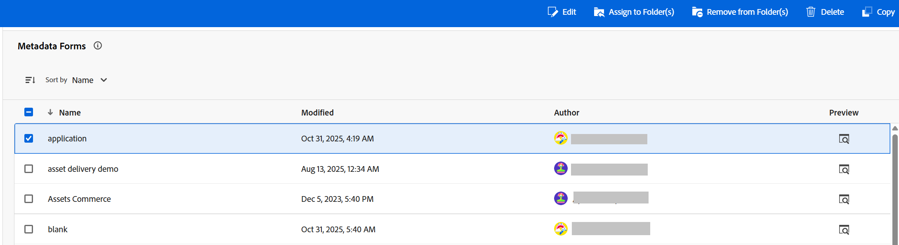
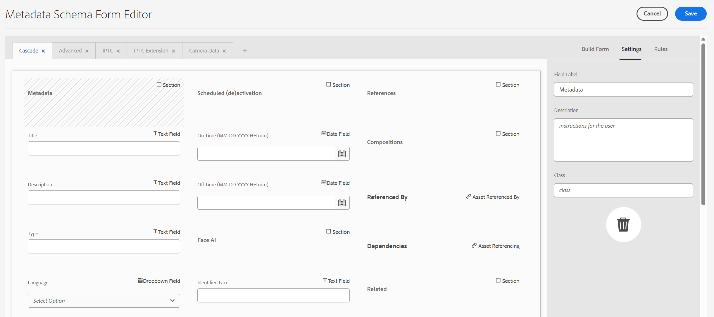
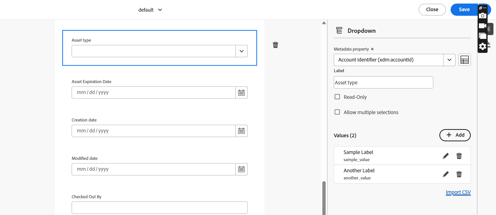
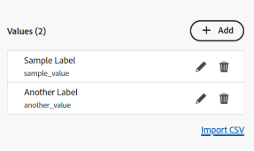
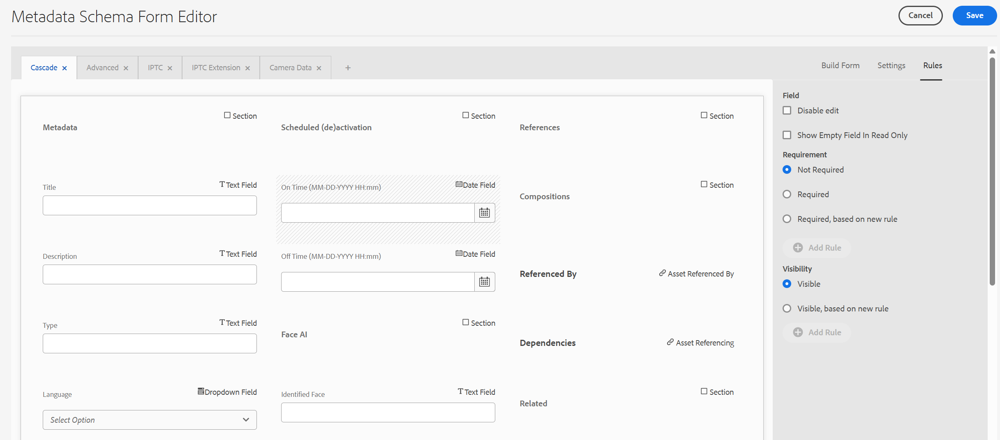
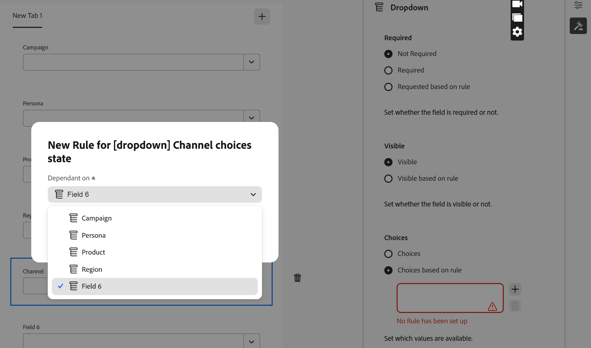
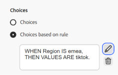

# Cascading Metadata {#cascading-metadata}

When capturing the metadata information of an asset, users provide information in the various available fields. You can display specific metadata fields or field values that are dependent on the options selected in the other fields. Such conditional display of metadata is called cascading metadata. In other words, you can create a dependency between a particular metadata field/value and one or more fields and/or their values.

Use metadata schemas to define rules for displaying cascading metadata. For example, if your metadata schema includes an asset type field, you can define a pertinent set of fields to be displayed based on the type of asset a user selects.

Here are some use cases for which you can define cascading metadata:

* Where user location is required, display relevant city names based on the user's choice of country and state.
* Load pertinent brand names in a list based on the user's choice of product category.
* Toggle the visibility of a particular field based on the value specified in another field. For example, display separate shipping address fields if the user wants the shipment delivered at a different address.
* Designate a field as mandatory based on the value specified in another field.
* Change options displayed for a particular field based on the value specified in another field.
* Set the default metadata value in a particular field based on the value specified in another field.

## Configure cascading metadata in [!DNL Experience Manager] {#configure-cascading-metadata-in-aem}

Consider a scenario where you want to display cascading metadata based on the type of asset that is selected. Some examples

* For a video, display applicable fields such as format, codec, duration, and so on.
* For a Word or PDF document, display fields, such as page count, author, and so on.

Irrespective of the asset type chosen, display the copyright information as a required field. You can use the [pre-defined metadata components](metadata-assets-view.md#property-components) and [assign metadata to a folder](metadata-assets-view.md#assign-metadata-form-folder).

### Build Metadata Schema Form {#build-metadata-schema-form}

Consider the steps below to create a new Metadata Schema Form: 

1. Select the [!DNL Experience Manager] logo, and go to **[!UICONTROL Settings]** > **[!UICONTROL Metadata Forms]**.
1. Select a schema form and then select **[!UICONTROL Edit]** from the toolbar to edit the schema.

   

1. Select `+` to add a new tab.

### Modify an existing Metadata Schema Form {#modify-existing-metadata-schema-form}

Consider the steps below to modify an existing Metadata Schema Form:

1. Open an existing Metadata Schema Form and navigate to the [pre-defined components](metadata-assets-view.md#property-components) that you want to add in the form and drop the elements on your canvas.

    

1. Add a Dropdown field for asset type. Specify a name and property path in the Settings.

   

   For example, if the Asset type is Video, then add the other required fields such as format, codec, and duration. Similarly, add dependent fields for other asset types. For example, add fields page count and author for document assets, such as PDF and Word files.

1. Values are the options provided to a metadata form-user. You can provide the key-value pairs either manually or from a JSON file.

    * To specify the values manually, click `+` and specify the option label and value. For example, specify Video, PDF, Word, and Image asset types.

    * To fetch the values from a CSV file dynamically, click **[!UICONTROL import CSV]** and provide the path of the CSV file. [!DNL Experience Manager] fetches the key-value pairs in the real time when the form is presented to the user.

   Both options are mutually exclusive. You cannot import the options from a CSV file and edit manually.

   

1. To create a dependency between the asset type field and other fields, choose the dependent field and open the **[!UICONTROL Rules]** tab.

   

1. Under **[!UICONTROL Required]**, choose the **[!UICONTROL Required, based on new rule]** option.

1. Under **[!UICONTROL Visibility]**, choose the **[!UICONTROL Visible, based on new rule]** option.

   >[!NOTE]
   >
   >You can apply **[!UICONTROL Requirement]** condition and **[!UICONTROL Visibility]** condition independent of each other.
   
1. Select **[!UICONTROL Add Rule]** and choose the **[!UICONTROL Asset Type]** field to create a dependency. Also choose the field value on which to create the dependency. In this case, choose **[!UICONTROL Video]**. Select **[!UICONTROL Done]** to save the changes.

   

   You can edit or delete the defined rule.
   
   

1. Similarly, create a dependency between the value in the Asset Type field and other fields.

1. Repeat the steps to create dependency between the other assets such as PDF and Word in the [!UICONTROL Asset Type] field and fields such as [!UICONTROL Page Count] and [!UICONTROL Author].

1. Click **[!UICONTROL Save]**. Apply the metadata schema to a folder.

1. Navigate to the folder to which you applied the Metadata Schema and open the properties page of an asset. Depending upon your choice in the Asset Type field, pertinent cascading metadata fields are displayed.
 
## Next Steps {#next-steps}

* [Watch a video to manage metadata forms in Assets view](https://experienceleague.adobe.com/docs/experience-manager-learn/assets-essentials/configuring/metadata-forms.html)

* Provide product feedback using the [!UICONTROL Feedback] option available on the Assets view user interface

* Provide documentation feedback using [!UICONTROL Edit this page]  or [!UICONTROL Log an issue]  available on the right sidebar

* Contact [Customer Care](https://experienceleague.adobe.com/?support-solution=General#support)

