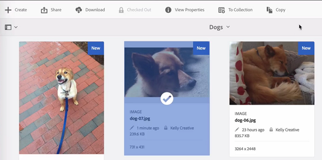

# Check-in and check-out files in [!DNL Experience Manager] DAM {#check-in-and-check-out-files-in-assets}

<table>
    <tr>
        <td>
            <i>New</i> <a href="/help/assets/dynamic-media/dm-prime-ultimate.md"><b>Dynamic Media Prime and Ultimate</b></a>
        </td>
        <td>
            <i>New</i> <a href="/help/assets/assets-ultimate-overview.md"><b>AEM Assets Ultimate</b></a>
        </td>
        <td>
            <i>New</i> <a href="/help/assets/integrate-aem-assets-edge-delivery-services.md"><b>AEM Assets integration with Edge Delivery Services</b></a>
        </td>
        <td>
            <i>New</i> <a href="/help/assets/aem-assets-view-ui-extensibility.md"><b>UI Extensibility</b></a>
        </td>
          <td>
            <i>New</i> <a href="/help/assets/dynamic-media/enable-dynamic-media-prime-and-ultimate.md"><b>Enable Dynamic Media Prime and Ultimate</b></a>
        </td>
    </tr>
    <tr>
        <td>
            <a href="/help/assets/search-best-practices.md"><b>Search Best Practices</b></a>
        </td>
        <td>
            <a href="/help/assets/metadata-best-practices.md"><b>Metadata Best Practices</b></a>
        </td>
        <td>
            <a href="/help/assets/product-overview.md"><b>Content Hub</b></a>
        </td>
        <td>
            <a href="/help/assets/dynamic-media-open-apis-overview.md"><b>Dynamic Media with OpenAPI capabilities</b></a>
        </td>
        <td>
            <a href="https://developer.adobe.com/experience-cloud/experience-manager-apis/"><b>AEM Assets developer documentation</b></a>
        </td>
    </tr>
</table>

| Version | Article link |
| -------- | ---------------------------- |
| AEM 6.5  |    [Click here](https://experienceleague.adobe.com/docs/experience-manager-65/assets/managing/check-out-and-submit-assets.html?lang=en)                  |
| AEM as a Cloud Service     | This article         |

[!DNL Adobe Experience Manager Assets] lets you check out assets for editing and check them back in after you complete making the changes. After you check out an asset, only you can edit, annotate, publish, move, or delete the asset. Checking out an asset locks the asset. Other users cannot perform any of these operations on the asset until you check the asset back in to [!DNL Assets]. However, they can still change the metadata for the locked asset.

To be able to check out/in assets, you require Write access on them.

This feature helps prevent other users from overriding the changes made by an author where multiple users collaborate on editing workflows across teams.

## Check out assets {#checking-out-assets}

1. From the [!DNL Assets] user interface, select the asset you want to check out. You can also select multiple assets to check out.

1. From the toolbar, click **[!UICONTROL Checkout]**. The **[!UICONTROL Checkout]** option toggles to **[!UICONTROL Checkin]**.
    To verify whether other users can edit the asset you checked out, log in as a different user. The icon  displays on the thumbnail of the asset that you checked out.

   

   Select the asset. Notice that the toolbar does not display any options that let you edit, annotate, publish, or delete the asset.

   

   To edit the metadata for the locked asset, click **[!UICONTROL View Properties]**.

1. Click **[!UICONTROL Edit]** to open the asset in edit mode.

1. Edit the asset and save the changes. For example, crop the image and save. You can also choose to annotate or publish the asset.

1. Select the edited asset from the [!DNL Assets] interface, and click **[!UICONTROL Checkin]** from the toolbar. The modified asset is checked in to [!DNL Assets] and is available to other users for editing.

## Forced check in {#forced-check-in}

Administrators can check in assets that are checked out by other users.

1. Log in to [!DNL Assets] as an administrator.
1. From the [!DNL Assets] user interface select one or more assets that have been checked out by other users.

   

1. From the toolbar, click **[!UICONTROL Release Lock]**. The asset is checked back in and available for edit to other users.

## Best practices and limitations {#tips-limitations}

* It is possible to delete a *folder* that contains checked-out asset files. Before deleting a folder, ensure that no digital assets are checked-out by users.

**See also**

* [Translate Assets](translate-assets.md)
* [Assets HTTP API](mac-api-assets.md)
* [Assets supported file formats](file-format-support.md)
* [Search assets](search-assets.md)
* [Connected assets](use-assets-across-connected-assets-instances.md)
* [Asset reports](asset-reports.md)
* [Metadata schemas](metadata-schemas.md)
* [Download assets](download-assets-from-aem.md)
* [Manage metadata](manage-metadata.md)
* [Search facets](search-facets.md)
* [Manage collections](manage-collections.md)
* [Bulk metadata import](metadata-import-export.md)
* [Publish Assets to AEM and Dynamic Media](/help/assets/publish-assets-to-aem-and-dm.md)

>[!MORELIKETHIS]
>
>* [Understand check in and check out in [!DNL Experience Manager] desktop app](https://experienceleague.adobe.com/docs/experience-manager-desktop-app/using/using.html#how-app-works2)
>* [Video tutorial to understand check in and check out in [!DNL Assets]](https://experienceleague.adobe.com/docs/experience-manager-learn/assets/collaboration/check-in-and-check-out.html)
