# Manage collections in [!DNL Content Hub] {#manage-collections}

A collection refers to a set of assets that can be shared among users. A collection can include assets from different locations while maintaining their referential integrity.

[!DNL Content Hub] lets you create public collections. These collections are accessible to all the entitled users, creating a shared space where multiple users can efficiently access and utilize content. Collections promote collaborative use of resources for increased efficiency and convenience. Within the collection browse page, you can: 

* **Create**: Create one or more collections.
* **View**: View the assets and their properties.  
* **Share**: Share assets as a link with others. 
* **Download**: Download the assets.
* **Remove**: Remove specific assets from a collection. 
* **Delete**: Delete the entire collection. 
* **Pin/Unpin**: Pin or unpin collection.
* **Favorite**: Mark collection as favorite.

It helps users to easily access and manage the diverse assets available within [!DNL Content Hub].

>[!VIDEO](https://video.tv.adobe.com/v/3435687/?learn=on){transcript=true}

## Prerequisites {#prerequisites}

[Content Hub users](deploy-content-hub.md#onboard-content-hub-users) can perform the actions mentioned in this article.

## Create collections{#create-collections}

You can choose to [create a new collection](#create-new-collection) or [add assets to an existing collection](#add-assets-to-existing-collection) while managing governance.

### Create a new collection{#create-new-collection}

Execute the steps below to control access while creating collections:

1. Go to **[!DNL Collections]** tab and click **[!UICONTROL Create Collection]**. A new Collection window appears.

1. Add **[!UICONTROL Title]** and **[!UICONTROL Description]** for the collection.

    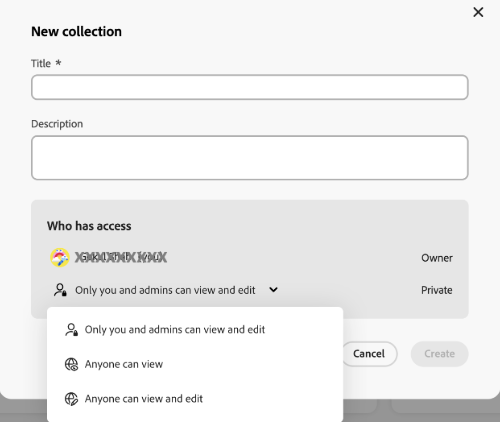

1. Under **[!UICONTROL Who can access]** dropdown > select the access control type. The following options are available:

    |Access method | Access type | Description |
    |---|---|---|
    | **Only you and administrators can edit**| Private | Only creator and the administrators can edit and access this collection. |
    | **Anyone can view**| Public | Everyone can access this collection, but only creator and Administrators can edit. |
    | **Anyone can view and edit**| Public | This collection is open to everyone, with full access and editing permissions granted without restrictions.|

    >[!NOTE]
    >
    > [!DNL Content Hub] administrator can view all the options available under **[!UICONTROL Who can access]** dropdown, whereas for regular users, you need to [specify and configure](configure-content-hub-ui-options.md) which options they can access.

1. Click **[!UICONTROL Create]**. Once done, you can [add assets to the collection](#add-assets-to-existing-collection).

>[!VIDEO](https://video.tv.adobe.com/v/3463336) 

<!--
>[!NOTE]
>
>Collections governance is a limited availability feature. You can get it enabled  by creating a support ticket. Once enabled, you need to [Configure Collections in Content Hub](configure-content-hub-ui-options.md#configure-collections-content-hub).
-->

<!--
To create a new collection, navigate to the **[!UICONTROL Collections]** tab and click **[!UICONTROL Create new collection]**. Enter the **[!UICONTROL Title]** and provide an optional **[!UICONTROL Description]** for the assets. Click **[!UICONTROL Create]**.
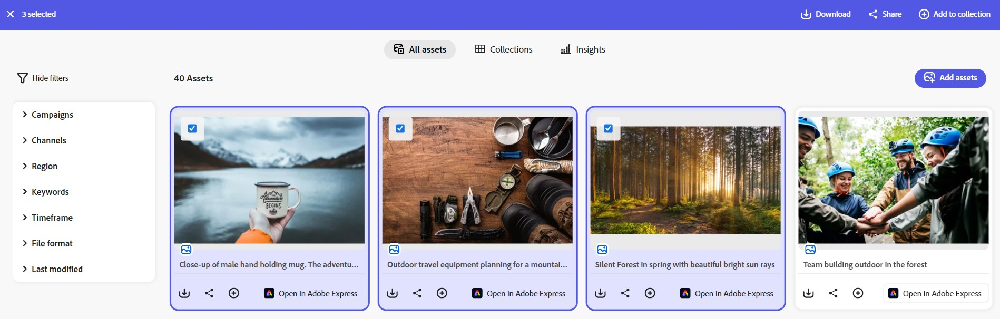          
-->

### Add assets to an existing collection{#add-assets-to-existing-collection}

To add assets to an existing collection, select the assets you need to add to the collection. Click **[!UICONTROL Add to collection]**. You are prompted to select the collection. 

 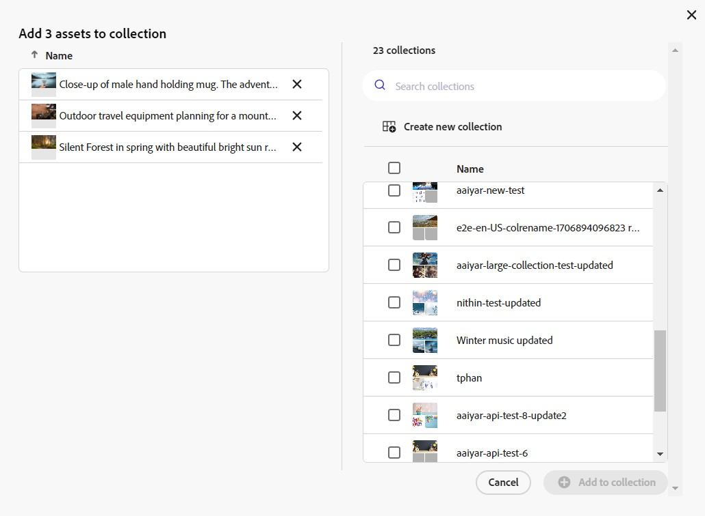

Choose the collection where you need to add the asset. You can also search the existing collection using the search bar.  Select the collection(s) to which you need to add the assets and click **[!UICONTROL Add to collection]**.

## View collections{#view-collections}

Navigate to the **[!UICONTROL Collections]** tab and search for the collection name. You can use filters to refine your search results by selecting specific criteria, helping you quickly find the most relevant collections. 

To view the list of assets available in a collection, click the collection name. You can also apply filters within a collection to narrow down the asset results. Click the asset that you need to view within a collection. [!DNL Content Hub] displays the detailed view for the asset. [See asset details](asset-properties-content-hub.md).

### Filter collections view {#filter-collections-view}

Content Hub allows you to filter collections view to easily find exactly what you are looking for by narrowing down options based on your preferences. Ensure the [configuration of Collections in Content Hub](configure-content-hub-ui-options.md#configure-collections-content-hub).

To filter the collections view, go to **[!DNL Collections]** tab and navigate to Collections drop down. Choose among the following options:
    
* **[!UICONTROL All Collections]:** Select this option to view and edit all collections, including those that are private or shared with you.
* **[!UICONTROL Only me]:** Select this option to view collections that are accessible to you.
* **[!UICONTROL Anyone can view]:** This option lets you filter collections that are accessible to everyone but editable only by the creator.
* **[!UICONTROL Anyone can edit]:** Select this option to filter collections that are both accessible and editable by everyone.

    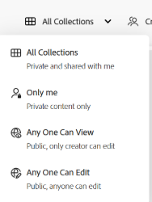

Moreover, to filter the collections view based on access permissions, go to **[!DNL Collections]** tab and navigate to one of the following options:

* **[!UICONTROL Created by anyone]:** This filter restricts you to view collections created by any user.

* **[!UICONTROL Created by me]:** This filter restricts you to view collections created by you.

    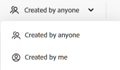

<!--
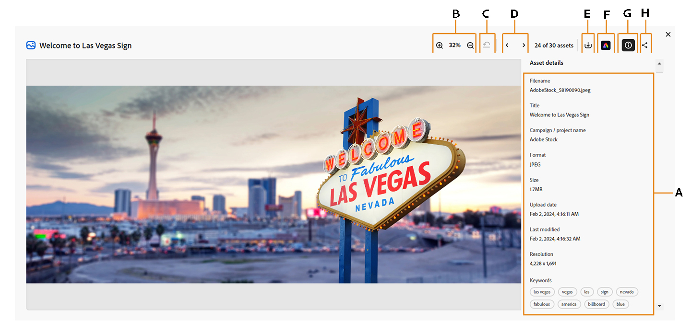

* **A**: Details and metadata of the asset 
* **B**: Zoom In or Zoom Out the asset 
* **C**: Reset Zoom view 
* **D**: View the previous or next asset 
* **E**: Download the asset 
* **F**: Open the asset in Adobe Express 
* **G**: Hide the metadata of the asset 
* **H**: Share the asset as a link 
-->

## Download assets available within a collection{#download-assets-within-collection}

To download assets available within a collection, navigate to the **[!UICONTROL Collections]** tab.  
Click  icon on the collection card. 

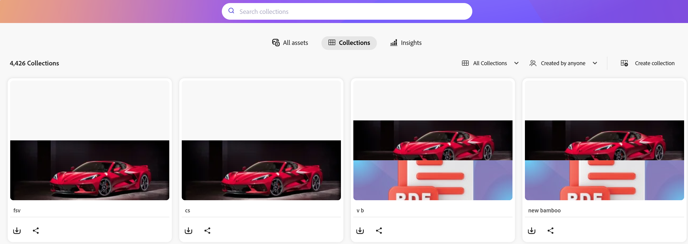

All the assets in the collection are downloaded.

You can also open the collection to download the assets individually. Click the collection containing the assets that you need to download. Select the assets and click **[!UICONTROL Download]**. 

Learn how to [download an asset from the [!DNL Content Hub]](download-assets-content-hub.md). 

## Share assets available within a collection {#share-assets-available-within-collection}

You can also share the assets available within a collection. Ensure to [enable public link sharing in Content Hub](configure-content-hub-ui-options.md#configure-collections-content-hub). Navigate to the **[!UICONTROL Collections]** tab. Select the  icon on the asset card. The share link is copied. You can share the copied link with the recipient. Learn more about [sharing assets in the [!DNL Content Hub]](share-assets-content-hub.md).

Content Hub Collections provides comprehensive governance tools for effective asset management, including customizable sharing permissions and collaboration features. From read-only access to full administrative control, these settings support fine governance over asset distribution. When sharing an asset either individually or as part of a collection, the scope of access is determined by the collection's current access level assigned to the user. Alternatively, you cannot share a private collection.

## Edit details of a collection {#edit-details-of-collection}

To edit **[!UICONTROL Title]** and **[!UICONTROL Description]** of a collection, click the collection name and then click the  icon. [!UICONTROL Collection Details] screen appears that allows you to edit the **[!UICONTROL Title]** and **[!UICONTROL Description]** of a collection. Click **[!UICONTROL Save Changes]** to confirm the modifications. Moreover, you can update the access to the collection through the Edit Collection dialog, depending on the configuration.

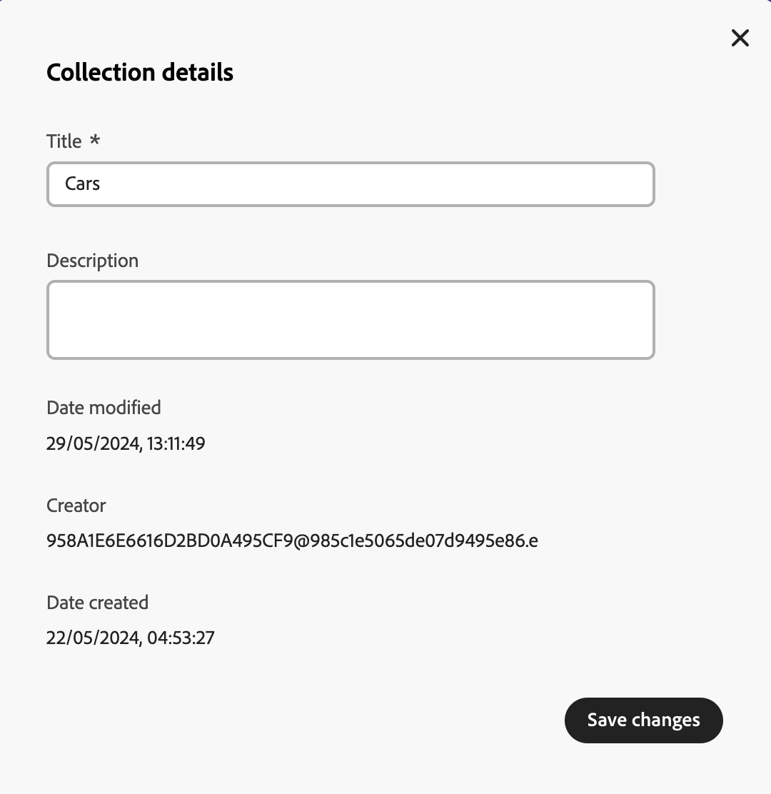

## Remove assets from a collection{#remove-assets-from-a-collection}

The following users can remove single or multiple assets from a collection:

* An administrator 
* An owner of collection
* A non-admin user with the edit rights

To remove assets from a collection, click the collection from which you need to remove assets, select the assets and click **[!UICONTROL Remove from collection]**. 

 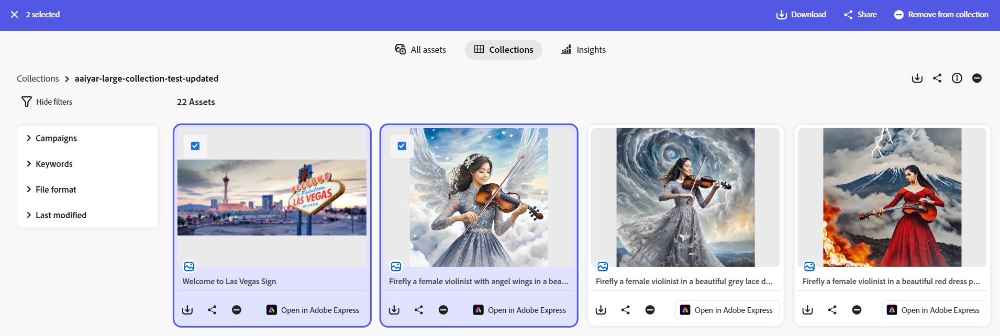

You are prompted to confirm the asset removal. Click **[!UICONTROL Remove]**.  
The selected assets are successfully removed from the collection. 

## Delete a collection{#delete-collection}

Only administrators and creator can delete a collection. To delete a collection, navigate to the **[!UICONTROL Collections]** tab and click the collection that you need to delete. Click  icon to delete the collection.

## Pin or Unpin collection {#pin-unpin-collection}

Content Hub Administrators can pin collections in Content Hub for quick access. Pinned collections are displayed in a dedicated Pinned section on the Collections home page, making it easier to keep important collections within reach. For quick access, you can pin or unpin a collection by executing the steps below:

1. Browse the Collections which you want to pin or unpin.

1. Click **[!UICONTROL More actions]**  and select **[!UICONTROL Pin to quick access]**. A confirmation box appears.

    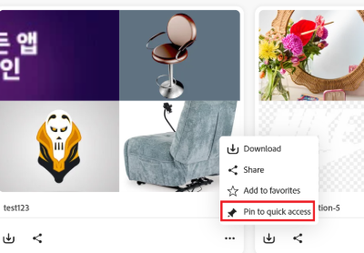

1. Click **[!UICONTROL Pin]** to confirm. The warning message appears when you pin a private collection.

    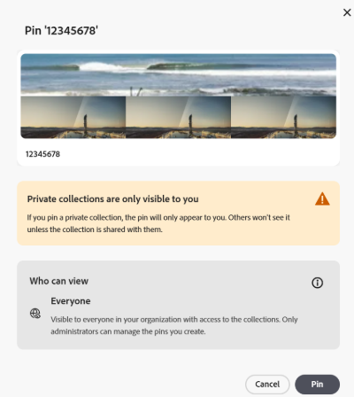

    The pinned Collections appear on the top for quick access. Alternatively, to unpin the collection, click **[!UICONTROL More actions]**  and select **[!UICONTROL Unpin]**.

    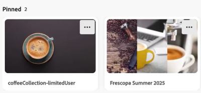
 
## Mark Collections as Favorite {#favorite-collection}

You can mark Collections as Favorite in Content Hub, making it easier to organize and retrieve them. Once added, your favorite collections are conveniently available from the Favorites tab on the Content Hub home page. Additionally, you can search assets within Favorite Collections. To mark collections as Favorites, follow these steps:

1. Browse the Collections you want to mark as Favorites.

1. Click **[!UICONTROL More actions]**  and select **[!UICONTROL Add to Favorites]** to mark collection as Favorite.

    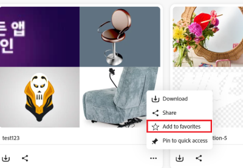

    Collections marked as Favorites now display under **[!UICONTROL My Favorites]** tab. Alternatively, you can remove the Collections from **[!UICONTROL My Favorites]**. To do this, click **[!UICONTROL More actions]**  and select **[!UICONTROL Remove from Favorites]**.

    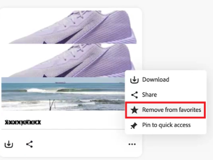

## Frequently asked questions {#faqs-manage-collections-content-hub}

### What do you refer to as collections in AEM Assets Content Hub?

A collection in AEM Assets Content Hub refers to a set of assets that can be shared among users. Collections can include assets from different locations while maintaining their referential integrity. They create a shared space for users to efficiently access and utilize content.

### How can I create a new collection in AEM Assets Content Hub?

To create a new collection in AEM Assets Content Hub, go to the Collections tab and click **Create Collection**. In the new Collection window, add a Title and Description, select the access control type under the **Who can access** dropdown list, and click **Create**. You can then add assets to the collection.

### What types of access control are available when creating a collection in AEM Assets Content Hub?

There are three access control types in AEM Assets Content Hub: **Private** - Only the creator and administrators can edit and access, **Public** - View only - Everyone can view, but only creator and administrators can edit, and **Public** - View and edit - everyone can access and edit the collection without restrictions.

### Who can perform actions on collections in AEM Assets Content Hub?

AEM Assets Content Hub users can perform actions such as creating, viewing, sharing, downloading, removing, deleting, pinning collections, and marking them as favorites. Administrators have additional privileges, such as viewing all access options and deleting collections.

### How do I add assets to an existing collection in AEM Assets Content Hub?

To add assets to an existing collection in AEM Assets Content Hub, select the assets you want to add, click **Add to collection**, and choose the collection from the list. You can also search for collections using the search bar. Click **Add to collection** to confirm the action.

### Can collections be filtered and searched in AEM Assets Content Hub?

Yes, collections can be filtered and searched in AEM Assets Content Hub by name, access permissions, or creator. Filters include options like **All Collections**, **Only me**, **Anyone can view**, **Anyone can edit**, **Created by anyone**, and **Created by me**.

### How do I download assets from a collection in AEM Assets Content Hub?

To download assets from a collection in AEM Assets Content Hub, navigate to the **Collections** tab and click the download icon on the collection card to download all assets. You can also open the collection, select individual assets, and click **Download** to download them separately.

### How can assets be shared from a collection in AEM Assets Content Hub?

Assets can be shared by enabling public link sharing in AEM Assets Content Hub. Select the share icon on the asset card to copy the share link, which can then be sent to recipients. Note that private collections cannot be shared.

### Who can remove assets from a collection in AEM Assets Content Hub?

An owner of the collection, an administrator, or a non-admin user with edit rights can remove single or multiple assets from a collection in AEM Assets Content Hub. To remove, select the assets and click **Remove from collection**, and then confirm the removal.

### Who is allowed to delete a collection from AEM Assets Content Hub and how is it done?

Only administrators and the creator of a collection can delete it. To delete, navigate to the Collections tab, select the collection, and click the delete icon. The collection is removed from AEM Assets Content Hub.

### What all options can an administrator configure for collections in AEM Assets Content Hub?

Administrator can enable or disable the following options for collections in AEM Assets Content Hub:

* Enable the **View Only Collections** toggle to allow collections that are accessible to everyone but editable only by the creator and administrator.

* Enable the **Public Collections** toggle to allow collections that are both accessible and editable by everyone. If **View Only Collections** and **Public Collections** toggles are disabled, then by default, non-admin users can create only private collections.

