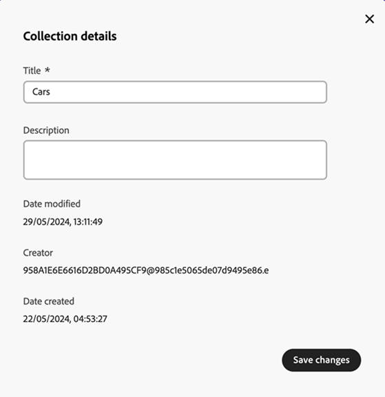

# Manage collections in [!DNL Content Hub] {#manage-collections}

| [Search Best Practices](/help/assets/search-best-practices.md) |[Metadata Best Practices](/help/assets/metadata-best-practices.md)|[Content Hub](/help/assets/product-overview.md)|[Dynamic Media with OpenAPI capabilities](/help/assets/dynamic-media-open-apis-overview.md)|[AEM Assets developer documentation](https://developer.adobe.com/experience-cloud/experience-manager-apis/)|
| ------------- | --------------------------- |---------|----|-----|

<!--  -->

>[!AVAILABILITY]
>
>Content Hub guide is now available in PDF format. Download the entire guide and use Adobe Acrobat AI Assistant to answer your queries. 
>
>[!BADGE Content Hub Guide PDF]{type=Informative url="https://helpx.adobe.com/content/dam/help/en/experience-manager/aem-assets/content-hub.pdf"}

A collection refers to a set of assets that can be shared among users. A collection can include assets from different locations while maintaining their referential integrity.

[!DNL Content Hub] lets you create public collections. These collections are accessible to all the entitled users, creating a shared space where multiple users can efficiently access and utilize content. Collections promote collaborative use of resources for increased efficiency and convenience. Within the collection browse page, you can: 

* **Create**: Create one or more collections.
* **View**: View the assets and their properties.  
* **Share**: Share assets as a link with others. 
* **Download**: Download the assets.
* **Remove**: Remove specific assets from a collection. 
* **Delete**: Delete the entire collection. 

It helps users to easily access and manage the diverse assets available within [!DNL Content Hub].

## Prerequisites {#prerequisites}

[Content Hub users](deploy-content-hub.md#onboard-content-hub-users) can perform actions mentioned in this article.

## Create collections{#create-collections}

You can choose to [create a new collection](#create-new-collection) or [add assets to an existing collection](#add-assets-to-existing-collection).

### Create a new collection{#create-new-collection}

Select the assets that you need to add to a collection and click **[!UICONTROL Add To collection]**.

 

To create a new collection, navigate to the **[!UICONTROL Collections]** tab and click **[!UICONTROL Create new collection]**. Enter the **[!UICONTROL Title]** and provide an optional **[!UICONTROL Description]** for the assets. Click **[!UICONTROL Create]**.

### Add assets to an existing collection{#add-assets-to-existing-collection}

To add assets to an existing collection, select the assets you need to add to the collection. Click **[!UICONTROL Add to collection]**. You are prompted to select the collection. 

 

Choose the collection where you need to add the asset. You can also search the existing collection using the search bar.  Select the collection (s) to which you need to add the assets and click **[!UICONTROL Add to collection]**.

## View collections{#view-collections}

Navigate to the **[!UICONTROL Collections]** tab and search for the collection name. To view the list of assets available in a collection, click the collection name. You can also apply filters within a collection to narrow down the asset results.

Click the asset that you need to view within a collection. [!DNL Content Hub] displays the detailed view for the asset. [See asset details](asset-properties-content-hub.md).

<!--

* **A**: Details and metadata of the asset 
* **B**: Zoom In or Zoom Out the asset 
* **C**: Reset Zoom view 
* **D**: View the previous or next asset 
* **E**: Download the asset 
* **F**: Open the asset in Adobe Express 
* **G**: Hide the metadata of the asset 
* **H**: Share the asset as a link 
-->

## Download assets available within a collection{#download-assets-within-collection}

To download assets available within a collection, navigate to the **[!UICONTROL Collections]** tab.  
Click  icon on the collection card. 

All the assets in the collection are downloaded.

You can also open the collection to download the assets individually. Click the collection containing the assets that you need to download. Select the assets and click **[!UICONTROL Download]**. 

Learn how to [download an asset from the [!DNL Content Hub]](download-assets-content-hub.md). 

## Share assets available within a collection {#share-assets-available-within-collection}

You can also share the assets available within a collection. Navigate to the **[!UICONTROL Collections]** tab. Select the  icon on the collection card. The share link is copied. You can share the copied link with the recipient. Learn more about [sharing assets in the [!DNL Content Hub]](share-assets-content-hub.md).

## Edit details of a collection {#edit-details-of-collection}

To edit **[!UICONTROL Title]** and **[!UICONTROL Description]** of a collection, click the collection name and then click the  icon. [!UICONTROL Collection Details] screen appears that allows you to edit the **[!UICONTROL Title]** and **[!UICONTROL Description]** of a collection. Click **[!UICONTROL Save Changes]** to confirm the modifications.

## Remove assets from a collection{#remove-assets-from-a-collection}

You can remove single or multiple assets from a collection. To remove assets from a collection, click the collection from which you need to remove assets, select the assets and click **[!UICONTROL Remove from collection]**. 

 

You are prompted to confirm the asset removal. Click **[!UICONTROL Remove]**.  
The selected assets are successfully removed from the collection. 

## Delete a collection{#delete-collection}

To delete a collection, navigate to the **[!UICONTROL Collections]** tab and click the collection that you need to delete. Click  icon to delete the collection.
