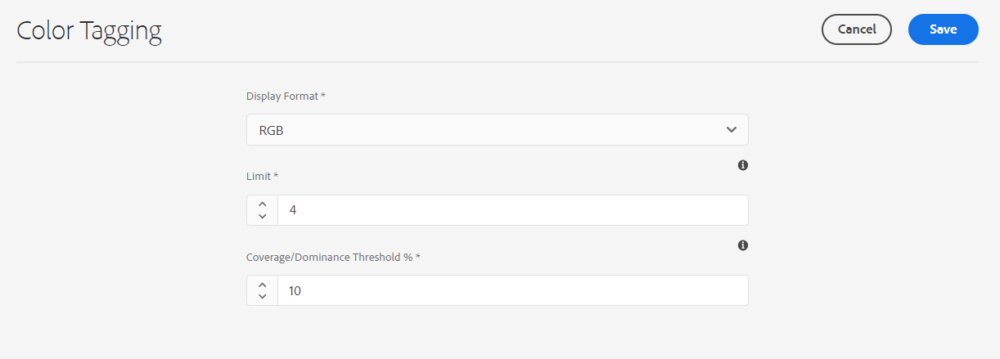
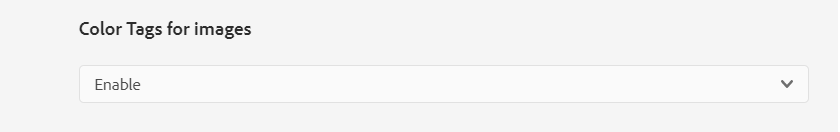
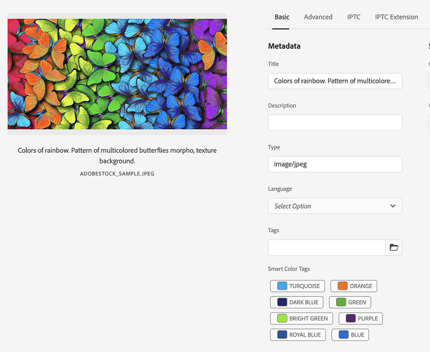
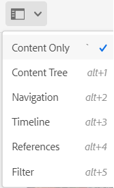
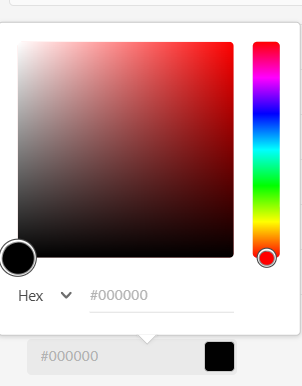

# Color tags for images {#color-tag-images}

Experience Manager Assets uses Adobe Sensei AI capabilities to distinguish between colors in an image and apply those as tags automatically on ingestion. These tags enable enhanced Search experience, based on image color composition. 

You can configure the number of colors, within a range of one to forty, that are tagged to an image so that you can search for images based on those colors later. Experience Manager Assets applies the tags based on the color coverage in an image. You can also configure the display format for a color tag.

>[!NOTE]
>
>This feature is available in prerelease channel. See [Prerelease Channel documentation](https://experienceleague.adobe.com/docs/experience-manager-cloud-service/content/release-notes/prerelease.html?lang=en#enable-prerelease) for information to enable the feature for your environment.

The following figure illustrates the sequence of tasks that you perform to configure and manage color tagging for images in Experience Manager Assets: 

## Supported file formats {#supported-file-formats-color-tags}

|File format |Extension | MIME type |Input Colorspace |Maximum supported source file size |Maximum supported file size resolution|
|---|---|---|---|---|---|
| JPEG |.jpg, .jpeg|image/jpeg |sRGB|15GB |20000px X 20000px | 
| PNG |.png|image/png |sRGB |15GB |20000px X 20000px |
| TIFF |.tif, .tiff|image/tiff |sRGB | 4GB (limited by format specifications |20000px X 20000px |
| PSD |.psd|image/vnd.adobe.photoshop |sRGB|2GB (limited by format specifications)|20000px X 20000px|
| GIF |.gif|image/gif|sRGB|15GB|20000px X 20000px|
| BMP |.bmp|image/bmp |sRGB|4GB (limited by format specifications)|20000px X 20000px|

## Manage color tagging properties {#manage-color-tagging-properties}

To manage the color tagging properties for images:

   1. Navigate to **[!UICONTROL Tools > Assets > Color Tagging]**.

      

   1. Specify a display format for the color tag in the **[!UICONTROL Display Format]** field. The possible options include the color name, RGB, or HEX format.

   1. Specify the number of colors to tag for the images in the **[!UICONTROL Limit]** field. These colors display when you view the properties for an image.  You can define a number between one and forty in this field. The default value for this field is ten colors. 

   1. Specify the minimum color coverage percentage to include a color tag in the search results in the **[!UICONTROL Coverage/Dominance Threshold %]** field. For example, if the coverage of Red color in an image is ten percent and you define nine percent in this field, the image gets included when you search for images with Red color. However, if the coverage of Red color in an image is ten percent and you define eleven percent in this field, the image does not get included when you search for images with Red color.

      You can specify any number between five and hundred in this field. The default value is eleven.

      >[!NOTE]
      >
      >Adobe recommends to use a value close to the default value in this field. Setting a high number value set for this field (for example, greater than 25) may return very few search results. Similarly, setting a low number value (for example, less than 6) may return too many search results, which may not be useful.
      
   1. Click **[!UICONTROL Save]**.      

      >[!VIDEO](https://video.tv.adobe.com/v/340108)
 

### Disable color tagging {#disable-color-tagging}

Color tagging for images is enabled by default. You can disable color tagging at the folder-level. All child folders inherit the color tagging properties from the parent folder.

To disable color tagging at the folder-level:

1. Navigate to **[!UICONTROL Adobe Experience Manager > Assets > Files]**.

1. Select the folder and click **[!UICONTROL Properties]**.

1. In the **[!UICONTROL Asset Processing]** tab, navigate to the **[!UICONTROL Color Tags for images]** folder. Select one of the following values from the drop-down list:

   * Inherited - The folder inherits the enable or disable options from the parent folder.

   * Enable - Enables color tagging for the selected folder.

   * Disable - Disables color tagging for the selected folder.

   

## Configure metadata schema to add smart color tags component {#configure-metadata-schema}

Metadata schemas contain specific fields for specific information to be filled in. It also contains layout information to display metadata fields in a user-friendly way. Metadata properties include title, description, MIME types, tags, and more. You can use the [!UICONTROL Metadata Schema Forms] editor to modify the existing schemas or add custom metadata schemas.

>[!NOTE]
>
>Smart Color Tag field is available in default metadata schema. If you are using a customized metadata schema, configure your schema to add smart color tag field.

To add the Smart Color Tags component to the Metadata Schema Form Editor:

1. Navigate to **[!UICONTROL Tools > Assets > Metadata Schemas]**.

1. Select the schema name and click **[!UICONTROL Edit]**.

1. Drag **[!UICONTROL Smart Color Tags]** from the **[!UICONTROL Build Form]** tab to the **[!UICONTROL Metadata Schema Form Editor]**.

1. Click the **[!UICONTROL Smart Color Tag Field]** in the **[!UICONTROL Metadata Schema Form Editor]**.

1. Specify an appropriate value in the **[!UICONTROL Field Label]** field in the **[!UICONTROL Settings]**  tab.

1. Click **[!UICONTROL Save]**.

     >[!VIDEO](https://video.tv.adobe.com/v/340124)

## View smart color tags for images {#view-color-tags}

To view smart color tags for images:

1. Navigate to **[!UICONTROL Adobe Experience Manager > Assets > Files]**.

1. Click the appropriate folder and select the image.

1. Select **[!UICONTROL Properties]** and view the tags in the **[!UICONTROL Smart Color Tags]** field.

   

   Hover the mouse over a color tag to view the **[!UICONTROL Coverage/Dominance Threshold %]** of a color in an image.

## Configure AEM Assets color predicate {#configure-search-predicate}

You can configure search filter for images. You can then base your search criteria on a specific color to filter the results.

>[!NOTE]
>
>Configure AEM Assets color predicate only if you are not using the default search form.

To configure the search filter, create an Asset Color Predicate using the Assets Admin Search Rail.

To configure the search filter:

1.  Navigate to **[!UICONTROL Tools > General > Search Forms]**.

1. Select **[!UICONTROL Assets Admin Search Rail]** and click **[!UICONTROL Edit]**.

1. Drag **[!UICONTROL Asset Color Predicate]** from the **[!UICONTROL Select Predicate]** tab to the **[!UICONTROL Search Form Editor]**.

1. Specify an appropriate value in the **[!UICONTROL Field Label]** field in the **[!UICONTROL Settings]**  tab.

1. Click **[!UICONTROL Done]** to save the settings.

   >[!VIDEO](https://video.tv.adobe.com/v/340110)

## Search images based on colors {#search-images-based-on-colors}

>[!VIDEO](https://video.tv.adobe.com/v/340761)

After configuring all color tagging properties and [configuring Assets color predicate](#search-images-based-on-colors), you can search images based on a color as a filter.

To search images based on colors:

1. Navigate to **[!UICONTROL Assets > Files]**.

1. Select **[!UICONTROL Filter]** from the dropdown list.
   

1. Select the [AEM Assets color predicate](#configure-search-predicate).

1. Drag the color picker to select the appropriate color. The selected color displays in the read-only field available below the color picker. You can select RGB or HEX as the display format for the color.

   

   You can filter images based on the selection of one color. The images that have the selected color as one of the smart color tags and above the [Coverage/ Dominance Threshold %](#manage-color-tagging-settings) display in the right pane.

1. Click x in the Search bar to clear the filter.

