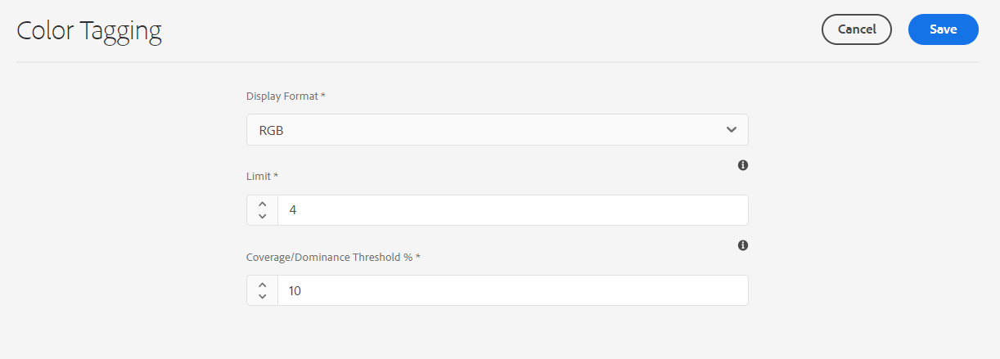
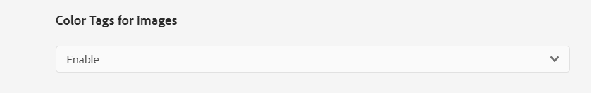
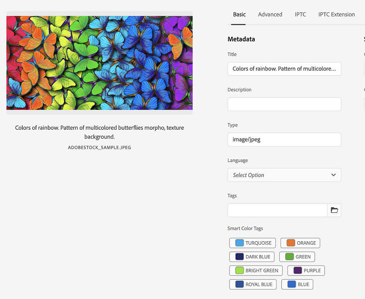
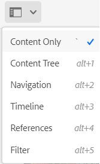
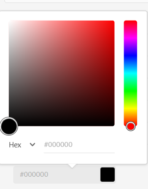

# Color tags for images {#color-tag-images}

[!DNL Adobe Experience Manager] (AEM) Assets automatically applies **color tags** to images on ingestion, using Adobe AI capabilities to distinguish between the distinct colors in an image. Administrators can configure a **range of one to 40 colors** to be tagged per image, enabling a color-driven search experience across the digital asset library. These tags let users locate images based on image color composition, making it possible to retrieve visually consistent assets quickly.

## How color tagging works

On ingestion, Adobe AI analyzes each image and identifies its distinct colors. Experience Manager Assets applies the color tags based on the color coverage in an image, so the colors that dominate a given image are prioritized in the tagging. Because these tags are generated automatically, no manual tagging effort is required to make images searchable by color.

This color-based tagging enables an enhanced Search experience built around image color composition. As a result, users can filter and surface assets by dominant color, which is valuable for maintaining brand color consistency, assembling color-coordinated collections, and speeding up creative asset discovery.

## Configuration options

Administrators can control how color tagging behaves for images in Experience Manager Assets through the following settings:

- **Number of tagged colors:** Configure how many colors are tagged to each image, within a supported range of **one to 40 colors**. A higher number captures more of an image's color nuance for later search, while a lower number focuses tagging on the most prominent colors.
- **Display format:** Configure the display format for a color tag, controlling how each color tag is presented within the interface.

Because the number of tagged colors determines which colors are searchable later, choosing the appropriate range ensures that images can be reliably found based on the colors relevant to your workflow.

## Configuring and managing color tagging

Configuring and managing color tagging for images in Experience Manager Assets follows a defined sequence of tasks. In general, administrators enable and configure the color tagging capability, set the number of colors to be tagged and the display format, apply these settings so that Adobe AI tags images on ingestion, and then use the resulting color tags to search and manage assets by color. Completing these tasks in order ensures that images are consistently tagged and reliably discoverable through color-based search.

## Supported file formats {#supported-file-formats-color-tags}

The following image file formats are supported for color tagging, each with defined limits on source file size and resolution. All supported formats require an **sRGB input colorspace** and share a **maximum supported resolution of 20000 × 20000 pixels**. The **MIME type** (Multipurpose Internet Mail Extensions type) identifies each format's media classification, while the **Input Colorspace** specifies the color model the source file must use. Note that certain maximum file sizes are limited by each format's own specifications rather than by the service itself. Supported formats include **JPEG** (Joint Photographic Experts Group), **PNG** (Portable Network Graphics), **TIFF** (Tagged Image File Format), **PSD** (Adobe Photoshop Document), **GIF** (Graphics Interchange Format), and **BMP** (Bitmap).

|File format |Extension | MIME type |Input Colorspace |Maximum supported source file size |Maximum supported file size resolution|
|---|---|---|---|---|---|
| JPEG |.jpg and .jpeg|image/jpeg |sRGB|15 GB |20000 × 20000 pixels |
| PNG |.png|image/png |sRGB |15 GB |20000 × 20000 pixels |
| TIFF |.tif and .tiff|image/tiff |sRGB | 4 GB (limited by format specifications) |20000 × 20000 pixels |
| PSD |.psd|image/vnd.adobe.photoshop |sRGB|2 GB (limited by format specifications)|20000 × 20000 pixels|
| GIF |.gif|image/gif|sRGB|15 GB|20000 × 20000 pixels|
| BMP |.bmp|image/bmp |sRGB|4 GB (limited by format specifications)|20000 × 20000 pixels|

## Manage color tagging properties {#manage-color-tagging-properties}

To manage the color tagging properties for images:

1. Navigate to **[!UICONTROL Tools > Assets > Color Tagging]**.

   

1. Specify a display format for the color tag in the **[!UICONTROL Display Format]** field. The possible options include the color name, RGB, or HEX format.

1. Set the number of colors to tag for each image in the **[!UICONTROL Limit]** field, which accepts a value **between 1 and 40** and defaults to **10 colors**. These tagged colors appear when the image properties are viewed. Because this field controls how many dominant colors are captured per image, a higher limit records more colors while a lower limit keeps the tag set concise.

1. Specify the minimum color coverage percentage required to include a color tag in the search results in the **[!UICONTROL Coverage/Dominance Threshold %]** field. This threshold determines whether a color is prominent enough within an image to be indexed for color-based search. For example, if the coverage of Red color in an image is ten percent and you define nine percent in this field, the image is included when you search for images with Red color. However, if the coverage of Red color in an image is ten percent and you define 11 percent in this field, the image is excluded from a Red color search.

   You can specify any number **between 5 and 100** in this field, and the **default value is 11**.

   >[!NOTE]
   >
   >Adobe recommends using a value close to the default value in this field. Setting a high value (for example, greater than 25) may return few search results, because fewer colors will meet the elevated coverage requirement. Setting a low value (for example, less than 6) may return too many search results, which may not be useful.

1. Click **[!UICONTROL Save]**.

   >[!VIDEO](https://video.tv.adobe.com/v/340108)

### Disable color tagging {#disable-color-tagging}

**Color tagging for images is enabled by default** in [!DNL Adobe Experience Manager] (AEM). Administrators can disable color tagging at the folder-level to control automated tagging behavior for specific asset directories. All child folders inherit the color tagging properties from the parent folder. As a result, changing the setting on a parent folder automatically propagates to nested folders, ensuring consistent tagging behavior across an asset hierarchy without configuring each folder individually.

To disable color tagging at the folder-level:

1. Navigate to **[!UICONTROL Adobe Experience Manager > Assets > Files]**.

1. Select the folder and click **[!UICONTROL Properties]**.

1. In the **[!UICONTROL Asset Processing]** tab, navigate to the **[!UICONTROL Color Tags for images]** folder. Select one of the following values from the drop-down list:

   * **Inherited** - The folder inherits the enable or disable option from its parent folder, applying whatever color tagging behavior is configured higher in the hierarchy.

   * **Enable** - Enables color tagging for the selected folder, so images added to the folder are processed for color tags.

   * **Disable** - Disables color tagging for the selected folder, so no color tags are generated for images in the folder.

   

## Configure metadata schema to add smart color tags component {#configure-metadata-schema}

Metadata schemas define the specific fields used to capture specific information about an asset. Each schema also defines layout information that organizes and displays metadata fields in a user-friendly, structured way. Common metadata properties include **title**, **description**, **MIME types**, and **tags**, among others. Use the [!UICONTROL Metadata Schema Forms] editor to modify existing schemas or to create custom metadata schemas tailored to your organization's workflows.

>[!NOTE]
>
>The Smart Color Tag field is available in the default metadata schema. Smart color tags automatically classify assets by their dominant colors, making visual assets easier to search and organize. If you are using a customized metadata schema, the Smart Color Tag field is not included by default, so you must configure your schema to add the smart color tag field.

To add the Smart Color Tags component to the Metadata Schema Form Editor:

1. Navigate to **[!UICONTROL Tools > Assets > Metadata Schemas]**.

1. Select the schema name and click **[!UICONTROL Edit]**.

1. Drag **[!UICONTROL Smart Color Tags]** from the **[!UICONTROL Build Form]** tab to the **[!UICONTROL Metadata Schema Form Editor]**. This adds the smart color tag capability to the selected schema.

1. Click the **[!UICONTROL Smart Color Tag Field]** in the **[!UICONTROL Metadata Schema Form Editor]**.

1. Specify an appropriate value in the **[!UICONTROL Field Label]** field in the **[!UICONTROL Settings]** tab. This label determines how the smart color tag field appears to users completing metadata.

1. Click **[!UICONTROL Save]** to apply the changes to the schema.

     >[!VIDEO](https://video.tv.adobe.com/v/340124)

## Color tags for existing images in DAM {#color-tags-existing-images}

Existing images in [!DNL Adobe Experience Manager] (AEM) **Digital Asset Management (DAM)** are not color tagged automatically. To generate color tags for assets already stored in the repository, run the **[!UICONTROL Reprocess Assets]** action manually. Reprocessing re-runs the asset processing workflow, which analyzes each image and applies **Smart Color Tags** based on the dominant colors it detects. Because these color tags improve searchability and visual discovery within the DAM, applying them to legacy assets makes previously untagged images findable through color-based queries.

**Smart Color Tags** are metadata labels that describe the predominant colors present in an image. They enable users to filter and search the asset library by color.

To color tag images, or entire folders (including subfolders) of assets that exist in the assets repository, follow these steps:

1. Select the [!DNL Adobe Experience Manager] logo and then select assets from the [!UICONTROL Navigation] page.

1. Select [!UICONTROL Files].

1. In the Assets interface, navigate to the folder to which you want to apply color tags.

1. Select the entire folder or specific images.

1. Select the  **[!UICONTROL Reprocess Assets]** icon and select the **[!UICONTROL Full Process]** option. The **Full Process** option ensures the complete processing workflow runs, which is required to generate the color tags.

When the process completes, navigate to the [!UICONTROL Properties] page of any image within the folder. The automatically generated tags appear in the **[!UICONTROL Smart Color Tags]** section on the [!UICONTROL Basic] tab.

## View smart color tags for images {#view-color-tags}

**Smart color tags** automatically identify and label the dominant colors present within an image, making it easier to organize, filter, and retrieve visual assets by their color composition. Because these tags are generated for each image, teams can quickly locate assets that match a specific color palette without manually inspecting every file.

**To view smart color tags for images:**

1. Navigate to **[!UICONTROL Adobe Experience Manager > Assets > Files]** to access the digital asset repository where your image files are stored.

1. Click the appropriate folder and select the image whose color tags you want to review.

   

1. Select **[!UICONTROL Properties]** and view the tags in the **[!UICONTROL Smart Color Tags]** field. This field lists the colors detected within the selected image.

   Hover the mouse over a color tag to view the **[!UICONTROL Coverage/Dominance Threshold %]** of that color in the image. This percentage indicates how prominently the color appears—that is, how much of the image the color occupies—so you can gauge which colors are dominant versus secondary within the visual.

## Configure AEM Assets color predicate {#configure-search-predicate}

The **[!DNL Adobe Experience Manager] (AEM) Assets color predicate** configures a search filter that lets you find images by color. Once configured, this predicate bases your search criteria on a specific color and returns only the assets that match, enabling fast, color-based visual discovery across large image libraries.

Color-based filtering is especially valuable for teams managing extensive digital asset collections, because it allows users to locate on-brand imagery, group visually similar assets, and refine large result sets by dominant color rather than relying solely on metadata or file names.  This streamlines creative workflows and improves the precision of asset retrieval.

>[!NOTE]
>
>Configure the AEM Assets color predicate only if you are not using the default search form.

To configure the search filter, create an **Asset Color Predicate** using the Assets Admin Search Rail. The Asset Color Predicate is the search component that adds the color filtering control to your custom search form.

To configure the search filter:

1.  Navigate to **[!UICONTROL Tools > General > Search Forms]**.

1. Select **[!UICONTROL Assets Admin Search Rail]** and click **[!UICONTROL Edit]** to open it for modification.

1. Drag **[!UICONTROL Asset Color Predicate]** from the **[!UICONTROL Select Predicate]** tab to the **[!UICONTROL Search Form Editor]**, which places the color filter control onto the form.

1. Specify an appropriate value in the **[!UICONTROL Field Label]** field in the **[!UICONTROL Settings]**  tab. This label identifies the color filter for users of the search form.

1. Click **[!UICONTROL Done]** to save the settings and apply the color predicate to the search rail.

   >[!VIDEO](https://video.tv.adobe.com/v/340110)

## Search images based on colors {#search-images-based-on-colors}

>[!VIDEO](https://video.tv.adobe.com/v/340761)

After configuring all color tagging properties and [configuring the Assets color predicate](#search-images-based-on-colors), you can search and filter images by color directly within the AEM Assets interface. Color-based search relies on **smart color tags**, which are the dominant colors automatically detected and assigned to each asset during processing. This lets you locate visually matching images without depending on manual metadata or file names.

To search images based on colors:

1. Navigate to **[!UICONTROL Assets > Files]**.

   

1. Select **[!UICONTROL Filter]** from the drop-down list.

1. Select the [AEM ([!DNL Adobe Experience Manager]) Assets color predicate](#configure-search-predicate).

1. Drag the color picker to select the appropriate color. The selected color displays in the read-only field available below the color picker, which confirms your exact selection before the filter is applied. You can select **RGB** or **HEX** as the display format for the color, allowing you to match a specific brand or design value precisely.

   

   You can filter images based on the selection of **one color** at a time. The images that have the selected color as one of the **smart color tags**, and that appear **above the [Coverage/ Dominance Threshold %](#manage-color-tagging-settings)**, display in the right pane. The Coverage/Dominance Threshold % defines the minimum proportion a color must occupy within an image for that image to qualify as a match. As a result, only assets where the chosen color is sufficiently prominent are returned, ensuring more relevant results.

1. Clear the filter by clicking the **X** in the Search bar. Clearing the filter removes the color constraint and restores the full, unfiltered list of assets.

**See also**

* [Translate Assets](/help/assets/translate-assets.md)
* [Assets HTTP API](/help/assets/mac-api-assets.md)
* [Assets supported file formats](/help/assets/file-format-support.md)
* [Search assets](/help/assets/search-assets.md)
* [Connected assets](/help/assets/use-assets-across-connected-assets-instances.md)
* [Asset reports](/help/assets/asset-reports.md)
* [Metadata schemas](/help/assets/metadata-schemas.md)
* [Download assets](/help/assets/download-assets-from-aem.md)
* [Manage metadata](/help/assets/manage-metadata.md)
* [Manage Dynamic Media templates](/help/assets/dynamic-media/manage-dynamic-media-templates.md)
* [Manage reports in Assets view](/help/assets/manage-reports-assets-view.md)
* [Search facets](/help/assets/search-facets.md)
* [Manage collections](/help/assets/manage-collections.md)
* [Bulk metadata import](/help/assets/metadata-import-export.md)
* [Publish Assets to AEM and Dynamic Media](/help/assets/publish-assets-to-aem-and-dm.md)
