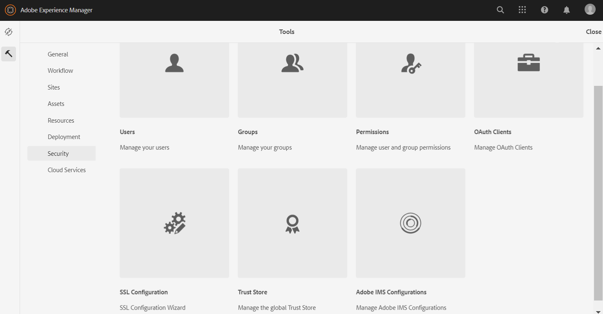

# Configure AEM Assets with Brand Portal {#configure-aem-assets-with-brand-portal}

Adobe Experience Manager (AEM) Assets is configured with Brand Portal through Adobe I/O, which procures an IMS token for authorization of your Brand Portal tenant.

## Prerequisites {#prerequisites}

You require the following to configure AEM Assets with Brand Portal:

* An up and running AEM Assets cloud instance.
* Brand Portal tenant URL.
* A user with system administrator privileges on the IMS organization of the Brand Portal tenant. 

**Contact Support** for further queries.

## Create configuration {#create-new-configuration}

You can create new configuration on Adobe I/O to configure your AEM Assets cloud instance with Brand Portal.

Perform the following steps in the listed sequence: 
1. [Obtain public certificate](#public-certificate)
1. [Create Adobe I/O integration](#createnewintegration) 
1. [Create IMS Account configuration](#create-ims-account-configuration)
1. [Configure cloud service](#configure-the-cloud-service)
1. [Test configuration](#test-configuration)

### Create IMS configuration {#create-ims-configuration}

IMS configuration authenticates your Brand Portal tenant with AEM Assets author instance. 

IMS configuration includes two steps:

* [Obtain public certificate](#public-certificate) 
* [Create IMS Account configuration](#create-ims-account-configuration)

### Obtain public certificate {#public-certificate}

Public certificate allows you to authenticate your profile on Adobe I/O.

1. Login to your AEM Assets cloud instance

1. From **Tools**  panel, navigate to **[!UICONTROL Security]** >> **[!UICONTROL Adobe IMS Configurations]**.

   

1. Adobe IMS Configurations page opens.
   
   Click **[!UICONTROL Create]**. 
   
   This will take you to the **[!UICONTROL Adobe IMS Technical Account Configuration]** page.

1. By default, **Certificate** tab opens.

   In **Cloud Solution**, select **[!UICONTROL Adobe Brand Portal]**.  

1. Mark the checkbox **[!UICONTROL Create new certificate]** and specify an **alias** for the certificate. The alias serves as name of the dialog. 

1. Click **[!UICONTROL Create certificate]**. A dialog appears. Click **[!UICONTROL OK]** to generate the public certificate.

   

1. Click **[!UICONTROL Download Public Key]** and save the *AEM-Adobe-IMS.crt* certificate file on your machine. The certificate file is used to [create Adobe I/O integration](#createnewintegration).  

   

1.  Click **[!UICONTROL Next]**. 

    In the **Account** tab, you create the Adobe IMS Account but for that you will need the integration details. Keep this page open for now.

    Open a new tab and [create Adobe I/O integration](#createnewintegration) to get the integration details for IMS Account configurations. 

### Create Adobe I/O integration {#createnewintegration}

Adobe I/O integration generates API Key, Client Secret, and Payload (JWT) which is required in setting up the IMS Account configurations.

1. Login to Adobe I/O Console with system administrator privileges on the IMS organization of the Brand Portal tenant.

   Default URL: [https://console.adobe.io/](https://console.adobe.io/) 

1. Click **[!UICONTROL Create Integration]**.

1. Select **[!UICONTROL Access an API]**, and click **[!UICONTROL Continue]**.

   

1. Create a new integration page opens. 
   
   Select your organization from the drop-down list.

   In **[!UICONTROL Experience Cloud]**, Select **[!UICONTROL AEM Brand Portal]** and click **[!UICONTROL Continue]**. 

   If the Brand Portal option is disabled for you, ensure that you have selected correct organization from the drop-down box above the **[!UICONTROL Adobe Services]** option. If you do not know your organization, contact your administrator.

   

1. Specify a name and description for the integration. Click **[!UICONTROL Select a File from your computer]** and upload the `AEM-Adobe-IMS.crt` file downloaded in the [obtain public certificates](#public-certificate) section.

1. Select the profile of your organization. 

   Or, select the default profile **[!UICONTROL Assets Brand Portal]** and click **[!UICONTROL Create Integration]**. The integration is created.

1. Click **[!UICONTROL Continue to integration details]** to view the integration information. 

   Copy the **[!UICONTROL API Key]** 
   
   Click **[!UICONTROL Retrieve Client Secret]** and copy the Client Secret key.

   

1. Navigate to **[!UICONTROL JWT]** tab, and copy the **[!UICONTROL JWT payload]**.

   The API Key, Client Secret key, and JWT payload information will be used to create IMS account configuration.

### Create IMS Account configuration {#create-ims-account-configuration}

Ensure that you have performed the following steps:

* [Obtain public certificate](#public-certificate)
* [Create Adobe I/O integration](#createnewintegration)

**Steps to create IMS account configuration:**

1. Open the IMS Configuration page, **[!UICONTROL Accounts]** tab. You kept the page open at the end of section, [Obtain public certificate](#public-certificate).

1. Specify a **[!UICONTROL Title]** for the IMS account.

   In **[!UICONTROL Authorization Server]**, enter the URL: [https://ims-na1.adobelogin.com/](https://ims-na1.adobelogin.com/)  

   Paste the API Key, Client Secret, and JWT payload that you have copied in the end of [Create Adobe I/O integration](#createnewintegration).

   Click **[!UICONTROL Create]**.

   The Integration is created.

   

   
1. Select the IMS configuration and click **[!UICONTROL Check Health]**. A dialog box appears. 

   Click **[!UICONTROL Check]**. On successful connection, the *Token retrieved successfully* message appears.

   

>[!CAUTION]
   >
   >Create only one valid IMS configuration. Do not create multiple IMS configurations.
   >
   > Make sure the configuration is healthy. In case, the configuration is unhealthy, delete it and create a new, healthy configuration.

### Configure cloud service {#configure-the-cloud-service}

Perform the following steps to create Brand Portal cloud service configuration:

1. Login to your AEM Assets cloud instance

1. From **Tools**  panel, navigate to **[!UICONTROL Cloud Services >> AEM Brand Portal]**.

   Brand Portal Configurations page opens.

1. Click **[!UICONTROL Create]**.

1. Specify a **[!UICONTROL Title]** for the configuration. 

   Select the IMS Configuration that you have created in the step, [create IMS Account configuration](#create-ims-account-configuration).
   
   In **[!UICONTROL Service URL]**, enter your Brand Portal tenant URL.   
   
    

1. Click **[!UICONTROL Save and Close]**. The cloud configuration is created. Your AEM Assets cloud instance is now configured with the Brand Portal tenant. 

### Test configuration {#test-configuration}

1. Login to your AEM Assets cloud instance.

1. From **Tools**  panel, navigate to **[!UICONTROL Deployment]** > **[!UICONTROL Distribution]**.

    

1. The Distribution page opens. 

   A Brand Portal distribution agent `bpdistributionagent0` is created under **[!UICONTROL Publish to Brand Portal]**.

   Click **[!UICONTROL Publish to Brand Portal]**.

   

   >[!NOTE]
    >
    >By default, one distribution agent is created for a Brand Portal tenant.
    >

1. The distribution agent page opens. By default, the **[!UICONTROL Status]** tab opens which populates the distribution queues. 
   
   A distribution agent contains two queues: 
   * A processing queue for distribution of assets to Brand Portal. 
   * An error queue for the assets where distribution has failed. 

   

1. To verify the connection between AEM Assets and Brand Portal, click **[!UICONTROL Test Connection]**.

   

   A message appears at the bottom of page that your test package is successfully delivered.

   >[!NOTE]
    >
    >Avoid disabling the distribution agent, as it can cause the distribution of the assets (running-in-queue) to fail.
    >

Brand Portal is successfully configured with your AEM Assets cloud instance. You can now:

* [Publish assets from AEM Assets to Brand Portal](publish-to-brand-portal.md)
* [Publish folders from AEM Assets to Brand Portal](publish-to-brand-portal.md#publish-folders-to-brand-portal)
* [Publish collections from AEM Assets to Brand Portal](publish-to-brand-portal.md#publish-collections-to-brand-portal)

In addition to assets, you can also publish metadata schemas, image presets, search facets, and tags from AEM Assets to Brand Portal. See, [Brand Portal documentation](https://docs.adobe.com/content/help/en/experience-manager-brand-portal/using/home.html).

## Distribution logs {#distribution-logs}

You can check the logs for detailed information on the actions performed on the distribution agent. 

For example, we have published an asset from AEM Assets to Brand Portal to verify the configuration. 

1. Follow the steps (Step 1 to 4) as shown in **[!UICONTROL Test Connection]** and navigate to the distribution agent page.

1. Click **[!UICONTROL Logs]** to view the distribution logs. You can see the processing and error logs here.

   

The distribution agent generates the following logs:

* INFO: This is a system generated log trigged on successful configuration that enables the distribution agent. 
* DSTRQ1 (Request 1): Trigged on test connection.
   
On publishing the asset, the following request and response logs are generated:

**Distribution agent request**:
* DSTRQ2 (Request 2): The asset publishing request is triggered.
* DSTRQ3 (Request 3): The system triggers another request to publish the folder in which the asset exist and replicates the folder in Brand Portal.

**Distribution agent response**:
* queue-bpdistributionagent0 (DSTRQ2): The asset is published to Brand Portal.
* queue-bpdistributionagent0 (DSTRQ3): The system replicates the folder containing the asset in Brand Portal.

In the above example, an additional request and response is triggered. The system could not find the parent folder (a.k.a Add Path) in Brand Portal because the asset was published for the first-time, therefore, triggers an addtional request to create a parent folder with the same name in Brand Portal where the asset is published.  

>[!NOTE]
    >
    >Additional request is generated in case the parent folder does not exist in Brand Portal (in the above example), or the parent folder has been modified in AEM Assets. 
    >

## Additional information {#additional-information}

Go to `/system/console/slingmetrics` for statistics related to the distributed content:

1. **Counter metrics**
   * sling: `mac_sync_request_failure`
   * sling: `mac_sync_request_received`
   * sling: `mac_sync_request_success`

1. **Time metrics**
   * sling: `mac_sync_distribution_duration`
   * sling: `mac_sync_enqueue_package_duration`
   * sling: `mac_sync_setup_request_duration`

<!--
   Comment Type: draft

   <li> </li>
   -->

   <!--
   Comment Type: draft

   <li>Step text</li>
   -->
