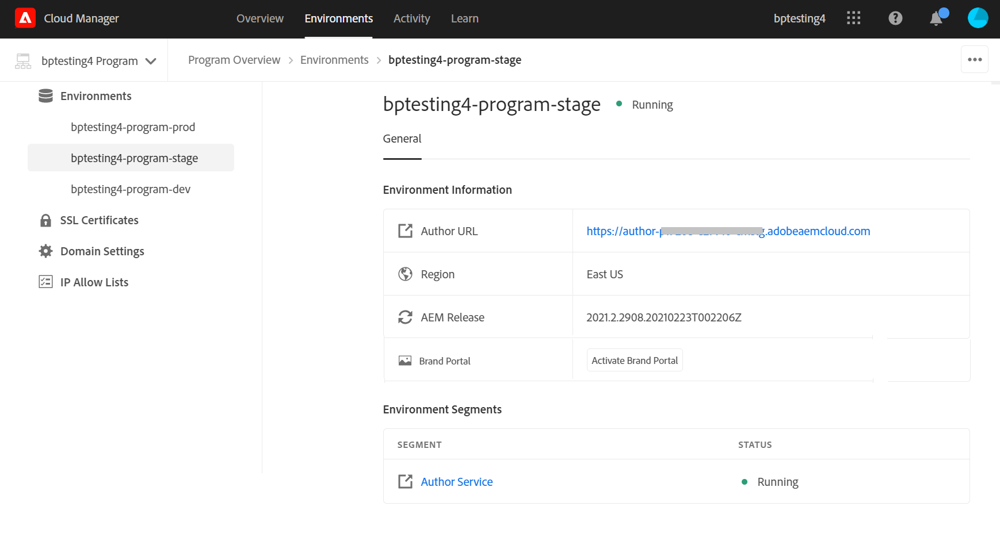
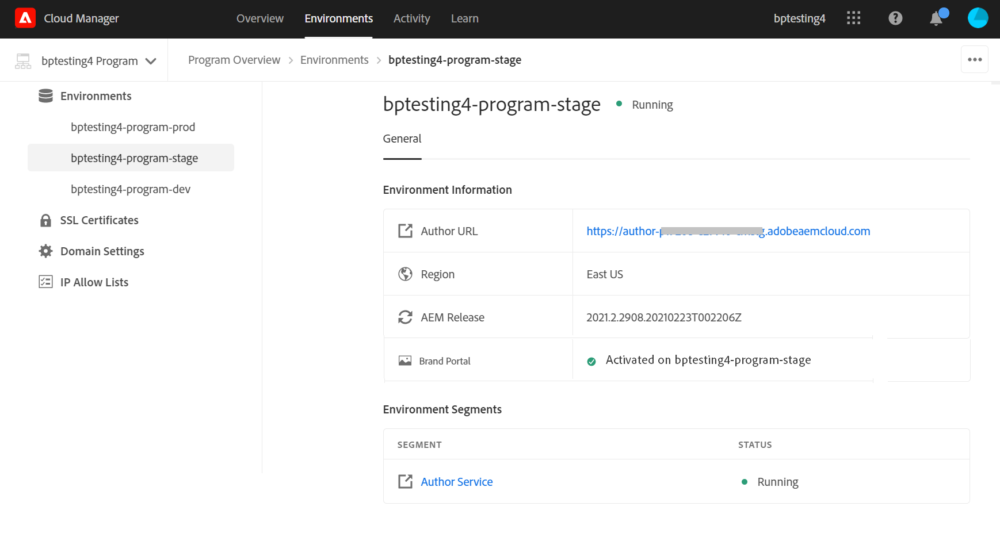
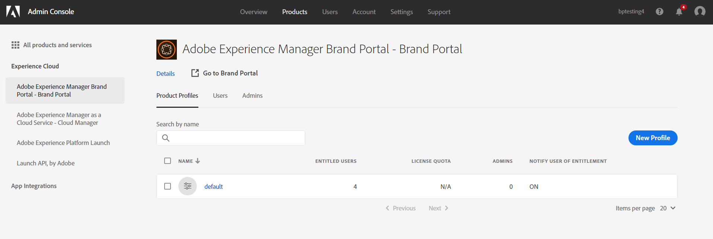
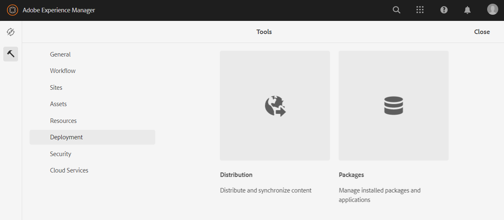
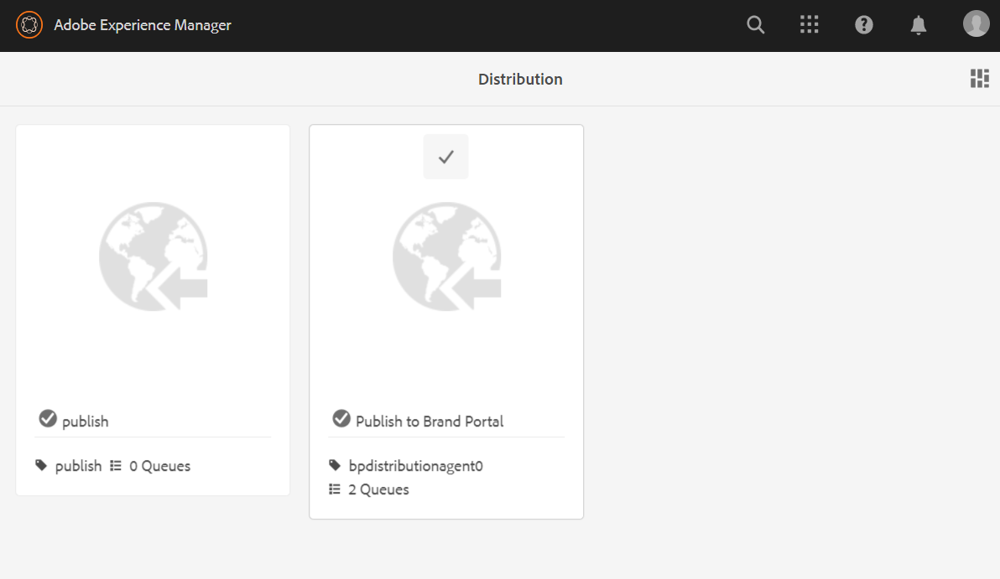
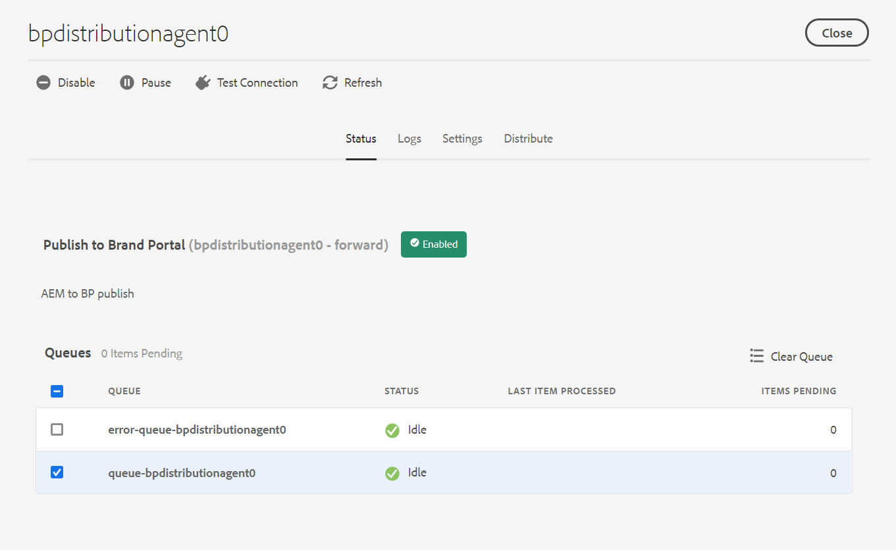
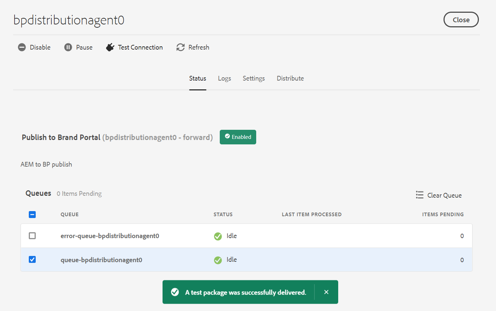
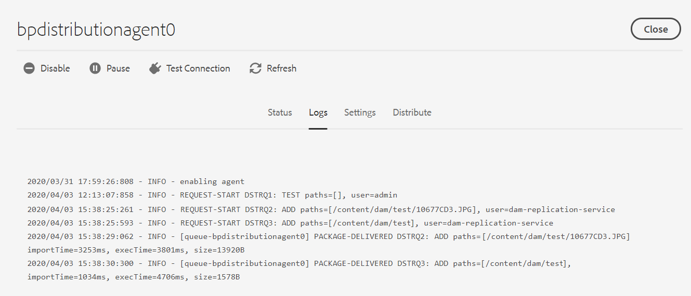

# Configure AEM Assets as a [!DNL Cloud Service] with Brand Portal {#configure-aem-assets-with-brand-portal}

Configuring Adobe Experience Manager Assets Brand Portal allows you to publish approved brand assets from Adobe Experience Manager Assets as a [!DNL Cloud Service] instance to Brand Portal and distribute them to the Brand Portal users.

## Activate Brand Portal using Cloud Manager {#activate-brand-portal}

The Cloud Manager user activates Brand Portal for an AEM Assets as a [!DNL Cloud Service] instance. The activation workflow creates the required configurations (authorization token, IMS configuration, and Brand Portal cloud service) at the backend and reflects the status of the Brand Portal tenant in Cloud Manager.

**Prerequisites** 

You require the following to activate Brand Portal on your AEM Assets as a [!DNL Cloud Service] instance:

* An up and running AEM Assets as a [!DNL Cloud Service] instance.
* A user having access to Cloud Manager, assigned to Profiles of the Cloud Manager Product. See [accessing Cloud Manager](https://experienceleague.adobe.com/docs/experience-manager-cloud-service/security/ims-support.html?lang=en#accessing-cloud-manager) for more information. 

>[!NOTE]
>
>An AEM Assets as a [!DNL Cloud Service] instance is entitled to connect only one Brand Portal tenant. You can create multiple environments (development, production, and stage) for your AEM Assets as a [!DNL Cloud Service] instance, wherein Brand Portal is activated only on one environment.

**Steps to activate Brand Portal**

You can activate Brand Portal while creating the environments for your AEM Assets as a [!DNL Cloud Service] instance, or separately. Let us assume that the environments were already created, and you are now required to activate Brand Portal.

1. Log in to Adobe Cloud Manager and navigate to **[!UICONTROL Environments]**.
   
   The **[!UICONTROL Environments]** page displays the list of all the existing environments.

1. Select the environments (one by one) from the list to view the environment details.

   Brand Portal is entitled to one of the available environments and is reflected under the **[!UICONTROL Environment Information]**.

   Once you find the environment associated with Brand Portal, click on the **[!UICONTROL Activate Brand Portal]** button to begin the activation workflow.

   

1. It may take few mins to activate the Brand Portal tenant as the activation workflow creates the required configurations at the backend. Once the Brand Portal tenant is activated, the status changes to Activated. 

   

**See also**:
* [Add users and roles in AEM Assets as a Cloud Service](https://experienceleague.adobe.com/docs/experience-manager-cloud-service/onboarding/what-is-required/add-users-roles.html?lang=en#role-definitions)

* [Manage environments in Cloud Manager](https://experienceleague.adobe.com/docs/experience-manager-cloud-service/implementing/using-cloud-manager/manage-environments.html?lang=en#adding-environments)

**Log in to your Brand Portal tenant**:

After activation of your Brand Portal tenant in Cloud Manager, you can login to Brand Portal from Admin Console or by directly using the tenant URL.

The default URL of your Brand Portal tenant is: `https://<tenant-id>.brand-portal.adobe.com/`.

Perform the following steps if you are not sure of the Brand Portal URL:

1. Log in to [Admin Console](http://adminconsole.adobe.com/) and navigate to **[!UICONTROL Products]**.
1. From the left rail, select **[!UICONTROL Adobe Experience Manager Brand Portal – Brand Portal]**.
1. Click on **[!UICONTROL Go to Brand Portal]** to directly open Brand Portal in the browser.

   Or copy the Brand Portal tenant URL and paste it in your browser to open the Brand Portal interface.

   

**Test connection**

Perform the following steps to validate the connection between your AEM Assets as a [!DNL Cloud Service] instance and Brand Portal tenant:

1. Log in to AEM Assets.

1. From the **Tools** panel, navigate to **[!UICONTROL Deployment]** > **[!UICONTROL Distribution]**.

    

   A Brand Portal distribution agent (**[!UICONTROL bpdistributionagent0]**) is created under **[!UICONTROL Publish to Brand Portal]**.

   

1. Click **[!UICONTROL Publish to Brand Portal]** to open the distribution agent. 

   You can see the distribution queues under the **[!UICONTROL Status]** tab. 
   
   A distribution agent contains two queues: 
   * **processing-queue**: for the distribution of assets to Brand Portal. 

   * **error-queue**: for the assets where distribution has failed. 
   
   >[!NOTE]
   >
   >It is recommended to review the failures and  clear the **error-queue** periodically.  

   

1. To verify the connection between AEM Assets as a [!DNL Cloud Service] and Brand Portal, click on the **[!UICONTROL Test Connection]** icon.

   

   A message appears that your *test package is successfully delivered*.

   >[!NOTE]
   >
   >Avoid disabling the distribution agent, as it can cause the distribution of the assets (running-in-queue) to fail.

To verify the connection between your AEM Assets as a [!DNL Cloud Service] instance and Brand Portal tenant, publish an asset from AEM Assets to Brand Portal. If the connection is successful, the published asset is visible in the Brand Portal interface.

You can now:

* [Publish assets from AEM Assets to Brand Portal](publish-to-brand-portal.md)
* [Publish folders from AEM Assets to Brand Portal](publish-to-brand-portal.md#publish-folders-to-brand-portal)
* [Publish collections from AEM Assets to Brand Portal](publish-to-brand-portal.md#publish-collections-to-brand-portal)
* [Publish assets from Brand Portal to AEM Assets](https://experienceleague.adobe.com/docs/experience-manager-brand-portal/using/asset-sourcing-in-brand-portal/brand-portal-asset-sourcing.html?lang=en) - Asset Sourcing in Brand Portal
* [Publish presets, schemas, and facets to Brand Portal](https://docs.adobe.com/content/help/en/experience-manager-brand-portal/using/publish/publish-schema-search-facets-presets.html)
* [Publish tags to Brand Portal](https://docs.adobe.com/content/help/en/experience-manager-brand-portal/using/publish/brand-portal-publish-tags.html)

See [Brand Portal documentation](https://docs.adobe.com/content/help/en/experience-manager-brand-portal/using/home.html) for more information.

**Distribution logs**

You can monitor the distribution agent logs for the asset publishing workflow. 

For example, we have published an asset from AEM Assets to Brand Portal to validate the configuration. 

1. Follow the steps (from 1 to 4) as shown in the **Test connection** section and navigate to the distribution agent page.
1. Click **[!UICONTROL Logs]** to view the processing and error logs.

   

The distribution agent has generated the following logs:

* INFO: This is a system-generated log that triggers on successful configuration of the distribution agent. 
* DSTRQ1 (Request 1): Triggers on test connection.

On publishing the asset, the following request and response logs are generated:

**Distribution agent request**:

* DSTRQ2 (Request 2): The asset publishing request is triggered.
* DSTRQ3 (Request 3): The system triggers another request to publish the AEM Assets folder (in which the asset exists) and replicates the folder in Brand Portal.

**Distribution agent response**:

* queue-bpdistributionagent0 (DSTRQ2): The asset is published to Brand Portal.
* queue-bpdistributionagent0 (DSTRQ3): The system replicates the AEM Assets folder (containing the asset) in Brand Portal.

In the above example, an additional request and response is triggered. The system could not find the parent folder (Add Path) in Brand Portal because the asset was published for the first time, therefore, it triggered an additional request to create a parent folder with the same name in Brand Portal where the asset is published.  

>[!NOTE]
>
>Additional request is generated in case the parent folder does not exist in Brand Portal or has been modified in AEM Assets. 

Along with the automation workflow to activate Brand Portal on AEM Assets as a [!DNL Cloud Service], there exists another method to manually configure AEM Assets as a [!DNL Cloud Service] with Brand Portal using Adobe Developer Console which is not recommended anymore.

>[!NOTE]
>
>You must contact Adobe Support if you are facing any problem while activating your Brand Portal tenant.

## Manual configuration using Adobe Developer Console {#manual-configuration}

The following section describes how to manually configure AEM Assets as a [!DNL Cloud Service] with Brand Portal using Adobe Developer Console. 

Earlier, AEM Assets as a [!DNL Cloud Service] was manually configured with Brand Portal via Adobe Developer Console, which procures an Adobe Identity Management Services (IMS) account token for authorization of the Brand Portal tenant. It requires configurations in both, AEM Assets as well as Adobe Developer Console.

1. In AEM Assets, create an IMS account and generate a public key (certificate).
1. In Adobe Developer Console, create a project for your Brand Portal tenant (organization).
1. Under the project, configure an API using the public key to create a service account connection.
1. Get the service account credentials and JSON Web Token (JWT) payload information.
1. In AEM Assets, configure the IMS account using the service account credentials and JWT payload.
1. In AEM Assets, configure the Brand Portal cloud service using the IMS account and Brand Portal endpoint (organization URL).
1. Test your configuration by publishing an asset from AEM Assets to Brand Portal.

>[!NOTE]
>
>An AEM Assets as a [!DNL Cloud Service] instance shall only be configured with one Brand Portal tenant.

**Prerequisites** 

You require the following to configure AEM Assets with Brand Portal:

* An up and running AEM Assets as a [!DNL Cloud Service] instance
* A Brand Portal tenant URL
* A user with system administrator privileges on the IMS organization of the Brand Portal tenant 

## Create configuration {#create-new-configuration}

Perform the following steps in the specified sequence to configure AEM Assets with Brand Portal.
 
1. [Obtain public certificate](#public-certificate)
1. [Create service account (JWT) connection](#createnewintegration) 
1. [Configure IMS account](#create-ims-account-configuration)
1. [Configure cloud service](#configure-the-cloud-service)

### Create IMS configuration {#create-ims-configuration}

The IMS configuration authenticates your AEM Assets as a [!DNL Cloud Service] instance with the Brand Portal tenant. 

IMS configuration includes two steps:

* [Obtain public certificate](#public-certificate) 
* [Configure IMS account](#create-ims-account-configuration)

### Obtain public certificate {#public-certificate}

The public key (certificate) authenticates your profile on Adobe Developer Console.

1. Log in to AEM Assets.
1. From the **Tools** panel, navigate to **[!UICONTROL Security]** > **[!UICONTROL Adobe IMS Configurations]**.
1. In Adobe IMS Configurations page, click **[!UICONTROL Create]**. It will redirect to the **[!UICONTROL Adobe IMS Technical Account Configuration]** page. By default, the **Certificate** tab opens.
1. Select **[!UICONTROL Adobe Brand Portal]** in the **[!UICONTROL Cloud Solution]** dropdown list.  
1. Select the **[!UICONTROL Create new certificate]** check box and specify an **alias** for the public key. The alias serves as name of the public key. 
1. Click **[!UICONTROL Create certificate]**. Then, click **[!UICONTROL OK]** to generate the public key.

   

1. Click the **[!UICONTROL Download Public Key]** icon and save the public key (CRT) file on your machine.

   The public key will be used later to configure API for your Brand Portal tenant and generate service account credentials in Adobe Developer Console.  

   

1. Click **[!UICONTROL Next]**.

    In the **Account** tab, Adobe IMS account is created which requires the service account credentials that are generated in Adobe Developer Console. Keep this page open for now.

    Open a new tab and [create a service account (JWT) connection in Adobe Developer Console](#createnewintegration) to get the credentials and JWT payload for configuring the IMS account. 

### Create service account (JWT) connection {#createnewintegration}

In Adobe Developer Console, projects and APIs are configured at Brand Portal tenant (organization) level. Configuring an API creates a service account (JWT) connection. There are two methods to configure API, by generating a key pair (private and public keys) or by uploading a public key. To configure AEM Assets with Brand Portal, you must generate a public key (certificate) in AEM Assets and create credentials in Adobe Developer Console by uploading the public key. These credentials are required to configure the IMS account in AEM Assets. Once the IMS account is configured, you can configure the Brand Portal cloud service in AEM Assets.

Perform the following steps to generate the service account credentials and JWT payload:

1. Log in to Adobe Developer Console with system administrator privileges on the IMS organization (Brand Portal tenant). The default URL is [https://www.adobe.com/go/devs_console_ui](https://www.adobe.com/go/devs_console_ui).

   >[!NOTE]
   >
   >Ensure that you have selected the correct IMS organization (Brand Portal tenant) from the dropdown (organization) list located at the upper-right corner.

1. Click **[!UICONTROL Create new project]**. A blank project with a system-generated name is created for your organization. 

   Click **[!UICONTROL Edit project]** to update the **[!UICONTROL Project Title]** and **[!UICONTROL Description]**, and click **[!UICONTROL Save]**.
   
1. In the **[!UICONTROL Project overview]** tab, click **[!UICONTROL Add API]**.

1. In the **[!UICONTROL Add an API window]**, select **[!UICONTROL AEM Brand Portal]** and click **[!UICONTROL Next]**. 

   Ensure that you have access to the AEM Brand Portal service.

1. In the **[!UICONTROL Configure API]** window, click **[!UICONTROL Upload your public key]**. Then, click **[!UICONTROL Select a File]** and upload the public key (.crt file) that you have downloaded in the [obtain public certificate](#public-certificate) section. 

   Click **[!UICONTROL Next]**.

   

1. Verify the public key and click **[!UICONTROL Next]**.

1. Select **[!UICONTROL Assets Brand Portal]** as the default product profile and click **[!UICONTROL Save configured API]**. 

   <!-- 
   In Brand Portal, a default profile is created for each organization. The Product Profiles are created in admin console for assigning users to groups (based on the roles and permissions). For configuration with Brand Portal, the OAuth token is created at organization level. Therefore, you must configure the default Product Profile for your organization. 
   -->

   

1. Once the API is configured, you are redirected to the API overview page. From the left navigation under **[!UICONTROL Credentials]**, click on the **[!UICONTROL Service Account (JWT)]** option.

   >[!NOTE]
   >
   >You can view the credentials and perform actions such as generate JWT tokens, copy credential details, retrieve client secret, and so on.

1. From the **[!UICONTROL Client Credentials]** tab, copy the **[!UICONTROL client ID]**. 

   Click **[!UICONTROL Retrieve Client Secret]** and copy the **[!UICONTROL client secret]**.

   

1. Navigate to the **[!UICONTROL Generate JWT]** tab and copy the **[!UICONTROL JWT Payload]** information. 

You can now use the client ID (API key), client secret, and JWT payload to [configure the IMS account](#create-ims-account-configuration) in AEM Assets.

<!--
1. Click **[!UICONTROL Create Integration]**.

1. Select **[!UICONTROL Access an API]**, and click **[!UICONTROL Continue]**.

   

1. Create a new integration page opens. 
   
   Select your organization from the drop-down list.

   In **[!UICONTROL Experience Cloud]**, Select **[!UICONTROL AEM Brand Portal]** and click **[!UICONTROL Continue]**. 

   If the Brand Portal option is disabled for you, ensure that you have selected correct organization from the drop-down box above the **[!UICONTROL Adobe Services]** option. If you do not know your organization, contact your administrator.

   

1. Specify a name and description for the integration. Click **[!UICONTROL Select a File from your computer]** and upload the `AEM-Adobe-IMS.crt` file downloaded in the [obtain public certificates](#public-certificate) section.

1. Select the profile of your organization. 

   Or, select the default profile **[!UICONTROL Assets Brand Portal]** and click **[!UICONTROL Create Integration]**. The integration is created.

1. Click **[!UICONTROL Continue to integration details]** to view the integration information. 

   Copy the **[!UICONTROL API Key]** 
   
   Click **[!UICONTROL Retrieve Client Secret]** and copy the Client Secret key.

   

1. Navigate to **[!UICONTROL JWT]** tab, and copy the **[!UICONTROL JWT payload]**.

   The API Key, Client Secret key, and JWT payload information will be used to create IMS account configuration.

-->

### Configure IMS account {#create-ims-account-configuration}

Ensure that you have performed the following steps:

* [Obtain public certificate](#public-certificate)
* [Create service account (JWT) connection](#createnewintegration)

Perform the following steps to configure the IMS account. 

1. Open the IMS Configuration and navigate to the **[!UICONTROL Account]** tab. You kept the page open while [obtaining the public certificate](#public-certificate).

1. Specify a **[!UICONTROL Title]** for the IMS account.

   In the **[!UICONTROL Authorization Server]** field, specify the URL: [https://ims-na1.adobelogin.com/](https://ims-na1.adobelogin.com/)  

   Specify client ID in the **[!UICONTROL API key]** field, **[!UICONTROL Client Secret]**, and **[!UICONTROL Payload]** (JWT payload) that you have copied while [creating the service account (JWT) connection](#createnewintegration).

   Click **[!UICONTROL Create]**.

   The IMS account is configured. 

   

   
1. Select the IMS account configuration and click **[!UICONTROL Check Health]**.

   Click **[!UICONTROL Check]** in the dialog box. On successful configuration, a message appears that the *Token is retrieved successfully*.

   

>[!CAUTION]
>
>You must have only one IMS configuration.
>
>Ensure that the IMS configuration passes the health check. If the configuration does not pass the health check, it is invalid. You must delete it and create a new, valid configuration.

### Configure cloud service {#configure-the-cloud-service}

Perform the following steps to configure the Brand Portal cloud service:

1. Log in to AEM Assets.

1. From the **Tools** panel, navigate to **[!UICONTROL Cloud Services]** > **[!UICONTROL AEM Brand Portal]**.

1. In the Brand Portal Configurations page, click **[!UICONTROL Create]**.

1. Specify a **[!UICONTROL Title]** for the configuration. 

   Select the IMS configuration that you created while [configuring the IMS account](#create-ims-account-configuration).
   
   In the **[!UICONTROL Service URL]** field, specify your Brand Portal tenant (organization) URL.   
   
    

1. Click **[!UICONTROL Save & Close]**. The cloud configuration is created. 

   Your AEM Assets as a [!DNL Cloud Service] instance is now configured with the Brand Portal tenant.  

You can now test the configuration by checking the distribution agent and publishing assets to Brand Portal.

<!--
### Test configuration {#test-configuration}

Perform the following steps to validate the configuration:

1. Log in to AEM Assets.

1. From the **Tools** panel, navigate to **[!UICONTROL Deployment]** > **[!UICONTROL Distribution]**.

    

   A Brand Portal distribution agent (**[!UICONTROL bpdistributionagent0]**) is created under **[!UICONTROL Publish to Brand Portal]**.

   

1. Click **[!UICONTROL Publish to Brand Portal]** to open the distribution agent. 

   You can see the distribution queues under the **[!UICONTROL Status]** tab. 
   
   A distribution agent contains two queues: 
   * **processing-queue**: for the distribution of assets to Brand Portal. 

   * **error-queue**: for the assets where distribution has failed. 
   
   >[!NOTE]
   >
   >It is recommended to review the failures and  clear the **error-queue** periodically.  

   

1. To verify the connection between AEM Assets as a [!DNL Cloud Service] and Brand Portal, click on the **[!UICONTROL Test Connection]** icon.

   

   A message appears that your *test package is successfully delivered*.

   >[!NOTE]
   >
   >Avoid disabling the distribution agent, as it can cause the distribution of the assets (running-in-queue) to fail.

You can now:

* [Publish assets from AEM Assets to Brand Portal](publish-to-brand-portal.md)
* [Publish folders from AEM Assets to Brand Portal](publish-to-brand-portal.md#publish-folders-to-brand-portal)
* [Publish collections from AEM Assets to Brand Portal](publish-to-brand-portal.md#publish-collections-to-brand-portal)
* [Publish assets from Brand Portal to AEM Assets](https://experienceleague.adobe.com/docs/experience-manager-brand-portal/using/asset-sourcing-in-brand-portal/brand-portal-asset-sourcing.html?lang=en) - Asset Sourcing in Brand Portal
* [Publish presets, schemas, and facets to Brand Portal](https://docs.adobe.com/content/help/en/experience-manager-brand-portal/using/publish/publish-schema-search-facets-presets.html)
* [Publish tags to Brand Portal](https://docs.adobe.com/content/help/en/experience-manager-brand-portal/using/publish/brand-portal-publish-tags.html)

See [Brand Portal documentation](https://docs.adobe.com/content/help/en/experience-manager-brand-portal/using/home.html) for more information.

## Distribution logs {#distribution-logs}

You can monitor the distribution agent logs for the asset publishing workflow. 

For example, we have published an asset from AEM Assets to Brand Portal to validate the configuration. 

1. Follow the steps (from 1 to 4) as shown in the [Test Configuration](#test-configuration) section and navigate to the distribution agent page.
1. Click **[!UICONTROL Logs]** to view the processing and error logs.

   

The distribution agent has generated the following logs:

* INFO: This is a system-generated log that triggers on successful configuration of the distribution agent. 
* DSTRQ1 (Request 1): Triggers on test connection.

On publishing the asset, the following request and response logs are generated:

**Distribution agent request**:

* DSTRQ2 (Request 2): The asset publishing request is triggered.
* DSTRQ3 (Request 3): The system triggers another request to publish the AEM Assets folder (in which the asset exists) and replicates the folder in Brand Portal.

**Distribution agent response**:

* queue-bpdistributionagent0 (DSTRQ2): The asset is published to Brand Portal.
* queue-bpdistributionagent0 (DSTRQ3): The system replicates the AEM Assets folder (containing the asset) in Brand Portal.

In the above example, an additional request and response is triggered. The system could not find the parent folder (Add Path) in Brand Portal because the asset was published for the first time, therefore, it triggered an additional request to create a parent folder with the same name in Brand Portal where the asset is published.  

>[!NOTE]
>
>Additional request is generated in case the parent folder does not exist in Brand Portal or has been modified in AEM Assets. 
-->

<!--

## Additional information {#additional-information}

Go to `/system/console/slingmetrics` for statistics related to the distributed content:

1. **Counter metrics**
   * sling: `mac_sync_request_failure`
   * sling: `mac_sync_request_received`
   * sling: `mac_sync_request_success`

1. **Time metrics**
   * sling: `mac_sync_distribution_duration`
   * sling: `mac_sync_enqueue_package_duration`
   * sling: `mac_sync_setup_request_duration`

-->

<!--
   Comment Type: draft

   <li> </li>
   -->

   <!--
   Comment Type: draft

   <li>Step text</li>
-->
